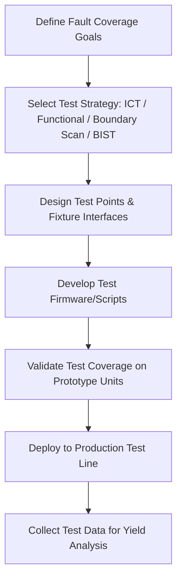

## Design for Testability

### Overview

Design for Testability (DFT) is the practice of designing hardware so that it can be efficiently and thoroughly verified — during bring-up, production, field service, and failure diagnosis — with minimal manual effort and maximum fault coverage. While related to Design for Manufacturability's test-DFM considerations, DFT is broader: it spans bring-up debug access, automated production test strategy, in-field diagnostics, and the architectural decisions (test points, boundary scan, built-in self-test) that make all of these possible. A board with poor testability can function correctly yet still be costly to bring up, slow to manufacture at volume, and difficult to diagnose when something eventually fails.

### Why Testability Matters Across the Product Lifecycle

- **Bring-up efficiency**: the first prototype boards inevitably need debugging; accessible test points and clear labeling dramatically reduce the time engineers spend probing an unfamiliar board to isolate a fault.
- **Production test coverage and speed**: at manufacturing volume, every board must be verified quickly and with high fault-detection confidence; poor testability forces either slower, more manual test processes or reduced fault coverage, both of which carry cost and quality risk.
- **Field diagnostics**: for products that are serviced or diagnosed remotely/in the field, built-in diagnostic capability (self-test routines, accessible status reporting) can be the difference between a quick fix and an unnecessary full-unit return.
- **Yield and cost feedback**: production test data, when the test strategy provides sufficiently granular fault isolation, feeds back into identifying systematic component or process issues before they cause large-scale quality problems.

### Categories of Test in the Product Lifecycle

### Test Point Design

- **Coverage of critical nets**: test points should provide access to power rails, ground, reset, clock signals, and key communication buses (SPI, I2C, UART) — nets most likely to be probed during debugging or verified during production test.
- **Physical accessibility**: test points should be positioned with probe or bed-of-nails fixture access in mind, avoiding placement directly beneath tall components or too close to board edges where a fixture pin or probe tip cannot reliably land.
- **Standardized test point size and spacing**: production in-circuit test (ICT) fixtures typically require a minimum test point diameter and minimum spacing between adjacent points to reliably make contact without shorting neighbors; these dimensions are usually specified by the test house or ICT equipment vendor.
- **Labeling and silkscreen identification**: clearly labeling test points on the silkscreen (matching schematic net names) significantly speeds up debug, both for the original design team and for anyone else who later needs to diagnose the board.
- **Avoiding solder-mask-covered vias as the only access point**: a via alone, especially if tented (covered by solder mask), does not provide reliable probe contact; dedicated test point pads without solder mask covering are preferable for anything requiring routine probing.

### In-Circuit Test (ICT)

ICT uses a bed-of-nails fixture to make simultaneous electrical contact with many test points on an assembled board, verifying component values, connectivity, and basic functionality without needing to power up and exercise the full system.

- **Fixture cost and complexity scale with test point count and board complexity**, so ICT is typically justified at higher production volumes where the upfront fixture cost is amortized across many units; low-volume production often relies more heavily on functional test alone.
- **Coverage limitations**: ICT is effective at catching component-level defects (wrong value, open, short, missing component) but is generally less effective at catching complex functional or timing-related faults, which functional test is better suited to catch.
- **Access point requirements**: every net intended for ICT coverage needs a physically accessible test point, meaning ICT strategy should be considered during layout, not retrofitted after the design is otherwise complete.

### Functional Test

Functional test exercises the assembled, powered board through some or all of its intended operating modes, verifying that it behaves correctly as a complete system rather than checking individual component values.

- **Automated test scripts**: typically driven by firmware (either the product's actual firmware or a dedicated test-mode firmware image) that exercises peripherals, communicates results over a test interface, and reports pass/fail status.
- **Test fixture connectors**: dedicated connectors (sometimes pogo-pin based, sometimes standard connectors) providing power, communication, and any stimulus/measurement signals needed for the functional test sequence.
- **Coverage of analog and RF performance**: functional test can verify parameters ICT cannot easily check, such as sensor accuracy, RF transmit power, or timing performance under real operating conditions.
- **Calibration integration**: for products requiring per-unit calibration (sensor offset trimming, RF power calibration), functional test time is often where this calibration data is measured and written to non-volatile storage.

### Built-In Self-Test (BIST)

Firmware- or hardware-implemented self-test routines that a device can run autonomously, either at power-up, on command, or periodically during operation:

- **Power-on self-test (POST)**: a boot-time sequence verifying critical subsystems (memory integrity checks, peripheral presence detection, sensor communication verification) before the device proceeds to normal operation, catching hardware faults early rather than allowing the device to behave unpredictably.
- **On-demand diagnostic routines**: firmware commands (accessible via a debug interface, service menu, or remote command) that exercise specific subsystems and report detailed status, useful for field diagnostics without requiring specialized test equipment.
- **Continuous/background health monitoring**: some designs implement ongoing checks during normal operation (e.g., periodic ADC reference verification, communication bus error-rate monitoring) that can flag degrading conditions before they cause an outright failure.
- **BIST reduces dependency on external test equipment** for at least a subset of fault coverage, which is particularly valuable for field service scenarios where a full production test fixture is unavailable.

### Boundary Scan (JTAG / IEEE 1149.1)

For designs with limited physical test point access — common on dense boards with fine-pitch BGAs where many nets are simply inaccessible to a physical probe — boundary scan provides an alternative connectivity and fault-detection mechanism.

- **Boundary scan cells** embedded within compliant ICs allow test equipment to control and observe pin states digitally through the JTAG chain, without needing physical probe access to each individual pin.
- **Chain design considerations**: boundary-scan-capable ICs on a board are typically connected in a serial chain (TDI to TDO), and the chain's order and accessibility should be planned during schematic/layout rather than assumed to work automatically.
- **Coverage limitations**: boundary scan verifies digital connectivity effectively but does not inherently test analog circuitry, power supply correctness, or overall functional behavior — it is a complement to, not a full replacement for, ICT and functional test.
- **Debug use beyond production test**: the same JTAG infrastructure used for boundary scan is often also the primary firmware programming and debug interface, so its design (header placement, chain integrity, signal integrity at the JTAG connector) serves both purposes.

### Programming and Debug Interface Design

- **Accessible programming header placement**: firmware programming/debug connectors (SWD, JTAG, or a vendor-specific interface) should be positioned for both bench debug convenience during development and, ideally, automated programming fixture access during production.
- **Production programming strategy**: some designs use a pogo-pin "bed of nails"-style programming fixture rather than a populated header, saving BOM cost and board space at the cost of requiring dedicated fixture nets to be routed to accessible pads.
- **In-system vs. off-board programming**: some production flows program flash memory or MCUs before placement (off-board, "pre-programming"), while others program in-circuit after assembly; the choice affects both test point/header requirements and production flow design.
- **Debug interface security considerations**: for production units, disabling or restricting debug/programming access after production programming (via a lock bit, fuse, or similar mechanism) is a common practice to protect firmware IP and prevent unauthorized access to internal state, though the specific mechanism is highly device- and security-requirement-dependent. [Inference — exact debug-lock mechanisms are vendor- and product-specific]

### Test Coverage and Fault Diagnosis Strategy

- **Fault coverage planning**: a testability strategy should identify which classes of faults (open/short circuits, wrong component values, functional/timing faults, analog/RF performance deviations) each test stage is expected to catch, ensuring no significant fault class is left entirely uncovered.
- **Test sequencing for fault isolation**: structuring tests to run in an order that isolates faults efficiently (e.g., verifying power rails before attempting communication tests, since a bad power rail can cause a cascade of secondary functional test failures that obscure the actual root cause).
- **Diagnostic granularity vs. test time trade-off**: more granular fault diagnosis (pinpointing the exact failing component or subsystem) generally requires more test time and complexity than a simple pass/fail result, and the appropriate trade-off depends on production volume and the cost of failure analysis versus test time.
- **Data logging for yield analysis**: capturing detailed test results (not just pass/fail, but actual measured values) enables statistical process control and early detection of drifting yield trends before they become major production issues.

### Common DFT Pitfalls in Embedded Design

- **Deferring test strategy planning until after layout is complete**, discovering too late that critical nets have no accessible test point and require a costly layout revision to add coverage.
- **Insufficient test point spacing or size** for the intended ICT fixture, forcing a fixture redesign or reduced test coverage.
- **No power-on self-test or boot-time fault detection**, allowing a board with a latent hardware fault to boot into an ambiguous or silently degraded state rather than reporting a clear diagnostic failure.
- **Relying solely on functional test with no granular fault isolation**, resulting in a "fail" result that provides little guidance for root-cause failure analysis when yield issues arise.
- **Leaving debug/JTAG access fully open on production units** without considering the security and IP-protection implications of an accessible programming/debug interface in the field.
- **Underestimating production test time impact on throughput**, designing a thorough but slow test sequence that becomes a manufacturing bottleneck at higher volumes without appropriate parallelization or fixture planning.

**Related Topics**
- Design for Manufacturability
- Schematic Capture Fundamentals
- PCB Layout Principles
- Component Selection and Footprints
- Debugging — Using logic analyzers and RTT for firmware event correlation
- Manufacturing — Bill of materials (BOM) management and component sourcing
- Reliability — Accelerated life testing and failure rate estimation