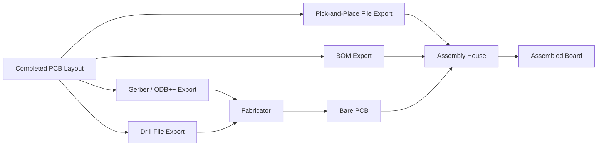
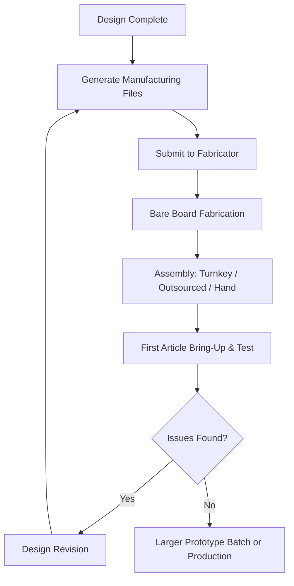

## Prototyping and PCB Fabrication Process

### Overview

The prototyping and PCB fabrication process spans everything from submitting a completed design to receiving a physical, populated board ready for testing. Understanding this process — file preparation, fabricator selection, the physical manufacturing steps, and assembly options — helps embedded designers make informed trade-offs about cost, lead time, and quality at the prototype stage, and sets expectations for how design decisions translate into a manufacturable physical product.

### From Design Files to Manufacturing Files

Before a board can be fabricated, the EDA design files must be converted into a standardized manufacturing data package that any fabricator can interpret unambiguously.

- **Gerber files (RS-274X)**: the traditional industry-standard format for describing each copper layer, solder mask layer, silkscreen layer, and paste layer as a set of 2D vector graphics — one file per layer.
- **ODB++ or IPC-2581**: newer, more comprehensive intelligent data formats that bundle all layer, drill, netlist, and stackup information into a single unified file (or file set), reducing the ambiguity and manual reconstruction sometimes required when interpreting a traditional Gerber set.
- **Drill files (Excellon format)**: specify the location, size, and plating status (plated through-hole vs. non-plated) of every drilled hole on the board.
- **Pick-and-place (centroid) files**: list every component's reference designator, position, rotation, and side of board (top/bottom), used by assembly equipment to automate component placement.
- **Bill of materials (BOM)**: the complete parts list with reference designators, quantities, manufacturer part numbers, and often approved alternates, used for both procurement and assembly line component staging.
- **Fabrication drawing/notes**: a document specifying board thickness, copper weight, surface finish, solder mask/silkscreen color, impedance control requirements, and any special notes not captured elsewhere in the data files.

### PCB Fabrication Process Steps (Bare Board)

While the exact sequence varies by fabricator and board complexity, a typical multi-layer PCB fabrication process includes:

1. **Inner layer imaging and etching**: for multi-layer boards, each internal copper layer is patterned first (photoresist applied, exposed, developed, then unwanted copper etched away), before the layers are laminated together.
2. **Lamination**: internal layers and prepreg (uncured dielectric material) are stacked in the correct sequence and pressed together under heat and pressure, bonding them into a solid multi-layer panel.
3. **Drilling**: holes are mechanically or laser-drilled through the laminated panel at locations specified by the drill file, for both plated through-holes/vias and any non-plated mechanical holes.
4. **Through-hole plating (electroless + electrolytic copper deposition)**: drilled holes are chemically and electrolytically plated with copper to create an electrically conductive via/through-hole connecting the relevant layers.
5. **Outer layer imaging and etching**: the outer copper layers are patterned and etched using the same photoresist-based process as the inner layers.
6. **Solder mask application**: a protective polymer coating is applied over the copper, with openings left at pad locations (defined by the solder mask layer in the design files) to control where solder can adhere during assembly.
7. **Silkscreen printing**: reference designators, polarity markers, logos, and other text/graphics are printed onto the board surface, typically after solder mask application.
8. **Surface finish application**: a final finish (HASL, ENIG, immersion silver, OSP, or others) is applied to exposed copper pads to prevent oxidation and ensure solderability until assembly.
9. **Electrical testing**: bare boards are typically tested (flying probe or bed-of-nails, depending on volume) against the design netlist to verify no manufacturing defects (opens, shorts) before shipment.
10. **Profiling/routing and depanelization**: individual boards are cut from the manufacturing panel (via routing, v-scoring, or punching), and any final mechanical features are completed.

### Surface Finish Options

| Finish | Description | Trade-offs |
|---|---|---|
| HASL (Hot Air Solder Leveling) | Board dipped in molten solder, excess leveled with hot air knives | Low cost; uneven surface not ideal for very fine-pitch components; leaded and lead-free variants exist |
| ENIG (Electroless Nickel Immersion Gold) | Thin nickel layer with a gold flash on top | Flat surface, good for fine-pitch/BGA; higher cost; some risk of a defect called "black pad" if process control is poor |
| Immersion Silver | Thin silver layer over copper | Flat surface, lower cost than ENIG; more prone to tarnishing/oxidation if stored improperly before assembly |
| Immersion Tin | Thin tin layer over copper | Flat surface; shorter shelf life than ENIG; tin whisker risk is a consideration for some applications |
| OSP (Organic Solderability Preservative) | Organic coating protecting copper until reflow | Low cost, flat surface; shortest shelf life and least robust to multiple reflow cycles among common finishes |

Finish selection depends on component pitch requirements, cost sensitivity, shelf-life needs before assembly, and number of reflow cycles the board will undergo; ENIG is commonly favored for fine-pitch BGA designs despite its higher cost. [Inference — exact trade-off priorities are design- and volume-specific]

### Prototype Fabricator Selection Considerations

- **Turnaround time vs. cost trade-off**: most fabricators offer tiered pricing, where faster turnaround (same-day to a few days) carries a significant cost premium over standard turnaround (one to two weeks), a trade-off relevant when balancing project schedule against prototype budget.
- **Process capability match to design requirements**: not every low-cost prototype fabricator supports advanced features (blind/buried vias, very fine trace/space, controlled impedance certification, exotic materials); design requirements should be checked against a specific fabricator's published capability before submission.
- **Minimum order quantities**: many prototype-focused fabricators offer small quantities (as few as 5–10 boards) at accessible pricing, while production-focused fabricators may have higher minimums better suited to volume orders.
- **DFM feedback quality**: fabricators vary in how thoroughly they review submitted files for manufacturability issues before production — some offer detailed automated or manual DFM review, catching problems before they become a wasted prototype run.

### Prototype Assembly Options

- **Fully outsourced assembly**: sending bare boards, a BOM, and pick-and-place data to a contract assembler who sources components (or uses designer-supplied components), places them, and reflows the board — the most hands-off option but typically the most expensive per unit at low volumes and slowest turnaround.
- **Turnkey prototype services**: many prototype fabricators now offer combined "turnkey" fabrication plus assembly services, sourcing common components from their own inventory and handling the entire process from Gerbers/BOM to assembled boards in a single order — often faster and simpler for low-volume prototypes than coordinating separate fab and assembly vendors.
- **Hand assembly / hobbyist-scale reflow**: for very early prototypes or designs using larger, hand-solderable packages, in-house hand assembly (soldering iron, hot air rework station, or a small toaster-oven/hotplate reflow setup) can be a fast, low-cost option, though it is impractical for fine-pitch or BGA components and does not scale to meaningful production volumes.
- **Stencil use for hand/low-volume reflow**: even at small scale, using a laser-cut or 3D-printed solder paste stencil for SMT components significantly improves solder joint consistency compared to manually dispensing paste, particularly for boards with more than a handful of SMT components.

### Prototype Iteration Strategy

- **Bring-up board revisions**: it is common and often expected that a first prototype revision reveals issues (a footprint error, a missing decoupling capacitor, an incorrect net) requiring at least one further revision before the design is ready for larger-scale prototyping or production.
- **Panelizing multiple design variants**: when practical, submitting a panel with multiple small design variations (e.g., different component footprint options, alternate circuit topologies to be evaluated) in a single fabrication run can save cost and time compared to separate submissions, though this requires careful panel design.
- **Staged prototype quantities**: many teams order a small initial quantity (a handful of boards) for first bring-up and debug, followed by a larger prototype batch (tens of boards) once the design is validated, before committing to full production tooling and volume ordering.
- **Design verification before production commitment**: thorough electrical, functional, thermal, and (where applicable) EMC pre-compliance testing on prototype units before committing to production-volume ordering reduces the risk of costly production-scale defects.

### File Submission Best Practices

- **Include a complete fabrication drawing/notes file**, specifying stackup, surface finish, board thickness, and any special requirements not otherwise obvious from the raw Gerber/drill data, reducing the chance of the fabricator making an incorrect assumption.
- **Verify layer stack order and naming clarity** before export, since a misnamed or misordered layer in the exported file set is a common source of fabrication errors that may not be caught until the board arrives incorrect.
- **Cross-check the netlist/BOM against the actual schematic** one final time before submission, since fabrication and assembly errors originating from a stale or mismatched BOM are costly to discover only after boards are built.
- **Review the fabricator's DFM report carefully** rather than treating it as a formality, since it represents the fabricator's specific process knowledge about the submitted design's manufacturability.
- **Retain and version-control the exact file set submitted** for each fabrication run, ensuring traceability between a specific physical board revision and the design files that produced it — especially important once multiple prototype revisions exist.

### Common Prototyping and Fabrication Pitfalls

- **Submitting files without a fabrication drawing**, leaving critical specifications (surface finish, stackup, impedance requirements) to the fabricator's default assumptions, which may not match design intent.
- **Underestimating total prototype lead time**, forgetting to account for component procurement lead time (which can exceed board fabrication time, especially for less common parts) when planning a project schedule.
- **Choosing a fabricator whose process capability doesn't match design requirements**, discovering incompatibility only after a failed or rejected submission.
- **Skipping a stencil for SMT-heavy hand-assembled prototypes**, resulting in inconsistent solder joints that create debugging ambiguity (is a fault an electrical design issue or a poor solder joint?).
- **Not retaining version-controlled records of exactly what was submitted and received**, causing confusion when comparing behavior across multiple prototype revisions later in the program.
- **Treating the first prototype revision as though it should be production-final**, rather than budgeting realistic time and resources for at least one iteration cycle, which is standard practice for all but the simplest designs.

**Related Topics**
- Design for Manufacturability
- Design for Testability
- Component Selection and Footprints
- PCB Layout Principles
- Schematic Capture Fundamentals
- Quality — Solder joint reliability and reflow profile fundamentals
- Manufacturing — Bill of materials (BOM) management and component sourcing