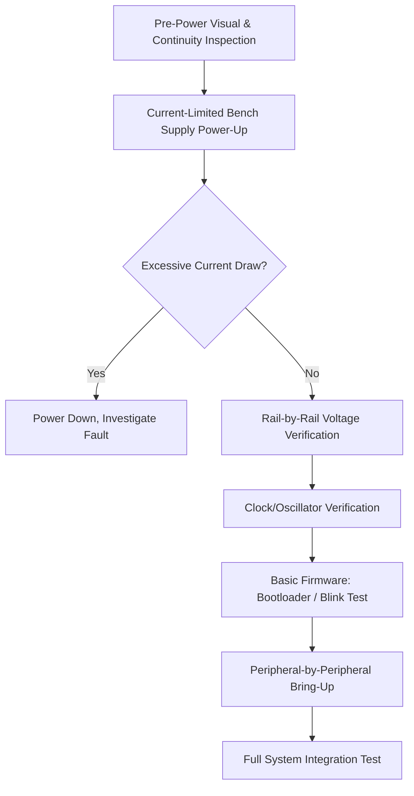

## Bring-Up and Hardware Validation

### Overview

Bring-up is the process of taking a freshly fabricated and assembled prototype board and methodically verifying, for the first time, that it powers on correctly and its subsystems function as designed. Hardware validation extends this into a structured, comprehensive verification effort confirming the board meets its full set of electrical, functional, and environmental requirements. Bring-up and validation form the critical bridge between a design existing on paper (or in an EDA tool) and a design proven to work as a physical product — and the methodical discipline applied here directly determines how quickly hardware issues are found, correctly diagnosed, and fixed rather than masked or misattributed.

### Why Structured Bring-Up Matters

- **First power-on risk**: a board that has never been powered carries risk of an undetected fabrication or assembly defect (a solder bridge, a reversed component, an open via) that could cause damage if power is applied carelessly; a structured, incremental approach minimizes this risk.
- **Fault isolation efficiency**: a systematic bring-up sequence isolates faults to the smallest possible subsystem before moving to more complex verification, avoiding the confusion of debugging multiple interacting problems simultaneously.
- **Distinguishing hardware faults from firmware faults**: especially on a new board running new firmware simultaneously, an undisciplined bring-up approach can make it very difficult to tell whether an observed failure is a hardware defect, a firmware bug, or an interaction between the two.
- **Documentation value**: a well-documented bring-up process creates a reusable reference (test procedures, expected measurements, known-good waveforms) valuable for future board revisions, production test development, and field diagnosis.

### Pre-Power-On Inspection

Before applying any power, a visual and electrical inspection reduces the risk of damage from an undetected assembly defect:

- **Visual inspection**: checking for obvious solder bridges, missing components, tombstoned passives, or incorrect component orientation (particularly polarized parts) under magnification, ideally cross-referenced against the assembly drawing.
- **Continuity and short-circuit checks**: using a multimeter to verify there is no unexpected short between power rails and ground before power is ever applied — this simple check catches a meaningful fraction of common assembly defects (solder bridges, reversed decoupling capacitors) before they can cause damage.
- **Resistance/impedance spot checks**: measuring resistance at key test points against expected values (where known) can reveal an incorrectly placed component or a wiring error before power-on.
- **Bill of materials verification against the physical board**: confirming, especially on a first-built prototype, that the components actually populated match the intended BOM — a common source of early confusion is a substituted or incorrectly sourced component.

### Incremental Power-On Strategy

Rather than applying full system power immediately, a staged approach reduces risk and improves fault isolation:

1. **Current-limited bench supply power-up**: applying power through a bench power supply with a conservative current limit set below the expected normal operating current allows the supply to cut off safely if a short circuit or other fault causes excessive current draw, rather than allowing damage to propagate.
2. **Rail-by-rail verification**: for multi-rail designs, powering and verifying each voltage rail sequentially (rather than all rails simultaneously) isolates which specific rail, if any, is faulty, and confirms each regulator is producing its expected output voltage before dependent circuitry is powered.
3. **Quiescent current draw check**: comparing the board's initial current draw (before any firmware is running, if applicable) against the expected value from design calculations or simulation — a current draw significantly higher than expected is an early warning sign of a short or misconfigured component.
4. **Voltage rail measurement at multiple points**: verifying not just the regulator output directly, but voltage at representative load points across the board, confirming acceptable IR drop and that the PDN is delivering adequate voltage where it matters.
5. **Thermal check during initial power-up**: briefly checking (by touch, with appropriate caution, or with a non-contact IR thermometer) for any component becoming unexpectedly hot, which can indicate a fault even if voltages otherwise appear nominal.

### Clock and Reset Verification

Before attempting any firmware-dependent bring-up, confirming the board's fundamental timing and reset behavior is functioning correctly avoids wasted debugging effort chasing what looks like a software problem but is actually a hardware clock or reset issue:

- **Oscillator startup verification**: using an oscilloscope to confirm the crystal oscillator is running at the expected frequency with a clean waveform, since a marginal oscillator circuit (incorrect load capacitance, poor layout, weak drive) can cause intermittent or unreliable operation that is difficult to diagnose once firmware bring-up is underway.
- **Reset circuit behavior**: verifying the reset line behaves correctly across the supply voltage's power-up ramp (no false triggering, correct release timing relative to supply stabilization), since an unreliable reset circuit can cause intermittent, hard-to-reproduce boot failures.
- **Power sequencing verification**: for multi-rail designs with sequencing requirements, confirming with an oscilloscope (multiple channels capturing rail voltages simultaneously) that rails power up and down in the intended order and timing.

### Firmware-Enabled Bring-Up Progression

Once basic power and clock integrity are confirmed, bring-up typically proceeds with increasingly capable firmware:

- **Minimal bootloader/blink test**: the simplest possible firmware (often just toggling a GPIO connected to an LED, or a UART "hello world" message) confirms the MCU itself is alive, can execute code from its programming interface, and basic I/O is functional — deliberately avoiding complexity that could obscure a more fundamental issue.
- **Peripheral-by-peripheral verification**: enabling and testing one peripheral interface at a time (UART, SPI, I2C, ADC, timers) against known expected behavior, rather than attempting to bring up the full application firmware at once, which would make isolating a peripheral-specific fault far more difficult.
- **External component/sensor verification**: for each external IC on the board (sensors, memory, radio modules), a targeted test verifying basic communication (e.g., successfully reading a known device ID register) before attempting to use that component within the larger application logic.
- **Progressive integration**: only after individual subsystems are independently verified does bring-up typically progress to running larger portions of actual application firmware, layering complexity incrementally rather than attempting a full system test on unverified hardware.

### Common First-Bring-Up Issues and Diagnostic Approaches

- **No power / excessive current draw**: often traced to a solder bridge, reversed polarized component, or an incorrectly valued/placed component; systematic continuity checking and thermal imaging can localize the fault region before component-level investigation.
- **Regulator not producing expected output**: can stem from an incorrect feedback resistor value, insufficient input voltage/headroom, missing or incorrect output capacitor (some regulators are unstable without a properly specified output cap), or an incorrectly populated enable pin condition.
- **MCU not responding to programmer/debugger**: frequently a power, reset, or programming interface signal integrity issue rather than a firmware problem — checking for correct voltage on programming interface pins and confirming reset behavior is a common first diagnostic step.
- **Peripheral communication failure (I2C/SPI not responding)**: commonly caused by a missing pull-up resistor (I2C in particular requires external pull-ups that are easy to accidentally omit), incorrect clock polarity/phase configuration (SPI), or an address/pin mapping mismatch between schematic intent and firmware configuration.
- **Intermittent or marginal behavior**: often signal integrity related (a marginal oscillator, inadequate decoupling, a signal integrity issue on a fast bus) rather than a simple binary "works/doesn't work" fault, and typically requires oscilloscope-based investigation rather than purely logical/firmware debugging.

### Hardware Validation Beyond Initial Bring-Up

Once a board is confirmed functional at a basic level, broader validation activities confirm it meets its full requirements across realistic operating conditions:

- **Functional requirement verification**: systematically testing every documented functional requirement against the built hardware, not just the subset of functionality exercised during initial bring-up.
- **Parametric/electrical characterization**: measuring actual electrical performance (voltage regulation accuracy, timing margins, signal integrity metrics) against datasheet and design targets, rather than relying solely on "does it work" functional pass/fail.
- **Environmental testing**: verifying operation across the product's specified temperature range, humidity conditions, and (where applicable) vibration/shock requirements, since a board that works perfectly at room temperature on a lab bench may reveal marginal behavior only under environmental extremes.
- **Power consumption validation**: profiling actual current draw across operating states against the design's power budget targets (see Measuring and Profiling Power Consumption), confirming battery life projections are realistic before committing to production.
- **EMC pre-compliance testing**: early-stage emissions and immunity testing to catch issues while design changes remain feasible, rather than discovering EMC problems only at formal certification.
- **Reliability/stress testing**: extended operation testing, thermal cycling, or accelerated aging techniques to surface reliability issues that would not appear during short-duration functional validation.
- **Regression testing across board revisions**: for any subsequent hardware revision, re-running the validation suite against the new revision to confirm fixes resolved intended issues without introducing new regressions.

### Bring-Up Documentation Practices

- **Test procedure documentation**: recording the specific steps, expected results, and pass/fail criteria for each bring-up and validation test, both to ensure repeatability and to build institutional knowledge for future board revisions or team members.
- **Known-good reference captures**: saving oscilloscope waveforms, measured voltage values, and other reference data from a confirmed-good board, providing a baseline for comparison when diagnosing issues on subsequent units or future revisions.
- **Issue tracking with root cause**: logging every issue discovered during bring-up along with its eventual root cause and resolution, both to inform the next design revision and to build a pattern library of common failure modes for the team.
- **Traceability to specific board serial numbers/revisions**: particularly important when multiple prototype units or revisions exist simultaneously, ensuring test results and known issues are correctly attributed to the specific hardware configuration tested.

### Common Bring-Up and Validation Pitfalls

- **Skipping pre-power-on inspection** and applying full power immediately, risking damage from an assembly defect that a simple continuity check would have caught.
- **Bringing up too much complexity at once** (e.g., running full application firmware on a never-before-powered board), making fault isolation far harder than a staged, incremental approach.
- **Conflating firmware bugs with hardware faults** (or vice versa) due to an undisciplined bring-up sequence that doesn't clearly separate hardware-level verification from firmware-dependent testing.
- **Validating only at room temperature and nominal supply voltage**, missing marginal behavior that only appears at temperature or voltage extremes within the product's specified operating range.
- **Insufficient documentation of bring-up findings**, losing valuable diagnostic knowledge that would have accelerated debugging on the next board revision or production unit.
- **Declaring bring-up "complete" after basic functional verification** without proceeding to full validation against all documented requirements, risking late discovery of gaps during later-stage testing or, worse, in the field.

**Related Topics**
- Measuring and Profiling Power Consumption
- Design for Testability
- Prototyping and PCB Fabrication Process
- Signal Integrity in PCB Design
- Debugging — Using logic analyzers and RTT for firmware event correlation
- Debugging — Oscilloscope measurement techniques for digital signals
- Reliability — Accelerated life testing and failure rate estimation