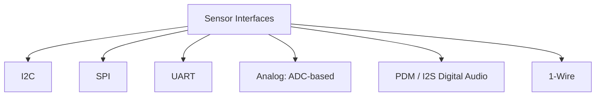

## Common Sensor Types and Interfaces

### Overview

Embedded systems frequently interface with sensors to perceive their physical environment — motion, temperature, light, pressure, proximity, and more. Understanding the common sensor categories, their underlying sensing principles, and the electrical/digital interfaces used to communicate with them is foundational to embedded hardware and firmware design. Sensor selection and interfacing decisions affect not just functional correctness but power consumption, noise immunity, calibration complexity, and overall system cost.

### Sensor Categories by Physical Quantity

#### Motion and Inertial Sensors

- **Accelerometers**: measure linear acceleration along one or more axes, commonly using MEMS (micro-electromechanical systems) capacitive or piezoresistive sensing elements. Used for orientation detection, tap/shock detection, step counting, and vibration monitoring.
- **Gyroscopes**: measure angular velocity (rate of rotation) around one or more axes, typically MEMS-based using the Coriolis effect on a vibrating proof mass. Used for orientation tracking, stabilization, and combined with accelerometer data for more robust attitude estimation.
- **Inertial Measurement Units (IMUs)**: integrated packages combining accelerometer, gyroscope, and often magnetometer into a single device (commonly called a 6-axis or 9-axis IMU depending on included sensors), simplifying board design and often including onboard sensor fusion processing.
- **Magnetometers**: measure magnetic field strength and direction, commonly used for compass/heading functionality, often combined with accelerometer/gyroscope data in 9-axis IMU configurations.

#### Environmental Sensors

- **Temperature sensors**: available in several sensing technologies — thermistors (resistance changes with temperature, requiring a reference resistor and often nonlinear compensation), RTDs (resistance temperature detectors, more linear and precise but typically more expensive), thermocouples (voltage generated from a junction of dissimilar metals, common for high-temperature or industrial applications), and integrated digital temperature sensor ICs (which internally handle sensing and provide a direct digital readout, simplifying interfacing at the cost of less flexibility than a raw analog sensing element).
- **Humidity sensors**: typically capacitive sensing elements where a polymer dielectric's capacitance changes with absorbed moisture; frequently integrated alongside a temperature sensor in a single combined humidity/temperature IC, since temperature compensation is generally needed for accurate humidity readings.
- **Pressure sensors**: MEMS-based (piezoresistive or capacitive) sensing elements measuring absolute, gauge, or differential pressure; used for barometric altitude estimation, weather sensing, and industrial/automotive pressure monitoring applications.
- **Gas sensors**: various sensing technologies (electrochemical, metal-oxide semiconductor, non-dispersive infrared) targeting specific gas species (CO2, VOCs, CO, specific hazardous gases), often requiring careful calibration and, for some technologies, a warm-up period before readings stabilize.

#### Optical Sensors

- **Ambient light sensors**: measure visible or near-visible light intensity, commonly used for automatic display brightness adjustment or basic presence/occlusion detection.
- **Proximity sensors**: often combine an infrared emitter and receiver, measuring reflected IR intensity to detect nearby object presence (e.g., detecting a phone near a user's ear), distinct from longer-range distance-ranging sensors.
- **Color sensors**: typically use multiple photodiodes with different spectral filters (red, green, blue, sometimes clear/IR channels) to estimate the color and intensity of incident light.
- **Time-of-flight (ToF) distance sensors**: emit a pulsed or modulated light signal (often infrared laser) and measure the time for reflected light to return, calculating distance from the known speed of light; offer more accurate absolute distance measurement than simple IR proximity sensing, at higher cost and complexity.
- **Image sensors (cameras)**: CMOS or (less commonly in modern embedded designs) CCD sensor arrays capturing 2D image data, interfaced via parallel camera buses (e.g., DVP) or serial interfaces (e.g., MIPI CSI-2) depending on resolution and frame rate requirements.

#### Force, Pressure, and Motion-Related Sensors

- **Strain gauges**: resistive elements that change resistance proportional to mechanical deformation, typically used within a Wheatstone bridge configuration to measure small resistance changes with high sensitivity, common in load cells and force-sensing applications.
- **Load cells**: transducers (often strain-gauge-based) converting mechanical force/weight into an electrical signal, requiring precision instrumentation amplification of the small bridge output signal.
- **Touch/capacitive sensors**: detect touch or proximity through changes in capacitance, ranging from simple single-electrode touch buttons to full capacitive touchscreen controllers supporting multi-touch sensing.

#### Sound and Vibration Sensors

- **Microphones**: available as analog electret condenser microphones (requiring an analog front-end for amplification and often bias voltage) or digital MEMS microphones (commonly using PDM — pulse-density modulation — or I2S digital output, simplifying interfacing and reducing analog noise susceptibility).
- **Vibration sensors/accelerometers for condition monitoring**: specialized higher-bandwidth accelerometers used in industrial predictive maintenance applications to detect abnormal machinery vibration signatures.

### Common Digital Sensor Interfaces

#### I2C (Inter-Integrated Circuit)

- **Two-wire bus** (SDA data line, SCL clock line), supporting multiple devices sharing the same bus through unique 7-bit or 10-bit device addresses.
- **Requires external pull-up resistors** on both SDA and SCL lines (typically not included on the sensor itself), a frequently overlooked requirement that causes communication failures during bring-up if omitted.
- **Moderate speed**: standard mode (100 kHz), fast mode (400 kHz), and faster modes exist, generally sufficient for most sensor polling applications but not suited to high-bandwidth data streaming.
- **Widely used for**: temperature/humidity sensors, many IMUs, ambient light sensors, and other sensors where moderate update rates and simple wiring (only two signal lines, shareable across many devices) are prioritized over raw throughput.
- **Multi-device addressing considerations**: when multiple identical sensors are needed on one bus, an address-select pin (if the sensor provides one) or an I2C multiplexer IC can resolve address conflicts.

#### SPI (Serial Peripheral Interface)

- **Four-wire bus** typically (MOSI, MISO, SCLK, and a chip-select line per device), though some sensors use fewer wires (e.g., a 3-wire half-duplex variant).
- **Higher speed than I2C**, commonly supporting several MHz to tens of MHz clock rates, suited to sensors requiring higher data throughput (higher-sample-rate IMUs, image sensors with parallel-adjacent SPI configuration registers).
- **Per-device chip-select line**: unlike I2C's shared-address addressing, each SPI device typically requires its own dedicated chip-select signal from the host, which can consume more MCU GPIO pins as device count grows.
- **No standardized addressing**: SPI device selection is purely through the chip-select line, meaning bus topology and device count are constrained more directly by available host GPIO than by a protocol-level addressing limit.

#### UART (Universal Asynchronous Receiver/Transmitter)

- **Point-to-point, asynchronous serial interface**, commonly used for sensors that output more complex or larger data payloads (GPS modules, some gas sensors, certain higher-level sensor modules with onboard processing) rather than simple periodic register reads.
- **No shared clock**: both ends must be configured to the same baud rate in advance, and there is no inherent multi-device bus-sharing mechanism as with I2C or SPI's chip-select approach.
- **Often used for sensor modules with significant onboard intelligence** (e.g., a GPS receiver module that outputs parsed NMEA sentences) rather than raw low-level register-based sensor ICs.

#### Analog Interfaces (ADC-Based)

- **Direct analog output sensors** (some temperature sensors, simple photoresistors, certain pressure/force sensors) require the host MCU's onboard ADC (analog-to-digital converter) to digitize the sensor's voltage or current output.
- **Signal conditioning considerations**: analog sensor interfacing often requires additional circuitry (amplification, filtering, level shifting, reference voltage generation) between the raw sensor element and the ADC input to achieve adequate accuracy and noise immunity.
- **Noise susceptibility**: analog signal paths are generally more susceptible to noise coupling than digital interfaces, making layout practices (short traces, ground plane integrity, filtering near the ADC input) particularly important for accurate analog sensor readings.

#### PDM / I2S (Digital Audio Interfaces)

- **PDM (Pulse-Density Modulation)**: a single-bit, high-oversampling-rate digital audio interface commonly used by MEMS microphones, requiring a digital filter (often implemented in the MCU or a dedicated audio peripheral) to convert the PDM bitstream into standard PCM audio samples.
- **I2S (Inter-IC Sound)**: a synchronous digital audio interface using separate clock, word-select, and data lines, commonly used for higher-quality digital microphones and audio codec interfacing.

#### 1-Wire

- **Single data line** (plus ground, and often a way to derive power parasitically from the data line itself) protocol, used by a smaller set of sensors (some digital temperature sensor families are a well-known example) prioritizing minimal wiring over speed or multi-device bus complexity.
- **Timing-critical protocol**: 1-Wire communication relies on precise timing of line pull-down durations, which can be more demanding on firmware/timer resources than I2C or SPI's clock-synchronized approach.

### Sensor Interface Comparison

| Interface | Wire Count | Typical Speed | Multi-Device Support | Common Sensor Use Cases |
|---|---|---|---|---|
| I2C | 2 (+ power/ground) | 100 kHz – ~3.4 MHz (mode-dependent) | Address-based, shared bus | Temp/humidity, IMUs, ambient light |
| SPI | 4 (typical) | MHz to tens of MHz | Per-device chip-select | High-sample-rate IMUs, image sensors |
| UART | 2 (TX/RX) | Baud-rate dependent | Point-to-point only | GPS modules, intelligent sensor modules |
| Analog/ADC | 1+ per channel | Limited by ADC sample rate | N/A (per-channel wiring) | Simple temp/light/force sensors |
| PDM/I2S | 2–4 | High (audio-rate oversampling) | Limited/protocol-specific | MEMS microphones, audio codecs |
| 1-Wire | 1 (+ ground) | Slow, timing-critical | Addressable (device ROM ID) | Certain digital temperature sensor families |

### Sensor Fusion Considerations

When multiple sensors contribute to a combined estimate (e.g., accelerometer + gyroscope for orientation, or multiple environmental sensors for a composite air-quality index), **sensor fusion** algorithms combine their outputs, often compensating for each individual sensor's weaknesses:

- **Complementary filtering / Kalman filtering**: common techniques for combining accelerometer and gyroscope data, exploiting the accelerometer's long-term stability (but noise susceptibility to short-term motion) and the gyroscope's short-term accuracy (but long-term drift) to produce a more robust combined orientation estimate.
- **Sampling rate alignment**: sensors with different native output rates must be resampled, interpolated, or otherwise time-aligned before fusion, an important firmware design consideration when combining data streams from sensors on different interfaces with different update rates.
- **Calibration dependency**: fusion algorithm accuracy is often highly dependent on proper individual sensor calibration (offset, scale, and sometimes temperature compensation) being applied before the fusion stage, since fusion cannot generally compensate for an uncalibrated raw sensor input.

### Practical Sensor Interfacing Considerations

- **Power sequencing and startup time**: many sensors require a defined power-up sequence and settling/warm-up time before valid readings are available (particularly common for gas sensors and some optical sensors), which firmware must account for rather than assuming an immediate valid reading after power-on.
- **Interrupt-driven vs. polled operation**: many digital sensors provide an interrupt output pin (e.g., signaling new data ready, or a threshold event like a motion trigger) allowing the MCU to remain in a low-power sleep state until genuinely needed, rather than continuously polling the sensor over the bus — an important power-management consideration (see Measuring and Profiling Power Consumption).
- **Bus loading and pull-up sizing for I2C**: as more devices and longer trace lengths are added to an I2C bus, pull-up resistor values may need adjustment to maintain acceptable rise-time characteristics at the intended clock speed, a detail easy to overlook when simply adding "one more sensor" to an existing bus.
- **EMI/noise coupling into analog sensor signals**: analog sensor traces routed near switching regulators, digital buses, or RF sections are more susceptible to coupled noise degrading measurement accuracy, reinforcing the layout principles discussed in Signal Integrity and EMI/EMC topics.
- **Datasheet register map verification**: many sensor communication failures during bring-up trace back to a misread or misinterpreted register map (incorrect address, wrong bit ordering, misunderstood scaling factor) rather than a hardware fault — careful datasheet cross-referencing during firmware driver development is essential.

### Common Sensor Interfacing Pitfalls

- **Omitting I2C pull-up resistors**, a frequent and easily avoidable bring-up failure.
- **Ignoring sensor warm-up/settling time requirements**, causing firmware to read and act on invalid data immediately after power-on.
- **Placing analog sensor traces near noisy digital or power switching circuitry**, degrading measurement accuracy in ways that may not be obvious without careful signal integrity analysis.
- **Failing to account for sensor self-heating**, particularly relevant for sensors placed near heat-generating components or that themselves dissipate meaningful power, which can bias temperature or other environmentally-sensitive readings.
- **Assuming raw sensor output is directly usable without calibration**, when many sensor types require offset/scale calibration (and sometimes temperature compensation) to achieve their specified accuracy.
- **Underestimating I2C bus loading effects** when scaling up the number of devices or trace length on a shared bus without revisiting pull-up resistor sizing.

**Related Topics**
- Communication Protocols — I2C, SPI, and UART fundamentals
- Signal Integrity in PCB Design
- Measuring and Profiling Power Consumption
- Component Selection and Footprints
- Firmware — Interrupt-driven design and low-power sleep strategies
- Calibration — Sensor offset, scale, and temperature compensation techniques
- Bring-Up and Hardware Validation