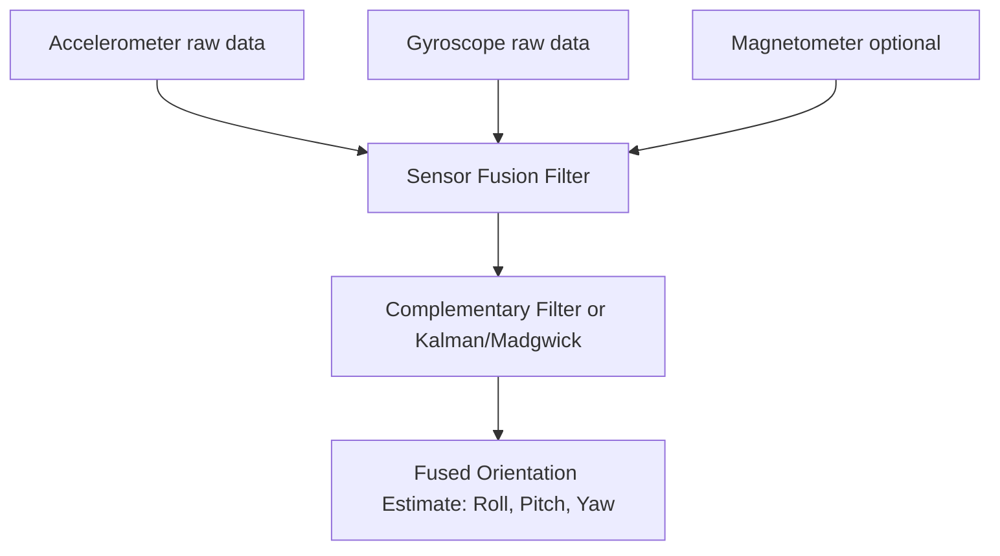

## Motion Sensors — Accelerometers and Gyroscopes

### Overview

Accelerometers and gyroscopes are inertial sensors that measure motion-related quantities without requiring an external reference point. Accelerometers measure proper acceleration (including gravity), while gyroscopes measure angular velocity (rate of rotation). Together they form the core of an Inertial Measurement Unit (IMU), used in embedded systems for orientation sensing, motion detection, stabilization, navigation, and gesture recognition.

Both sensor types are typically implemented as MEMS (Micro-Electro-Mechanical Systems) devices in embedded contexts — microscopic mechanical structures etched onto silicon, combined with signal-conditioning circuitry on the same die or package.

---

### Accelerometers

#### Physical Principle

An accelerometer measures proper acceleration — the acceleration relative to free-fall, not relative to the ground. A stationary accelerometer on a table reads approximately 1 g upward (9.81 m/s²) along the vertical axis, because it measures the force required to prevent the sensing mass from free-falling, not the coordinate acceleration.

MEMS accelerometers work by suspending a small proof mass on flexible springs (usually etched silicon beams). When the device accelerates, inertia causes the proof mass to lag relative to the sensor frame, deflecting the springs. This deflection is measured — most commonly via capacitive sensing, where the proof mass forms one plate of a differential capacitor and displacement changes capacitance.

$$a = \frac{F}{m}$$

The measured force from spring deflection is converted into an acceleration value using the known spring constant and proof mass.

#### Sensing Technologies

**Capacitive (most common in consumer/embedded MEMS):**

- Proof mass with interdigitated comb fingers forms a differential capacitor with fixed electrodes
- Displacement changes capacitance asymmetrically between two plates
- High sensitivity, low power, good temperature stability
- Used in nearly all modern low-cost IMUs (e.g., MPU-6050, LIS3DH, ADXL345)

**Piezoresistive:**

- Deflection of the proof mass strains a piezoresistive element, changing its resistance
- Simpler readout circuitry but generally noisier and more temperature-sensitive than capacitive designs
- Common in higher-shock-range or automotive sensors

**Piezoelectric:**

- Deflection or vibration generates a charge across a piezoelectric material
- Cannot measure static (DC) acceleration — only dynamic/vibration
- Used in vibration monitoring and shock detection, not for tilt/orientation sensing

#### Key Specifications

- **Range**: Measurement span, typically ±2g to ±16g for consumer parts, up to ±200g for shock/impact sensing
- **Sensitivity**: Output change per unit of acceleration (e.g., mg/LSB for digital output, mV/g for analog output)
- **Resolution**: Smallest detectable change in acceleration, tied to ADC bit depth and noise floor
- **Bandwidth**: Frequency range over which the sensor accurately tracks acceleration changes; determined by the mechanical resonance of the proof mass and any internal low-pass filtering
- **Noise density**: Typically expressed in µg/√Hz; determines the practical resolution floor at a given bandwidth
- **Zero-g offset**: Output error when acceleration is nominally zero on a given axis; varies with temperature and requires calibration
- **Cross-axis sensitivity**: Unwanted response on one axis to acceleration applied on another axis, caused by mechanical misalignment

#### Output Interpretation

A 3-axis accelerometer reports acceleration along X, Y, Z axes. At rest, the vector sum should equal 1g:

$$\left|\vec{a}\right| = \sqrt{a_x^2 + a_y^2 + a_z^2} \approx 1g$$

Tilt angle relative to gravity can be derived from static readings:

$$\theta_{pitch} = \arctan\left(\frac{a_x}{\sqrt{a_y^2 + a_z^2}}\right)$$


$$\theta_{roll} = \arctan\left(\frac{a_y}{\sqrt{a_x^2 + a_z^2}}\right)$$

This works reliably only when the sensor is not undergoing linear acceleration beyond gravity — any dynamic motion corrupts the tilt estimate, since the accelerometer cannot distinguish gravitational acceleration from linear acceleration.

#### Common Interfaces

- **I2C**: Most common for low-to-moderate sample rates (up to a few kHz); simple two-wire bus, address-based addressing, widely supported by embedded MCUs
- **SPI**: Higher throughput, used when higher output data rates or lower latency are needed
- **Analog output**: Older/simpler parts output a voltage proportional to acceleration, requiring an external ADC

---

### Gyroscopes

#### Physical Principle

A MEMS gyroscope measures angular velocity (rate of rotation) using the Coriolis effect. A vibrating proof mass is driven to oscillate at a fixed frequency along a drive axis. When the sensor rotates about an axis perpendicular to this vibration, the Coriolis force induces a secondary oscillation along a sense axis, proportional to the angular rate.

$$F_{Coriolis} = -2m(\vec{\omega} \times \vec{v})$$

Where $\vec{\omega}$ is the angular velocity vector and $\vec{v}$ is the velocity of the vibrating mass. This secondary motion is detected capacitively, similar to accelerometer sensing, and converted to a rate output (typically in degrees per second, °/s or dps).

Unlike accelerometers, gyroscopes measure a rate, not a position — orientation must be obtained by integrating this rate over time:

$$\theta(t) = \theta_0 + \int_0^t \omega(\tau)\, d\tau$$

#### Key Specifications

- **Range**: Typically ±125 dps to ±2000 dps for MEMS gyros used in consumer/embedded applications
- **Sensitivity**: mdps/LSB for digital output
- **Bias (zero-rate output)**: Non-zero output when the sensor is stationary; the primary source of integration drift
- **Bias stability**: How much the bias changes over time and temperature, often specified in °/hr or °/s
- **Noise density**: Expressed in dps/√Hz (or °/√hr for Angle Random Walk), governing short-term resolution
- **Angular Random Walk (ARW)**: Cumulative error in integrated angle due to white noise in the rate signal, growing with $\sqrt{t}$

#### Drift and Integration Error

Because orientation from a gyroscope requires integrating the angular rate, any constant bias error accumulates linearly with time, and any noise accumulates as a random walk:

$$\text{Drift}(t) \approx b \cdot t + \text{ARW} \cdot \sqrt{t}$$

Where $b$ is the residual bias after calibration. This is why gyroscope-only orientation estimates become unusable after tens of seconds to minutes without correction — a defining limitation addressed by sensor fusion (below).

---

### Combining Accelerometers and Gyroscopes: The IMU

Accelerometers and gyroscopes are complementary:

| Property | Accelerometer | Gyroscope |
| --- | --- | --- |
| Measures | Linear acceleration (incl. gravity) | Angular velocity |
| Good for | Long-term tilt reference (static) | Short-term dynamic orientation change |
| Weakness | Corrupted by linear motion/vibration | Drifts over time (integration error) |
| Frequency behavior | Accurate at low frequency, noisy at high | Accurate at high frequency, drifts at low |

This complementary error profile is the basis for **sensor fusion** — combining both signals to produce a stable, low-drift orientation estimate.

**Complementary filter** (simple, computationally cheap):

$$\theta = \alpha(\theta_{gyro}) + (1-\alpha)(\theta_{accel})$$

Where $\theta_{gyro}$ is the previous angle integrated forward with new gyro data, $\theta_{accel}$ is the angle computed from the accelerometer, and $\alpha$ is a weighting constant close to 1 (e.g., 0.98), giving the gyroscope short-term authority while letting the accelerometer correct long-term drift.

**Kalman filter** (more robust, standard in production systems): Statistically optimal fusion that models sensor noise characteristics explicitly, commonly implemented in embedded contexts via the Madgwick or Mahony filter (computationally lighter variants suited to microcontrollers) or a full Extended Kalman Filter (EKF) when a magnetometer is also fused in (producing a full AHRS — Attitude and Heading Reference System).



---

### Calibration

**Accelerometer calibration:**

- **Offset (bias) calibration**: Place the sensor stationary in known orientations (e.g., each axis pointing up/down) and record offsets from expected 1g/0g values
- **Scale factor calibration**: Compare measured output against known reference accelerations (often gravity itself, using six-position calibration)
- **Temperature compensation**: Zero-g offset and sensitivity both drift with temperature; higher-grade parts include onboard temperature sensors for compensation

**Gyroscope calibration:**

- **Bias calibration**: Average the stationary output over a sample window to estimate and subtract the zero-rate offset; must be redone periodically since bias drifts with temperature and over the device lifetime
- **Scale factor calibration**: Rotate the sensor a known angle (e.g., using a calibrated turntable) and compare against integrated output

[Inference] Consumer-grade MEMS gyroscope bias typically requires recalibration or temperature compensation because bias stability specifications on the order of several °/hr, if uncorrected, are usually sufficient to make raw dead-reckoning orientation estimates unreliable within short timeframes for many practical embedded applications — the specific tolerable drift depends heavily on application requirements.

---

### Practical Example: Reading an MPU-6050 over I2C

The MPU-6050 is a widely used 6-axis MEMS IMU (3-axis accelerometer + 3-axis gyroscope) commonly paired with microcontrollers like the ATmega328 or STM32 series.

**Register-level flow:**

1. Write to `PWR_MGMT_1` (0x6B) to wake the device from sleep mode (it powers up in sleep by default)
2. Configure full-scale range via `ACCEL_CONFIG` (0x1C) and `GYRO_CONFIG` (0x1B) registers
3. Read raw 16-bit signed values from `ACCEL_XOUT_H/L`, `ACCEL_YOUT_H/L`, `ACCEL_ZOUT_H/L` (starting at 0x3B) and equivalent gyro registers (starting at 0x43)
4. Convert raw counts to physical units using the sensitivity scale factor for the configured range (e.g., at ±2g range, sensitivity is 16384 LSB/g)

```c
// Simplified I2C read example (pseudocode style, common HAL pattern)
uint8_t wake_cmd[2] = {0x6B, 0x00};        // PWR_MGMT_1 = 0x00 (wake)
i2c_write(MPU6050_ADDR, wake_cmd, 2);

uint8_t reg = 0x3B;                         // ACCEL_XOUT_H
uint8_t buf[14];
i2c_write(MPU6050_ADDR, &reg, 1);
i2c_read(MPU6050_ADDR, buf, 14);            // burst-read accel+temp+gyro

int16_t accel_x_raw = (buf[0] << 8) | buf[1];
float accel_x_g = accel_x_raw / 16384.0f;   // ±2g range sensitivity
```

**Output:** At rest on a flat surface, `accel_z_g` should read approximately 1.0, with `accel_x_g` and `accel_y_g` near 0.0. Any deviation indicates tilt or uncorrected offset error.

[Unverified] Exact register addresses and default power-on states should be confirmed against the specific IMU part's datasheet revision, since register maps can differ across manufacturers and even across generations of the same product line.

---

### Sensor Placement and Mechanical Considerations

- **Vibration coupling**: Accelerometers mounted on vibrating structures (e.g., motor housings, drone frames) will pick up high-frequency mechanical noise; mechanical damping or software low-pass filtering is often needed
- **Axis alignment**: Physical mounting must match the intended reference frame; misalignment introduces cross-axis coupling that calibration alone can only partially correct
- **Lever-arm effects**: If the IMU is not mounted at the center of rotation of a moving body, the accelerometer will sense additional centripetal/tangential acceleration components during rotation, distinct from the gyroscope's rotational reading

---

### Applications in Embedded Systems

- **Orientation sensing**: Tilt-compensated displays, drone/robot attitude control, image stabilization
- **Motion/gesture detection**: Step counting, tap detection, free-fall detection, wake-on-motion for low-power devices
- **Vibration monitoring**: Predictive maintenance in industrial embedded systems
- **Dead-reckoning navigation**: Short-term position estimation when GPS is unavailable, fused with other sensors to bound drift
- **Impact/shock detection**: Automotive airbag triggers, drop detection in consumer electronics

Illustration of accelerometer proof-mass displacement under acceleration:

<svg xmlns="http://www.w3.org/2000/svg" viewBox="0 0 640 320">
<title>MEMS Accelerometer Proof Mass Deflection (svg_diagram)</title>
<rect x="0" y="0" width="640" height="320" fill="#ffffff" />

<text x="20" y="30" font-size="16" font-weight="bold" fill="#222">MEMS Accelerometer — Proof Mass Deflection (svg_diagram)</text>


<text x="60" y="70" font-size="14" fill="#333">At Rest (0g)</text>

<rect x="30" y="90" width="220" height="140" fill="none" stroke="#888" stroke-width="2" />

<rect x="120" y="140" width="40" height="40" fill="`#4a90d9`" stroke="`#22456b`" stroke-width="2" />

<line x1="60" y1="160" x2="120" y2="160" stroke="#555" stroke-width="2" />

<line x1="60" y1="140" x2="60" y2="180" stroke="#555" stroke-width="2" />

<line x1="220" y1="160" x2="160" y2="160" stroke="#555" stroke-width="2" />

<line x1="220" y1="140" x2="220" y2="180" stroke="#555" stroke-width="2" />

<text x="115" y="250" font-size="12" fill="#555">Proof mass centered</text>

<text x="115" y="266" font-size="12" fill="#555">Capacitance C1 = C2</text>


<text x="400" y="70" font-size="14" fill="#333">Under Acceleration (+a)</text>

<rect x="370" y="90" width="220" height="140" fill="none" stroke="#888" stroke-width="2" />

<rect x="500" y="140" width="40" height="40" fill="`#d94a4a`" stroke="`#6b2222`" stroke-width="2" />

<line x1="400" y1="160" x2="500" y2="160" stroke="#555" stroke-width="2" />

<line x1="400" y1="140" x2="400" y2="180" stroke="#555" stroke-width="2" />

<line x1="560" y1="160" x2="540" y2="160" stroke="#555" stroke-width="2" />

<line x1="560" y1="140" x2="560" y2="180" stroke="#555" stroke-width="2" />

<text x="470" y="250" font-size="12" fill="#555">Mass displaced (inertial lag)</text>

<text x="470" y="266" font-size="12" fill="#555">Capacitance C1 &gt; C2 (asymmetric)</text>


<line x1="480" y1="290" x2="560" y2="290" stroke="#000" stroke-width="2" marker-end="url(#arrow)" />
<text x="490" y="308" font-size="12" fill="#000">acceleration direction</text>
</svg>

---

### Key Points

- Accelerometers measure proper (specific force) acceleration including gravity; gyroscopes measure angular rate.
- Accelerometer static readings give reliable tilt but are corrupted by dynamic motion; gyroscope readings are accurate short-term but drift when integrated over time.
- Sensor fusion (complementary filter, Kalman, Madgwick/Mahony) combines both to produce a stable orientation estimate.
- Both are typically MEMS capacitive devices, interfaced via I2C or SPI in embedded designs.
- Calibration (bias and scale factor, ideally temperature-compensated) is essential for usable accuracy in both sensor types.

---

### Related Topics

- Magnetometers and full 9-DOF AHRS sensor fusion
- Complementary filter vs. Kalman filter implementation on microcontrollers
- Sensor fusion libraries (Madgwick, Mahony, DMP on MPU-6050/6500)
- I2C and SPI protocol fundamentals for sensor interfacing
- Low-power motion-triggered wake-up design patterns
- Vibration analysis and predictive maintenance using accelerometers
- Dead-reckoning navigation and drift correction techniques
- MEMS pressure sensors and barometric altitude sensing
- ADC resolution and noise floor considerations in sensor signal chains