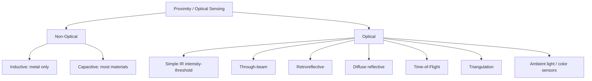

## Proximity and Optical Sensors

### Overview

Proximity sensors detect the presence, absence, or distance of an object without physical contact, while optical sensors more broadly use light to sense properties such as distance, intensity, color, or motion. In embedded systems, these sensors are used for object detection, distance measurement, ambient light sensing, gesture recognition, and touchless interaction. This category spans several distinct sensing technologies, each with different physical principles, ranges, and trade-offs.

---

### Categories of Proximity Sensing

#### Inductive Proximity Sensors

Detect metallic objects using electromagnetic induction. An oscillator generates a high-frequency magnetic field at the sensor face; when a conductive (typically ferrous) target enters the field, eddy currents induced in the target dampen the oscillation amplitude, which is detected and converted to a switching output.

- **Detects**: Metal objects only (ferrous metals give greater range than non-ferrous)
- **Typical range**: A few millimeters to ~30-60 mm for standard industrial sensors
- **Strengths**: Immune to dust, dirt, oil, non-metallic debris; robust in harsh industrial environments
- **Limitations**: Cannot detect non-metallic objects; range affected by target material and size
- **Common use**: Industrial embedded control (limit switches, conveyor position sensing, gear tooth counting)

#### Capacitive Proximity Sensors

Detect a wide range of materials (metallic and non-metallic, including liquids and granular solids) by sensing changes in capacitance between the sensor's electrode and the target, as the target enters the sensor's electric field and alters the local dielectric.

- **Detects**: Metals, plastics, wood, liquids, glass, powders — essentially any material with a dielectric constant different from air
- **Typical range**: A few millimeters to ~60 mm depending on target size and material
- **Strengths**: Can sense through non-conductive barriers (e.g., liquid level through a plastic tank wall)
- **Limitations**: Sensitive to humidity and environmental contamination; lower precision than optical alternatives
- **Common use**: Liquid level detection, bulk material sensing, touch-sensitive panels (capacitive touch is a closely related technology)

#### Optical (Photoelectric) Proximity Sensors

Use light — typically infrared (IR), sometimes visible or laser — to detect objects. These form the largest and most diverse category and are further divided by detection method.

---

### Optical Sensing Methods

#### Through-Beam (Opposed Mode)

A separate emitter and receiver are placed facing each other; an object is detected when it interrupts the light beam between them.

- **Strengths**: Longest range (up to tens of meters), most reliable detection regardless of target color/reflectivity
- **Limitations**: Requires alignment of two separate units, higher installation complexity
- **Common use**: Conveyor break-beam counting, safety light curtains, door/gate obstruction detection

#### Retroreflective

Emitter and receiver are housed together; light is bounced back by a dedicated reflector, and an object is detected when it interrupts the beam.

- **Strengths**: Single-unit installation (simpler wiring than through-beam), moderate range
- **Limitations**: Requires a separate reflector, shiny/reflective targets can cause false negatives (light bounces off the object itself back to the receiver)

#### Diffuse Reflective

Emitter and receiver are housed together; light reflects directly off the target surface back to the receiver — no separate reflector needed.

- **Strengths**: Simplest installation, no reflector required
- **Limitations**: Range and reliability depend heavily on target color, surface finish, and angle; dark or matte targets reduce range significantly
- **Common use**: General-purpose object detection where target material varies

#### Time-of-Flight (ToF)

Measures the time for emitted light (typically a laser or IR pulse/modulated signal) to travel to the target and return, converting this into a distance measurement:

$$d = \frac{c \cdot t}{2}$$

Where $c$ is the speed of light and $t$ is the round-trip time. Because $c$ is extremely large, direct pulse-timing ToF requires picosecond-level timing resolution; many low-cost embedded ToF sensors instead use phase-shift detection on a modulated continuous light signal:

$$d = \frac{c \cdot \Delta\phi}{4\pi f_{mod}}$$

Where $\Delta\phi$ is the measured phase shift and $f_{mod}$ is the modulation frequency.

- **Strengths**: Provides actual distance (not just presence/absence), largely independent of target color/reflectivity compared to simple IR proximity sensors
- **Typical range**: Millimeters to several meters, depending on sensor class
- **Common use**: Robotics obstacle avoidance, drone altitude hold, phone proximity/auto-focus sensing, industrial distance measurement
- **Example parts**: ST VL53L0X/VL53L1X (widely used in embedded/hobbyist projects), often communicating over I2C

#### Triangulation-Based Optical Distance Sensing

An emitter (often a laser or IR LED) projects a beam at an angle; the position of the reflected spot on a receiving sensor (e.g., a position-sensitive detector or linear CCD/CMOS array) shifts depending on target distance, and geometry is used to calculate distance.

$$d = \frac{f \cdot b}{x}$$

Where $f$ is the focal length of the receiver lens, $b$ is the baseline distance between emitter and receiver, and $x$ is the measured displacement of the reflected spot on the sensor array.

- **Strengths**: High precision at short-to-medium range
- **Limitations**: Accuracy degrades at longer distances (the geometric relationship becomes less sensitive as distance increases); baseline separation requirement limits miniaturization
- **Common use**: Sharp GP2Y0A series IR distance sensors, commonly used in hobbyist robotics

---

### Simple IR Proximity (Non-ToF, Non-Triangulation)

The simplest and lowest-cost proximity sensing method: an IR LED emits light, and an IR phototransistor or photodiode detects reflected intensity. Detection is based on a threshold of reflected light intensity, not true distance measurement.

- **Strengths**: Very low cost, simple to interface (often just a digital output or basic analog voltage), minimal processing required
- **Limitations**: No true distance information beyond calibrated intensity thresholds, highly sensitive to target color/reflectivity and ambient IR light (e.g., sunlight)
- **Common use**: Line-following robots, simple object presence detection, IR obstacle-avoidance modules

---

### Ambient Light and Color Sensors

A related but distinct class of optical sensor measures light intensity or spectral content rather than detecting object presence.

- **Ambient Light Sensors (ALS)**: Measure ambient illuminance (in lux), typically using a photodiode with a spectral response filtered to approximate human eye sensitivity; used for automatic display brightness adjustment
- **Color sensors**: Use multiple photodiodes with red/green/blue (and sometimes clear/IR) filters to determine color composition of reflected or ambient light; used in embedded applications like color sorting, print calibration, and RGB LED feedback control
- **RGB/multi-spectral sensors**: Extend color sensing to more spectral bands for applications like material identification or agricultural sensing

---

### Gesture and Motion-via-Light Sensors

Some optical sensors combine multiple photodiodes or an array to detect motion direction, not just presence.

- Use multiple IR emitter/receiver pairs (or a single emitter with multiple receivers) arranged spatially
- The relative timing and intensity pattern across receivers as an object passes over indicates direction of motion (e.g., left-to-right swipe vs. right-to-left)
- Common use: Touchless gesture control interfaces, hand-wave wake-up detection

---

### Key Specifications Across Optical/Proximity Sensors

- **Sensing range**: Minimum and maximum reliable detection distance
- **Response time**: How quickly the sensor output updates following a change in target presence/distance
- **Field of view (FoV)**: Angular spread of the sensing beam; narrow FoV gives more precise spatial resolution but a smaller detection cone
- **Ambient light immunity**: Ability to reject interference from sunlight or other IR sources, often achieved through modulated emitter signals paired with synchronized detection (lock-in style filtering)
- **Output type**: Digital (binary presence/absence), analog voltage (intensity-proportional), or digital interface (I2C/SPI) reporting calibrated distance
- **Power consumption**: Especially relevant for battery-powered embedded designs; pulsed/duty-cycled emitters reduce average power draw significantly compared to continuous emission

---

### Practical Example: VL53L0X Time-of-Flight Sensor over I2C

The VL53L0X is a common single-photon avalanche diode (SPAD)-based ToF distance sensor, widely used in embedded and robotics projects, communicating via I2C.

```c
// Simplified I2C interaction pattern (pseudocode style)
// Typical workflow using a vendor HAL/driver library:

VL53L0X_Init(&sensor);
VL53L0X_SetDeviceMode(&sensor, VL53L0X_DEVICEMODE_SINGLE_RANGING);

VL53L0X_RangingMeasurementData_t measurement;
VL53L0X_PerformSingleRangingMeasurement(&sensor, &measurement);

uint16_t distance_mm = measurement.RangeMilliMeter;
uint8_t range_status = measurement.RangeStatus;   // 0 = valid measurement

if (range_status == 0) {
    printf("Distance: %u mm\n", distance_mm);
} else {
    printf("Invalid measurement, status: %u\n", range_status);
}
```

**Output:** A valid reading returns distance in millimeters, typically accurate within tens of millimeters at short range, with accuracy and maximum range affected by target reflectivity and ambient IR conditions.

[Unverified] Exact accuracy figures, maximum range, and status code meanings should be confirmed against the specific sensor's datasheet and driver library version, as these vary across part revisions and vendor SDK releases.

---

### Sensing Method Comparison



---

### Illustration: Optical Sensing Modes

<svg xmlns="http://www.w3.org/2000/svg" viewBox="0 0 700 380">
<title>Optical Proximity Sensing Modes Compared (svg_diagram)</title>
<rect x="0" y="0" width="700" height="380" fill="#ffffff" />
<text x="20" y="28" font-size="16" font-weight="bold" fill="#222">Optical Proximity Sensing Modes (svg_diagram)</text>


<text x="30" y="60" font-size="13" font-weight="bold" fill="#333">Through-Beam</text>

<rect x="30" y="75" width="20" height="30" fill="`#4a90d9`" />

<text x="20" y="120" font-size="10" fill="#555">Emitter</text>

<line x1="50" y1="90" x2="170" y2="90" stroke="`#e0a800`" stroke-width="2" stroke-dasharray="4,3" />

<rect x="170" y="75" width="20" height="30" fill="`#4a90d9`" />

<text x="160" y="120" font-size="10" fill="#555">Receiver</text>

<rect x="100" y="70" width="12" height="40" fill="`#d94a4a`" />

<text x="80" y="135" font-size="10" fill="#555">Object breaks beam</text>


<text x="260" y="60" font-size="13" font-weight="bold" fill="#333">Retroreflective</text>

<rect x="260" y="75" width="20" height="30" fill="`#4a90d9`" />

<text x="250" y="120" font-size="10" fill="#555">Sensor</text>

<line x1="280" y1="85" x2="400" y2="85" stroke="`#e0a800`" stroke-width="2" stroke-dasharray="4,3" />

<line x1="400" y1="85" x2="280" y2="95" stroke="`#e0a800`" stroke-width="2" stroke-dasharray="4,3" />

<rect x="400" y="70" width="8" height="40" fill="#888" />

<text x="385" y="130" font-size="10" fill="#555">Reflector</text>


<text x="470" y="60" font-size="13" font-weight="bold" fill="#333">Diffuse</text>

<rect x="470" y="75" width="20" height="30" fill="`#4a90d9`" />

<text x="460" y="120" font-size="10" fill="#555">Sensor</text>

<line x1="490" y1="85" x2="570" y2="100" stroke="`#e0a800`" stroke-width="2" stroke-dasharray="4,3" />

<line x1="570" y1="100" x2="490" y2="95" stroke="`#e0a800`" stroke-width="2" stroke-dasharray="4,3" />

<rect x="565" y="80" width="10" height="45" fill="`#d94a4a`" />

<text x="540" y="140" font-size="10" fill="#555">Target</text>


<text x="30" y="200" font-size="13" font-weight="bold" fill="#333">Time-of-Flight</text>

<rect x="30" y="215" width="24" height="30" fill="`#4a90d9`" />

<text x="15" y="260" font-size="10" fill="#555">Emitter+Receiver</text>

<line x1="54" y1="225" x2="220" y2="225" stroke="`#e0a800`" stroke-width="2" />

<line x1="220" y1="225" x2="54" y2="235" stroke="`#e0a800`" stroke-width="2" />

<rect x="215" y="210" width="10" height="40" fill="`#d94a4a`" />

<text x="90" y="280" font-size="10" fill="#555">distance = (c × time) / 2</text>


<text x="320" y="200" font-size="13" font-weight="bold" fill="#333">Triangulation</text>

<rect x="320" y="245" width="20" height="20" fill="`#4a90d9`" />

<text x="305" y="280" font-size="10" fill="#555">Emitter</text>

<rect x="400" y="245" width="20" height="20" fill="`#7ac36a`" />

<text x="390" y="280" font-size="10" fill="#555">Detector array</text>

<line x1="340" y1="255" x2="480" y2="215" stroke="`#e0a800`" stroke-width="2" />

<rect x="475" y="205" width="8" height="20" fill="`#d94a4a`" />

<line x1="483" y1="215" x2="410" y2="248" stroke="`#e0a800`" stroke-width="2" stroke-dasharray="3,2" />

<text x="330" y="300" font-size="10" fill="#555">spot position → distance (geometry)</text>


<text x="500" y="320" font-size="10" fill="#777">Dashed/solid lines = light path</text>

<text x="500" y="336" font-size="10" fill="#777">Red block = target object</text>

</svg>

---

### Key Points

- Inductive sensors detect only metal; capacitive sensors detect a broad range of materials via dielectric changes; both are non-optical proximity methods.
- Optical proximity sensors range from simple threshold-based IR detection to precise Time-of-Flight and triangulation distance measurement.
- Through-beam offers the longest, most reliable range; diffuse reflective is simplest to install but most affected by target surface properties.
- ToF sensors provide actual distance in real units and are largely reflectivity-independent compared to simple IR intensity sensors, making them well suited to robotics and obstacle avoidance.
- Ambient light and color sensors extend optical sensing beyond proximity into illuminance and spectral measurement.
- Ambient IR interference (e.g., sunlight) is a major real-world limitation for IR-based sensors, typically mitigated via modulated emission and synchronized detection.

---

### Related Topics

- LiDAR and scanning ToF systems for embedded robotics
- Capacitive touch sensing and touchscreen controllers
- Ambient light sensor integration for display power management
- IR remote control receiver/decoding circuits
- Ultrasonic distance sensors (non-optical alternative for ranging)
- Sensor fusion combining ToF/optical data with IMU data
- Photodiode and phototransistor circuit design fundamentals
- Optical encoder design for rotary/linear position sensing