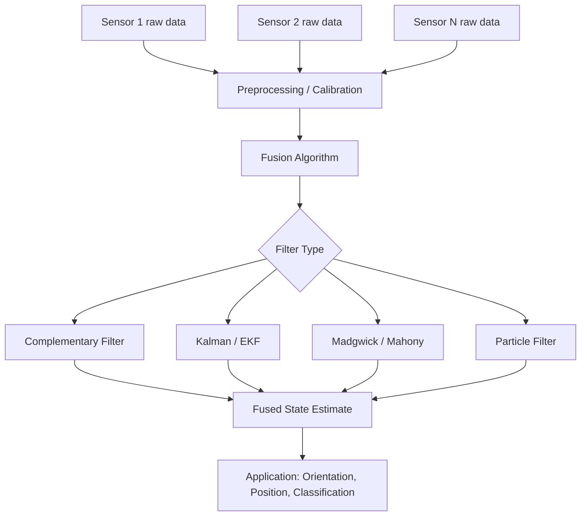

## Sensor Fusion Techniques

### Overview

Sensor fusion is the process of combining data from multiple sensors to produce an estimate that is more accurate, complete, or reliable than any single sensor could provide alone. In embedded systems, sensor fusion is essential wherever individual sensors have complementary strengths and weaknesses — most commonly in motion/orientation estimation (accelerometer + gyroscope + magnetometer), localization (GPS + IMU), and environmental sensing (combining multiple sensor modalities to reduce noise or resolve ambiguity).

The core motivation is that no single sensor is ideal across all conditions: sensors differ in noise characteristics, drift behavior, update rate, and susceptibility to specific error sources. Fusion algorithms exploit these differences statistically or algorithmically to produce a better combined estimate.

---

### Why Fusion Is Necessary

Consider the canonical case of an accelerometer and gyroscope estimating orientation:

- The accelerometer gives an absolute tilt reference (using gravity) but is corrupted by any linear acceleration/vibration, and offers no yaw information.
- The gyroscope gives accurate short-term angular rate but accumulates drift when integrated over time due to bias and noise.

Neither sensor alone is sufficient for a stable, drift-free, motion-robust orientation estimate — but their error characteristics are complementary in the frequency domain (accelerometer: reliable at low frequency; gyroscope: reliable at high frequency), which is what makes fusion effective.

This principle generalizes: fusion is most valuable when combined sensors have different, non-overlapping failure modes.

---

### Levels of Sensor Fusion

Sensor fusion is often categorized by the level at which data is combined:

- **Low-level (data/signal fusion)**: Raw sensor data is combined directly, e.g., merging raw accelerometer and gyroscope samples before any feature extraction. Requires sensors of compatible type and timing.
- **Feature-level fusion**: Features extracted independently from each sensor (e.g., detected edges from a camera, detected peaks from a vibration sensor) are combined before final estimation.
- **Decision-level fusion**: Each sensor (or subsystem) independently produces a decision or estimate, and these are combined at the final stage (e.g., voting, weighted averaging of independent classifier outputs).

Most classic embedded orientation-fusion algorithms (complementary filter, Kalman filter) operate at the low/signal level.

---

### Complementary Filter

The complementary filter is a lightweight, computationally cheap fusion technique well suited to resource-constrained microcontrollers. It works by applying a high-pass filter to the high-frequency-trustworthy sensor (gyroscope) and a low-pass filter to the low-frequency-trustworthy sensor (accelerometer), then summing the results.

$$\theta_t = \alpha(\theta_{t-1} + \omega_t \Delta t) + (1-\alpha)\,\theta_{accel,t}$$

Where:

- $\theta_{t-1}$ is the previous fused angle estimate
- $\omega_t$ is the current gyroscope angular rate
- $\Delta t$ is the sample interval
- $\theta_{accel,t}$ is the angle computed from the current accelerometer reading
- $\alpha$ is the filter weighting constant, typically 0.95–0.98

**Strengths**: Extremely low computational cost, easy to implement and tune, no matrix operations required.

**Limitations**: The weighting constant $\alpha$ is fixed and not statistically optimal; does not explicitly model sensor noise covariance; typically applied per-axis (roll/pitch), and generally cannot resolve yaw without a magnetometer, since gravity provides no reference for rotation about the vertical axis.

---

### Kalman Filter

The Kalman filter is a statistically optimal recursive estimator (under linear-Gaussian assumptions) that fuses sensor data by explicitly modeling system dynamics and sensor noise. It operates in two repeating steps:

**Prediction step** — project the current state forward using a system model:

$$\hat{x}_k^- = A\hat{x}_{k-1} + Bu_k$$

$$P_k^- = AP_{k-1}A^T + Q$$

**Update (correction) step** — incorporate the new measurement:

$$K_k = P_k^- H^T (HP_k^- H^T + R)^{-1}$$

$$\hat{x}_k = \hat{x}_k^- + K_k(z_k - H\hat{x}_k^-)$$

$$P_k = (I - K_k H)P_k^-$$

Where $\hat{x}$ is the state estimate, $P$ is the estimate error covariance, $Q$ is process noise covariance, $R$ is measurement noise covariance, $K_k$ is the Kalman gain, and $z_k$ is the sensor measurement.

The Kalman gain $K_k$ dynamically weights how much to trust the new measurement versus the prediction, based on the relative uncertainty of each — this is what distinguishes it from the complementary filter's fixed weighting.

#### Extended Kalman Filter (EKF)

Standard Kalman filters assume linear system dynamics. Orientation estimation involves nonlinear relationships (e.g., quaternion or Euler angle kinematics), so the **Extended Kalman Filter** linearizes the system locally around the current estimate using a Jacobian matrix at each step, enabling Kalman-style fusion for nonlinear systems.

**Strengths**: Statistically principled, explicitly accounts for sensor noise and uncertainty, widely used in production AHRS/navigation systems.

**Limitations**: Computationally heavier (matrix inversion required at each update), requires tuning of $Q$ and $R$ covariance matrices, EKF linearization can introduce error for highly nonlinear systems, higher memory footprint than complementary filtering — a real constraint on small microcontrollers.

---

### Madgwick and Mahony Filters

Purpose-built for embedded orientation estimation (commonly used with 9-DOF IMUs: accelerometer + gyroscope + magnetometer), these algorithms achieve Kalman-like fusion quality at a fraction of the computational cost, making them popular for real-time embedded AHRS on microcontrollers.

**Madgwick filter**: Formulates orientation as a quaternion and uses gradient descent to minimize the error between the measured gravity/magnetic field direction and the direction predicted by the current orientation estimate, then fuses this correction with the gyroscope-integrated estimate.

**Mahony filter**: Uses a complementary-filter-like structure but operating in quaternion space, with proportional-integral (PI) feedback correcting gyroscope bias using the accelerometer/magnetometer error signal — conceptually a nonlinear PI controller on the rotation error.

Both avoid the matrix inversion and covariance propagation of a full EKF, making them substantially cheaper computationally while still outperforming a simple per-axis complementary filter, particularly for full 3D orientation (including yaw, when a magnetometer is present).

---

### Particle Filter

For highly nonlinear or non-Gaussian estimation problems where EKF linearization introduces too much error, particle filters represent the state distribution using a set of weighted random samples ("particles") rather than a single Gaussian estimate.

- Each particle represents a hypothesis of the true state
- Particles are propagated through the system model, then reweighted based on how well they match new sensor measurements
- Resampling periodically discards low-weight particles and duplicates high-weight ones

**Strengths**: Handles arbitrary nonlinearities and multimodal distributions (e.g., ambiguous localization with multiple plausible positions).

**Limitations**: Computationally expensive relative to Kalman-family filters — accuracy scales with particle count, which directly increases compute and memory cost, generally making pure particle filters less common in low-power embedded contexts unless a DSP or more capable processor is available.

**Common use**: Robot localization (Monte Carlo Localization), tracking problems with ambiguous or multimodal state estimates.

---

### Fusion in Navigation: GPS + IMU

A common embedded fusion problem outside orientation sensing is combining GPS (absolute but low-rate, occasionally unavailable/noisy) with IMU dead-reckoning (high-rate, drifts over time without absolute reference).

- GPS provides periodic absolute position corrections (typically 1–10 Hz)
- IMU (accelerometer + gyroscope) provides high-rate relative motion estimation between GPS updates via dead-reckoning
- A Kalman filter (or EKF, given nonlinear vehicle dynamics) fuses the two: IMU data propagates the state forward at high rate, GPS fixes correct accumulated drift when available

This same GPS-denied bridging principle extends to indoor robotics, where GPS is unavailable and other absolute references (visual landmarks, UWB beacons, SLAM) substitute for GPS corrections.

---

### Sensor Fusion Beyond Motion: Multi-Modal Fusion

Fusion is not limited to inertial/motion sensors. Other embedded fusion contexts include:

- **Environmental sensing**: Combining temperature, humidity, and gas sensor readings to compensate for cross-sensitivity (e.g., a gas sensor's baseline drifting with humidity)
- **Vision + LiDAR/ToF fusion**: Combining camera imagery with depth sensor data for robust obstacle detection, common in embedded robotics and autonomous systems
- **Redundant sensor voting**: Using multiple sensors of the same type (e.g., triple-redundant IMUs in safety-critical systems) and fusing/voting to detect and reject a faulty sensor
- **Multi-rate fusion**: Combining sensors with very different update rates (e.g., a slow but accurate barometer with a fast but noisy accelerometer-derived vertical velocity for altitude estimation in drones)

---

### Choosing a Fusion Technique

| Technique | Computational Cost | Accuracy/Robustness | Typical Embedded Use |
| --- | --- | --- | --- |
| Complementary filter | Very low | Moderate | Simple tilt sensing, low-power MCUs |
| Mahony filter | Low | Good | Drone/robot AHRS on mid-range MCUs |
| Madgwick filter | Low–moderate | Good–very good | Drone/robot AHRS, wearables |
| Kalman filter (linear) | Moderate | Optimal (linear-Gaussian) | Linear system state estimation |
| Extended Kalman Filter | Moderate–high | Very good | GPS+IMU navigation, full AHRS |
| Particle filter | High | Very good (nonlinear/multimodal) | Robot localization, tracking |

[Inference] The choice between these techniques in practice generally trades off available compute/memory budget against required accuracy and robustness to nonlinear or multimodal conditions, since faster/cheaper methods make progressively stronger simplifying assumptions about the underlying system and noise — the specific acceptable trade-off depends on the target application's latency, power, and accuracy requirements.

---

### Fusion Pipeline Structure

---

### Illustration: Complementary Frequency-Domain Fusion

<svg xmlns="http://www.w3.org/2000/svg" viewBox="0 0 640 320">
<title>Complementary Filter — Frequency Domain Trust Regions (svg_diagram)</title>
<rect x="0" y="0" width="640" height="320" fill="#ffffff" />
<text x="20" y="28" font-size="16" font-weight="bold" fill="#222">Complementary Filter — Frequency Trust Regions (svg_diagram)</text>

<line x1="60" y1="260" x2="580" y2="260" stroke="#333" stroke-width="2" />
<line x1="60" y1="260" x2="60" y2="60" stroke="#333" stroke-width="2" />
<text x="300" y="290" font-size="12" fill="#333">Frequency →</text>
<text x="20" y="160" font-size="12" fill="#333" transform="rotate(-90 20 160)">Trust</text>

<path d="M 60 90 C 200 90, 250 200, 400 250 C 480 258, 540 260, 580 260" fill="none" stroke="#4a90d9" stroke-width="3" />
<text x="70" y="80" font-size="12" fill="#4a90d9" font-weight="bold">Accelerometer (low-pass)</text>

<path d="M 60 260 C 200 258, 250 200, 400 100 C 480 70, 540 65, 580 62" fill="none" stroke="#d94a4a" stroke-width="3" />
<text x="420" y="55" font-size="12" fill="#d94a4a" font-weight="bold">Gyroscope (high-pass)</text>

<line x1="320" y1="60" x2="320" y2="260" stroke="#888" stroke-width="1" stroke-dasharray="4,3" />
<text x="330" y="75" font-size="11" fill="#555">crossover region</text>

<text x="60" y="300" font-size="11" fill="#555">Low freq: accel trusted, gyro drift dominates</text>

<text x="380" y="300" font-size="11" fill="#555">High freq: gyro trusted, accel noise dominates</text>

</svg>

---

### Key Points

- Sensor fusion combines complementary sensors to overcome individual weaknesses (drift, noise, limited reference frame, low update rate).
- Complementary filters are cheap and simple but use fixed, non-statistically-optimal weighting.
- Kalman/EKF filters are statistically optimal under stated assumptions but computationally heavier, requiring covariance tuning.
- Madgwick and Mahony filters offer a practical middle ground for embedded AHRS: near-Kalman quality at much lower computational cost.
- Particle filters handle nonlinear/multimodal problems but are the most computationally expensive, generally reserved for platforms with adequate processing headroom.
- Fusion extends beyond motion sensing to navigation (GPS+IMU), environmental compensation, and multi-modal robotics perception.

---

### Related Topics

- Quaternion and Euler angle representations for orientation
- Extended Kalman Filter implementation details and tuning (Q/R covariance selection)
- Madgwick filter algorithm derivation and open-source implementations
- GPS/IMU integration architectures for embedded navigation
- SLAM (Simultaneous Localization and Mapping) fundamentals
- Sensor calibration prerequisites for effective fusion
- Redundant sensor voting and fault detection in safety-critical embedded systems
- Real-time operating system (RTOS) scheduling considerations for fusion loop timing