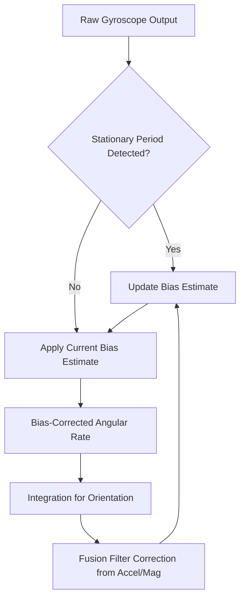

## Calibration and Drift Compensation

### Overview

Calibration is the process of characterizing and correcting the systematic errors of a sensor so its output accurately reflects the physical quantity being measured. Drift compensation addresses the subset of errors that change over time, temperature, or usage — as opposed to fixed, one-time manufacturing errors. In embedded systems, calibration and drift compensation are essential because raw sensor output almost always contains systematic error sources that, left uncorrected, degrade accuracy well beyond the sensor's inherent noise floor.

These two concerns are related but distinct: calibration typically refers to a deliberate, often one-time (or periodic) procedure to determine correction parameters, while drift compensation refers to ongoing, often continuous, adjustment to account for errors that change during operation.

---

### Sources of Sensor Error

Understanding error sources is necessary to choose the correct compensation strategy.

- **Offset (bias) error**: A constant additive error — the sensor reads a nonzero value when the true quantity is zero
- **Scale factor (gain) error**: A multiplicative error — the sensor's output is proportionally too large or small relative to the true value
- **Nonlinearity**: The sensor's response deviates from a straight-line relationship across its range, so a single offset/scale correction is insufficient
- **Cross-axis/cross-sensitivity error**: The sensor responds to a quantity other than the one intended (e.g., an accelerometer axis responding partially to acceleration on another axis; a gas sensor responding to humidity as well as target gas concentration)
- **Temperature-dependent error**: Offset, scale factor, or nonlinearity that changes with temperature — one of the most common real-world drift sources in embedded sensing
- **Time-dependent drift (aging)**: Slow, long-term change in sensor characteristics due to material aging, mechanical stress relaxation, or component degradation
- **Short-term drift/noise**: Random or slowly varying error over seconds to minutes, often characterized statistically (e.g., Allan variance analysis for gyroscopes)

$$y_{measured} = k \cdot x_{true} + b + f(T) + \eta(t)$$

Where $k$ is scale factor, $b$ is offset, $f(T)$ is a temperature-dependent error term, and $\eta(t)$ represents time-varying noise/drift.

---

### Calibration Types

#### Factory Calibration

Performed by the sensor manufacturer during production, often storing correction coefficients in onboard non-volatile memory (e.g., OTP or EEPROM) that the sensor or host applies automatically. Many modern digital sensors (e.g., pressure sensors, some IMUs) include this and expose calibrated output directly, though residual error and drift after factory calibration are still common, especially with temperature and aging.

#### Field/User Calibration

Performed by the end application or user, typically to correct for installation-specific effects (mounting orientation, local magnetic interference for magnetometers, mechanical mounting stress) that factory calibration cannot anticipate.

**Common field calibration procedures:**

- **Zero-point/offset calibration**: Record sensor output under a known zero-reference condition (e.g., gyroscope at rest, accelerometer axis known to read exactly 1g or 0g) and subtract the offset
- **Multi-point calibration**: Record sensor output at several known reference values spanning the sensor's range, then fit a correction curve (linear or higher-order polynomial)
- **Six-position calibration (accelerometers)**: Orient the sensor with each axis pointing up and down (six total orientations), using the known ±1g reference at each position to solve for offset and scale factor per axis
- **Figure-8 calibration (magnetometers)**: Rotate the sensor through varied orientations (often in a figure-8 pattern) to sample the full range of the magnetic field vector, enabling ellipsoid fitting to correct for hard-iron and soft-iron distortion

#### Continuous/Online Calibration

Some systems continuously re-estimate calibration parameters during normal operation rather than relying solely on a discrete calibration procedure, often using redundant information (e.g., a Kalman filter that estimates and corrects gyroscope bias as one of its state variables during normal fusion operation, rather than requiring a stationary calibration step).

---

### Correcting Offset and Scale Factor

Given raw sensor output $y_{raw}$, offset $b$, and scale factor $k$, the corrected value is:

$$x_{corrected} = \frac{y_{raw} - b}{k}$$

For a two-point calibration using two known reference points $(x_1, y_1)$ and $(x_2, y_2)$:

$$k = \frac{y_2 - y_1}{x_2 - x_1}$$


$$b = y_1 - k \cdot x_1$$

For nonlinear sensors, a polynomial fit across multiple calibration points is used instead of a single linear correction:

$$x_{corrected} = c_0 + c_1 y_{raw} + c_2 y_{raw}^2 + \dots$$

Where coefficients $c_i$ are typically determined via least-squares regression against known reference values.

---

### Temperature Compensation

Temperature is one of the most significant real-world drift sources for embedded sensors — affecting accelerometer/gyroscope bias, pressure sensor offset, and many chemical/gas sensor baselines.

**Common approaches:**

- **Lookup table (LUT) compensation**: Characterize sensor error at multiple temperatures during a calibration phase, store the resulting offset/scale corrections in a table, and interpolate at runtime based on a measured temperature (many IMUs include an onboard temperature sensor specifically for this purpose)
- **Polynomial temperature model**: Fit offset and/or scale factor as a polynomial function of temperature, e.g., $b(T) = b_0 + b_1 T + b_2 T^2$, and apply the correction using real-time temperature readings
- **Differential/ratiometric design**: Some sensor architectures inherently cancel common-mode temperature effects through differential measurement (e.g., a Wheatstone-bridge-based sensor where temperature affects both bridge arms equally, canceling in the differential output)

[Inference] The appropriate temperature compensation approach generally depends on how strongly and nonlinearly the specific sensor's error varies with temperature — a simple linear model is often adequate for many components, but higher-order or lookup-table approaches tend to be preferred when nonlinearity or hysteresis in the temperature response has been characterized as significant for that part.

---

### Gyroscope Bias Drift and Compensation

Gyroscope bias is a canonical embedded drift problem: even a small residual bias produces unbounded integration error over time.

$$\theta_{error}(t) = \int_0^t b(\tau)\, d\tau$$

**Compensation strategies:**

- **Static bias calibration**: Average gyroscope output over a stationary period at startup to estimate initial bias
- **Runtime re-estimation**: Detect periods of known-stationary state (e.g., via accelerometer variance thresholding) during operation and re-average bias, since bias itself drifts with temperature and over time
- **Kalman filter bias state**: Include gyroscope bias as an explicit state variable in the fusion filter's state vector, letting the filter continuously refine the bias estimate using corrections from the accelerometer/magnetometer
- **Allan variance characterization**: A statistical technique used during sensor characterization (not runtime) to decompose noise into components (angle random walk, bias instability, rate random walk) as a function of averaging time, informing filter tuning and expected drift bounds



---

### Magnetometer Calibration: Hard-Iron and Soft-Iron Distortion

Magnetometers are particularly sensitive to installation-specific distortion, making field calibration essential in almost all embedded applications using them.

- **Hard-iron distortion**: Caused by nearby permanent magnets or magnetized ferrous materials (e.g., speakers, other components on a PCB) that add a constant offset vector to the measured magnetic field, shifting the calibration sphere's center away from the origin
- **Soft-iron distortion**: Caused by nearby materials that distort the local field direction and magnitude (without being permanently magnetized themselves), warping the ideal sphere of magnetometer readings into an ellipsoid

**Calibration procedure**: Rotate the sensor through a wide range of orientations while logging raw output; fit an ellipsoid to the resulting point cloud; the ellipsoid's center gives the hard-iron offset, and its shape (via eigenvalue decomposition) gives the soft-iron correction matrix.

$$\vec{h}_{corrected} = W(\vec{h}_{raw} - \vec{h}_{offset})$$

Where $\vec{h}_{offset}$ is the hard-iron offset vector and $W$ is the soft-iron correction matrix derived from the fitted ellipsoid.

---

### Drift Compensation Beyond Inertial Sensors

- **Pressure/altitude sensors**: Barometric drift over hours/days due to weather-driven atmospheric pressure changes is often compensated by periodic re-referencing against a known altitude or a secondary source (e.g., GPS altitude) rather than treated as a fixed sensor calibration problem
- **Gas sensors**: Baseline resistance in resistive gas sensors (e.g., MOx sensors) drifts with humidity, temperature, and sensor aging; compensation often combines a co-located humidity/temperature sensor with periodic baseline recalibration in known-clean-air conditions
- **ADC reference drift**: Any sensor relying on an analog-to-digital converter is sensitive to reference voltage drift; ratiometric sensor designs (where sensor output and ADC reference share the same supply) inherently cancel much of this error, while non-ratiometric designs require a stable/calibrated voltage reference

---

### Calibration Data Storage and Application

In embedded systems, a full recalibration procedure is often impractical at every power-up, so calibration coefficients are typically:

- Computed once (factory or initial field calibration) and stored in non-volatile memory (EEPROM, flash) on the microcontroller or sensor itself
- Loaded at startup and applied to raw readings before use by application logic
- Periodically refreshed if the system supports online/runtime recalibration (e.g., gyroscope bias re-estimation during detected stationary periods)

```c
// Simplified example: applying stored offset/scale calibration to raw accelerometer data
typedef struct {
    float offset_x, offset_y, offset_z;
    float scale_x,  scale_y,  scale_z;
} accel_cal_t;

void apply_calibration(int16_t raw[3], float out[3], const accel_cal_t *cal) {
    out[0] = (raw[0] - cal->offset_x) * cal->scale_x;
    out[1] = (raw[1] - cal->offset_y) * cal->scale_y;
    out[2] = (raw[2] - cal->offset_z) * cal->scale_z;
}
```

**Output:** Given raw ADC/register counts and previously determined `offset`/`scale` values (from a six-position calibration procedure), this produces corrected acceleration values in physical units (g), reducing systematic bias and scale error prior to use in tilt or motion calculations.

[Unverified] The exact calibration coefficient storage format, memory location, and reapplication method vary by specific sensor part and application design, so implementation details should be confirmed against the target sensor's datasheet and the embedded system's own storage/configuration architecture.

---

### Verifying Calibration Quality

- **Residual error check**: After calibration, re-measure at known reference points and confirm residual error is within the sensor's specified tolerance
- **Cross-validation**: Use a subset of reference points for fitting calibration coefficients and a separate subset to validate, avoiding overfitting to calibration data (particularly relevant for higher-order polynomial or ellipsoid fits)
- **Long-term monitoring**: Track sensor output drift over time/temperature in deployed conditions where feasible, to detect when recalibration is warranted

---

### Illustration: Offset and Scale Factor Correction

<svg xmlns="http://www.w3.org/2000/svg" viewBox="0 0 640 340">
<title>Sensor Calibration — Offset and Scale Correction (svg_diagram)</title>
<rect x="0" y="0" width="640" height="340" fill="#ffffff" />
<text x="20" y="28" font-size="16" font-weight="bold" fill="#222">Offset and Scale Factor Correction (svg_diagram)</text>

<line x1="80" y1="290" x2="580" y2="290" stroke="#333" stroke-width="2" />
<line x1="80" y1="290" x2="80" y2="50" stroke="#333" stroke-width="2" />
<text x="300" y="320" font-size="12" fill="#333">True Value (x)</text>
<text x="20" y="170" font-size="12" fill="#333" transform="rotate(-90 20 170)">Sensor Output (y)</text>

<line x1="80" y1="270" x2="540" y2="70" stroke="#7ac36a" stroke-width="2" stroke-dasharray="5,3" />
<text x="420" y="90" font-size="11" fill="#3d7a2e">Ideal (y = x)</text>

<line x1="80" y1="230" x2="540" y2="110" stroke="#d94a4a" stroke-width="2" />
<text x="420" y="140" font-size="11" fill="#a83232">Raw (offset + scale error)</text>

<circle cx="200" cy="182" r="4" fill="#4a90d9" />
<circle cx="350" cy="130" r="4" fill="#4a90d9" />
<circle cx="480" cy="86" r="4" fill="#4a90d9" />
<text x="440" y="70" font-size="11" fill="#22456b">Corrected points</text>

<line x1="80" y1="270" x2="80" y2="230" stroke="#555" stroke-width="1" />
<text x="90" y="255" font-size="10" fill="#555">offset (b)</text>
</svg>

---

### Key Points

- Sensor error sources include offset, scale factor, nonlinearity, cross-sensitivity, temperature dependence, and time-based aging/drift.
- Calibration determines correction parameters (offset, scale, higher-order coefficients); drift compensation applies ongoing correction as those parameters change over time or temperature.
- Six-position calibration is standard for accelerometers; figure-8 ellipsoid fitting is standard for magnetometer hard-iron/soft-iron correction.
- Gyroscope bias drift is a critical embedded concern because it accumulates unbounded error under integration; static, runtime, and filter-based bias re-estimation are all common mitigation strategies.
- Temperature compensation (via lookup table, polynomial model, or inherently differential sensor design) addresses one of the most common real-world drift sources.
- Calibration coefficients are typically computed once and stored in non-volatile memory, then applied to raw readings at runtime, with some systems supporting continuous online recalibration.

---

### Related Topics

- Allan variance analysis for inertial sensor noise characterization
- Kalman filter state augmentation for online bias estimation
- Magnetometer hard-iron/soft-iron ellipsoid fitting algorithms
- Non-volatile memory (EEPROM/flash) strategies for storing calibration data on microcontrollers
- Gas sensor baseline drift and humidity/temperature compensation techniques
- ADC reference voltage stability and ratiometric sensor design
- Manufacturing test and factory calibration procedures for sensor production
- Statistical calibration validation and least-squares curve fitting