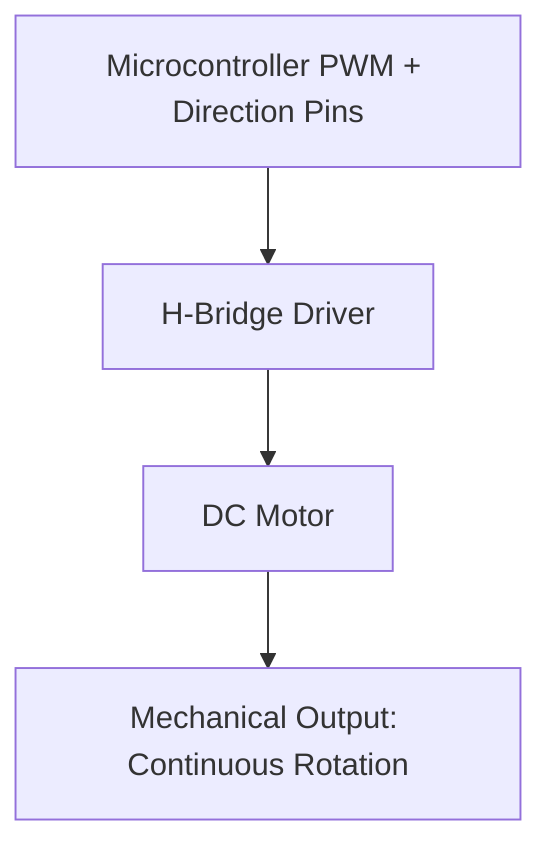
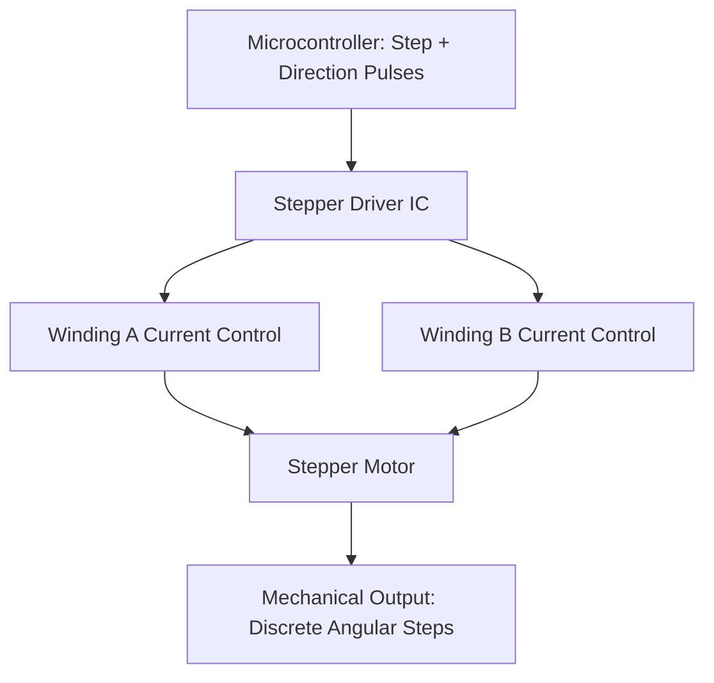

## DC Motors, Stepper Motors, and Servos


### Overview

DC motors, stepper motors, and servo motors are the three actuator types most commonly interfaced with embedded systems for producing mechanical motion. Each converts electrical energy into rotational (or sometimes linear) motion using fundamentally different operating principles, and each is suited to different control requirements — continuous rotation with variable speed, precise incremental positioning, or closed-loop angular/positional control.

---

### DC Motors

#### Operating Principle

A brushed DC motor consists of a rotating armature (rotor) with wire windings inside a fixed magnetic field (from permanent magnets or field windings in the stator). Current flowing through the armature windings, within the magnetic field, produces a force via the Lorentz force law:

$$\vec{F} = I\vec{L} \times \vec{B}$$

This force generates torque, causing rotation. A commutator (a mechanical rotary switch) combined with brushes periodically reverses current direction in the armature windings as the rotor turns, maintaining continuous rotational torque rather than the rotor simply aligning and stopping.

$$\tau = k_t \cdot I$$


$$V_{back-emf} = k_e \cdot \omega$$

Where $\tau$ is torque, $I$ is armature current, $k_t$ is the torque constant, $V_{back-emf}$ is the back-electromotive force generated by the rotating armature, $k_e$ is the back-EMF constant, and $\omega$ is angular velocity. In consistent SI units, $k_t$ and $k_e$ are numerically equal.

#### Brushed vs. Brushless DC Motors

**Brushed DC (BDC)**:

- Mechanical brushes/commutator handle current switching
- Simple to drive: apply DC voltage, motor spins; reverse polarity to reverse direction
- Brushes wear over time, creating maintenance and longevity limitations; brush arcing also generates electrical noise
- Common in low-cost embedded applications: toy motors, simple actuators, basic robotics

**Brushless DC (BDC/BLDC)**:

- Commutation is performed electronically rather than mechanically, using a driver circuit that switches current through stator windings based on rotor position (typically sensed via Hall effect sensors or back-EMF sensing in sensorless designs)
- No brushes to wear out; generally higher efficiency, longer lifespan, and better power-to-weight ratio than equivalent brushed motors
- Requires a dedicated electronic speed controller (ESC) or motor driver IC to generate the correct commutation sequence
- Common in drones, higher-performance robotics, cooling fans, and applications requiring long service life

#### Speed and Torque Control

DC motor speed is primarily controlled via **Pulse Width Modulation (PWM)** of the supply voltage, effectively controlling average applied voltage:

$$V_{avg} = D \cdot V_{supply}$$

Where $D$ is the PWM duty cycle (0 to 1). Direction control (for brushed DC) is typically achieved with an **H-bridge** circuit, allowing current to flow through the motor in either direction under microcontroller control.



#### Key Specifications

- **Rated voltage/current**: Nominal operating conditions
- **Stall torque**: Maximum torque at zero speed (maximum current draw condition)
- **No-load speed**: Maximum rotational speed with no mechanical load
- **Torque constant ($k_t$) / back-EMF constant ($k_e$)**: Relate current to torque and speed to back-EMF
- **Efficiency curve**: Efficiency varies significantly with operating point; peak efficiency typically occurs well below stall torque and below no-load speed

---

### Stepper Motors

#### Operating Principle

A stepper motor divides a full rotation into a discrete number of steps, moving to a fixed angular position for each electrical pulse sequence applied to its windings, rather than rotating continuously and smoothly like a DC motor. This makes steppers well suited to open-loop position control, since (absent missed steps) the motor's position can be tracked simply by counting commanded steps.

**Two common stepper types:**

- **Permanent magnet (PM) stepper**: Rotor is a permanent magnet; simpler and lower cost, generally coarser step resolution
- **Hybrid stepper**: Combines permanent magnet and variable reluctance principles; most common in precision embedded/industrial applications due to finer natural step resolution

#### Step Angle and Microstepping

$$\text{Step angle} = \frac{360°}{\text{steps per revolution}}$$

A common full-step hybrid stepper has 200 steps per revolution (1.8° per step). **Microstepping** drives the windings with sinusoidally varying (rather than simple on/off) current, allowing the rotor to settle at intermediate positions between full steps:

$$I_A = I_{max}\sin(\theta), \quad I_B = I_{max}\cos(\theta)$$

Where $\theta$ represents the fractional position within a full step. Microstepping (e.g., 1/16 or 1/256 microstepping) improves positional smoothness and reduces resonance/vibration compared to full-step or half-step drive, though the achievable holding torque at intermediate microsteps is [Inference] generally reduced somewhat relative to full-step positions due to nonlinearities in real motor magnetic behavior not fully captured by the idealized sinusoidal current model, and true mechanical positional accuracy at fine microstep resolutions is typically lower than the electrical step resolution would suggest.

#### Drive Configurations

- **Unipolar stepper**: Windings have a center tap, allowing current direction control without an H-bridge (simpler driver circuit, but typically lower torque efficiency than bipolar for a given winding)
- **Bipolar stepper**: Full winding is driven in both directions using H-bridge circuitry per winding; generally higher torque efficiency, requires a dedicated stepper driver IC (e.g., A4988, DRV8825, TMC2209) to manage current control and stepping sequence



#### Key Specifications

- **Steps per revolution / step angle**: Base positional resolution before microstepping
- **Holding torque**: Maximum torque the motor can resist at standstill while energized, without losing position
- **Pull-in/pull-out torque**: Maximum torque at which the motor can start/maintain synchronism at a given step rate without missing steps
- **Maximum step rate**: Frequency limit before torque drops significantly or steps are missed due to winding inductance limiting current rise time

#### Open-Loop Limitation

Because standard stepper control is open-loop (no position feedback), applying excessive load torque can cause the rotor to "miss steps" — losing synchronization with the commanded step sequence — without the controller being aware, leading to accumulated position error. Closed-loop stepper systems (adding an encoder for feedback) address this at additional cost and complexity, blurring the line toward servo-style control.

---

### Servo Motors

#### Operating Principle

"Servo motor" in embedded/hobbyist contexts typically refers to a small geared DC motor combined with a position feedback potentiometer (or encoder) and onboard control circuitry, packaged as a self-contained closed-loop position-control actuator. Unlike a raw DC motor or open-loop stepper, a servo continuously compares its actual position (from the feedback sensor) against a commanded target position and drives the internal motor to minimize the error.

$$e(t) = \theta_{target} - \theta_{actual}$$

The internal controller (commonly a simple proportional or PID controller) drives motor current based on this error signal until it converges toward zero.

#### Control Signal: PWM Pulse-Position

Hobbyist RC-style servos are typically controlled via a PWM signal where **pulse width** (not duty cycle) encodes the target angle, repeated at a fixed frame rate (commonly ~50 Hz, i.e., a 20 ms period):

- ~1.0 ms pulse width → one extreme (e.g., 0°)
- ~1.5 ms pulse width → center (e.g., 90°)
- ~2.0 ms pulse width → other extreme (e.g., 180°)

[Unverified] Exact pulse-width-to-angle mapping and total travel range vary meaningfully between servo manufacturers and models, so exact values should be confirmed against the specific servo's datasheet rather than assumed universal.

```c
// Simplified embedded servo control example (typical MCU PWM peripheral)
void set_servo_angle(uint8_t angle_deg) {
    // Map 0-180 degrees to 1000-2000 microsecond pulse width
    uint16_t pulse_us = 1000 + ((uint32_t)angle_deg * 1000) / 180;
    set_pwm_pulse_width_us(SERVO_PWM_CHANNEL, pulse_us);
}
```

**Output:** Calling `set_servo_angle(90)` produces a pulse width of approximately 1500 µs, commanding the servo to its center position; the servo's internal feedback loop then drives toward and holds that position.

#### Continuous Rotation Servos

A variant where the internal feedback potentiometer is removed/disconnected and replaced with fixed-position circuitry, converting the same PWM pulse-width control signal into a speed/direction command instead of a position command — functionally behaving like a simplified variable-speed DC gearmotor with built-in H-bridge control, rather than true closed-loop position control.

#### Key Specifications

- **Torque rating**: Typically specified in kg·cm or oz·in at a given supply voltage
- **Speed**: Typically specified as time per 60° of rotation at a given supply voltage and load
- **Rotation range**: Commonly 180° for standard hobby servos, though continuous-rotation and multi-turn variants exist
- **Deadband**: Minimum position error the servo will tolerate without actively correcting, affecting positional precision and jitter/holding behavior

---

### Comparing the Three Actuator Types

| Property | DC Motor | Stepper Motor | Servo Motor |
| --- | --- | --- | --- |
| Motion type | Continuous rotation | Discrete steps | Closed-loop position (typically limited range) |
| Position feedback | None (unless added externally) | None (open-loop) | Built-in (potentiometer/encoder) |
| Position accuracy | N/A without external encoder | Good if no steps missed | Good, self-correcting |
| Control complexity | Simple (PWM + H-bridge) | Moderate (driver IC, step sequencing) | Simple external interface (single PWM signal), complexity hidden internally |
| Typical embedded use | Wheels, fans, continuous drive | 3D printers, CNC, precise open-loop positioning | RC vehicles, robotic arms, camera gimbals |
| Failure mode under overload | Stalls, draws high current | Misses steps silently | Struggles/oscillates but position feedback remains valid |

---

### Selecting an Actuator Type

- **Choose a DC motor** when continuous rotation with variable speed is needed and precise position tracking is not required (or will be handled externally, e.g., with a separate encoder and control loop)
- **Choose a stepper motor** when precise, repeatable open-loop positioning is needed, load torque is predictable and within the motor's pull-out torque limits, and the cost/complexity of a closed-loop encoder system is undesirable
- **Choose a servo motor** when a bounded range of closed-loop angular positioning is needed with minimal external control complexity, since the feedback loop is handled internally and the embedded system only needs to generate a simple PWM command signal

---

### Illustration: Actuator Control Signal Comparison

<svg xmlns="http://www.w3.org/2000/svg" viewBox="0 0 680 360">
<title>Control Signals — DC Motor PWM, Stepper Pulses, Servo Pulse-Width (svg_diagram)</title>
<rect x="0" y="0" width="680" height="360" fill="#ffffff" />
<text x="20" y="28" font-size="16" font-weight="bold" fill="#222">Actuator Control Signals Compared (svg_diagram)</text>


<text x="30" y="60" font-size="13" font-weight="bold" fill="#333">DC Motor: PWM Duty Cycle</text>

<line x1="30" y1="100" x2="640" y2="100" stroke="#ccc" stroke-width="1" />

<path d="M30,100 L30,70 L90,70 L90,100 L150,100 L150,70 L210,70 L210,100 L270,100 L270,70 L330,70 L330,100" fill="none" stroke="`#4a90d9`" stroke-width="2" />

<text x="350" y="90" font-size="11" fill="#555">Duty cycle → average voltage → speed</text>


<text x="30" y="150" font-size="13" font-weight="bold" fill="#333">Stepper: Discrete Step Pulses</text>

<line x1="30" y1="190" x2="640" y2="190" stroke="#ccc" stroke-width="1" />

<line x1="60" y1="190" x2="60" y2="160" stroke="`#d94a4a`" stroke-width="2" />

<line x1="120" y1="190" x2="120" y2="160" stroke="`#d94a4a`" stroke-width="2" />

<line x1="180" y1="190" x2="180" y2="160" stroke="`#d94a4a`" stroke-width="2" />

<line x1="240" y1="190" x2="240" y2="160" stroke="`#d94a4a`" stroke-width="2" />

<line x1="300" y1="190" x2="300" y2="160" stroke="`#d94a4a`" stroke-width="2" />

<text x="350" y="180" font-size="11" fill="#555">Each pulse = one fixed angular step</text>


<text x="30" y="240" font-size="13" font-weight="bold" fill="#333">Servo: Pulse-Position (20ms frame)</text>

<line x1="30" y1="280" x2="640" y2="280" stroke="#ccc" stroke-width="1" />

<path d="M30,280 L30,250 L55,250 L55,280 L430,280 L430,250 L455,250 L455,280" fill="none" stroke="`#7ac36a`" stroke-width="2" />

<text x="60" y="300" font-size="10" fill="#555">~1.5ms pulse</text>

<text x="60" y="315" font-size="10" fill="#555">↕ within 20ms frame period</text>

<text x="350" y="300" font-size="11" fill="#555">Pulse width → target angle</text>

</svg>

---

### Key Points

- DC motors produce continuous rotation via Lorentz-force torque; brushed motors use mechanical commutation, brushless motors use electronic commutation for better efficiency and lifespan at added driver complexity.
- Stepper motors move in discrete, countable steps and are controlled open-loop; microstepping improves smoothness but with some reduction in positional accuracy and holding torque relative to full steps.
- Servo motors (in the embedded/hobbyist sense) are self-contained closed-loop position actuators, controlled via a simple pulse-width-encoded PWM signal, with the feedback loop handled internally.
- Steppers can silently miss steps under excessive load (open-loop failure mode); servos maintain valid position feedback even when struggling under load.
- Driver hardware differs substantially across types: H-bridge for DC/bipolar stepper windings, dedicated stepper driver ICs for step sequencing and microstepping, and a single PWM signal line for standard hobby servos.

---

### Related Topics

- H-bridge motor driver circuit design and PWM motor speed control
- Stepper driver ICs and microstepping current control (A4988, DRV8825, TMC-series)
- Closed-loop stepper systems and encoder feedback integration
- BLDC motor commutation and electronic speed controller (ESC) design
- PID control theory applied to motor position/speed control
- Motor selection: torque-speed curves and gear reduction considerations
- Encoder types (optical, magnetic) for adding position feedback to DC motors
- Power stage considerations: motor driver current ratings, flyback diodes, thermal management