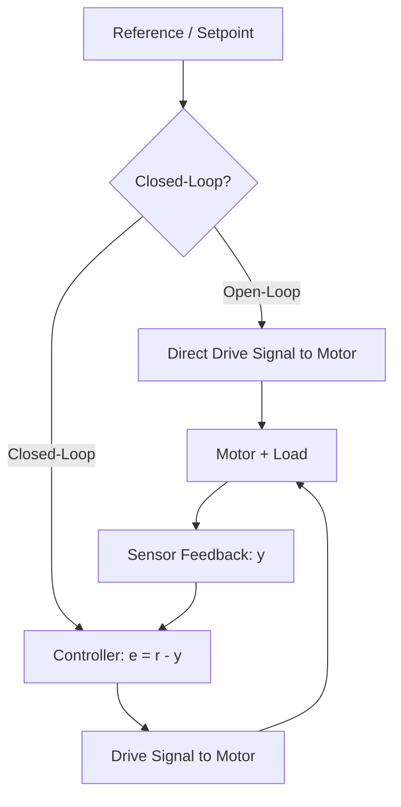
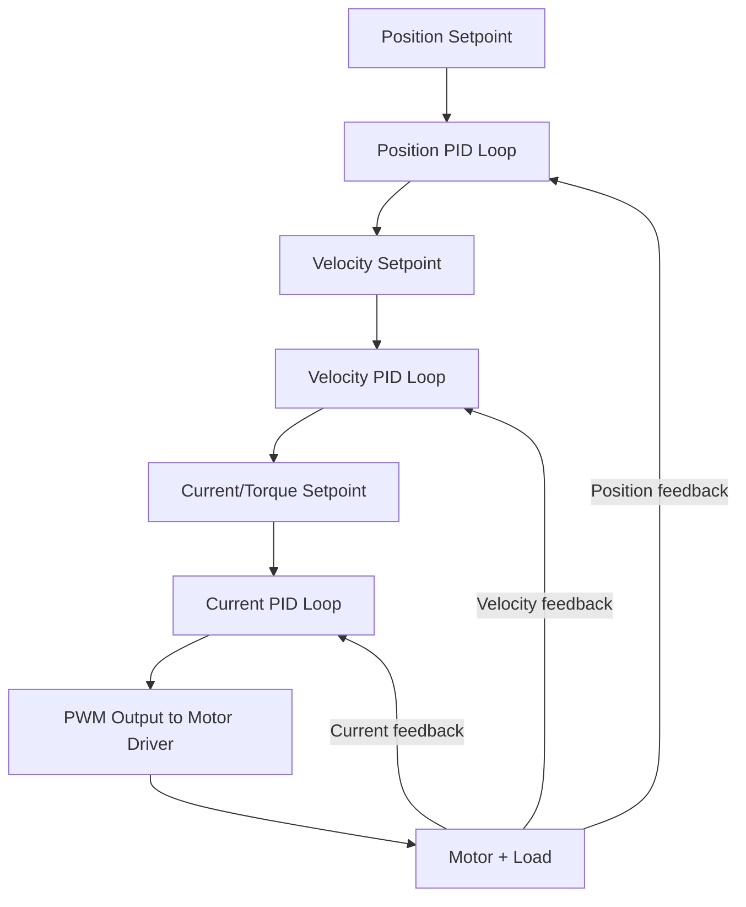
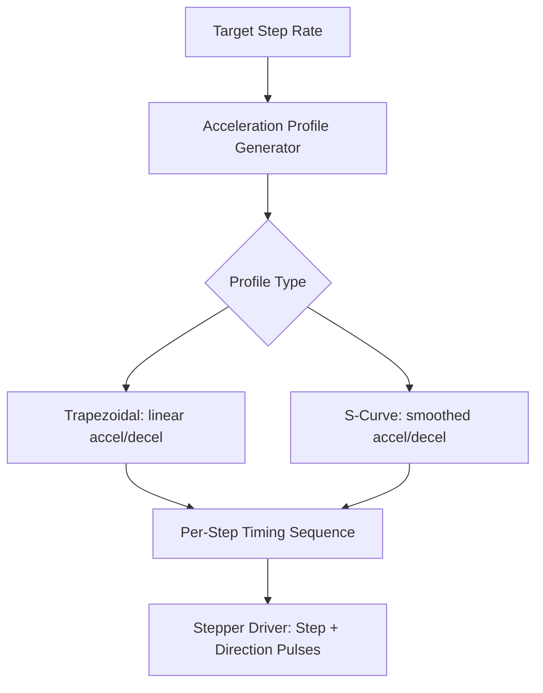
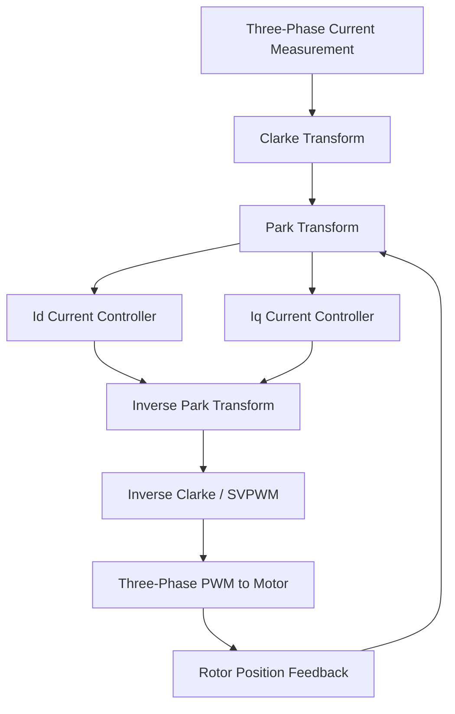

## Motor Control Algorithms


### Overview

Motor control algorithms are the computational methods embedded systems use to drive motors toward a desired speed, position, or torque, given feedback (or the absence of it) from sensors. These range from simple open-loop drive schemes to sophisticated closed-loop and model-based techniques used in high-performance BLDC and servo systems. The choice of algorithm depends on the motor type (DC, stepper, BLDC), available feedback, required precision, and computational resources of the target microcontroller.

---

### Open-Loop vs. Closed-Loop Control

**Open-loop control** drives the motor based on a commanded input without measuring actual output (speed/position) and correcting for error. Simpler, requires no feedback sensor, but cannot compensate for load disturbances, friction variation, or missed steps.

**Closed-loop control** measures actual motor behavior (via encoder, tachometer, Hall sensors, or back-EMF sensing) and continuously adjusts the drive signal to minimize the error between commanded and actual output.

$$e(t) = r(t) - y(t)$$

Where $r(t)$ is the reference (commanded) value and $y(t)$ is the measured actual value. Closed-loop control is generally required wherever load disturbances, friction, or precision requirements exceed what open-loop drive can reliably achieve.



---

### PID Control

The Proportional-Integral-Derivative (PID) controller is the most widely used closed-loop control algorithm in embedded motor control, valued for its relative simplicity and effectiveness across a broad range of systems.

$$u(t) = K_p e(t) + K_i \int_0^t e(\tau)\,d\tau + K_d \frac{de(t)}{dt}$$

Where $u(t)$ is the control output (e.g., PWM duty cycle), $e(t)$ is the error signal, and $K_p$, $K_i$, $K_d$ are the proportional, integral, and derivative gains.

- **Proportional term**: Produces output proportional to current error; higher $K_p$ gives faster response but risks overshoot and instability if too high
- **Integral term**: Accumulates past error over time, eliminating steady-state error that a proportional-only controller cannot fully remove (e.g., compensating for constant friction or load torque); excessive $K_i$ can cause overshoot and oscillation ("integral windup" is a related practical concern, addressed below)
- **Derivative term**: Responds to the rate of change of error, providing damping that can reduce overshoot and oscillation; sensitive to measurement noise, since differentiation amplifies high-frequency noise

#### Discrete-Time Implementation

Embedded PID controllers run at a fixed sample rate, requiring a discretized form:

$$u_k = K_p e_k + K_i T_s \sum_{i=0}^{k} e_i + K_d \frac{e_k - e_{k-1}}{T_s}$$

Where $T_s$ is the sample period. A common practical embedded implementation uses the incremental (velocity) form to avoid recomputing the full integral sum each cycle:

$$\Delta u_k = K_p(e_k - e_{k-1}) + K_i T_s e_k + \frac{K_d}{T_s}(e_k - 2e_{k-1} + e_{k-2})$$

```c
// Simplified discrete PID controller for embedded motor speed control
typedef struct {
    float kp, ki, kd;
    float integral;
    float prev_error;
    float output_min, output_max;
} pid_controller_t;

float pid_update(pid_controller_t *pid, float setpoint, float measured, float dt) {
    float error = setpoint - measured;
    pid->integral += error * dt;

    // Basic anti-windup: clamp integral term
    float integral_term = pid->ki * pid->integral;

    float derivative = (error - pid->prev_error) / dt;
    pid->prev_error = error;

    float output = pid->kp * error + integral_term + pid->kd * derivative;

    // Clamp output and back-calculate integral to prevent windup
    if (output > pid->output_max) {
        output = pid->output_max;
        pid->integral -= error * dt;  // undo integral accumulation
    } else if (output < pid->output_min) {
        output = pid->output_min;
        pid->integral -= error * dt;
    }
    return output;
}
```

**Output:** Called periodically (e.g., every 1 ms in a timer interrupt) with the current speed setpoint and measured speed (from an encoder), this returns a PWM duty cycle command that drives the motor toward the setpoint while resisting load-induced steady-state error.

#### Integral Windup and Anti-Windup

When the control output saturates (e.g., PWM duty cycle capped at 100%) while error remains, the integral term can continue accumulating unboundedly, causing significant overshoot once the system finally starts responding — a phenomenon called integral windup. Common mitigations include clamping the integral term directly, back-calculation (as in the example above), or conditional integration (pausing integral accumulation while output is saturated).

#### Tuning

- **Manual/heuristic tuning**: Adjust gains empirically, typically starting with $K_p$ alone, then adding $K_i$ to remove steady-state error, then $K_d$ to reduce overshoot
- **Ziegler-Nichols method**: A structured heuristic tuning procedure using the system's critical gain and oscillation period at the stability boundary to derive starting gain values
- **Model-based tuning**: Using a known or identified system model (transfer function) to analytically derive gains meeting specified performance criteria (rise time, overshoot, settling time)

[Inference] In practice, embedded motor control PID gains are frequently tuned empirically on the actual hardware rather than purely analytically, since real motor/load dynamics (friction, backlash, sensor noise, load variation) often deviate from idealized models in ways that are more efficiently addressed through iterative tuning than through fully model-based derivation alone — though this balance varies with how well-characterized the specific system is.

---

### Cascade Control Structures

Many embedded motor control systems use nested (cascade) PID loops rather than a single loop, particularly for position control:



The innermost loop (typically current/torque) runs at the highest update rate and responds fastest, while outer loops (velocity, then position) run progressively slower, each producing the setpoint for the loop inside it. This structure is standard in industrial servo drives and improves both disturbance rejection and control bandwidth management compared to a single monolithic loop.

---

### Bang-Bang (On-Off) Control

The simplest possible closed-loop strategy: the actuator is driven fully on or fully off depending on whether measured output is below or above the setpoint, often with hysteresis to prevent rapid switching (chattering) near the setpoint.

- **Strengths**: Extremely simple, minimal computation
- **Limitations**: Produces oscillation around the setpoint rather than smooth convergence; generally unsuitable for precision motor control but sometimes acceptable for simple thermostat-like or coarse on/off actuator applications
- Rarely used for motor speed/position control directly, though relevant conceptually as the simplest closed-loop baseline

---

### Stepper Motor Control Algorithms

Stepper control differs from continuous-motor control because the "control" problem is primarily about generating the correct step pulse sequence and timing rather than continuously minimizing an error signal.

#### Full-Step and Half-Step Sequencing

The driver energizes windings in a defined sequence to advance the rotor one step (or half-step) at a time. Full-step sequences energize windings at fixed current levels; half-stepping alternates between energizing one and two windings simultaneously, doubling positional resolution at some cost to per-step torque uniformity.

#### Microstepping Current Profiles

As covered in stepper motor fundamentals, microstepping drives windings with sinusoidal current profiles rather than simple on/off switching, computed via:

$$I_A(\theta) = I_{max}\sin(\theta), \quad I_B(\theta) = I_{max}\cos(\theta)$$

The controller (often implemented in a dedicated stepper driver IC rather than the main microcontroller) generates this profile at each microstep interval.

#### Acceleration Profiling (Ramping)

Commanding a stepper motor to jump instantly to a high step rate typically causes missed steps because the rotor's mechanical inertia cannot keep pace with a sudden change in commanded velocity. Embedded stepper control algorithms therefore ramp step rate up and down smoothly:

- **Trapezoidal profile**: Linear acceleration, constant cruise velocity, linear deceleration — simple to compute, widely used in 3D printer/CNC firmware
- **S-curve profile**: Smoothly varying acceleration (avoiding instantaneous jumps in acceleration itself) reduces mechanical vibration and resonance compared to trapezoidal profiles, at the cost of more complex step-timing computation



---

### BLDC Motor Control: Trapezoidal and Field-Oriented Control (FOC)

Brushless DC motors require electronic commutation, and the sophistication of the commutation algorithm significantly affects efficiency, torque smoothness, and audible noise.

#### Six-Step (Trapezoidal) Commutation

The simplest BLDC control scheme: at any moment, two of the three motor phases are energized (one sourcing current, one sinking) while the third is left floating, and Hall effect sensors (or back-EMF zero-crossing detection in sensorless designs) determine when to switch to the next of six commutation states per electrical revolution.

- **Strengths**: Computationally simple, well suited to low-cost microcontrollers
- **Limitations**: Produces torque ripple (non-smooth torque output) because instantaneous current/torque is not continuously controlled between commutation steps; less efficient than FOC at a given torque output

#### Field-Oriented Control (FOC)

A more advanced technique that models the motor's stator currents as vectors in a rotating reference frame aligned with the rotor's magnetic flux, allowing independent control of torque-producing and flux-producing current components — conceptually similar to controlling a DC motor's torque directly, despite the underlying AC/BLDC hardware.

**Core transforms:**

- **Clarke transform**: Converts three-phase stator currents ($I_a, I_b, I_c$) into a two-axis stationary reference frame ($I_\alpha, I_\beta$)
- **Park transform**: Converts the stationary-frame currents into a rotating reference frame aligned with rotor flux ($I_d, I_q$), where $I_q$ directly corresponds to torque-producing current and $I_d$ corresponds to flux-producing current

$$I_d = I_\alpha \cos\theta + I_\beta \sin\theta$$


$$I_q = -I_\alpha \sin\theta + I_\beta \cos\theta$$

Where $\theta$ is the rotor's electrical angle, typically obtained from an encoder, resolver, or sensorless estimation algorithm.

Separate PID controllers regulate $I_d$ (typically held near zero for standard operation, maximizing torque-per-amp) and $I_q$ (controlling torque directly), with the results transformed back (inverse Park/Clarke) into three-phase PWM duty cycles via Space Vector PWM (SVPWM) or similar modulation.



**Strengths**: Smooth torque output (minimal ripple), higher efficiency, precise torque control, quieter operation compared to trapezoidal commutation.

**Limitations**: Significantly higher computational requirements (real-time trigonometric transforms and multiple nested current control loops), requires accurate rotor position sensing/estimation, generally implemented on more capable microcontrollers (often with hardware FPU and sometimes dedicated motor-control peripherals) or DSPs rather than low-end 8-bit MCUs.

---

### Sensorless Control Techniques

Many BLDC/FOC systems avoid physical position sensors (Hall sensors, encoders) to reduce cost and wiring complexity, instead estimating rotor position algorithmically:

- **Back-EMF zero-crossing detection**: Used with trapezoidal commutation; the undriven third phase's back-EMF crosses zero at a predictable point relative to commutation timing, providing a position reference — but this method is ineffective at very low or zero speed, since back-EMF magnitude is proportional to rotor velocity
- **Sliding mode observers / model-based estimators**: Used with FOC to estimate rotor flux angle from measured currents and a motor model, without a physical position sensor, at added algorithmic and tuning complexity relative to sensor-based FOC

---

### Choosing a Control Algorithm

| Requirement | Suitable Approach |
| --- | --- |
| Simple on/off actuation | Bang-bang control |
| Basic speed/position regulation with feedback | PID control |
| Precise multi-loop position control | Cascade PID (position/velocity/current) |
| Open-loop precise stepping | Stepper step-sequencing with acceleration profiling |
| Low-cost BLDC drive, torque ripple acceptable | Six-step trapezoidal commutation |
| High-efficiency, smooth-torque BLDC drive | Field-Oriented Control (FOC) |
| Sensor-cost-sensitive BLDC | Sensorless back-EMF or observer-based estimation |

---

### Key Points

- Open-loop control is simpler but cannot correct for load disturbances or missed steps; closed-loop control uses feedback to continuously minimize error.
- PID control is the standard closed-loop algorithm for embedded motor control, requiring careful gain tuning and anti-windup handling for the integral term.
- Cascade (nested) PID loops — current inside velocity inside position — are standard in high-performance servo control architectures.
- Stepper motor control centers on step sequencing and acceleration profiling (trapezoidal or S-curve) rather than continuous error minimization.
- BLDC control ranges from simple, torque-rippled six-step trapezoidal commutation to computationally intensive but smooth and efficient Field-Oriented Control using Clarke/Park transforms.
- Sensorless techniques (back-EMF zero-crossing, model-based observers) reduce hardware cost at the expense of added algorithmic complexity and reduced low-speed performance.

---

### Related Topics

- Space Vector PWM (SVPWM) modulation techniques
- Encoder and Hall sensor integration for closed-loop feedback
- Motor system identification and transfer function modeling
- Real-time embedded control loop timing and interrupt-driven implementation
- Current sensing techniques (shunt resistors, Hall-effect current sensors) for FOC
- Dedicated motor control peripherals and DSP/FPU-equipped microcontrollers
- Torque ripple analysis and mitigation techniques
- Regenerative braking and four-quadrant motor control