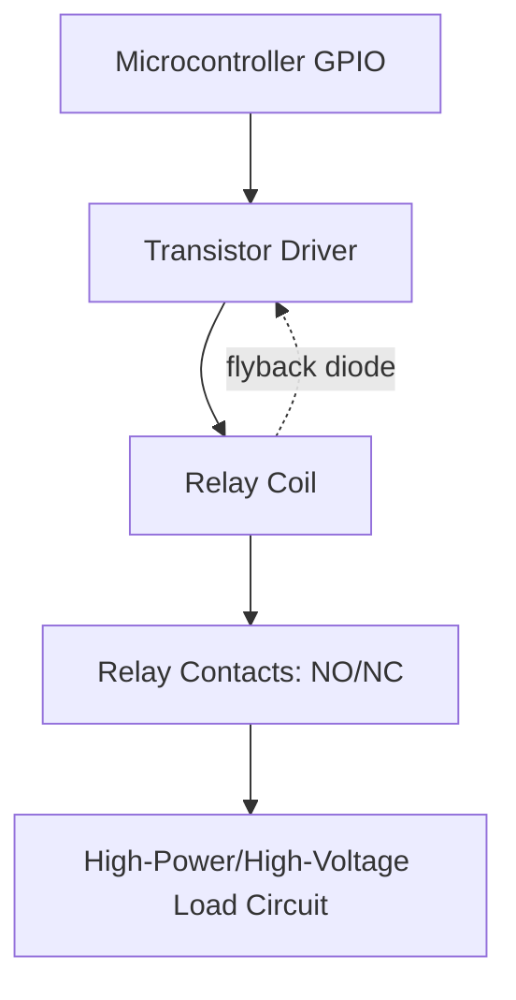

## Relays and Solid-State Switching

### Overview

Relays and solid-state switches are components used to control high-power or high-voltage loads using a low-power control signal from an embedded system, and to provide electrical isolation between a control circuit and a switched load. Both serve the same fundamental purpose — using a small signal to switch a larger load — but achieve it through very different physical mechanisms, with correspondingly different trade-offs in speed, lifespan, isolation, and switching characteristics.

---

### Why Switching Interfaces Are Needed

Microcontroller GPIO pins typically source or sink only a few tens of milliamps at logic-level voltages (commonly 3.3V or 5V), far below what most real-world loads (motors, heaters, lamps, mains-powered equipment, solenoids) require. Relays and solid-state switches bridge this gap, allowing a microcontroller to control loads that draw far more current or operate at far higher voltages than the microcontroller itself could handle directly.

---

### Electromechanical Relays

#### Operating Principle

An electromechanical relay uses an electromagnet (coil) to mechanically move a set of contacts, physically opening or closing a separate switched circuit. Energizing the coil generates a magnetic field that pulls an armature, moving the contacts between open and closed positions.

- **Normally Open (NO)**: Contacts are open when the coil is de-energized, closed when energized
- **Normally Closed (NC)**: Contacts are closed when de-energized, open when energized
- **Single Pole Single Throw (SPST) / Single Pole Double Throw (SPDT) / Double Pole Double Throw (DPDT)**: Describe the number of switched circuits ("poles") and switching positions ("throws") a relay provides

#### Key Characteristics

- **Complete galvanic isolation**: The coil circuit and switched contact circuit are physically and electrically separate, providing strong isolation between control and load circuits — important for safety when switching mains voltage or for isolating noisy loads from sensitive control electronics
- **Switching capacity**: Relays can switch relatively high current/voltage loads (many common embedded-hobbyist relay modules handle several amps at 250VAC or 30VDC) using a low-power coil (often 5V or 12V, tens of milliamps)
- **Mechanical wear**: Contacts physically wear over repeated switching cycles, especially under arcing conditions with inductive loads; relays have a finite mechanical/electrical switching lifespan, typically specified in number of cycles
- **Switching speed**: Milliseconds — mechanical armature movement is inherently much slower than solid-state switching
- **Contact bounce**: Mechanical contacts briefly bounce (make/break repeatedly) during transition, which can cause electrical noise or false triggering if not accounted for in circuit/firmware design
- **Audible click**: A byproduct of mechanical actuation, sometimes relevant to product design considerations
- **Arcing at contact separation**: Especially pronounced with inductive loads (motors, solenoids) due to the load's stored magnetic energy attempting to maintain current flow as contacts open, causing contact degradation over time

#### Driving a Relay Coil

Relay coils are typically driven through a transistor (BJT or MOSFET) rather than directly from a GPIO pin, since coil current usually exceeds safe GPIO sourcing/sinking capability, and a flyback diode is essential across the coil to protect the driving transistor from the inductive voltage spike generated when coil current is interrupted.



```c
// Simplified relay control via GPIO-driven transistor
void set_relay(bool energize) {
    gpio_write(RELAY_CONTROL_PIN, energize ? HIGH : LOW);
}
```

**Output:** Setting the GPIO high turns on the driving transistor, energizing the relay coil and closing (for a NO relay) the switched contacts, connecting the load circuit — with the actual load current flowing entirely through the isolated contact circuit, not through the microcontroller's GPIO path.

#### Relay Types

- **General-purpose electromechanical relay**: Standard armature-and-contact design described above
- **Reed relay**: Uses a sealed glass reed switch actuated by an external coil's magnetic field; faster switching and longer life than standard electromechanical relays, but generally lower current handling
- **Latching relay**: Uses a magnetic latch (or mechanical latch) to hold contact position without continuous coil power, requiring only a brief pulse to change state — useful for reducing power consumption in battery-powered or infrequently-switched applications, since holding current is not continuously required
- **Contactor**: A heavy-duty relay variant designed for switching very high current industrial loads (motors, large heaters), often incorporating additional arc suppression features

---

### Solid-State Relays (SSR) and Semiconductor Switching

#### Operating Principle

Solid-state relays and related semiconductor switches (MOSFETs, BJTs, IGBTs, TRIACs) use electronic (non-mechanical) means to switch current, generally via a semiconductor junction that changes conduction state based on a control signal, often still maintaining some form of isolation via an internal opto-coupler or transformer.

#### Solid-State Relay (SSR) Structure

A typical SSR packages:
1. An input stage (often an LED, opto-isolated from the output) that accepts the low-power control signal
2. A photosensitive triggering element (phototransistor or photodiode array) that detects the LED's light and triggers the output switching element
3. An output switching element (TRIAC for AC loads, or a power MOSFET/transistor arrangement for DC loads)

This structure provides optical isolation between control and load circuits, analogous in purpose to the physical isolation electromechanical relays provide via a separate coil/contact mechanism, but without any moving parts.

#### Key Characteristics

- **No mechanical wear**: No moving parts means no mechanical wear-out mechanism, giving effectively unlimited switching cycle life compared to the finite mechanical life of electromechanical relays [Inference], though the semiconductor switching elements themselves remain subject to thermal and electrical stress limits
- **Switching speed**: Microseconds to nanoseconds — orders of magnitude faster than electromechanical relays, enabling high-frequency switching (e.g., PWM control of loads) that mechanical relays cannot support
- **No contact bounce**: Since there are no mechanical contacts, there is no bounce-related noise or debounce requirement
- **Silent operation**: No audible click
- **Heat generation**: Semiconductor switching elements have non-zero on-state resistance/voltage drop, generating heat proportional to current, often requiring heatsinking for higher-current SSRs — a design consideration less prominent with electromechanical relay contacts
- **Leakage current**: Semiconductor switches typically exhibit small leakage current even in the "off" state, unlike a mechanically open relay contact, which is relevant for some sensitive load applications
- **Zero-crossing switching (AC SSRs)**: Many AC-output SSRs are designed to switch only at the AC waveform's zero-crossing point, reducing electrical noise and inrush current stress compared to switching at an arbitrary point in the AC cycle

#### MOSFETs and BJTs as Direct Switches

For DC loads, a MOSFET or BJT can be used directly as a solid-state switch without the full SSR package, offering the lowest cost and highest switching speed when full opto-isolation is not required (the microcontroller's ground and the load's ground being shared, or isolation being handled separately if needed).

- **MOSFET switching**: Preferred for most modern embedded low-side/high-side switching applications due to low on-resistance ($R_{DS(on)}$) and simple gate-voltage-driven control; a gate driver IC is often used for higher-current or higher-speed switching to rapidly charge/discharge the MOSFET's gate capacitance
- **BJT switching**: Simpler and lower-cost for light loads but generally less efficient than a MOSFET for higher-current switching due to higher saturation voltage drop and base current requirements
- **TRIAC**: A bidirectional semiconductor switch commonly used for AC load control (e.g., dimmers, motor speed control for AC motors), often triggered via a DIAC or optotriac for isolation

```c
// Simplified MOSFET-based DC load switching
void set_load(bool on) {
    gpio_write(MOSFET_GATE_PIN, on ? HIGH : LOW);
}
```

**Output:** Driving the gate pin high turns the MOSFET on (assuming an appropriate gate driver stage for the MOSFET's gate threshold and switching speed requirements), connecting the DC load to its supply with microsecond-scale switching response, in contrast to the millisecond-scale response of a mechanical relay.

---

### Comparing Electromechanical Relays and Solid-State Switching

| Property | Electromechanical Relay | Solid-State Relay / Switch |
|---|---|---|
| Isolation | Physical (coil/contact separation) | Optical/magnetic (opto-isolator or transformer), or none if directly driven |
| Switching speed | Milliseconds | Microseconds to nanoseconds |
| Switching lifespan | Finite (mechanical wear) | Effectively unlimited cycling (semiconductor thermal/electrical limits apply) |
| Contact bounce | Present | None |
| Audible noise | Present (click) | Silent |
| On-state loss | Very low (near-zero resistance metal contact) | Higher (semiconductor voltage drop, requires heatsinking at higher currents) |
| Off-state leakage | Effectively zero (open circuit) | Small leakage current typically present |
| Cost (general trend) | [Inference] Often lower for simple, low-cycle-count applications | [Inference] Often higher upfront but potentially more cost-effective long-term in high-cycle applications, depending on the specific parts and load compared |
| Best suited for | Infrequent switching, high isolation requirement, simplicity | High-frequency switching (e.g., PWM), long service life, silent/vibration-free operation |

---

### Selecting a Switching Approach

- **Choose an electromechanical relay** when strong physical isolation is required (e.g., switching mains voltage near sensitive electronics), switching frequency is low, and the relay's finite mechanical lifespan is acceptable for the application's expected duty cycle
- **Choose a solid-state relay** when isolation is still needed but switching speed, silence, or very high cycle counts matter more than the relay's higher on-state loss and potential leakage current
- **Choose a direct MOSFET/BJT switch** when isolation is not required (or is handled separately), and lowest cost, highest speed, and simplest circuitry are priorities — this is the typical choice for PWM-driven loads like motors and LEDs
- **Choose a TRIAC-based solution** specifically for AC load control requiring bidirectional current switching, such as light dimming or AC motor speed control

---

### Illustration: Relay vs. Solid-State Switching Structure

<svg xmlns="http://www.w3.org/2000/svg" viewBox="0 0 680 340">
  <title>Electromechanical Relay vs Solid-State Relay Structure (svg_diagram)</title>
  <rect x="0" y="0" width="680" height="340" fill="#ffffff" />
  <text x="20" y="28" font-size="16" font-weight="bold" fill="#222">Electromechanical vs Solid-State Switching (svg_diagram)</text>

  
  <text x="30" y="60" font-size="13" font-weight="bold" fill="#333">Electromechanical Relay</text>
  <rect x="30" y="80" width="280" height="140" fill="none" stroke="#888" stroke-width="2" />
  <rect x="50" y="110" width="60" height="50" fill="#4a90d9" stroke="#22456b" stroke-width="2" />
  <text x="55" y="140" font-size="10" fill="#fff">Coil</text>
  <line x1="110" y1="135" x2="150" y2="135" stroke="#555" stroke-width="2" stroke-dasharray="3,2" />
  <text x="110" y="125" font-size="9" fill="#555">magnetic field</text>
  <rect x="150" y="115" width="10" height="40" fill="#333" />
  <text x="130" y="180" font-size="9" fill="#555">Armature</text>
  <line x1="160" y1="120" x2="220" y2="120" stroke="#d94a4a" stroke-width="3" />
  <circle cx="220" cy="120" r="4" fill="#d94a4a" />
  <circle cx="230" cy="120" r="4" fill="#d94a4a" />
  <text x="180" y="200" font-size="10" fill="#555">Mechanical contacts (isolated circuit)</text>

  
  <text x="370" y="60" font-size="13" font-weight="bold" fill="#333">Solid-State Relay</text>
  <rect x="370" y="80" width="280" height="140" fill="none" stroke="#888" stroke-width="2" />
  <rect x="390" y="120" width="30" height="30" fill="#e0a800" />
  <text x="392" y="140" font-size="9" fill="#fff">LED</text>
  <path d="M 425 135 L 460 135" stroke="#e0a800" stroke-width="2" stroke-dasharray="2,2" />
  <text x="420" y="120" font-size="9" fill="#555">light</text>
  <rect x="460" y="120" width="30" height="30" fill="#7ac36a" />
  <text x="462" y="140" font-size="8" fill="#fff">Photo-</text>
  <text x="462" y="150" font-size="8" fill="#fff">detect</text>
  <rect x="530" y="115" width="40" height="40" fill="#d94a4a" />
  <text x="535" y="140" font-size="9" fill="#fff">TRIAC</text>
  <text x="420" y="190" font-size="10" fill="#555">Optical isolation (no moving parts)</text>

  <text x="30" y="260" font-size="11" fill="#555">Speed: ms | Wear: mechanical | Isolation: physical</text>
  <text x="370" y="260" font-size="11" fill="#555">Speed: µs-ns | Wear: none | Isolation: optical</text>
</svg>

---

### Key Points

- Relays and solid-state switches both let a low-power embedded control signal switch a higher-power/higher-voltage load, with electrical isolation as a common important feature.
- Electromechanical relays provide strong physical isolation and low on-state resistance but switch slowly (milliseconds), exhibit contact bounce, and have finite mechanical lifespan.
- Solid-state relays and direct MOSFET/BJT switching offer much faster switching (microseconds to nanoseconds), no mechanical wear, and silent operation, at the cost of higher on-state voltage drop, potential off-state leakage, and (for SSRs) generally higher cost.
- A flyback diode across a relay coil is essential to protect the driving transistor from inductive voltage spikes.
- Direct MOSFET switching (without full opto-isolation) is the typical choice for high-speed PWM-driven DC loads where isolation is not separately required.
- TRIACs are the standard choice for bidirectional AC load switching such as dimming and AC motor speed control.

---

### Related Topics

- Flyback diode and snubber circuit design for inductive load switching
- Gate driver ICs for high-speed/high-current MOSFET switching
- Opto-isolator and opto-triac circuit design
- Zero-crossing detection circuits for AC switching applications
- PWM-driven load switching and thermal design for MOSFET switches
- Contact debounce techniques for mechanical switches and relay contacts
- High-side vs. low-side switching topology considerations
- Inrush current limiting for high-power load switching