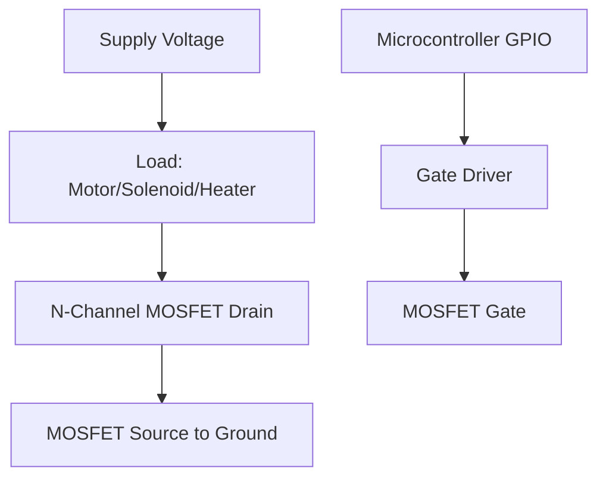
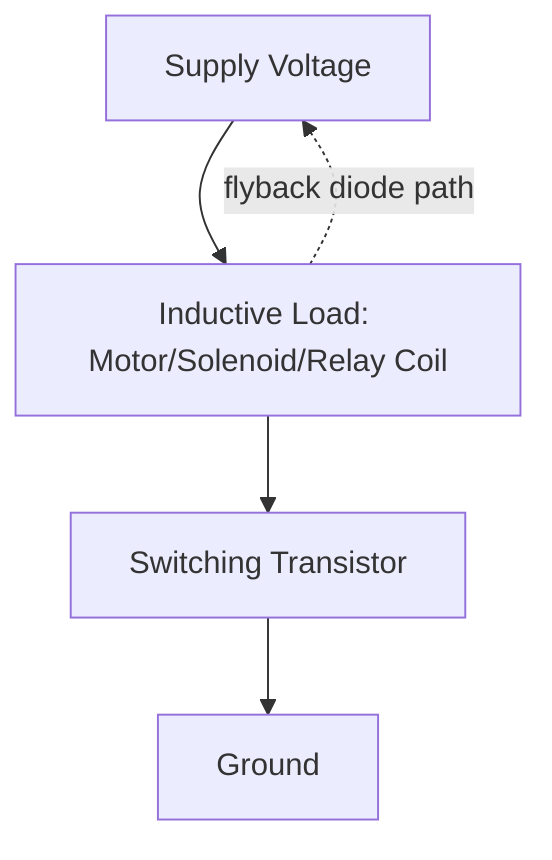
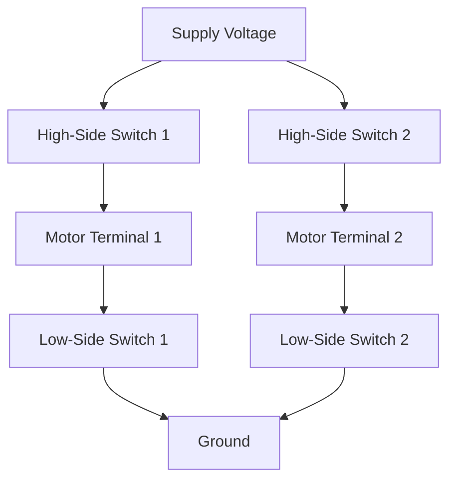
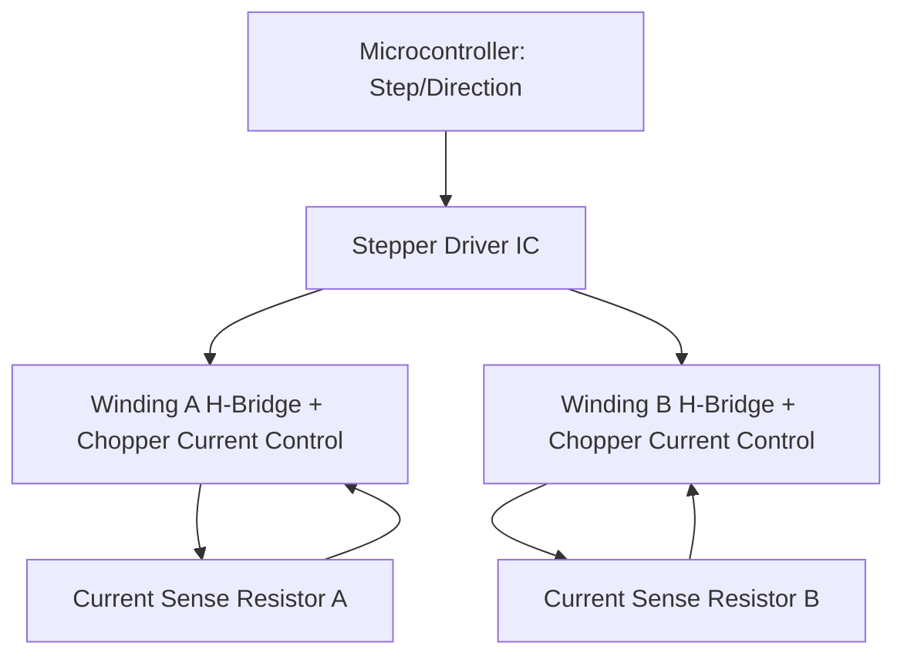
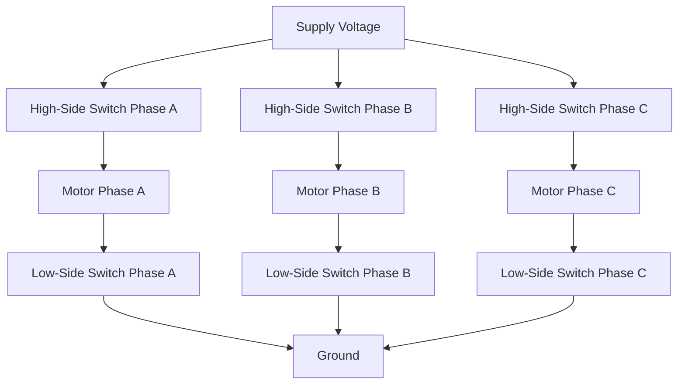

## Actuator Driver Circuits

### Overview

Actuator driver circuits are the interface electronics that translate low-power microcontroller control signals into the higher-power drive signals needed to operate motors, solenoids, valves, and other actuators. While the previous topics on motors and relays covered actuator types and high-level switching concepts, this topic focuses specifically on the driver circuit topologies and ICs that implement the actual power-stage interface between a microcontroller and an actuator's electrical requirements.

---

### Why Dedicated Driver Circuits Are Needed

A microcontroller GPIO pin typically sources/sinks a few tens of milliamps at logic-level voltage. Actuators generally require far more current, sometimes at higher voltage, than a GPIO pin can safely provide directly. Driver circuits perform current/voltage amplification, and in many cases add protection features (overcurrent, overtemperature, flyback suppression) that a bare transistor stage would not include.

---

### Single-Direction Switching Drivers

For loads that only need to be turned on/off in one current direction (e.g., unidirectional DC motor spin, solenoid actuation, resistive heating elements), a single low-side or high-side switch is sufficient.

#### Low-Side Switching

The switching element (typically an N-channel MOSFET) is placed between the load's return path and ground, with the load's positive side connected directly to supply voltage.

- N-channel MOSFETs are generally preferred for low-side switching because N-channel devices typically offer lower on-resistance ($R_{DS(on)}$) for a given die size/cost compared to equivalent P-channel devices, and gate drive is straightforward since the source is referenced to ground
- Simple to drive directly from a GPIO for lower-current loads, but a dedicated gate driver IC is used for higher-current or higher-speed switching to rapidly charge/discharge the MOSFET's gate capacitance

#### High-Side Switching

The switching element is placed between supply voltage and the load, with the load's other side connected to ground.

- High-side switching is often preferred when the load's return path must remain at ground potential for safety or other circuit design reasons (e.g., chassis-grounded loads, or when a fault must not leave the load unintentionally energized if the low-side connection fails)
- Driving a high-side N-channel MOSFET requires the gate voltage to exceed the supply rail (since the source follows the load's voltage as it switches), typically requiring a charge pump or bootstrap gate driver circuit; P-channel MOSFETs avoid this requirement but generally have higher on-resistance for comparable cost/size
- Dedicated high-side driver ICs handle the bootstrap/charge-pump requirements internally, simplifying design

---

### Flyback Protection for Inductive Loads

Motors, solenoids, and relay coils are inductive loads. When current through an inductor is abruptly interrupted (switch opens), the inductor's stored energy generates a large voltage spike attempting to maintain current flow, which can exceed the driving transistor's breakdown voltage and destroy it if unprotected.

$$V_{spike} = -L\frac{di}{dt}$$

A **flyback diode** (also called a freewheeling diode) placed in parallel with the inductive load, oriented to block current during normal operation but conduct during the voltage spike, provides a safe current path for the inductor's stored energy to dissipate.

For circuits requiring faster flyback energy dissipation than a simple diode provides (relevant in some high-speed switching or motor-driver contexts), a **snubber circuit** (typically a series resistor-capacitor network) can be used instead of or alongside a flyback diode to shape and dampen the voltage transient.

---

### H-Bridge Driver Circuits

For bidirectional DC motor control (forward/reverse rotation), an H-bridge circuit uses four switching elements arranged so that current can flow through the motor in either direction under microcontroller control.

**Operation modes:**
- **Forward**: High-side switch 1 + low-side switch 2 closed (current flows terminal 1 → motor → terminal 2)
- **Reverse**: High-side switch 2 + low-side switch 1 closed (current flows terminal 2 → motor → terminal 1)
- **Brake (short)**: Both low-side switches closed simultaneously, shorting the motor terminals together, using the motor's back-EMF to generate a braking current
- **Coast (high-Z)**: All switches open, motor terminals floating, allowing the motor to spin down freely under its own inertia and friction

A critical design/firmware concern is **shoot-through** — simultaneously closing both the high-side and low-side switch on the same leg of the bridge, creating a direct short from supply to ground. Dedicated H-bridge driver ICs typically include interlock/dead-time logic to prevent this; discrete implementations must implement equivalent protection in firmware and/or hardware timing.

**Common integrated H-bridge driver ICs** combine the four switching elements, gate drivers, and protection features (overcurrent, overtemperature, undervoltage lockout) into a single package, simplifying design compared to discrete MOSFET H-bridge implementations. [Unverified] Specific part selection depends on current/voltage requirements and should be verified against current datasheets, since part availability and specifications change over time.

---

### PWM Speed Control Integration

Driver circuits for DC motors typically combine H-bridge (or single-switch) direction control with PWM-based speed control, either by:
- PWM-modulating the high-side switch(es) while the low-side switch(es) remain steady (or vice versa) — reduces switching losses concentrated in one set of switches
- PWM-modulating both switches synchronously — can provide smoother current ripple and regenerative braking behavior during the PWM off-time, at the cost of more complex switching behavior

$$V_{avg} = D \cdot V_{supply}$$

Where $D$ is duty cycle, giving the effective average voltage (and thus approximate speed) applied to the motor.

---

### Stepper Motor Driver Circuits

Stepper drivers extend the H-bridge concept to two independent H-bridges (one per winding for a bipolar stepper), combined with current regulation circuitry to control winding current precisely — necessary because stepper motor windings are typically driven at a voltage higher than their rated current would allow under simple resistive limiting, using chopper-style current control instead.

- **Chopper drive**: The driver rapidly switches winding current on/off (well above audible frequency) to regulate average current to a target level, sensed via a current-sense resistor, allowing higher supply voltage for faster current rise time (and thus higher achievable step rate) while still respecting the winding's rated current
- **Microstepping current control**: As covered in stepper motor fundamentals, the chopper circuit modulates target current sinusoidally between the two windings to achieve intermediate rotor positions

---

### BLDC Driver Circuits (Three-Phase Bridge)

Brushless DC motor drivers extend the H-bridge concept to three phases, using six switching elements (a "three-phase bridge" or "six-pack") to independently drive current into each of the motor's three windings according to the commutation algorithm (trapezoidal six-step or FOC/SVPWM, as covered in motor control algorithms).

Dedicated three-phase gate driver ICs handle the bootstrap/charge-pump requirements for the three high-side switches and typically include shoot-through protection and current-sense amplification, working alongside a microcontroller (often one with hardware PWM peripherals specifically designed for motor control, providing complementary PWM outputs with built-in dead-time insertion) that implements the actual commutation/FOC algorithm.

---

### Driving Solenoids and Linear Actuators

Solenoids (used for locks, valves, linear push/pull actuation) are typically driven as simple inductive loads via a single low-side or high-side switch with flyback protection, similar to a unidirectional DC motor.

- **Continuous-duty vs. intermittent-duty solenoids**: Some solenoids are only rated for brief energization (a duty-cycle limit) due to heat buildup in the coil; driver firmware/circuitry may need to enforce a maximum on-time or reduced holding current after initial actuation (a "pull-in/hold-in" driving scheme, where full current is applied briefly to overcome initial mechanical resistance, then reduced to a lower holding current via PWM to reduce heat dissipation while still maintaining the actuated position)
- **Linear actuators** (motor + leadscrew mechanisms) are typically driven with standard DC motor H-bridge circuitry, sometimes combined with limit switches or current-sensing to detect end-of-travel (since mechanical end-stops cause current draw to rise sharply as the motor stalls against the stop)

---

### Protection Features Common in Integrated Driver ICs

- **Overcurrent protection**: Monitors output current and disables the driver (or limits current) if a threshold is exceeded, protecting against shorted loads or stalled motors
- **Overtemperature protection (thermal shutdown)**: Disables the driver if die temperature exceeds a safe threshold, re-enabling after cooling
- **Undervoltage lockout (UVLO)**: Prevents operation below a minimum supply voltage where switching behavior might otherwise be unreliable or gate drive insufficient
- **Cross-conduction (shoot-through) protection**: Built-in dead-time/interlock logic preventing simultaneous high-side/low-side conduction on the same bridge leg
- **Fault reporting**: Many driver ICs provide a fault status output pin, allowing the microcontroller to detect and respond to fault conditions in firmware rather than relying solely on the driver's internal protection

---

### Selecting a Driver Circuit Approach

| Actuator Need | Typical Driver Approach |
|---|---|
| Unidirectional DC load (solenoid, single-direction motor, heater) | Single low-side or high-side MOSFET switch with flyback protection |
| Bidirectional DC motor | H-bridge (discrete or integrated IC) |
| Stepper motor | Dual H-bridge with chopper current control (dedicated stepper driver IC) |
| BLDC motor | Three-phase bridge with dedicated gate driver IC + commutation algorithm |
| High-voltage/high-isolation switching | Relay or SSR (see relays and solid-state switching) rather than direct semiconductor drive |
| High duty-cycle solenoid (heat-sensitive) | PWM-based pull-in/hold-in driving scheme |

---

### Illustration: H-Bridge Current Paths

<svg xmlns="http://www.w3.org/2000/svg" viewBox="0 0 640 340">
  <title>H-Bridge Forward and Reverse Current Paths (svg_diagram)</title>
  <rect x="0" y="0" width="640" height="340" fill="#ffffff" />
  <text x="20" y="28" font-size="16" font-weight="bold" fill="#222">H-Bridge Current Paths (svg_diagram)</text>

  
  <text x="40" y="60" font-size="13" font-weight="bold" fill="#333">Forward Rotation</text>
  <rect x="40" y="80" width="220" height="160" fill="none" stroke="#888" stroke-width="1" />
  <rect x="60" y="90" width="50" height="20" fill="#7ac36a" />
  <text x="65" y="104" font-size="9" fill="#fff">HS1 ON</text>
  <rect x="180" y="90" width="50" height="20" fill="#ccc" />
  <text x="188" y="104" font-size="9" fill="#555">HS2 off</text>
  <rect x="110" y="140" width="60" height="30" fill="#4a90d9" />
  <text x="120" y="160" font-size="10" fill="#fff">Motor</text>
  <line x1="110" y1="100" x2="110" y2="140" stroke="#e0a800" stroke-width="2" />
  <line x1="170" y1="155" x2="230" y2="155" stroke="#e0a800" stroke-width="2" />
  <line x1="230" y1="155" x2="230" y2="200" stroke="#e0a800" stroke-width="2" />
  <rect x="60" y="200" width="50" height="20" fill="#ccc" />
  <text x="65" y="214" font-size="9" fill="#555">LS1 off</text>
  <rect x="180" y="200" width="50" height="20" fill="#7ac36a" />
  <text x="188" y="214" font-size="9" fill="#fff">LS2 ON</text>
  <text x="60" y="255" font-size="10" fill="#555">Current: HS1 → Motor → LS2</text>

  
  <text x="360" y="60" font-size="13" font-weight="bold" fill="#333">Reverse Rotation</text>
  <rect x="360" y="80" width="220" height="160" fill="none" stroke="#888" stroke-width="1" />
  <rect x="380" y="90" width="50" height="20" fill="#ccc" />
  <text x="388" y="104" font-size="9" fill="#555">HS1 off</text>
  <rect x="500" y="90" width="50" height="20" fill="#7ac36a" />
  <text x="508" y="104" font-size="9" fill="#fff">HS2 ON</text>
  <rect x="430" y="140" width="60" height="30" fill="#4a90d9" />
  <text x="440" y="160" font-size="10" fill="#fff">Motor</text>
  <line x1="525" y1="100" x2="525" y2="140" stroke="#e0a800" stroke-width="2" />
  <line x1="430" y1="155" x2="405" y2="155" stroke="#e0a800" stroke-width="2" />
  <line x1="405" y1="155" x2="405" y2="200" stroke="#e0a800" stroke-width="2" />
  <rect x="380" y="200" width="50" height="20" fill="#7ac36a" />
  <text x="388" y="214" font-size="9" fill="#fff">LS1 ON</text>
  <rect x="500" y="200" width="50" height="20" fill="#ccc" />
  <text x="508" y="214" font-size="9" fill="#555">LS2 off</text>
  <text x="380" y="255" font-size="10" fill="#555">Current: HS2 → Motor → LS1</text>
</svg>

---

### Key Points

- Driver circuits translate low-power microcontroller signals into actuator-appropriate current/voltage, and typically add protection features not present in a bare transistor stage.
- Flyback diodes (or snubber circuits) are essential across any inductive load (motor, solenoid, relay coil) to prevent voltage spikes from destroying the driving transistor.
- H-bridges enable bidirectional DC motor control via four switching elements, with shoot-through prevention (dead-time/interlock) as a critical design concern.
- Stepper drivers use dual H-bridges with chopper-style current regulation to precisely control winding current independent of supply voltage.
- BLDC/FOC drivers use a three-phase bridge (six switches) with dedicated gate driver ICs handling bootstrap requirements for high-side switching.
- Integrated driver ICs commonly bundle overcurrent, overtemperature, undervoltage lockout, and shoot-through protection, simplifying design relative to fully discrete implementations.

---

### Related Topics

- Gate driver IC selection and bootstrap/charge-pump circuit design
- MOSFET selection criteria: RDS(on), gate charge, voltage/current ratings
- PWM dead-time insertion and hardware motor-control timer peripherals
- Current sensing techniques (shunt resistor, Hall-effect) for driver feedback
- Thermal design and heatsinking for power switching stages
- EMI/EMC considerations in switching driver circuit layout
- Regenerative braking and four-quadrant H-bridge operation
- Solenoid pull-in/hold-in PWM driving schemes for thermal management