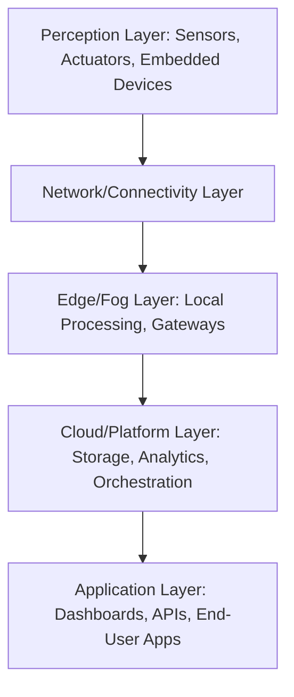
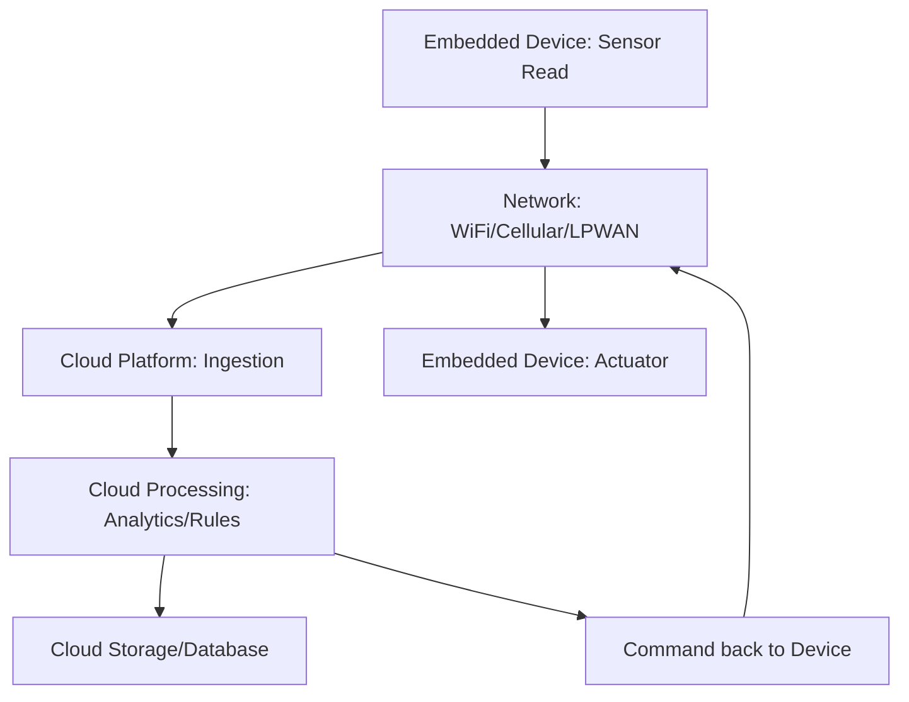
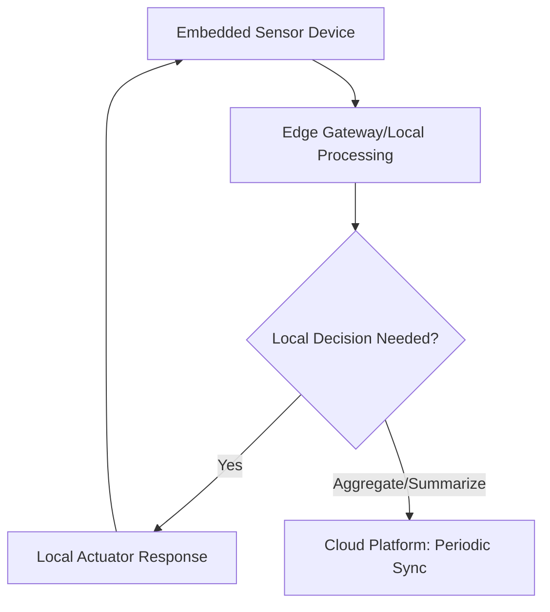
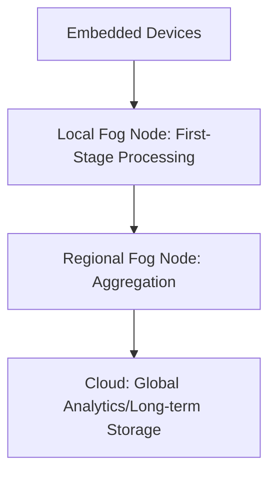
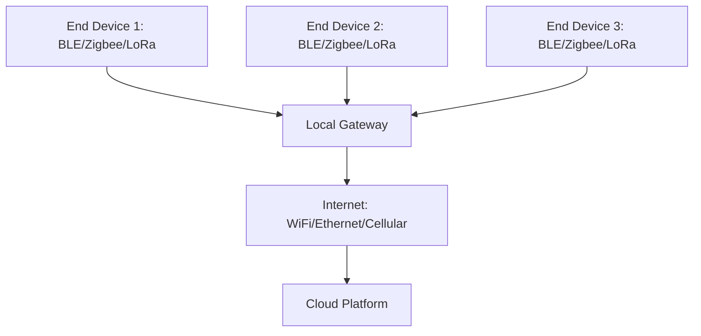
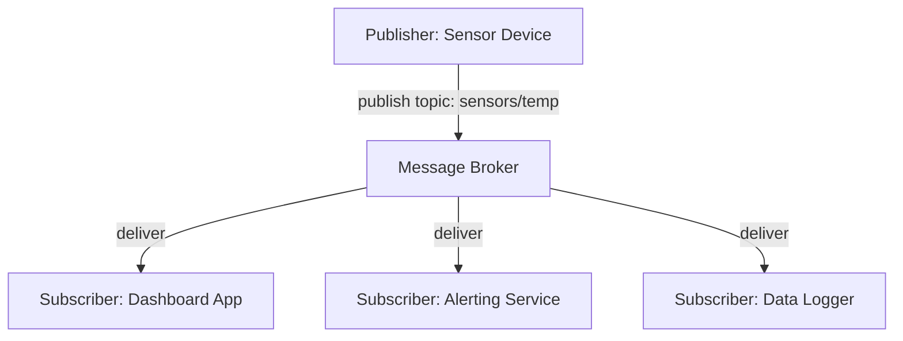
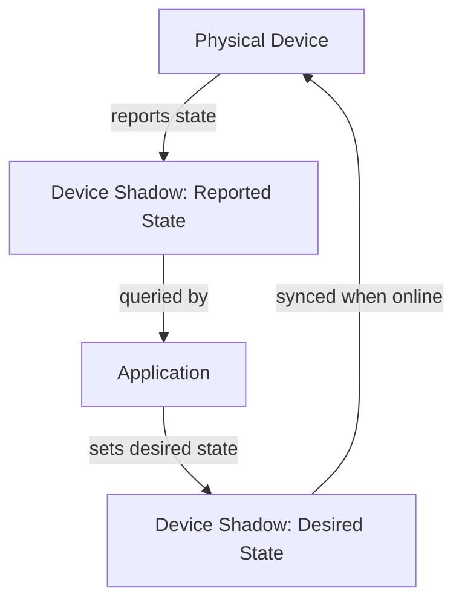
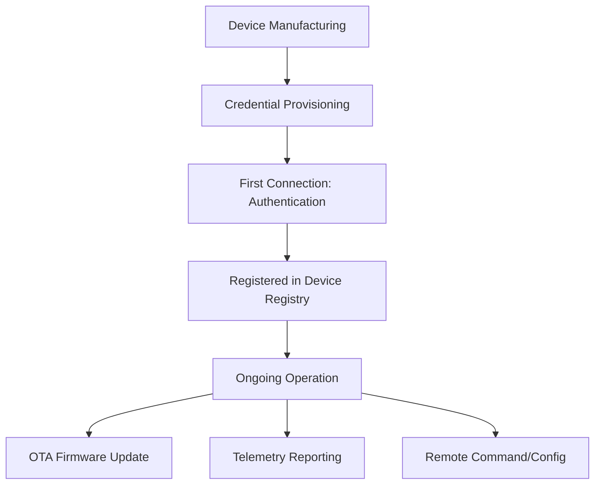

## IoT Architecture Patterns

### Overview

IoT architecture patterns are the structural approaches used to organize how embedded devices, connectivity, data processing, and applications interact across an Internet of Things system. These patterns address recurring design concerns: where computation happens (device, edge, or cloud), how devices communicate, how data flows and is aggregated, and how the system scales, remains reliable, and stays secure. Selecting an appropriate architecture pattern significantly affects an embedded system's power consumption, latency, bandwidth usage, and operational complexity.

---

### Layered IoT Reference Architecture

Most IoT architectures are described using a layered model, even though real deployments often blur boundaries between layers.

- **Perception layer**: The physical sensors, actuators, and embedded microcontrollers/microprocessors that interact directly with the physical world
- **Network/connectivity layer**: The communication protocols and infrastructure moving data between devices and higher layers (covered in depth under networking-specific topics)
- **Edge/fog layer**: Local computation performed near the data source, before data reaches centralized cloud infrastructure
- **Cloud/platform layer**: Centralized storage, processing, device management, and analytics
- **Application layer**: User-facing dashboards, mobile apps, APIs, and business logic consuming processed IoT data

---

### Cloud-Centric Architecture

In a cloud-centric pattern, embedded devices act primarily as data collectors and actuator interfaces, sending raw or lightly processed data to the cloud for storage, processing, and decision-making, then receiving commands back.

**Strengths**: Centralizes complex processing and storage where compute resources are effectively unconstrained; simplifies device firmware since minimal local logic is required; easier to update analytics/business logic without reflashing devices, since logic lives in the cloud rather than on the embedded device itself.

**Limitations**: Every decision requires round-trip network communication, introducing latency unsuitable for time-critical control loops; continuous connectivity dependency means the device may be non-functional (or degraded) during network outages; bandwidth costs and power consumption scale with data volume sent, which matters significantly for battery-powered or cellular/LPWAN-connected devices.

**Well suited to**: Applications where latency tolerance is moderate-to-high, connectivity is generally reliable, and centralized analytics/fleet-wide insight is a primary goal (e.g., environmental monitoring dashboards, non-time-critical asset tracking).

---

### Edge Computing Architecture

In an edge computing pattern, significant processing occurs locally — either on the embedded device itself or on a nearby edge gateway — before data is sent onward (if at all), reducing dependency on constant cloud connectivity.

**Strengths**: Low-latency local response (critical for control loops, safety systems, or any application where round-trip cloud latency is unacceptable); reduced bandwidth usage, since only summarized/aggregated/exception data needs to reach the cloud rather than continuous raw streams; continued local operation during network outages, since core decision logic does not depend on cloud availability.

**Limitations**: Increases embedded/edge device complexity and cost (more compute, memory, and often storage required locally); firmware/logic updates across a distributed fleet of edge devices are more operationally complex than updating centralized cloud logic; local processing still requires careful power budgeting on battery-powered devices, since local compute itself consumes energy.

**Well suited to**: Industrial control, safety-critical systems, robotics, applications with intermittent or unreliable connectivity, and bandwidth-constrained deployments (e.g., cellular/satellite-connected remote sensors).

---

### Fog Computing

An intermediate pattern between pure edge and pure cloud: processing is distributed across a hierarchy of nodes — end devices, local gateways, regional aggregation points — rather than concentrated entirely at either the device or the cloud.

Fog computing is often distinguished from simple edge computing by its explicit multi-tier structure, spreading computational load across several intermediate layers rather than a single edge gateway tier, which can help balance latency, bandwidth, and centralized-analytics benefits across a large, geographically distributed deployment. [Inference] The specific boundary between "edge" and "fog" terminology is used inconsistently across the industry, with some sources treating them as largely synonymous and others drawing a more explicit multi-tier distinction as described here.

---

### Gateway-Mediated Architecture

Many embedded IoT deployments use resource-constrained end devices (e.g., battery-powered sensors using BLE or Zigbee) that cannot directly connect to the internet, relying instead on a local gateway device to bridge between a low-power local network and internet/cloud connectivity.

- The gateway performs protocol translation (e.g., BLE/Zigbee to IP/MQTT), often some local aggregation or filtering, and manages the internet-facing connection so individual end devices don't each need their own internet-capable radio and associated power/cost overhead
- This pattern is standard for battery-powered sensor networks where directly equipping every end node with WiFi or cellular connectivity would be prohibitively power-hungry and costly compared to a short-range, low-power radio paired with a single shared gateway

---

### Publish-Subscribe (Pub/Sub) Messaging Pattern

A common communication architecture pattern within IoT systems (often layered on top of the physical/network architecture patterns above), where devices publish data to named topics/channels without needing to know which specific subscribers will consume it, and consumers subscribe to topics of interest.

- **Decoupling**: Publishers and subscribers don't need direct knowledge of each other, simplifying adding new consumers without modifying device firmware
- **MQTT** is the most widely used pub/sub protocol in embedded IoT contexts specifically, due to its lightweight message overhead and design suitability for constrained devices and unreliable networks (covered in more depth under IoT communication protocols)
- **Quality of Service (QoS) levels** in protocols like MQTT allow tuning delivery guarantees (at-most-once, at-least-once, exactly-once) against bandwidth/reliability trade-offs relevant to constrained embedded links

---

### Request-Response vs. Event-Driven Patterns

- **Request-response (e.g., HTTP/REST-based device APIs)**: A client explicitly requests data or issues a command, and the device/server responds; simple and familiar, but less efficient for devices that need to report state changes proactively (client would need to poll repeatedly)
- **Event-driven (e.g., pub/sub, webhooks)**: Devices push data/events as they occur rather than waiting to be polled, reducing unnecessary network traffic and latency for state-change-driven applications — generally preferred for embedded/IoT contexts where power and bandwidth efficiency matter, since polling wastes both on a device with no new data to report

---

### Device Shadow / Digital Twin Pattern

Many cloud IoT platforms implement a "device shadow" or "digital twin" pattern: a cloud-side representation of a device's last-known state, allowing applications to query or command a device's expected state even when the physical device is temporarily offline.

- Applications can set a "desired state" for a device even while offline; the device applies the change and reports back once connectivity is restored
- This pattern decouples application logic from real-time device availability, which is particularly relevant for embedded devices with intermittent connectivity (e.g., battery-powered devices that sleep for extended periods to conserve power)

---

### Device Provisioning and Lifecycle Management Pattern

A recurring architectural concern across most IoT deployments: how devices are securely onboarded, authenticated, and managed throughout their operational lifetime.

- **Provisioning**: Assigning a device unique identity/credentials, often during manufacturing or first power-on, to enable secure communication with the platform
- **Fleet management**: Centralized visibility and control over large numbers of deployed devices — firmware version tracking, health monitoring, remote configuration
- **Over-the-air (OTA) updates**: A common architectural requirement allowing firmware updates to be pushed to deployed embedded devices remotely, critical for field-deployed devices where physical access for updates is impractical

---

### Hierarchical/Hub-and-Spoke vs. Mesh Network Architecture

- **Hub-and-spoke**: All devices communicate through a central hub/gateway; simpler to reason about and manage, but the hub represents a single point of failure and potential bandwidth bottleneck
- **Mesh network**: Devices can relay messages through each other (e.g., Zigbee, Thread, some mesh-capable BLE configurations), extending range and improving resilience to individual node failure, at the cost of increased protocol complexity and per-device overhead for routing/relay logic

[Inference] The choice between hub-and-spoke and mesh topology in a given deployment generally depends on the physical layout and scale of the device network — mesh topologies tend to offer more benefit as coverage area and node count grow, since a single-hub architecture's range and capacity limitations become more constraining at larger scale, though this is a general tendency rather than a fixed rule applicable to every deployment.

---

### Comparing Major Architecture Patterns

| Pattern | Primary Benefit | Primary Trade-off | Typical Use Case |
|---|---|---|---|
| Cloud-centric | Centralized analytics, simple device logic | Latency, connectivity dependency | Dashboards, non-time-critical monitoring |
| Edge computing | Low latency, reduced bandwidth, offline resilience | Higher device cost/complexity | Industrial control, safety systems |
| Fog computing | Distributed load balancing across tiers | Increased architectural complexity | Large-scale distributed deployments |
| Gateway-mediated | Enables low-power end devices | Gateway as dependency/bottleneck point | Battery-powered sensor networks |
| Pub/sub messaging | Decoupled, scalable communication | Requires broker infrastructure | Multi-consumer telemetry systems |
| Device shadow/digital twin | Offline-tolerant command/state management | Added platform complexity | Intermittently-connected battery devices |

---

### Selecting an Architecture Pattern

- **Prioritize edge/local processing** when latency, offline resilience, or bandwidth cost are primary constraints
- **Prioritize cloud-centric processing** when centralized cross-device analytics and simplicity of device firmware are primary goals, and network conditions are generally reliable
- **Use gateway-mediated architecture** whenever end devices use short-range, low-power radios (BLE, Zigbee, Thread) that cannot directly reach the internet
- **Use pub/sub messaging** as the default communication pattern for most multi-consumer IoT telemetry scenarios, given its decoupling and bandwidth efficiency advantages over polling-based request-response
- **Incorporate device shadow/digital twin patterns** whenever devices have intermittent connectivity but applications need to interact with a consistent view of device state regardless of the device's current online/offline status

---

### Key Points

- IoT architectures are typically described as layered systems: perception, network, edge/fog, cloud, and application layers, though real systems often blend these boundaries.
- Cloud-centric architectures centralize processing but introduce latency and connectivity dependency; edge computing reduces both at the cost of increased device complexity.
- Gateway-mediated architectures are standard wherever low-power, short-range end devices cannot directly reach the internet.
- Pub/sub messaging (commonly via MQTT) is the dominant communication pattern in embedded IoT due to its decoupling and bandwidth efficiency.
- Device shadow/digital twin patterns let applications interact with a consistent device state representation despite intermittent device connectivity, common in battery-powered deployments.
- Device provisioning, fleet management, and OTA update capability are cross-cutting architectural concerns relevant to nearly all production IoT deployments, regardless of which processing-location pattern is chosen.

---

### Related Topics

- MQTT, CoAP, and other IoT communication protocols
- LPWAN technologies (LoRaWAN, NB-IoT, Sigfox) for long-range low-power connectivity
- Over-the-air (OTA) firmware update mechanisms and rollback safety
- Edge AI and on-device machine learning inference
- IoT security architecture: device identity, TLS/DTLS, secure boot
- Time-series database design for IoT telemetry storage
- Zigbee, Thread, and mesh networking protocol fundamentals
- Device provisioning standards and secure credential injection during manufacturing