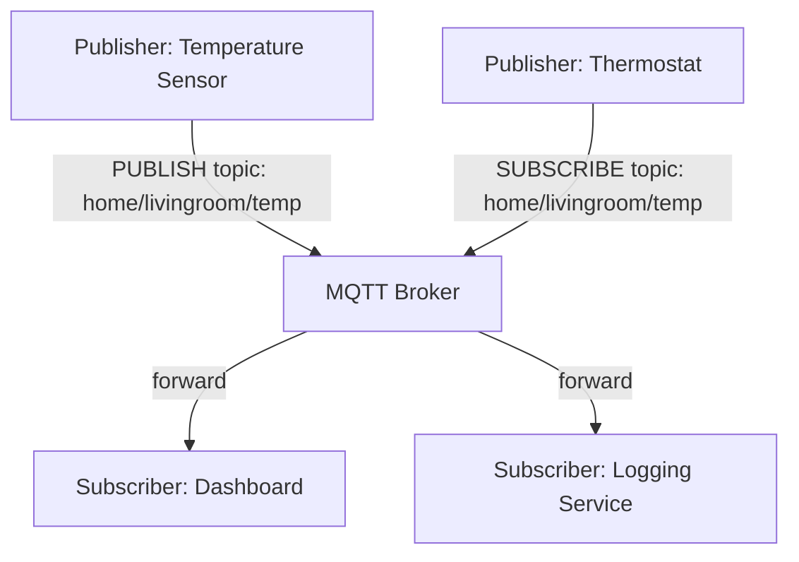
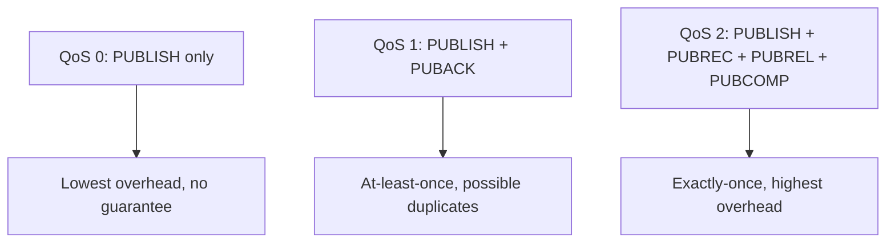
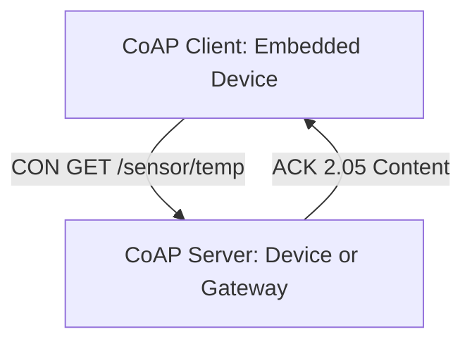

## MQTT and Lightweight Messaging Protocols

### Overview

Lightweight messaging protocols are communication protocols specifically designed for resource-constrained embedded devices and unreliable or bandwidth-limited networks, prioritizing small message overhead, low power consumption, and resilience over the richer feature sets of general-purpose web protocols like HTTP. MQTT is the most widely adopted protocol in this category for embedded IoT applications, though several alternatives address specific niches within the same broad design space.

---

### Why Lightweight Protocols Matter for Embedded Devices

Standard web protocols like HTTP carry significant per-message overhead (headers, connection setup, verbose text-based framing) that is often acceptable for general web traffic but poorly suited to embedded devices with constraints including:

- Limited RAM/flash for protocol stack implementation
- Battery power budgets where radio transmission time directly consumes energy
- Low-bandwidth or high-latency links (cellular, LPWAN, satellite)
- Unreliable connectivity requiring resilient reconnection and message delivery guarantees

Lightweight messaging protocols address these constraints through compact binary framing, minimal connection overhead, and built-in support for intermittent connectivity patterns.

---

### MQTT (Message Queuing Telemetry Transport)

#### Core Architecture

MQTT is a publish-subscribe messaging protocol built on top of TCP/IP, using a central **broker** to route messages between **publishers** (devices sending data) and **subscribers** (applications or devices consuming data), without publishers and subscribers needing direct knowledge of each other.



#### Topics

MQTT uses a hierarchical, slash-delimited topic naming scheme (e.g., `home/livingroom/temperature`) rather than fixed message types. Subscribers can use wildcards to subscribe to multiple related topics:

- **`+` (single-level wildcard)**: Matches exactly one topic level, e.g., `home/+/temperature` matches `home/livingroom/temperature` and `home/kitchen/temperature` but not `home/livingroom/sensor1/temperature`
- **`#` (multi-level wildcard)**: Matches any number of remaining levels, e.g., `home/#` matches all topics under `home/`

#### Quality of Service (QoS) Levels

MQTT defines three QoS levels that trade off delivery guarantee strength against message overhead and complexity:

- **QoS 0 (At most once)**: Message sent without acknowledgment; may be lost if the connection drops during transmission — lowest overhead, "fire and forget"
- **QoS 1 (At least once)**: Message is acknowledged by the receiver (PUBACK); sender retransmits if no acknowledgment is received, but this can result in duplicate delivery if the acknowledgment itself is lost
- **QoS 2 (Exactly once)**: Uses a four-step handshake (PUBREC, PUBREL, PUBCOMP in addition to the initial PUBLISH) to guarantee exactly-once delivery — highest overhead and latency, reserved for messages where duplicates or loss are both unacceptable



[Inference] The appropriate QoS level for a given embedded application generally depends on how costly duplicate or lost messages are relative to the additional bandwidth/latency cost of higher QoS handshaking — sensor telemetry where occasional loss is tolerable often uses QoS 0 or 1, while critical commands more often warrant QoS 1 or 2, though the specific choice depends on the application's tolerance for each failure mode.

#### Retained Messages and Last Will and Testament (LWT)

- **Retained messages**: The broker stores the last message published to a topic (with the retain flag set) and immediately delivers it to any new subscriber, ensuring new subscribers immediately receive the current state rather than waiting for the next update
- **Last Will and Testament (LWT)**: A client specifies a message to be published by the broker on its behalf if the client disconnects unexpectedly (i.e., without a clean disconnect), commonly used to signal device offline status to other subscribers — a particularly relevant feature for embedded devices on unreliable connections, where ungraceful disconnects are common

#### Persistent Sessions

MQTT supports persistent sessions, where the broker retains subscription state and queued QoS 1/2 messages for a disconnected client, delivering them once the client reconnects — relevant for battery-powered embedded devices that intentionally disconnect during sleep periods to conserve power, without losing messages published while offline.

#### Connection Overhead

MQTT uses a compact binary header (as small as 2 bytes for some message types) compared to HTTP's verbose text-based headers, and maintains a persistent TCP connection with periodic lightweight keepalive pings (PINGREQ/PINGRESP) rather than establishing a new connection per message — significantly reducing both bandwidth and the energy cost of repeated connection setup for embedded devices sending frequent small messages.

#### Security

Standard MQTT does not include encryption by default; **MQTT over TLS (sometimes called MQTTS)** on port 8883 is the standard approach for securing MQTT traffic, alongside username/password or certificate-based client authentication supported at the protocol level.

---

### MQTT-SN (MQTT for Sensor Networks)

A variant of MQTT designed for extremely constrained devices and non-TCP/IP networks (e.g., Zigbee, other low-power wireless mesh networks) where the overhead of maintaining a full TCP connection is itself prohibitive.

- Uses UDP or other connectionless transport instead of TCP
- Replaces long text-based topic names with short numeric topic IDs after an initial registration step, reducing per-message overhead further than standard MQTT
- Typically requires a gateway to bridge MQTT-SN traffic to a standard MQTT broker for integration with conventional MQTT infrastructure

---

### CoAP (Constrained Application Protocol)

CoAP is a lightweight protocol modeled conceptually after REST/HTTP semantics (GET, POST, PUT, DELETE) but redesigned for constrained devices and networks, running over UDP rather than TCP.



- **UDP-based**: Avoids TCP's connection establishment and state-maintenance overhead, at the cost of needing to implement reliability (when needed) at the application layer instead
- **Confirmable (CON) and Non-confirmable (NON) messages**: CoAP provides its own lightweight acknowledgment mechanism for reliability when needed, while allowing non-confirmable "fire and forget" messages when reliability is not required — a similar underlying concept to MQTT's QoS levels, but achieved through a different mechanism appropriate to UDP transport
- **Observe option**: Extends CoAP's request-response model to support a pub/sub-like pattern, where a client can "observe" a resource and receive updates as it changes, without needing a separate broker infrastructure the way MQTT requires
- **Compact binary header**: Similarly minimal to MQTT's framing, designed for the same class of bandwidth/power-constrained devices

**Comparison to MQTT**: CoAP's REST-like request-response model integrates more naturally with existing HTTP-based web infrastructure (CoAP-to-HTTP proxying is a common pattern) and avoids the need for a centralized broker, while MQTT's broker-mediated pub/sub model is often considered more naturally suited to many-to-many telemetry distribution scenarios and offers a richer feature set (QoS, retained messages, LWT, persistent sessions) purpose-built for that pattern.

---

### AMQP (Advanced Message Queuing Protocol)

A more feature-rich messaging protocol supporting complex routing, transactions, and guaranteed delivery, originally designed for enterprise messaging rather than constrained embedded devices specifically.

- Generally heavier-weight than MQTT or CoAP in terms of protocol complexity and resource requirements
- More commonly used at the edge/cloud/enterprise integration layer of an IoT system (e.g., between gateways and backend infrastructure) rather than directly on the most resource-constrained end devices, where MQTT or CoAP are more typical choices

---

### DDS (Data Distribution Service)

A pub/sub middleware standard, distinct from MQTT/CoAP in that it typically operates in a **brokerless, peer-to-peer** fashion rather than routing all messages through a central broker.

- Devices discover each other directly and exchange data peer-to-peer, avoiding the broker as both a single point of failure and a potential bandwidth bottleneck
- Offers fine-grained configurable Quality of Service policies (reliability, durability, deadline, liveliness) beyond MQTT's simpler three-level QoS model
- Commonly used in real-time, high-performance embedded contexts such as robotics (notably as the underlying communication middleware in ROS 2) and industrial/aerospace/defense systems, where the added configurability and brokerless architecture are valued despite generally higher implementation complexity than MQTT

---

### Protocol Comparison

| Protocol | Transport | Architecture | Overhead | Typical Use Case |
|---|---|---|---|---|
| MQTT | TCP | Broker-based pub/sub | Low | General IoT telemetry, many-to-many distribution |
| MQTT-SN | UDP/other | Broker-based pub/sub (via gateway) | Very low | Extremely constrained devices, non-IP networks |
| CoAP | UDP | REST-like request/response (+ Observe for pub/sub) | Low | Constrained devices needing HTTP-like semantics |
| AMQP | TCP | Broker-based, feature-rich routing | Moderate–high | Enterprise/backend integration, gateway-to-cloud |
| DDS | UDP (typ.) | Brokerless peer-to-peer pub/sub | Varies (configurable) | Real-time robotics, industrial/aerospace systems |
| HTTP/REST | TCP | Request/response | High | Non-constrained integrations, human-facing APIs |

---

### Practical Example: MQTT Publish from an Embedded Device

```c
// Simplified MQTT publish example (typical embedded MQTT client library pattern)
#include "mqtt_client.h"

void publish_temperature(mqtt_client_t *client, float temp_celsius) {
    char payload[16];
    snprintf(payload, sizeof(payload), "%.1f", temp_celsius);

    mqtt_publish(client,
                 "sensors/room1/temperature",  // topic
                 payload,                       // message payload
                 strlen(payload),
                 MQTT_QOS_1,                    // at-least-once delivery
                 false);                        // retain flag: false
}
```

**Output:** This publishes the current temperature reading (e.g., `"23.5"`) to the topic `sensors/room1/temperature` with QoS 1, meaning the broker acknowledges receipt and the client retransmits if no acknowledgment arrives, giving at-least-once delivery for a temperature reading where occasional duplicates are generally tolerable but silent message loss is not desired.

[Unverified] Exact API function signatures and available options vary by specific MQTT client library (e.g., paho-mqtt-embedded-c, esp-mqtt, various vendor SDKs), so implementation details should be confirmed against the specific library in use.

---

### Illustration: MQTT vs CoAP Architecture

<svg xmlns="http://www.w3.org/2000/svg" viewBox="0 0 680 320">
  <title>MQTT Broker Model vs CoAP Request-Response Model (svg_diagram)</title>
  <rect x="0" y="0" width="680" height="320" fill="#ffffff" />
  <text x="20" y="28" font-size="16" font-weight="bold" fill="#222">MQTT vs CoAP Architecture (svg_diagram)</text>

  
  <text x="30" y="60" font-size="13" font-weight="bold" fill="#333">MQTT: Broker-Mediated Pub/Sub</text>
  <rect x="150" y="90" width="80" height="40" fill="#e0a800" />
  <text x="160" y="115" font-size="11" fill="#fff">Broker</text>
  <rect x="30" y="150" width="70" height="30" fill="#4a90d9" />
  <text x="35" y="170" font-size="9" fill="#fff">Publisher A</text>
  <rect x="130" y="150" width="70" height="30" fill="#4a90d9" />
  <text x="135" y="170" font-size="9" fill="#fff">Publisher B</text>
  <line x1="65" y1="150" x2="180" y2="130" stroke="#555" stroke-width="1.5" />
  <line x1="165" y1="150" x2="190" y2="130" stroke="#555" stroke-width="1.5" />
  <rect x="230" y="150" width="70" height="30" fill="#7ac36a" />
  <text x="235" y="170" font-size="9" fill="#fff">Subscriber X</text>
  <line x1="220" y1="130" x2="265" y2="150" stroke="#555" stroke-width="1.5" />
  <text x="30" y="220" font-size="10" fill="#555">All traffic routed through central broker</text>

  
  <text x="400" y="60" font-size="13" font-weight="bold" fill="#333">CoAP: Direct Request/Response</text>
  <rect x="400" y="150" width="90" height="30" fill="#4a90d9" />
  <text x="405" y="170" font-size="9" fill="#fff">Client Device</text>
  <line x1="490" y1="160" x2="570" y2="160" stroke="#d94a4a" stroke-width="2" />
  <text x="495" y="150" font-size="9" fill="#a83232">GET / ACK</text>
  <rect x="570" y="150" width="90" height="30" fill="#7ac36a" />
  <text x="580" y="170" font-size="9" fill="#fff">Server Device</text>
  <text x="400" y="220" font-size="10" fill="#555">Direct peer communication, no broker</text>
</svg>

---

### Key Points

- Lightweight messaging protocols use compact binary framing and minimal connection overhead to suit resource-constrained embedded devices and unreliable/low-bandwidth networks.
- MQTT is the dominant broker-based pub/sub protocol for embedded IoT, offering configurable QoS levels, retained messages, Last Will and Testament, and persistent sessions purpose-built for intermittent connectivity.
- MQTT-SN extends similar concepts to non-TCP/IP and extremely constrained networks via UDP or other transports and numeric topic IDs.
- CoAP provides REST-like semantics over UDP with its own lightweight reliability mechanism and an Observe option for pub/sub-like behavior without requiring a broker.
- AMQP and DDS serve related but distinct niches — AMQP for feature-rich enterprise/backend messaging, DDS for brokerless, configurable real-time peer-to-peer communication in robotics and industrial contexts.
- Protocol choice depends on transport constraints (TCP vs UDP feasibility), whether broker infrastructure is desirable or must be avoided, and the specific delivery guarantee and latency requirements of the application.

---

### Related Topics

- MQTT broker selection and self-hosted vs. managed cloud MQTT services
- TLS/DTLS security for constrained device messaging protocols
- LPWAN protocols (LoRaWAN, NB-IoT) and their interaction with application-layer messaging
- ROS 2 and DDS middleware for robotics communication
- Embedded TCP/IP stack implementation considerations (lwIP and similar)
- Power consumption analysis of persistent vs. intermittent network connections
- Protocol translation and gateway design for mixed-protocol IoT deployments
- Message serialization formats (JSON, CBOR, Protocol Buffers) for constrained payloads