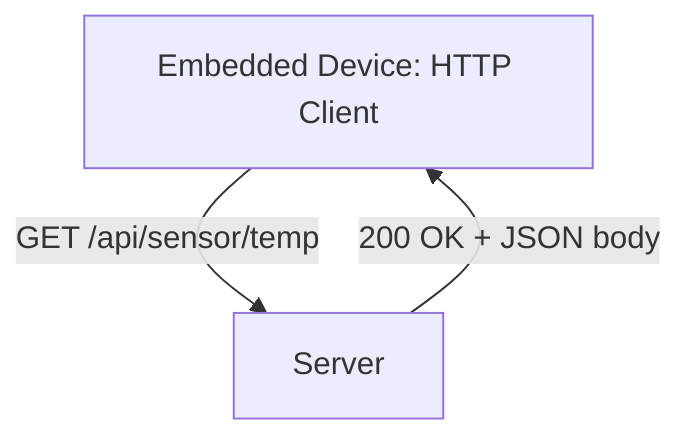
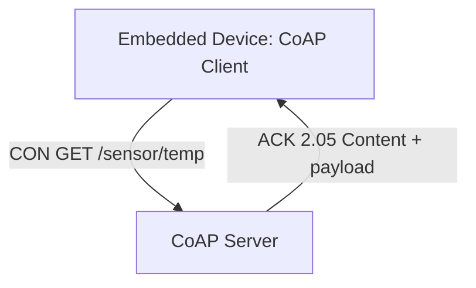
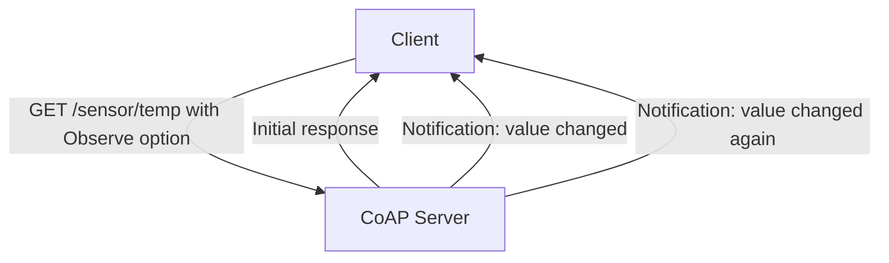
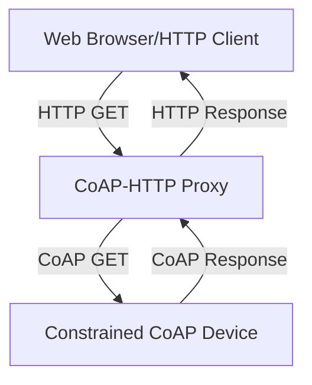

## CoAP and HTTP for Constrained Devices

### Overview

CoAP (Constrained Application Protocol) and HTTP represent two different approaches to REST-style request-response communication for embedded devices. HTTP is the ubiquitous protocol of the general web, offering broad compatibility and tooling support but carrying overhead poorly suited to the most constrained embedded devices. CoAP was purpose-designed to preserve HTTP's familiar REST semantics while drastically reducing overhead for constrained networks and devices. Understanding when each is appropriate — and how they interoperate — is a common architectural decision in embedded/IoT system design.

---

### HTTP in Embedded Contexts

#### Core Characteristics

HTTP is a text-based, request-response protocol running over TCP, using verbs (GET, POST, PUT, DELETE, PATCH) to operate on resources identified by URLs, with status codes indicating outcome.



#### Why HTTP Is Sometimes Impractical for Constrained Devices

- **Verbose text-based headers**: A typical HTTP request/response includes headers (Host, Content-Type, Content-Length, User-Agent, etc.) that add substantial byte overhead per message compared to the actual payload, particularly costly for small, frequent sensor readings
- **TCP connection overhead**: Each new HTTP/1.1 connection requires a TCP three-way handshake (and, if TLS is used, an additional handshake), consuming both time and energy — significant for devices that wake briefly, send data, then return to sleep to conserve battery
- **No native support for asynchronous push**: Standard HTTP is fundamentally a client-initiated request-response protocol; a device wanting to notify a server of new data must either wait to be polled or initiate its own outbound request, and receiving unsolicited server-initiated messages requires additional mechanisms (WebSockets, long-polling, Server-Sent Events) layered on top of standard HTTP
- **Memory footprint**: A full HTTP/1.1 client stack (particularly with TLS) requires more RAM/flash than many low-end microcontrollers provide, especially when robust parsing of arbitrary HTTP responses is required

#### When HTTP Remains a Reasonable Choice for Embedded Devices

- Devices with sufficient resources (typically 32-bit MCUs with adequate RAM/flash, or embedded Linux-class devices) where the overhead is not prohibitive
- Applications requiring easy integration with existing web infrastructure, browser-based dashboards, or third-party APIs that only support HTTP/REST
- Infrequent communication patterns where per-connection overhead is amortized over a longer period between messages
- Gateway devices that translate from a lightweight local protocol to HTTP for cloud/backend integration, rather than running HTTP on the most constrained end nodes themselves

#### HTTP/2 and Persistent Connections

HTTP/1.1 keep-alive and HTTP/2's multiplexed persistent connections reduce (though do not eliminate) the per-message connection overhead problem by reusing a single TCP connection across multiple requests, which is relevant when an embedded device makes several HTTP calls over a session rather than a single isolated request. [Inference] HTTP/2 support in embedded HTTP client libraries is less universal than HTTP/1.1 support, so availability should be checked against the specific embedded HTTP stack in use rather than assumed.

---

### CoAP: Purpose-Built for Constrained Devices

#### Core Design Goals

CoAP was designed by the IETF specifically to bring RESTful semantics to constrained-resource devices and constrained (lossy, low-bandwidth) networks, while remaining conceptually mappable to HTTP for easier integration with existing web infrastructure.



#### UDP-Based Transport

CoAP runs over UDP rather than TCP, avoiding TCP's connection establishment/teardown overhead and per-connection state maintenance. Since UDP itself provides no reliability guarantee, CoAP implements its own lightweight reliability mechanism at the application layer:

- **Confirmable (CON) messages**: Require an acknowledgment (ACK) from the receiver; the sender retransmits with exponential backoff if no ACK is received within a timeout
- **Non-confirmable (NON) messages**: Sent without expectation of acknowledgment — suitable for data where occasional loss is acceptable (e.g., frequent periodic sensor readings where a missed reading is not significant)
- **Reset (RST) messages**: Indicate the receiver could not process a message (e.g., unknown resource)

This gives applications explicit, message-by-message control over the reliability/overhead trade-off, conceptually similar to MQTT's QoS levels but implemented directly atop UDP rather than requiring a persistent TCP connection.

#### Compact Binary Header

CoAP uses a fixed 4-byte binary header (versus HTTP's variable-length text headers), with method/response codes encoded compactly and optional header fields represented as binary "options" rather than verbose text key-value pairs — substantially reducing per-message overhead relative to HTTP.

#### Methods and Response Codes

CoAP mirrors HTTP's method set (GET, POST, PUT, DELETE) and uses a response code scheme deliberately structured to parallel HTTP status codes (e.g., CoAP's 2.05 "Content" corresponds conceptually to HTTP's 200 OK, 4.04 "Not Found" corresponds to HTTP's 404), easing conceptual mapping between the two protocols for developers and for protocol translation.

#### Observe Option: Pub/Sub-Like Behavior Without a Broker

CoAP's **Observe** extension allows a client to register interest in a resource and receive asynchronous notifications whenever that resource changes, without requiring a separate broker infrastructure the way MQTT does:



This gives CoAP a mechanism for asynchronous, event-driven updates conceptually similar to MQTT's publish behavior, but structured as an extension to the request-response model rather than a fundamentally different messaging paradigm, and without needing a centralized broker component in the architecture.

#### Multicast Support

Because CoAP runs over UDP, it can leverage IP multicast to send a single request to multiple devices simultaneously (e.g., "all lights in this room, turn off") — a capability not natively available in standard HTTP/TCP, relevant for local-network device discovery and group commands in embedded/home-automation contexts.

#### Block-Wise Transfer

For payloads larger than fit comfortably in a single UDP datagram, CoAP defines a block-wise transfer mechanism, splitting larger payloads (e.g., a firmware update) across multiple smaller CoAP messages while preserving the protocol's lightweight per-message overhead characteristics.

#### Security: DTLS

Since CoAP runs over UDP rather than TCP, it uses **DTLS (Datagram Transport Layer Security)** rather than TLS to provide encryption and authentication — DTLS is essentially TLS adapted to work over an unreliable, connectionless transport, providing comparable security properties to TLS while accommodating UDP's lack of built-in reliability/ordering guarantees.

---

### HTTP-to-CoAP Proxying

Because CoAP was deliberately designed to map conceptually onto HTTP semantics, a common architectural pattern uses a proxy to translate between the two protocols, allowing constrained CoAP-speaking devices to be accessed by conventional HTTP-based clients (browsers, existing web APIs) without those clients needing native CoAP support.



This pattern lets an organization deploy CoAP on the most resource-constrained end devices (gaining CoAP's lower overhead and power benefits there) while still integrating with existing HTTP-based backend infrastructure and tooling without requiring every consumer of device data to implement a CoAP client.

---

### Practical Example: CoAP GET Request from an Embedded Device

```c
// Simplified CoAP client request example (typical embedded CoAP library pattern)
#include "coap_client.h"

void request_sensor_reading(coap_context_t *ctx) {
    coap_pdu_t *request = coap_new_pdu(ctx);
    coap_pdu_set_code(request, COAP_REQUEST_GET);
    coap_pdu_set_type(request, COAP_MESSAGE_CON);  // confirmable: expect ACK
    coap_add_option(request, COAP_OPTION_URI_PATH, "sensor/temp");

    coap_send(ctx, request);
    // Response handled asynchronously via registered callback
}
```

**Output:** This sends a confirmable GET request to the `/sensor/temp` resource; the CoAP server responds with an ACK carrying the response code (e.g., 2.05 Content) and the requested payload, or the client retransmits with backoff if no ACK arrives within the timeout window — giving reliable delivery over UDP without the overhead of establishing a full TCP connection.

[Unverified] Exact API function signatures vary by specific CoAP client library (e.g., libcoap, various vendor/RTOS-integrated CoAP stacks), so implementation details should be confirmed against the specific library in use.

---

### Comparing HTTP and CoAP for Embedded Use

| Property | HTTP | CoAP |
|---|---|---|
| Transport | TCP (TLS for security) | UDP (DTLS for security) |
| Header format | Verbose, text-based | Compact, 4-byte binary + binary options |
| Connection model | Connection-oriented (persistent or per-request) | Connectionless |
| Reliability | Provided by TCP | Provided by CoAP's CON/ACK mechanism when needed |
| Asynchronous push | Requires additional mechanism (WebSockets, SSE) | Native via Observe option |
| Multicast support | Not natively supported | Supported via UDP multicast |
| Tooling/compatibility | Extremely broad (browsers, existing APIs, libraries) | Narrower, IoT/embedded-specific tooling |
| Typical resource fit | 32-bit MCUs with adequate RAM/flash, embedded Linux | Highly constrained 8/16/32-bit MCUs, battery-powered sensors |

---

### Selecting Between HTTP and CoAP

- **Choose HTTP** when the device has sufficient resources, needs to integrate directly with existing web/browser infrastructure or third-party HTTP-only APIs, or communicates infrequently enough that connection overhead is not a significant concern
- **Choose CoAP** when the device is highly resource-constrained, operates on a lossy/low-bandwidth network, needs asynchronous push notification without broker infrastructure, or would benefit from multicast group addressing
- **Use HTTP-CoAP proxying** when constrained devices should run CoAP locally but must still integrate with an existing HTTP-based backend or web-facing application layer
- **Consider MQTT instead of either** when the primary need is many-to-many telemetry distribution with a central broker, rather than direct request-response interaction with individual devices (see the dedicated MQTT topic for that comparison)

---

### Illustration: Header Overhead Comparison

<svg xmlns="http://www.w3.org/2000/svg" viewBox="0 0 640 300">
  <title>HTTP vs CoAP Message Overhead Comparison (svg_diagram)</title>
  <rect x="0" y="0" width="640" height="300" fill="#ffffff" />
  <text x="20" y="28" font-size="16" font-weight="bold" fill="#222">HTTP vs CoAP Message Overhead (svg_diagram)</text>

  
  <text x="30" y="60" font-size="13" font-weight="bold" fill="#333">HTTP Request (typical)</text>
  <rect x="30" y="75" width="560" height="30" fill="#d94a4a" />
  <text x="35" y="95" font-size="10" fill="#fff">Text headers: Host, Content-Type, Content-Length, User-Agent, etc. (~200-400+ bytes)</text>
  <rect x="30" y="105" width="60" height="20" fill="#4a90d9" />
  <text x="35" y="119" font-size="9" fill="#fff">Payload</text>
  <text x="100" y="119" font-size="9" fill="#555">small payload relative to header overhead</text>

  
  <text x="30" y="170" font-size="13" font-weight="bold" fill="#333">CoAP Request (typical)</text>
  <rect x="30" y="185" width="30" height="30" fill="#d94a4a" />
  <text x="32" y="203" font-size="8" fill="#fff">4B</text>
  <text x="65" y="203" font-size="10" fill="#555">fixed binary header</text>
  <rect x="30" y="220" width="60" height="20" fill="#4a90d9" />
  <text x="35" y="234" font-size="9" fill="#fff">Payload</text>
  <text x="100" y="234" font-size="9" fill="#555">minimal fixed overhead + compact binary options</text>

  <text x="30" y="280" font-size="10" fill="#777">Illustrative proportions; actual sizes vary by implementation and options used</text>
</svg>

---

### Key Points

- HTTP's verbose text headers and TCP connection overhead make it less suited to the most resource- and power-constrained embedded devices, though it remains reasonable for devices with adequate resources or infrequent communication needs.
- CoAP preserves HTTP-like REST semantics (methods, response codes mapped conceptually to HTTP status codes) while using UDP transport and a compact 4-byte binary header to drastically reduce overhead.
- CoAP's CON/NON message types give per-message control over reliability, and its Observe option provides broker-free asynchronous push notification.
- CoAP supports UDP multicast for group addressing and block-wise transfer for larger payloads, both without requiring TCP-style connection state.
- DTLS provides CoAP's security layer, analogous to how TLS secures HTTP, adapted for UDP's connectionless nature.
- HTTP-CoAP proxying is a common architectural pattern, letting constrained devices run CoAP locally while integrating with existing HTTP-based backend and web infrastructure.

---

### Related Topics

- DTLS security configuration and handshake overhead for constrained devices
- MQTT as an alternative broker-based pub/sub approach (see dedicated MQTT topic)
- Embedded TCP/IP and UDP stack implementation (lwIP and similar constrained network stacks)
- RESTful API design principles applied to embedded device resources
- CoAP resource discovery (.well-known/core) for dynamic device capability advertisement
- Firmware OTA update delivery using CoAP block-wise transfer
- Power consumption analysis of connection-oriented vs. connectionless embedded communication
- IPv6 and 6LoWPAN as underlying network layers for constrained CoAP deployments