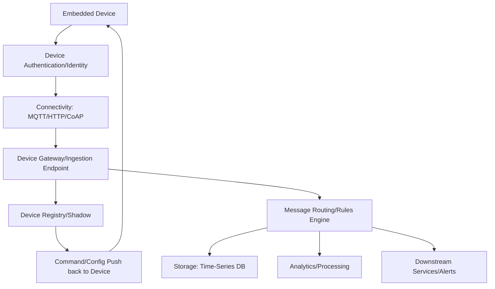
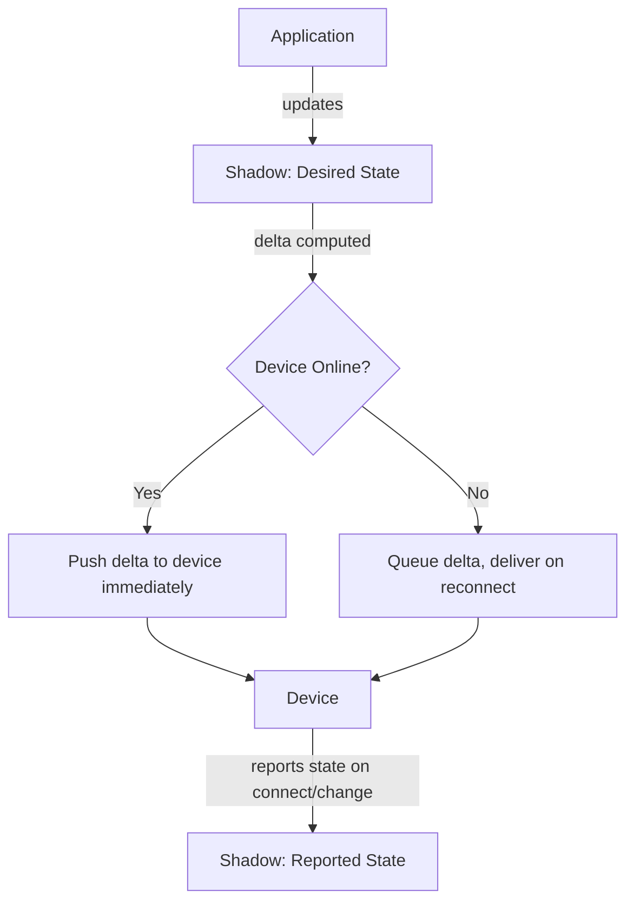
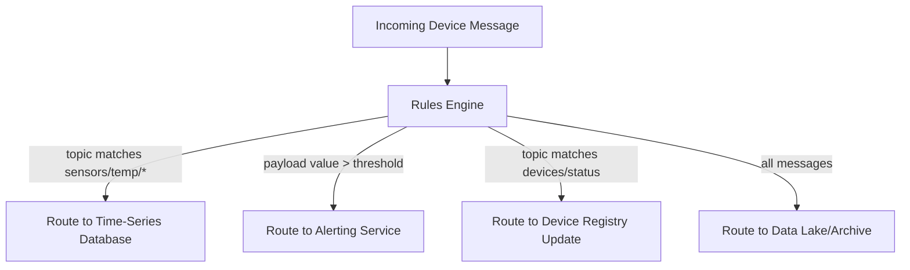
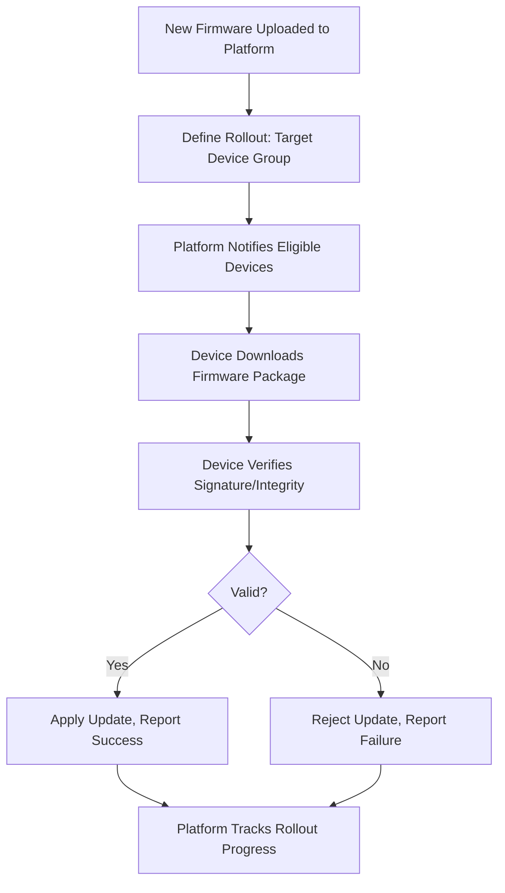

## Cloud Platform Integration for Embedded Devices

### Overview

Cloud platform integration is the set of architectural components and practices connecting embedded devices to cloud infrastructure for data ingestion, device management, remote control, and analytics. While earlier topics covered messaging protocols (MQTT, CoAP) and broad architecture patterns, this topic focuses specifically on the integration layer: how devices authenticate, connect to, and exchange data with cloud platforms, and the platform-side services that make this practical at scale.

---

### Core Components of Cloud Device Integration

A typical cloud IoT platform provides several integrated services beyond a bare messaging broker: device identity/authentication, a device registry tracking known devices and their metadata, a device shadow/digital twin, message routing rules, and integration points into broader cloud storage/analytics/compute services.

---

### Device Authentication and Identity

Establishing that a connecting device is who it claims to be — and preventing unauthorized devices from impersonating legitimate ones — is foundational to secure cloud integration.

#### X.509 Certificate-Based Authentication

Each device is provisioned with a unique X.509 certificate and private key (often generated during manufacturing or first boot), used to establish a mutually authenticated TLS/DTLS connection to the cloud platform.

- **Strengths**: Strong cryptographic identity, no shared secret transmitted over the network, revocable per-device if a device is compromised
- **Requirements**: Secure private key storage on the device (ideally in a hardware security element or secure enclave, since a private key stored in plain flash is vulnerable to extraction), and a certificate provisioning/rotation process integrated into the manufacturing or deployment pipeline

#### Symmetric Key / Token-Based Authentication

A simpler alternative using a shared secret (API key, pre-shared key, or token) rather than a full public-key certificate infrastructure.

- **Strengths**: Simpler to implement and provision than full certificate infrastructure, lower computational requirements on constrained devices (avoiding public-key cryptography operations)
- **Limitations**: A shared secret that leaks compromises that device's identity more directly than certificate-based schemes (though certificate private key compromise has similar consequences); generally considered less robust than certificate-based authentication for large-scale or security-sensitive deployments [Inference], though the appropriate choice depends on the specific threat model, device computational constraints, and deployment scale

#### Just-in-Time Provisioning (JITP)

A pattern where a device's cloud-side identity/registration is created automatically upon its first successful connection (using a manufacturer-signed certificate the platform is configured to trust), rather than requiring each device to be individually pre-registered in the cloud platform before deployment — reducing manufacturing/provisioning pipeline complexity for large device fleets.

---

### Device Registry

A cloud-side database of known devices and their metadata: device ID, type, firmware version, associated attributes/tags, and current connection status. The registry serves as the authoritative source for "what devices exist" and supports operations like:

- Querying devices by attribute (e.g., "all devices with firmware version < X" for targeted OTA rollout)
- Associating devices with logical groupings (fleets, customer accounts, physical locations)
- Tracking device lifecycle state (provisioned, active, decommissioned)

---

### Device Shadow / Digital Twin Integration

As introduced under IoT architecture patterns, the device shadow pattern maintains a cloud-side representation of device state, decoupling application interaction from real-time device connectivity.

- **Reported state**: What the device last told the platform about itself
- **Desired state**: What an application wants the device's state to be
- **Delta**: The difference between desired and reported state, computed by the platform and pushed to the device when it reconnects if it was offline when the desired state was set

This is particularly relevant for embedded devices using intermittent connectivity patterns (e.g., sleeping between reports to conserve battery), since applications can issue commands regardless of the device's current connection status, with delivery guaranteed once the device reconnects.

---

### Message Routing and Rules Engines

Cloud IoT platforms typically provide a rules engine that inspects incoming device messages (often based on topic pattern and/or message content) and routes them to appropriate downstream destinations without requiring custom integration code for each routing decision.

This decouples device-side firmware (which simply publishes to appropriate topics) from platform-side routing logic (which can be reconfigured without touching device firmware), a valuable separation of concerns for fleets of already-deployed devices where firmware updates are costlier than cloud-side configuration changes.

---

### Protocol Bridging at the Platform Layer

Cloud platforms commonly expose multiple protocol endpoints (MQTT, HTTP, sometimes CoAP or WebSockets) for device connectivity, internally normalizing incoming messages regardless of which protocol a given device used to connect, so downstream routing/storage/analytics logic doesn't need protocol-specific handling.

- Supports heterogeneous device fleets where different device classes (constrained battery-powered sensors vs. more capable gateway devices) use different connectivity protocols suited to their respective resource constraints
- Simplifies platform-side integration logic, since it operates on a normalized internal message representation rather than protocol-specific formats

---

### Data Ingestion and Storage Patterns

- **Time-series databases**: Purpose-built for the high-write-volume, time-ordered nature of sensor telemetry, typically optimized for queries like "average value over the last hour" or "all readings from device X in a date range" more efficiently than general-purpose relational databases
- **Hot/warm/cold storage tiering**: Recent data kept in fast, more expensive storage for real-time queries; older data moved to cheaper, slower storage (or aggregated/downsampled) as it ages, balancing query performance against long-term storage cost for high-volume telemetry
- **Stream processing**: Some platforms support real-time stream processing (windowed aggregation, anomaly detection, filtering) applied to data as it arrives, rather than only after it lands in storage — relevant for near-real-time alerting use cases

---

### Over-the-Air (OTA) Update Integration

Cloud platform integration commonly includes OTA firmware update orchestration as a core service:

- **Staged/canary rollouts**: Deploying an update to a small subset of devices first, monitoring for failures, before expanding to the full fleet — reduces the blast radius of a problematic firmware release
- **Signature verification**: Devices verify a cryptographic signature on downloaded firmware before applying it, preventing installation of tampered or unauthorized firmware images
- **Rollback capability**: Maintaining the ability to revert to a previous known-good firmware version if an update causes device malfunction, often via a dual-partition/A-B update scheme on the device itself

---

### Edge-to-Cloud Integration Patterns

For architectures using edge/fog computing (as covered in IoT architecture patterns), cloud integration often occurs at the gateway/edge tier rather than from every individual end device:

- The gateway aggregates, filters, or locally processes data from multiple end devices, then forwards a reduced/summarized data stream to the cloud, reducing both the number of cloud connections needed and the total data volume transmitted
- Some platforms provide edge runtime software (deployable to gateway hardware) that mirrors cloud platform APIs locally, allowing consistent application logic to run at the edge and sync with the cloud when connectivity allows — a pattern sometimes marketed as bringing "cloud-consistent" development to edge deployments

---

### Multi-Tenancy and Fleet Segmentation

Cloud platforms serving many customers or many independent deployments typically provide mechanisms to logically segment devices:

- **Tenant/account isolation**: Ensuring one customer's devices and data are not accessible to another customer sharing the same platform infrastructure
- **Fleet/group-based policies**: Applying configuration, OTA rollout targeting, or access control rules to logical device groups rather than requiring per-device configuration

---

### Cost and Bandwidth Considerations in Cloud Integration

- **Message volume pricing**: Many cloud IoT platforms charge based on message count and/or data volume, making protocol efficiency (MQTT/CoAP's lower overhead relative to HTTP) directly relevant to operating cost at scale, not just to device-side power/bandwidth constraints
- **Batching**: Aggregating multiple sensor readings into a single message before transmission (rather than one message per reading) reduces both message count and per-message overhead, at the cost of increased latency for individual readings to reach the cloud
- **Local filtering/deduplication**: Only transmitting data when it changes meaningfully (rather than continuously streaming unchanged values) reduces both bandwidth/cost and downstream storage volume — a common edge-processing optimization directly tied to cloud integration cost

---

### Selecting a Cloud Integration Approach

| Consideration | Design Implication |
|---|---|
| Large device fleet, security-sensitive | Certificate-based auth with hardware secure element, JITP for scalable onboarding |
| Small fleet, resource-constrained devices, lower security sensitivity | Token/symmetric-key authentication for simpler implementation |
| Intermittent connectivity (battery-powered) | Device shadow pattern, persistent MQTT sessions with queued message delivery |
| Heterogeneous device types across a fleet | Platform supporting multiple protocol endpoints (MQTT + HTTP + CoAP) |
| High telemetry volume | Time-series storage, batching, local filtering before transmission |
| Frequent firmware iteration | OTA integration with staged rollout and rollback support |
| Edge/fog architecture | Gateway-mediated cloud connection rather than direct end-device connections |

---

### Illustration: Device-to-Cloud Data Flow

<svg xmlns="http://www.w3.org/2000/svg" viewBox="0 0 680 320">
  <title>Device-to-Cloud Integration Data Flow (svg_diagram)</title>
  <rect x="0" y="0" width="680" height="320" fill="#ffffff" />
  <text x="20" y="28" font-size="16" font-weight="bold" fill="#222">Device-to-Cloud Integration Flow (svg_diagram)</text>

  <rect x="30" y="60" width="100" height="50" fill="#4a90d9" />
  <text x="40" y="90" font-size="10" fill="#fff">Embedded Device</text>

  <line x1="130" y1="85" x2="220" y2="85" stroke="#555" stroke-width="2" />
  <text x="135" y="75" font-size="9" fill="#555">TLS/DTLS auth</text>

  <rect x="220" y="60" width="110" height="50" fill="#e0a800" />
  <text x="228" y="82" font-size="10" fill="#fff">Ingestion</text>
  <text x="228" y="98" font-size="10" fill="#fff">Endpoint</text>

  <line x1="330" y1="85" x2="420" y2="85" stroke="#555" stroke-width="2" />

  <rect x="420" y="30" width="110" height="40" fill="#7ac36a" />
  <text x="428" y="55" font-size="10" fill="#fff">Device Registry</text>

  <rect x="420" y="90" width="110" height="40" fill="#7ac36a" />
  <text x="428" y="115" font-size="10" fill="#fff">Rules Engine</text>

  <line x1="330" y1="80" x2="420" y2="50" stroke="#555" stroke-width="1.5" />
  <line x1="330" y1="90" x2="420" y2="110" stroke="#555" stroke-width="1.5" />

  <rect x="560" y="90" width="100" height="40" fill="#d94a4a" />
  <text x="565" y="115" font-size="10" fill="#fff">Time-Series DB</text>
  <line x1="530" y1="110" x2="560" y2="110" stroke="#555" stroke-width="1.5" />

  <rect x="420" y="160" width="110" height="40" fill="#d94a4a" />
  <text x="428" y="185" font-size="10" fill="#fff">Alerting Service</text>
  <line x1="475" y1="130" x2="475" y2="160" stroke="#555" stroke-width="1.5" />

  <rect x="220" y="200" width="110" height="40" fill="#9370db" />
  <text x="228" y="225" font-size="10" fill="#fff">Device Shadow</text>
  <line x1="275" y1="200" x2="275" y2="130" stroke="#555" stroke-width="1.5" stroke-dasharray="4,3" />
  <line x1="220" y1="220" x2="130" y2="150" stroke="#555" stroke-width="1.5" stroke-dasharray="4,3" />
  <line x1="130" y1="150" x2="80" y2="110" stroke="#555" stroke-width="1.5" stroke-dasharray="4,3" />
  <text x="120" y="260" font-size="9" fill="#555">commands pushed back to device</text>
</svg>

---

### Key Points

- Cloud device integration combines authentication/identity, connectivity, a device registry, shadow/digital twin state, message routing, and downstream storage/analytics into a cohesive platform.
- Certificate-based (X.509) authentication offers stronger per-device identity than symmetric-key schemes but requires secure key storage and a more involved provisioning pipeline; token-based auth is simpler but generally considered less robust at scale.
- Device shadow patterns decouple application interaction from real-time device connectivity, particularly valuable for intermittently-connected, battery-powered embedded devices.
- Rules engines decouple device firmware (which just publishes to topics) from platform-side routing logic, allowing routing changes without firmware updates.
- OTA update integration typically includes staged/canary rollout, signature verification, and rollback capability as standard production practices.
- Message volume and bandwidth directly affect both device power consumption and cloud platform operating cost, making batching and local filtering relevant optimizations at both the device and integration-cost level.

---

### Related Topics

- Secure element / hardware security module (HSM) integration for device key storage
- X.509 certificate lifecycle management and rotation for large device fleets
- Time-series database query optimization for IoT telemetry
- A-B / dual-partition firmware update schemes for safe OTA rollback
- Stream processing and real-time anomaly detection architectures
- Multi-tenant SaaS architecture patterns applied to IoT platforms
- Edge runtime software and cloud-consistent edge development models
- IoT platform cost optimization: batching, filtering, and tiered storage strategies