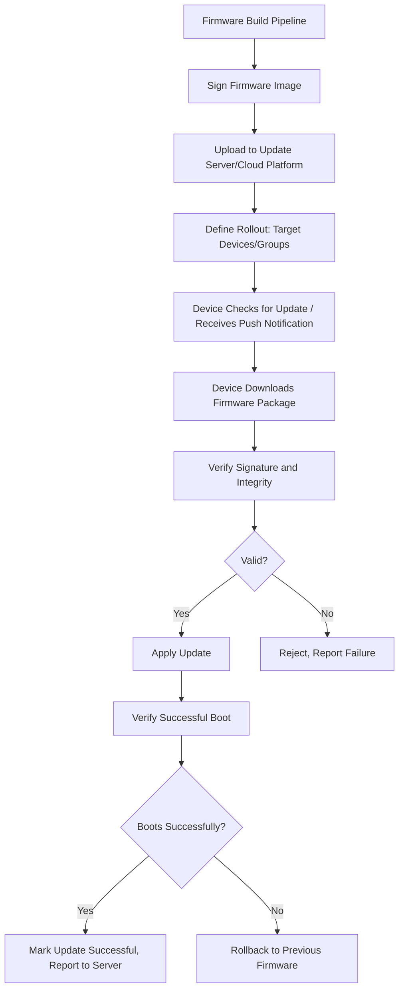
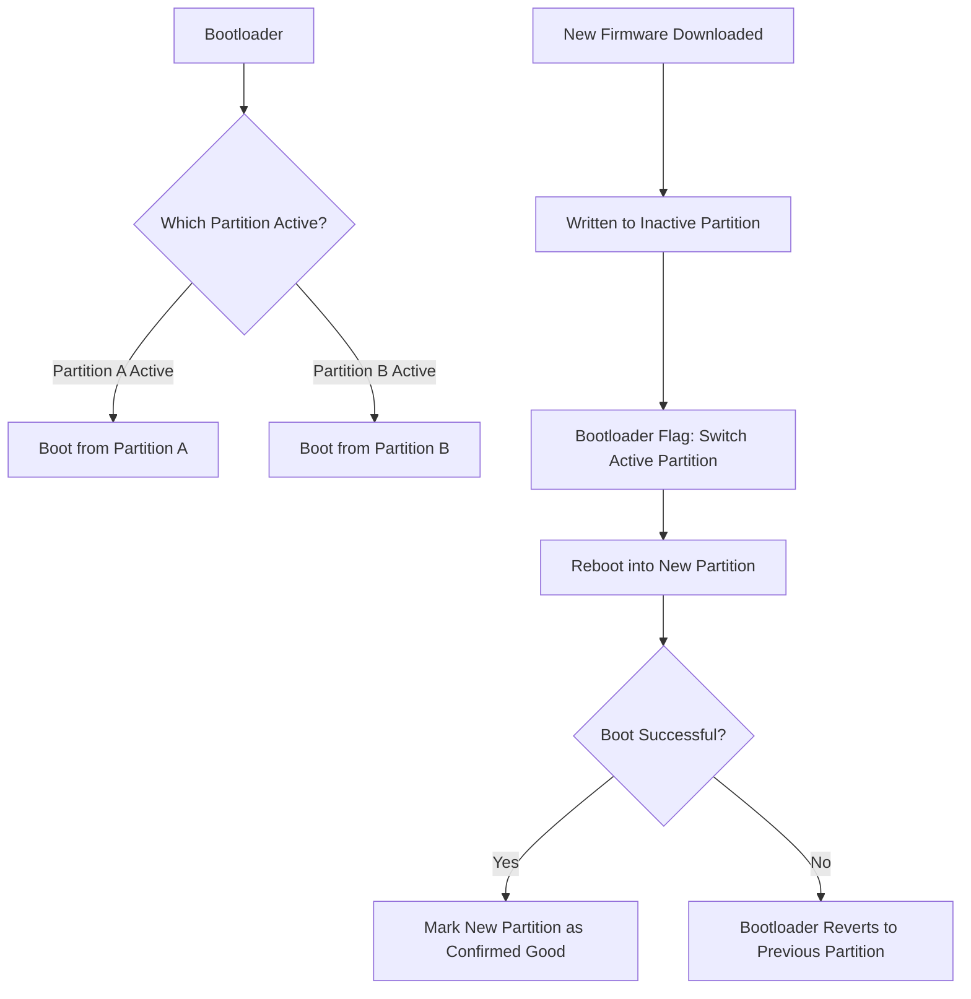
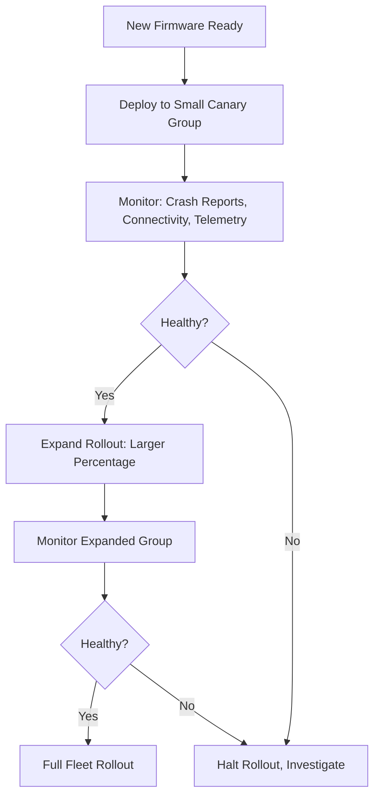
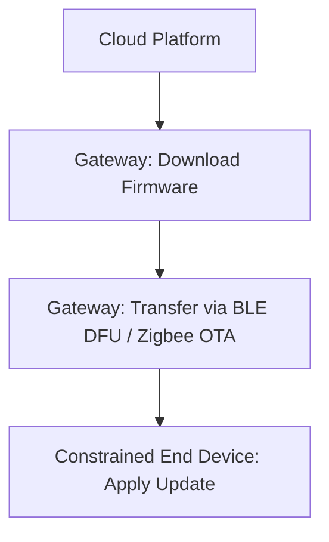

## Over-the-Air Update Mechanisms

### Overview

Over-the-air (OTA) update mechanisms allow embedded device firmware to be updated remotely, without requiring physical access to the device. This capability is essential for field-deployed embedded systems where manual reflashing is impractical or impossible at scale — enabling bug fixes, security patches, and feature additions after devices have shipped. OTA update design involves careful handling of failure modes, since a failed update on a remote, physically inaccessible device can otherwise permanently disable it (commonly called "bricking").

---

### Why OTA Design Requires Special Care

Unlike updating software on a general-purpose computer, embedded OTA updates carry heightened risk:

- Devices may be physically inaccessible (installed in walls, outdoor enclosures, remote locations, or simply too numerous to visit individually)
- Power loss or connectivity interruption during an update can leave a device in a corrupted, non-bootable state if not carefully protected against
- Constrained flash storage may limit how much space is available for update mechanisms (e.g., storing both old and new firmware simultaneously)
- Update failures at scale across a large fleet can represent significant business/safety risk, motivating careful staged rollout practices

Robust OTA design treats "what happens if the update fails partway through" as a primary design concern, not an edge case.

---

### Update Delivery Architecture

#### Pull vs. Push Update Notification

- **Pull model**: Device periodically checks in with the update server (e.g., "is a new version available for my device type?") — simpler server-side implementation, but introduces latency between update availability and device awareness, bounded by the check-in interval
- **Push model**: Server actively notifies connected devices of available updates (e.g., via an MQTT topic the device subscribes to) — lower latency to update propagation, but requires the device to maintain some form of persistent or periodic connectivity to receive the notification

---

### A/B (Dual-Partition) Update Scheme

One of the most robust and widely used OTA patterns: the device's flash storage is divided into two (or more) partitions, each capable of holding a complete, independently bootable firmware image.

**Key properties:**
- New firmware is written to the *inactive* partition while the device continues running normally from the currently active partition, meaning the device remains fully functional throughout the download/write process
- Only after the new firmware is fully written and verified does the bootloader switch which partition is considered "active" and reboot
- If the new firmware fails to boot successfully (crash loop, watchdog timeout, explicit self-check failure), the bootloader can automatically revert to the previous, known-good partition — providing automatic rollback without requiring the device to be physically recovered
- Requires roughly double the flash storage compared to a single-partition scheme, since two complete firmware images must fit simultaneously — a real constraint on the most storage-constrained microcontrollers

#### Boot Confirmation ("Mark Good") Pattern

A common refinement: after booting into new firmware, the device must actively confirm successful operation (e.g., successfully connecting to the network, passing a self-test, or simply running without crashing for some duration) before the bootloader permanently commits to that partition. If confirmation doesn't occur within a timeout, the bootloader treats the update as failed and reverts automatically — protecting against firmware that boots but is otherwise non-functional, not just firmware that fails to boot at all.

---

### Single-Partition Update Schemes

Some constrained devices cannot afford the flash storage overhead of a full dual-partition scheme, instead updating a single firmware image in place.

- **Higher risk**: A power loss or corruption during the write process can leave the device without any valid, bootable firmware image, since there is no complete fallback image stored elsewhere on the device
- **Mitigation approaches**: A separate, minimal, rarely-updated bootloader (kept intentionally simple and stable to minimize its own risk of needing updates) can implement basic recovery mechanisms (e.g., a small recovery image, or the ability to re-enter a firmware-download mode via a hardware pin/button if the main application firmware is corrupted)
- **Delta/incremental updates**: To reduce the storage and bandwidth footprint of an update, some single-partition schemes transmit only the binary difference between old and new firmware rather than a complete image, applying the patch in place — reducing data transfer size at the cost of more complex update-application logic and generally tighter coupling between the specific old and new firmware versions being patched between

---

### Bootloader Design Considerations

The bootloader is the piece of code responsible for deciding which firmware image to boot and for managing the update process itself — its correctness is disproportionately critical, since a bug in the bootloader itself can be far harder to recover from than a bug in application firmware (which the bootloader itself might otherwise be able to help recover from).

- **Bootloader immutability**: Many designs keep the bootloader itself effectively unchangeable (or update it extremely rarely, with extra caution) specifically because it is the last line of defense if application firmware becomes corrupted
- **Minimal bootloader scope**: Keeping bootloader functionality deliberately minimal (partition selection, signature verification, basic recovery mode) reduces the bootloader's own attack surface and bug surface, since a bootloader failure is generally much harder to remediate remotely than an application firmware failure
- **Secure boot chain**: The bootloader typically verifies a cryptographic signature on the firmware image before booting it, extending the device's chain of trust from an immutable hardware root of trust (e.g., a one-time-programmable key burned during manufacturing) through the bootloader to the application firmware

---

### Firmware Image Integrity and Authentication

- **Cryptographic signing**: Firmware images are signed (typically using asymmetric cryptography — the manufacturer holds a private signing key, the device holds the corresponding public key) so the device can verify that a downloaded image genuinely originated from an authorized source and has not been tampered with in transit or storage
- **Checksum/hash verification**: In addition to (not instead of) cryptographic signature verification, a hash (e.g., SHA-256) of the firmware image is typically checked to detect corruption during download or storage, independent of the authenticity guarantee the signature provides
- **Version/downgrade protection**: Some systems explicitly prevent installing an older firmware version than currently running (anti-rollback protection), which can be a security requirement (preventing an attacker from downgrading a device to a version with a known vulnerability) — though this must be balanced carefully against legitimate need to roll back a genuinely problematic update, which is a distinct mechanism from the bootloader's own automatic boot-failure rollback described above

---

### Staged and Canary Rollouts

Deploying an update to an entire fleet simultaneously carries significant risk if the update contains an undiscovered defect. Staged rollout practices mitigate this:

- **Canary deployment**: Releasing an update to a small, representative subset of devices first, monitoring health signals before proceeding
- **Percentage-based rollout**: Gradually increasing the proportion of the fleet receiving the update (e.g., 1% → 10% → 50% → 100%), pausing or halting if problems are detected at any stage
- **Rollout halting/pause capability**: The platform-side ability to immediately stop a rollout in progress if problems are detected, preventing further devices from receiving a problematic update while already-updated devices are addressed separately

---

### Bandwidth and Power Considerations for OTA on Constrained Devices

- **Delta updates**: As noted above, transmitting only the changed portions of firmware reduces bandwidth and, correspondingly, the radio-on time and energy cost of downloading an update on battery-powered devices
- **Scheduling updates during favorable conditions**: Battery-powered or intermittently-connected devices often schedule update checks/downloads for times of good connectivity or sufficient battery charge, rather than attempting downloads opportunistically at any time
- **Block-wise/chunked transfer**: Particularly relevant for constrained protocols like CoAP (via its block-wise transfer mechanism) or MQTT (via manual chunking, since MQTT itself has no native block-transfer feature), allowing a firmware image larger than available RAM to be downloaded and written to flash incrementally rather than requiring the entire image to be buffered in memory at once

---

### Gateway-Mediated OTA for Constrained End Devices

For end devices too constrained to run a full OTA client themselves (e.g., simple BLE or Zigbee sensors without direct internet connectivity), a local gateway often mediates the update process — downloading firmware from the cloud on the end device's behalf and transferring it over the local low-power network protocol, sometimes using protocol-specific OTA extensions (e.g., BLE's DFU - Device Firmware Update - profile, or Zigbee's OTA cluster).

---

### Comparing Update Scheme Approaches

| Approach | Storage Overhead | Failure Resilience | Complexity |
|---|---|---|---|
| A/B (dual-partition) | High (~2x firmware size) | High (automatic rollback) | Moderate |
| Single-partition, full image | Low | Low (no fallback image) | Low |
| Single-partition, delta/incremental | Lowest (bandwidth), low (storage) | Low-moderate (version coupling risk) | High |
| Gateway-mediated (constrained end device) | Depends on end-device scheme | Depends on end-device scheme + gateway reliability | Moderate-high (protocol translation) |

---

### Selecting an OTA Approach

- **Choose A/B (dual-partition)** when flash storage budget allows roughly double the firmware image size, and update reliability/automatic rollback is a priority — the generally preferred approach when resources permit
- **Choose single-partition with a robust recovery bootloader** when flash storage is too constrained for a full dual-partition scheme, accepting higher risk in exchange for lower storage overhead, and investing correspondingly more design effort in bootloader-level recovery mechanisms
- **Add delta/incremental updates** when bandwidth or radio-on energy cost is a dominant constraint (e.g., cellular-connected or battery-powered devices with infrequent, costly connectivity), accepting the added complexity of patch-based update logic
- **Use gateway-mediated OTA** for constrained end devices on local low-power networks (BLE, Zigbee) that cannot run a full OTA client themselves
- **Always implement staged/canary rollout practices** at the platform level regardless of the device-level update scheme chosen, since rollout risk management and device-level failure resilience address different, complementary failure modes

---

### Illustration: A/B Partition Update Flow

<svg xmlns="http://www.w3.org/2000/svg" viewBox="0 0 680 320">
  <title>A/B Dual-Partition OTA Update Flow (svg_diagram)</title>
  <rect x="0" y="0" width="680" height="320" fill="#ffffff" />
  <text x="20" y="28" font-size="16" font-weight="bold" fill="#222">A/B Partition Update Flow (svg_diagram)</text>

  <text x="30" y="60" font-size="13" font-weight="bold" fill="#333">Before Update</text>
  <rect x="30" y="75" width="140" height="50" fill="#7ac36a" stroke="#3d7a2e" stroke-width="2" />
  <text x="45" y="105" font-size="10" fill="#fff">Partition A (Active)</text>
  <rect x="190" y="75" width="140" height="50" fill="#ccc" stroke="#888" stroke-width="2" />
  <text x="205" y="105" font-size="10" fill="#555">Partition B (Empty)</text>

  <text x="30" y="160" font-size="13" font-weight="bold" fill="#333">During Update</text>
  <rect x="30" y="175" width="140" height="50" fill="#7ac36a" stroke="#3d7a2e" stroke-width="2" />
  <text x="35" y="205" font-size="9" fill="#fff">Partition A (still running)</text>
  <rect x="190" y="175" width="140" height="50" fill="#e0a800" stroke="#8a6800" stroke-width="2" />
  <text x="200" y="205" font-size="10" fill="#fff">Partition B (writing new fw)</text>

  <text x="30" y="260" font-size="13" font-weight="bold" fill="#333">After Successful Boot</text>
  <rect x="30" y="275" width="140" height="35" fill="#ccc" stroke="#888" stroke-width="2" />
  <text x="45" y="298" font-size="10" fill="#555">Partition A (standby fallback)</text>
  <rect x="190" y="275" width="140" height="35" fill="#7ac36a" stroke="#3d7a2e" stroke-width="2" />
  <text x="205" y="298" font-size="10" fill="#fff">Partition B (Active)</text>

  <text x="380" y="150" font-size="11" fill="#555">If Partition B fails to boot,</text>
  <text x="380" y="168" font-size="11" fill="#555">bootloader automatically</text>
  <text x="380" y="186" font-size="11" fill="#555">reverts to Partition A</text>
</svg>

---

### Key Points

- OTA update design must treat partial-failure scenarios (power loss, connectivity drop, corrupted image, non-booting firmware) as core design requirements, not edge cases, since remote devices may be unrecoverable if bricked.
- A/B (dual-partition) update schemes provide strong failure resilience via automatic bootloader-level rollback, at the cost of roughly doubled flash storage requirements.
- Boot confirmation ("mark good") patterns protect against firmware that boots but is otherwise non-functional, not just firmware that fails to boot outright.
- Cryptographic signature verification authenticates firmware origin; hash/checksum verification separately detects transmission/storage corruption — both are typically used together.
- Staged/canary rollout practices at the platform level are a complementary risk-mitigation layer distinct from (and needed regardless of) device-level update scheme robustness.
- Gateway-mediated OTA, delta updates, and scheduled/chunked transfer address the specific bandwidth and power constraints of the most resource-limited embedded end devices.

---

### Related Topics

- Secure boot and hardware root of trust implementation
- Cryptographic signing schemes and key management for firmware authentication
- Delta/binary diff algorithms for incremental firmware updates
- BLE DFU and Zigbee OTA cluster protocol-specific update mechanisms
- Watchdog timers and firmware self-test design for boot confirmation
- Flash memory wear leveling and endurance considerations for frequent updates
- Fleet health monitoring and telemetry-driven rollout decision automation
- Bootloader security hardening and minimal attack surface design