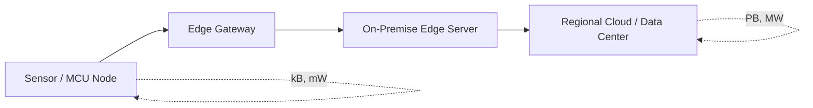
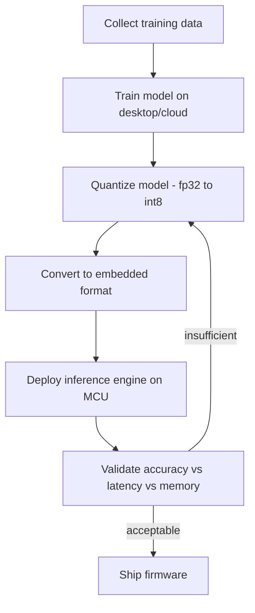
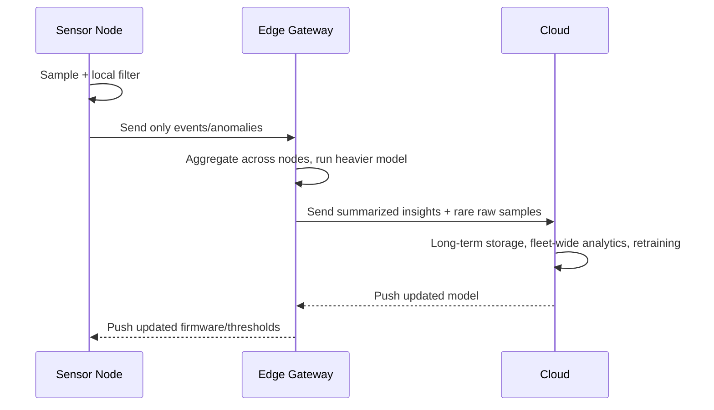

## Edge Computing on Embedded Devices

### Overview

Edge computing refers to performing data processing, filtering, and decision-making physically close to where data is generated — on the embedded device itself or on a nearby gateway — rather than sending raw data to a centralized cloud for processing. On embedded hardware this means running inference, control loops, aggregation, or event detection within the constraints of limited CPU, RAM, flash, and power.

### Why Push Compute to the Edge

**Key Points**
- **Latency**: Local decisions avoid round-trip network delay, critical for control loops (e.g., motor control, safety interlocks) that need sub-millisecond to low-millisecond response.
- **Bandwidth**: Raw sensor streams (audio, video, high-rate vibration data) are often far larger than the actionable information within them; edge processing reduces what must be transmitted.
- **Connectivity resilience**: Devices continue functioning (at least in a degraded mode) during network outages.
- **Privacy**: Sensitive raw data (e.g., audio, images) can be processed and discarded locally instead of leaving the device.
- **Power/cost**: Fewer bytes transmitted over cellular or LPWAN links directly reduces energy use and data costs, since radio transmission is typically far more energy-expensive per bit than local computation.

### Edge Computing Spectrum

Edge computing is not a single tier — it spans a range of device classes with very different capabilities.

| Tier | Example Hardware | Typical Compute | Power Budget |
|---|---|---|---|
| Sensor node (MCU) | Cortex-M0/M4, RISC-V MCU | KB–MB RAM, tens of MHz–hundreds of MHz | µW–mW |
| Edge AI node | Cortex-M55+Ethos-U, ESP32-S3, RP2040 | MB RAM, NPU/DSP acceleration | tens–hundreds of mW |
| Edge gateway | Cortex-A (Raspberry Pi class), Jetson Nano/Orin | GB RAM, GPU/NPU | 1–15 W |
| On-prem edge server | x86 or ARM server-class SoC | tens of GB RAM | tens–hundreds of W |

### Categories of Edge Workloads

#### 1. Signal Processing and Filtering

- Digital filters (FIR/IIR), Fast Fourier Transform (FFT) for vibration/audio analysis, Kalman filtering for sensor fusion.
- Often implemented using fixed-point arithmetic on MCUs without a hardware floating-point unit (FPU), trading precision for speed and reduced power.

#### 2. Rule-Based / Threshold Logic

- Simple conditionals (e.g., "if temperature > threshold, trigger alarm") — the lowest-complexity form of edge intelligence, requiring negligible compute.

#### 3. Control Loops

- PID controllers, motor commutation, closed-loop feedback systems that must execute deterministically within a fixed time budget (hard or soft real-time).

#### 4. Embedded Machine Learning / TinyML

- Running trained neural network models directly on microcontrollers, typically for classification tasks (keyword spotting, anomaly detection, gesture recognition, simple image classification).
- Distinguished from general "edge AI" (which may run on Cortex-A class gateways with more headroom) by operating within KB of RAM and often no OS.

### TinyML Deployment Pipeline

- **Quantization**: Converting model weights/activations from 32-bit floating point to 8-bit integer (or lower) representations. [Inference] This typically reduces model size roughly fourfold and can substantially speed up inference on integer-optimized MCU cores, though the exact ratio depends on the model architecture and target hardware's native instruction support.
- **Pruning**: Removing weights/connections that contribute little to model output, reducing model size and computation.
- **Knowledge distillation**: Training a smaller "student" model to mimic a larger "teacher" model's outputs.

**Common TinyML frameworks/toolchains**:
- TensorFlow Lite for Microcontrollers (TFLM)
- Edge Impulse (end-to-end data collection, training, and deployment pipeline)
- CMSIS-NN (ARM's optimized neural network kernels for Cortex-M)
- microTVM
- STM32Cube.AI (vendor-specific, for STM32 parts)

### Hardware Acceleration for Edge Inference

- **NPUs (Neural Processing Units)**: Dedicated silicon blocks for matrix multiply-accumulate operations, increasingly integrated into microcontroller SoCs (e.g., Arm Ethos-U55 paired with Cortex-M55).
- **DSPs**: General digital signal processors, useful for both classical signal processing and some ML workloads.
- **SIMD instruction extensions**: e.g., Arm Helium (MVE) on Cortex-M55, which accelerates vectorized operations without a separate accelerator block.
- **GPU/CUDA cores**: Present on higher-tier edge devices (Jetson family) but absent on typical MCU-class hardware.

### Memory and Compute Constraints

**Key Points**
- Typical microcontroller edge nodes: tens of KB to a few MB of RAM, hundreds of KB to a few MB of flash.
- Model and inference buffer memory must coexist with the RTOS, network stack, and application code — often the binding constraint is not "can the model run" but "does everything fit simultaneously."
- Flash write endurance matters if models or configuration are updated in the field (typical NOR flash: on the order of 10,000–100,000 erase cycles per sector), so frequent field-updated models should avoid wearing a single flash region.

### Real-Time Operating Systems and Edge Workload Scheduling

- Edge compute tasks often coexist with connectivity stacks (Wi-Fi/BLE/LoRa) and control loops on the same core, requiring an RTOS (FreeRTOS, Zephyr, ThreadX) to schedule tasks with appropriate priority.
- Inference tasks are typically lower priority than hard-real-time control loops but higher priority than best-effort telemetry upload.
- **Example** task priority ordering on a combined sensor/edge-AI node:
  1. Safety interlock / emergency stop (highest)
  2. Real-time control loop (motor, actuator)
  3. Sensor sampling (fixed-rate ISR-driven)
  4. Edge inference (periodic, can tolerate jitter)
  5. Network telemetry upload (lowest, best-effort)

### Edge-Cloud Split Architectures

Most real deployments are hybrid rather than purely edge or purely cloud.

- **Cascade/hierarchical inference**: A lightweight model runs on the sensor node to filter for "interesting" events; only those events (or their features) are forwarded to a gateway running a heavier model, reducing both compute and bandwidth at each tier.
- **Federated learning** (less common on constrained MCUs, more common at the gateway tier): Model updates are computed locally and only aggregated gradients/weights are sent to a central server, rather than raw data.

### Power Management Considerations

- Continuous inference at high sample rates conflicts with ultra-low-power design goals; **duty cycling** (waking periodically, sampling, running inference, sleeping) is standard for battery-powered edge nodes.
- Wake-on-event architectures: a low-power always-on peripheral (e.g., a low-power microphone with built-in voice activity detection, or a low-power accelerometer with motion-interrupt) wakes the main MCU only when there's something to process, keeping the higher-power core asleep otherwise.
- [Inference] The energy cost of the radio transmission required to send raw data off-device is often larger than the energy cost of running a small on-device model, which is one of the practical justifications for edge inference on battery-powered nodes — though the precise crossover point depends on model size, radio technology, and data volume.

### Common Pitfalls

- **Overestimating available RAM**: Forgetting that the RTOS, network stack buffers, and application state also consume RAM alongside the inference engine and its working buffers/tensor arena.
- **Ignoring quantization accuracy loss**: Deploying a quantized model without validating accuracy on representative field data, not just the original training/validation set.
- **Blocking the control loop**: Running inference synchronously on the same task/priority as a hard-real-time control loop, causing missed deadlines.
- **No fallback behavior**: Failing to define what the device does when edge inference is uncertain or the model itself fails/times out — silent failure in a safety-relevant context is a serious design flaw.
- **Treating edge and cloud training data as identical**: Field sensor noise, mounting variation, and environmental drift often differ from the curated training set, causing accuracy degradation over time (model/data drift) without a retraining or monitoring loop to catch it.

### Edge Compute Data Flow (SVG)

<svg xmlns="http://www.w3.org/2000/svg" viewBox="0 0 760 320">
  <text x="380" y="28" text-anchor="middle" font-size="18" font-weight="bold" fill="#1a1a1a">Edge Compute Data Flow (svg_diagram)</text>

  <rect x="30" y="70" width="180" height="90" rx="8" fill="#e8f0fe" stroke="#3b6fd6" stroke-width="1.5" />
  <text x="120" y="100" text-anchor="middle" font-size="13" font-weight="bold" fill="#1a1a1a">Raw Sensor Data</text>
  <text x="120" y="120" text-anchor="middle" font-size="11" fill="#333">High rate, high volume</text>

  <rect x="280" y="70" width="180" height="90" rx="8" fill="#fdf3e3" stroke="#d68b1a" stroke-width="1.5" />
  <text x="370" y="100" text-anchor="middle" font-size="13" font-weight="bold" fill="#1a1a1a">On-Device Inference</text>
  <text x="370" y="120" text-anchor="middle" font-size="11" fill="#333">Filter / classify / detect</text>

  <rect x="530" y="70" width="180" height="90" rx="8" fill="#eafaf1" stroke="#1f9d55" stroke-width="1.5" />
  <text x="620" y="100" text-anchor="middle" font-size="13" font-weight="bold" fill="#1a1a1a">Actionable Output</text>
  <text x="620" y="120" text-anchor="middle" font-size="11" fill="#333">Event, label, control signal</text>

  <line x1="210" y1="115" x2="280" y2="115" stroke="#555" stroke-width="1.5" marker-end="url(#arrow2)" />
  <line x1="460" y1="115" x2="530" y2="115" stroke="#555" stroke-width="1.5" marker-end="url(#arrow2)" />

  <rect x="280" y="210" width="180" height="80" rx="8" fill="#fbeaea" stroke="#c0392b" stroke-width="1.5" />
  <text x="370" y="240" text-anchor="middle" font-size="13" font-weight="bold" fill="#1a1a1a">Local Action</text>
  <text x="370" y="260" text-anchor="middle" font-size="11" fill="#333">Actuate, alarm, adjust</text>

  <line x1="620" y1="160" x2="620" y2="250" stroke="#555" stroke-width="1.5" />
  <line x1="620" y1="250" x2="460" y2="250" stroke="#555" stroke-width="1.5" marker-end="url(#arrow2)" />

  <text x="620" y="200" text-anchor="middle" font-size="10" fill="#777">(rare/summarized data to cloud)</text>

  </svg>

### Latency Budget Example

For a keyword-spotting wake-word model on a Cortex-M4 running at 80 MHz:

$$T_{total} = T_{sample} + T_{preprocess} + T_{inference} + T_{postprocess}$$

Where a representative budget might be $T_{sample} \approx 20\text{ms}$ (buffering audio window), $T_{preprocess} \approx 2\text{ms}$ (feature extraction, e.g., MFCC), $T_{inference} \approx 15\text{ms}$, and $T_{postprocess} < 1\text{ms}$, giving a total detection latency on the order of tens of milliseconds. [Unverified] Actual figures vary substantially by model architecture, clock speed, and compiler optimization, so this should be treated as an illustrative order-of-magnitude example rather than a benchmark for any specific part.

### Related Topics

- TinyML model quantization and pruning techniques in depth
- RTOS task scheduling and real-time guarantees
- Sensor fusion algorithms (Kalman/complementary filters) on embedded targets
- NPU/accelerator architectures for microcontrollers
- Over-the-air model updates and field retraining strategies
- Power profiling and duty-cycle design for battery-powered edge nodes
- Federated learning at the edge gateway tier