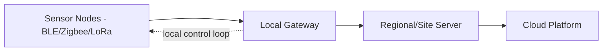
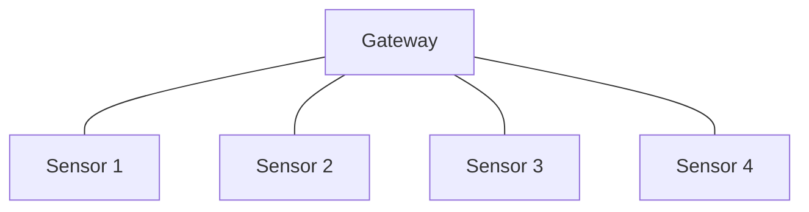
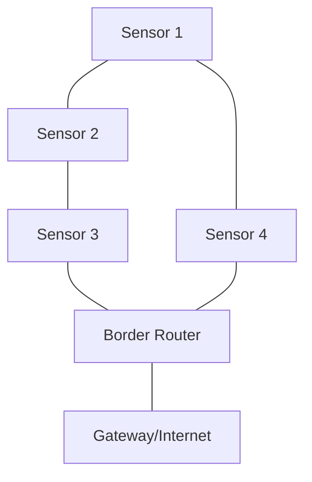
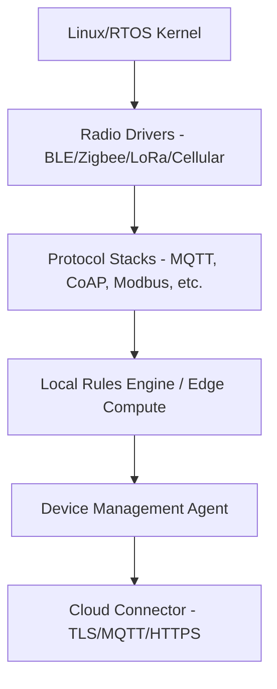

## Gateway Architectures

### Overview

An IoT gateway is a device that sits between constrained edge/sensor nodes and the wider network (cloud, on-premise servers, or the internet), performing protocol translation, aggregation, local processing, and often security enforcement. Gateways exist because most low-power sensor nodes cannot speak IP/TLS directly, or would burn unacceptable power and bandwidth doing so, so the gateway acts as a bridge and a trust boundary.

### Why Gateways Exist

**Key Points**
- **Protocol translation**: Many sensor-tier protocols (BLE, Zigbee, Z-Wave, LoRa, 6LoWPAN) are not directly IP-routable to the internet without a translating node.
- **Power asymmetry**: Battery-powered sensor nodes use low-power radios; gateways are typically mains-powered and can afford a always-on cellular, Wi-Fi, or Ethernet uplink.
- **Aggregation**: Combining many sensor streams into fewer, larger, more efficient uplink transmissions.
- **Local autonomy**: Allowing a site to keep functioning (control loops, local alarms) during cloud/internet outages.
- **Security boundary**: Concentrating certificate management, firewalling, and intrusion detection at one hardened point rather than on every constrained node.

### Gateway Architecture Spectrum

| Layer | Role | Example |
|---|---|---|
| Sensor/edge node | Sense, actuate, minimal processing | Battery-powered temperature sensor |
| Gateway | Protocol bridge, local aggregation/processing | Industrial PC, Raspberry Pi-class device, dedicated IoT gateway SoM |
| Site/regional server | Heavier local compute, short-term storage | On-prem edge server, factory MES system |
| Cloud platform | Fleet management, long-term storage, analytics | AWS IoT, Azure IoT Hub, custom backend |

### Core Gateway Functions

#### 1. Protocol Translation

A gateway commonly bridges between:
- **Downstream (sensor-facing)**: BLE, Zigbee, Z-Wave, Thread, LoRaWAN, Modbus, CAN bus, 6LoWPAN.
- **Upstream (cloud-facing)**: MQTT, HTTPS/REST, CoAP, AMQP over Wi-Fi, Ethernet, or cellular (LTE-M/NB-IoT/4G/5G).

This typically requires the gateway to run multiple radio/PHY stacks concurrently and translate application-layer semantics (e.g., converting a Zigbee cluster attribute report into an MQTT publish message).

#### 2. Data Aggregation and Batching

- Combining readings from many nodes into a single uplink payload reduces per-message overhead (especially important on metered cellular or LPWAN links).
- Time-series buffering: storing readings locally and forwarding on a schedule or when thresholds are crossed, rather than streaming continuously.

#### 3. Local Processing / Edge Compute Host

- Gateways, having more RAM/CPU than sensor nodes, are a natural place to run heavier inference models, rule engines, or complex event processing (correlating multiple sensor streams).
- See also: edge computing on embedded devices (heavier workloads at the gateway tier vs. lightweight TinyML on the sensor tier).

#### 4. Local Control and Autonomy

- Gateways often host the logic for site-local automation (e.g., "if zone temperature sensors disagree with HVAC state, trigger local alarm") so that control decisions do not depend on cloud connectivity round-trips.
- Store-and-forward buffering: queuing telemetry locally during a network outage and replaying it once connectivity resumes.

#### 5. Security Enforcement Point

- Terminates TLS/DTLS sessions from constrained nodes that cannot run a full IP stack, and re-originates a separate, stronger authenticated session to the cloud.
- Can host a local firewall, VPN tunnel endpoint, or network segmentation boundary between the operational technology (OT) network and the IT network.
- Manages device identity/credentials for the sensor nodes it fronts, in some architectures acting as a local certificate authority or credential proxy.

### Gateway Deployment Topologies

#### Star Topology

All sensor nodes communicate directly and only with a single gateway.

- Simple to reason about; single point of failure at the gateway.

#### Mesh-to-Gateway Topology

Sensor nodes form a mesh (e.g., Zigbee, Thread) among themselves, with one or more nodes acting as a border router into the gateway/internet.

- Improves range and resilience (nodes can relay for each other) at the cost of protocol complexity and higher latency variance.

#### Multi-Gateway / Redundant Topology

- Multiple gateways cover overlapping zones for failover, or are geographically distributed across a large site (e.g., a factory floor or campus).
- Requires coordination logic to avoid duplicate processing or conflicting local control decisions when more than one gateway can "see" the same node.

### Hardware Considerations

**Key Points**
- Gateways typically run a Cortex-A class application processor (vs. Cortex-M on sensor nodes), with enough RAM (hundreds of MB to several GB) to run a full Linux-based OS.
- Multiple concurrent radios are common: Wi-Fi, BLE, Zigbee/Thread (via a dedicated radio SoC), cellular modem, sometimes LoRa — each often on a separate chip or module coordinated by the main application processor.
- Storage: local flash or eMMC for OS, application code, and store-and-forward data buffering; some deployments add an SD card or SSD for longer local retention.
- Power: usually mains-powered, though battery/solar-backed gateways exist for remote or outdoor deployments (e.g., agricultural or environmental monitoring sites).

### Software Stack

- **OS choice**: Embedded Linux (Yocto, Buildroot, or a vendor distro) is common at the gateway tier because of driver availability and ecosystem support; some gateways run a lightweight RTOS if resource-constrained or requiring hard real-time behavior.
- **Container/orchestration layer**: Increasingly common to deploy gateway application logic as containers (Docker, balena, AWS IoT Greengrass, Azure IoT Edge) to allow remote, modular software updates without re-flashing the whole OS image.
- **Device management agent**: Handles OTA updates, telemetry health reporting, remote diagnostics, and configuration push from the cloud platform.

### Example Cloud Gateway Frameworks

**Example**
- **AWS IoT Greengrass**: Extends AWS IoT Core to edge/gateway devices, allowing Lambda-style functions and ML inference to run locally while maintaining a managed connection back to AWS.
- **Azure IoT Edge**: Similar concept — deploys containerized modules to a gateway device, managed centrally via Azure IoT Hub.
- **Eclipse Kura**: An open-source Java/OSGi-based IoT gateway framework, often used in industrial contexts, providing modular protocol drivers and cloud connectivity.
- **Home Assistant / openHAB**: Consumer/prosumer-oriented gateway software for home automation, bridging protocols like Zigbee and Z-Wave to a local hub with optional cloud connectivity.

[Unverified] Specific feature sets, pricing, and supported protocol lists for these platforms change frequently; current vendor documentation should be checked rather than relying on a fixed feature list.

### Gateway as a Security Boundary

- **Network segmentation**: Placing the gateway between an OT (operational technology) network segment and the IT/corporate network, so a compromised sensor cannot directly reach enterprise systems.
- **Credential proxying**: Rather than every constrained sensor node holding a cloud-facing TLS certificate, the gateway may hold the cloud credential and manage lighter-weight local credentials (e.g., a shared network key) for the sensor tier — trading per-node cryptographic strength for feasibility on constrained hardware.
- [Inference] This proxying pattern concentrates risk: a compromised gateway can potentially impersonate or manipulate every node behind it, so gateways are frequently the highest-value target in a segmented IoT deployment and typically warrant the strongest hardening (secure boot, hardware root of trust, restricted debug access) in the whole architecture.

### Common Pitfalls

- **Single point of failure**: A star-topology gateway with no redundancy means a gateway failure blinds an entire sensor cluster.
- **Unbounded local buffering**: Store-and-forward queues without size limits can exhaust gateway storage during extended outages, sometimes causing the gateway itself to crash or drop new inbound data ungracefully.
- **Inconsistent time sync**: Aggregated data from multiple sensor nodes is only meaningful if timestamps are consistent; gateways need a reliable time source (NTP, GPS, or a local RTC) and a strategy for handling nodes with drifted or missing clocks.
- **Overloaded protocol translation logic**: Cramming too much business logic into ad hoc translation code makes the gateway brittle and hard to update; many mature deployments separate "dumb" protocol bridging from a more maintainable rules/logic layer.
- **Weak physical security**: Gateways are often installed in accessible locations (utility closets, rooftops); physical tampering (debug port access, storage removal) is a realistic threat model that is easy to overlook relative to network-layer security.

### Gateway Architecture Layers (SVG)

<svg xmlns="http://www.w3.org/2000/svg" viewBox="0 0 760 340">
  <text x="380" y="28" text-anchor="middle" font-size="18" font-weight="bold" fill="#1a1a1a">Gateway Architecture Layers (svg_diagram)</text>

  <rect x="60" y="60" width="640" height="50" rx="6" fill="#e8f0fe" stroke="#3b6fd6" stroke-width="1.5" />
  <text x="380" y="90" text-anchor="middle" font-size="13" font-weight="bold" fill="#1a1a1a">Cloud Connector (TLS / MQTT / HTTPS)</text>

  <rect x="60" y="125" width="640" height="50" rx="6" fill="#fdf3e3" stroke="#d68b1a" stroke-width="1.5" />
  <text x="380" y="155" text-anchor="middle" font-size="13" font-weight="bold" fill="#1a1a1a">Device Management + Local Rules / Edge Compute</text>

  <rect x="60" y="190" width="640" height="50" rx="6" fill="#eafaf1" stroke="#1f9d55" stroke-width="1.5" />
  <text x="380" y="220" text-anchor="middle" font-size="13" font-weight="bold" fill="#1a1a1a">Protocol Stacks (MQTT, CoAP, Modbus, Zigbee Cluster Lib)</text>

  <rect x="60" y="255" width="640" height="50" rx="6" fill="#fbeaea" stroke="#c0392b" stroke-width="1.5" />
  <text x="380" y="285" text-anchor="middle" font-size="13" font-weight="bold" fill="#1a1a1a">Radio Drivers (Wi-Fi, BLE, Zigbee, LoRa, Cellular)</text>

  <line x1="380" y1="110" x2="380" y2="125" stroke="#555" stroke-width="1.5" marker-end="url(#arrow3)" />
  <line x1="380" y1="175" x2="380" y2="190" stroke="#555" stroke-width="1.5" marker-end="url(#arrow3)" />
  <line x1="380" y1="240" x2="380" y2="255" stroke="#555" stroke-width="1.5" marker-end="url(#arrow3)" />

  </svg>

### Related Topics

- Device provisioning and identity at the sensor-to-gateway trust boundary
- Protocol deep dive: MQTT vs. CoAP vs. AMQP tradeoffs
- Zigbee, Thread, and Matter as mesh-to-gateway standards
- OTA update orchestration for containerized gateway software (Greengrass, IoT Edge)
- Store-and-forward buffering strategies and backpressure handling
- Network segmentation and zero-trust patterns for OT/IT boundaries
- Time synchronization strategies (NTP/PTP/GPS) for distributed sensor fleets