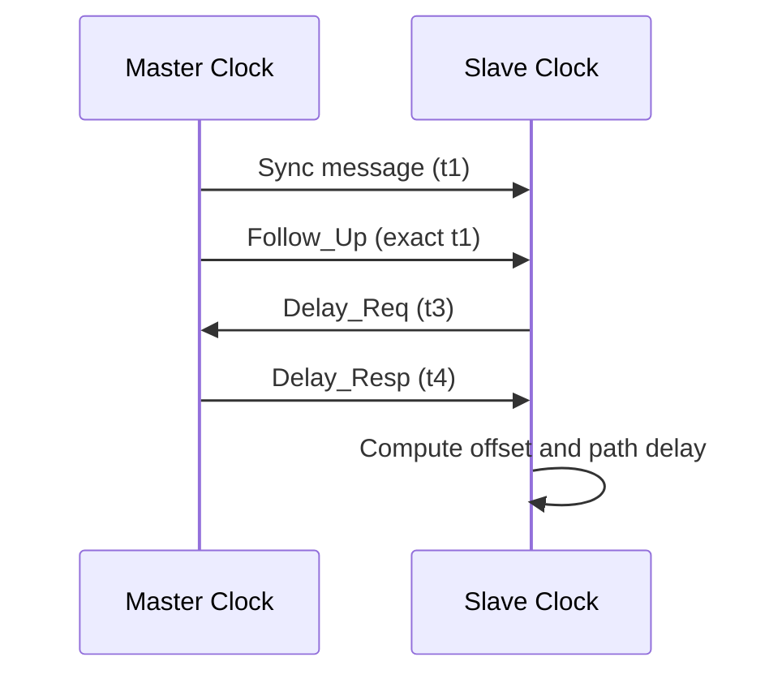
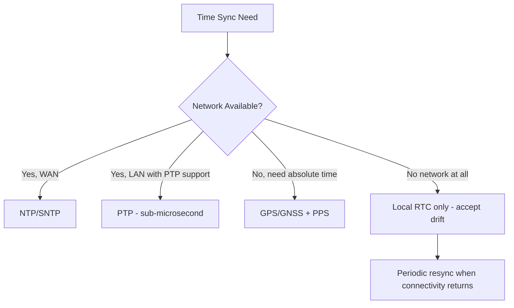

## Time Synchronization in Distributed Embedded Systems

### Overview

Time synchronization is the process of aligning the clocks of multiple independent embedded devices so that timestamps, event ordering, and coordinated actions are consistent across a distributed system. This matters wherever data from multiple nodes must be correlated (sensor fusion, event logging, distributed control) or where nodes must act in coordination (synchronized sampling, coordinated actuation, time-division radio scheduling).

### Why Clocks Drift

**Key Points**
- Every embedded device's local clock is typically driven by a crystal oscillator, which has a manufacturing tolerance (commonly expressed in parts-per-million, ppm).
- A crystal rated at ±20 ppm can drift by up to 20 microseconds per second, which accumulates to roughly 1.7 seconds per day in the worst case.
- Temperature, voltage, and aging all affect oscillator frequency over time, so drift is not constant — it changes with environmental conditions.
- Without correction, two devices with independent clocks will diverge continuously, making raw local timestamps unreliable for cross-device comparison beyond short periods.

$$\Delta t = t_0 \cdot \frac{ppm}{10^6}$$

Where $\Delta t$ is accumulated drift, $t_0$ is elapsed time, and $ppm$ is the oscillator's frequency tolerance.

### Sources of Time in Embedded Systems

| Source | Accuracy | Availability |
|---|---|---|
| Local RTC (crystal-based) | Drifts continuously without correction | Always available, no dependency |
| NTP (Network Time Protocol) | Typically single-digit to tens of milliseconds over WAN | Requires internet/network connectivity |
| PTP (Precision Time Protocol, IEEE 1588) | Sub-microsecond on well-engineered LANs | Requires hardware timestamping support and a local network |
| GPS/GNSS | Tens of nanoseconds | Requires clear sky view, GNSS receiver hardware |
| Cellular network time | Coarse (seconds), varies by carrier | Requires cellular modem, coarse only |
| Radio-based mesh sync (e.g., 802.15.4 beacon sync) | Sub-millisecond to microsecond depending on protocol | Requires participation in the mesh/network protocol |

### NTP: Network Time Protocol

- Client periodically queries one or more NTP servers, computing round-trip delay and offset using four timestamps (request sent, request received at server, response sent, response received at client).
- Compensates for network round-trip delay by assuming (often reasonably, not always accurately) that the outbound and return paths take roughly equal time.

$$\text{offset} = \frac{(T_2 - T_1) + (T_3 - T_4)}{2}$$

Where $T_1$ = client send time, $T_2$ = server receive time, $T_3$ = server send time, $T_4$ = client receive time.

- **SNTP (Simple NTP)**: A lighter-weight client-only variant commonly used on embedded devices that don't need NTP's full peer-to-peer, multi-stratum algorithm complexity.
- [Inference] NTP accuracy over the public internet is generally on the order of single-digit to tens of milliseconds because it is bounded largely by variable network latency (jitter) rather than the protocol's own precision, whereas on a well-controlled LAN with low, symmetric latency, sub-millisecond results are achievable.

### PTP: Precision Time Protocol (IEEE 1588)

- Designed for sub-microsecond synchronization on local networks, widely used in industrial automation, telecom, and financial trading infrastructure.
- Relies on **hardware timestamping** — the network interface itself timestamps packets at the physical layer (as close to the wire as possible) rather than in software, eliminating OS scheduling jitter from the measurement.
- Uses a **best master clock algorithm (BMCA)** to elect a grandmaster clock among participating nodes, with all other nodes synchronizing to it, potentially through intermediate boundary or transparent clocks.

- Requires switches/network infrastructure that support PTP (transparent or boundary clocks) for best results; running PTP over standard, unaware switches degrades accuracy due to variable queuing delay.

### GPS/GNSS-Disciplined Clocks

- A GNSS receiver provides a highly accurate absolute time reference, often paired with a **PPS (Pulse-Per-Second)** hardware signal that marks the exact start of each UTC second with nanosecond-level precision.
- The local oscillator is then "disciplined" (continuously adjusted) against the PPS signal, combining GNSS's absolute accuracy with the crystal's short-term stability between pulses.
- Common in outdoor infrastructure (base stations, environmental monitoring networks, synchrophasors in power grids) where a clear sky view is available and sub-microsecond synchronization across widely separated sites is required.
- Limitation: unusable indoors or in GNSS-denied environments without a repeater or alternative reference.

### Local Clock Sources on Embedded Devices

- **RTC (Real-Time Clock) peripheral**: A dedicated, often battery-backed, low-power timekeeping circuit that continues running through main power loss or deep sleep.
- **System tick / timer peripheral**: Derived from the main system clock, used for scheduling and short-interval timing but not typically battery-backed.
- **Temperature-Compensated Crystal Oscillator (TCXO) / Oven-Controlled Crystal Oscillator (OCXO)**: Higher-stability (and higher-cost, higher-power) oscillator options used where drift must be minimized without external time sources — OCXOs in particular are used in applications needing high stability independent of ambient temperature swings, at the cost of significant warm-up time and power draw.

### Synchronization Strategies by Constraint Class

**Example** decision logic for a battery-powered field sensor with intermittent LTE-M connectivity:
1. On boot, attempt to fetch time via SNTP over the cellular link.
2. If successful, discipline the local RTC and record sync timestamp.
3. Between connectivity windows, rely on the RTC, accepting bounded drift.
4. On each connectivity window, resync and log the observed drift since last sync (useful for characterizing that specific unit's oscillator behavior over temperature/aging).

### Distributed Sensor Fusion and Timestamp Alignment

- When combining readings from multiple sensor nodes (e.g., a vibration-monitoring network correlating fault signatures across a machine), timestamp misalignment directly translates into event correlation errors.
- **Local buffering with post-hoc correction**: Nodes timestamp locally, and a central aggregator corrects timestamps retroactively using each node's known offset/drift model, rather than requiring every node to be perfectly synchronized in real time.
- **Event-triggered sync**: Rather than continuous synchronization, nodes exchange sync beacons only around critical events, trading continuous accuracy for reduced radio/power overhead.

### Wireless Mesh Time Synchronization

- **802.15.4 / Zigbee / Thread**: Time-slotted channel hopping (TSCH) mode requires tight synchronization between mesh nodes to know when to listen/transmit; typically achieved via periodic sync frames referenced to a mesh-wide time base.
- **BLE**: Native BLE does not provide a built-in high-precision time sync mechanism; applications requiring it typically implement it at the application layer using connection event timing as a reference.
- **LoRaWAN**: Class B devices use periodic "beacon" broadcasts from the gateway to synchronize receive windows across nodes, trading some power overhead for scheduled downlink capability.

### Common Pitfalls

- **Assuming symmetric network delay**: NTP's offset calculation assumes roughly equal outbound/return latency; asymmetric paths (common on some cellular or satellite links) introduce systematic error that basic NTP cannot correct.
- **Software-only timestamping under load**: Timestamping packets in application or OS software (rather than hardware) introduces jitter from interrupt latency and scheduling, which can dominate the actual clock error being measured — especially problematic for PTP-class accuracy goals.
- **Ignoring oscillator temperature sensitivity**: A device that syncs indoors and is then deployed outdoors (or vice versa) may experience drift rates substantially different from what was characterized during development/testing.
- **No resync strategy after long outages**: A device that goes without network access for days/weeks may accumulate drift far beyond what a "resync on next connect" assumption anticipated, especially with lower-grade crystals.
- **Battery-backed RTC without initial time**: A device with a coin-cell-backed RTC still needs an initial absolute time reference at first boot (factory-set, or via network/GPS) — the RTC only preserves time across power loss, it doesn't originate correct time on its own.
- **Treating "synchronized" as binary**: Real synchronization always has a bounded error, not a “solved” state; system design should account for the actual expected accuracy (e.g., ±5 ms) rather than assuming perfect alignment.

### Time Sync Architecture (SVG)

<svg xmlns="http://www.w3.org/2000/svg" viewBox="0 0 760 340">
  <text x="380" y="28" text-anchor="middle" font-size="18" font-weight="bold" fill="#1a1a1a">Time Sync Architecture (svg_diagram)</text>

  <circle cx="130" cy="150" r="55" fill="#eafaf1" stroke="#1f9d55" stroke-width="1.5" />
  <text x="130" y="145" text-anchor="middle" font-size="12" font-weight="bold" fill="#1a1a1a">GNSS</text>
  <text x="130" y="162" text-anchor="middle" font-size="10" fill="#333">Absolute ref</text>

  <circle cx="380" cy="90" r="55" fill="#e8f0fe" stroke="#3b6fd6" stroke-width="1.5" />
  <text x="380" y="85" text-anchor="middle" font-size="12" font-weight="bold" fill="#1a1a1a">Gateway/</text>
  <text x="380" y="100" text-anchor="middle" font-size="12" font-weight="bold" fill="#1a1a1a">PTP Master</text>

  <circle cx="630" cy="150" r="55" fill="#fdf3e3" stroke="#d68b1a" stroke-width="1.5" />
  <text x="630" y="145" text-anchor="middle" font-size="12" font-weight="bold" fill="#1a1a1a">NTP</text>
  <text x="630" y="162" text-anchor="middle" font-size="10" fill="#333">WAN sync</text>

  <circle cx="230" cy="270" r="45" fill="#fbeaea" stroke="#c0392b" stroke-width="1.5" />
  <text x="230" y="275" text-anchor="middle" font-size="11" font-weight="bold" fill="#1a1a1a">Sensor Node A</text>

  <circle cx="530" cy="270" r="45" fill="#fbeaea" stroke="#c0392b" stroke-width="1.5" />
  <text x="530" y="275" text-anchor="middle" font-size="11" font-weight="bold" fill="#1a1a1a">Sensor Node B</text>

  <line x1="175" y1="175" x2="335" y2="120" stroke="#555" stroke-width="1.5" />
  <line x1="425" y1="120" x2="585" y2="175" stroke="#555" stroke-width="1.5" />
  <line x1="360" y1="145" x2="255" y2="230" stroke="#555" stroke-width="1.5" marker-end="url(#arrow4)" />
  <line x1="400" y1="145" x2="505" y2="230" stroke="#555" stroke-width="1.5" marker-end="url(#arrow4)" />

  </svg>

### Related Topics

- Real-time operating system scheduling and interrupt latency
- Gateway architectures as PTP/NTP relay points for sensor tiers
- LoRaWAN Class B beacon synchronization in depth
- Oscillator selection (crystal vs. TCXO vs. OCXO) for embedded design
- Sensor fusion and multi-node event correlation techniques
- Distributed consensus and event ordering (logical clocks, vector clocks) in embedded contexts