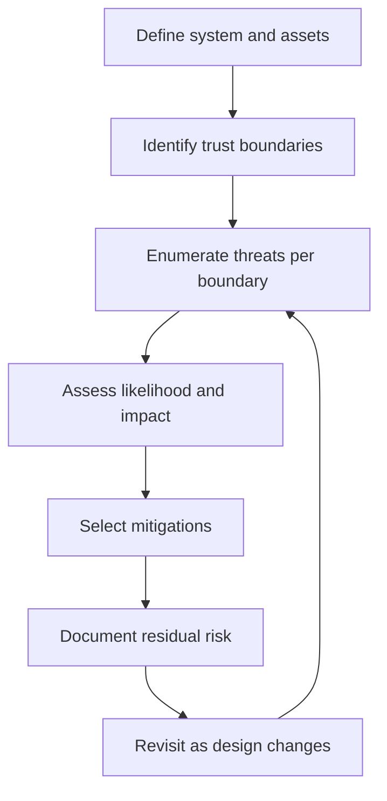
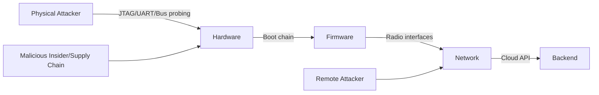
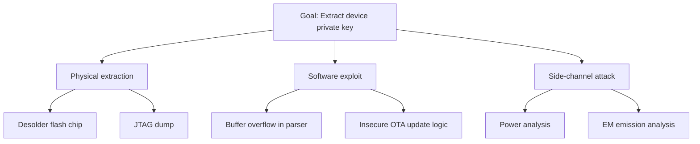

## Threat Modeling for Embedded Devices

### Overview

Threat modeling is the structured process of identifying what could go wrong in a system, who might cause it, and what the consequences would be, so that security effort is spent where it matters most rather than applied uniformly or by intuition. For embedded devices, threat modeling is distinct from general software threat modeling because it must account for physical access, resource constraints, long field lifetimes, and hardware-level attack surfaces that typical enterprise software threat models don't emphasize.

### Why Embedded Threat Modeling Differs from General IT Threat Modeling

**Key Points**
- **Physical access is often assumed possible**: Unlike a cloud server behind a locked data center, an embedded device may sit in a public space, a customer's home, or an unattended field location — physical attacks are frequently in-scope, not an edge case.
- **Long deployment lifetimes**: Devices can remain in the field for a decade or more, often exceeding the vendor's willingness or ability to patch, meaning threat models must consider vulnerabilities that will be discovered *after* the design freezes.
- **Resource constraints limit mitigations**: A microcontroller with a few hundred KB of flash cannot always afford a full cryptographic stack or complex intrusion detection, forcing threat models to make explicit tradeoffs.
- **Physical side channels**: Power consumption, electromagnetic emissions, and timing can leak secrets even when the logical/software security is sound.
- **Fleet-scale consequences**: A vulnerability in one device design can potentially compromise every unit ever manufactured with that design, not just one instance.

### Threat Modeling Process Overview

### Step 1: Define the System and Assets

Before enumerating threats, it's necessary to clearly define what is being protected.

**Example** asset categories for a connected embedded product:
- Cryptographic keys and device identity credentials
- Firmware (intellectual property, and a vector for further attacks if extracted)
- User/sensor data (may include personally identifiable or safety-relevant data)
- Device availability (uptime, correct operation — especially safety- or control-relevant devices)
- Backend/cloud credentials the device holds (a compromised device can pivot to attack the backend)
- Physical safety (for devices controlling actuators, motors, locks, medical functions)

### Step 2: Identify Trust Boundaries

A trust boundary is any point where data or control crosses between components with different trust levels — this is where threats concentrate.

Common embedded trust boundaries:
- Physical enclosure boundary (can an attacker open the device?)
- Debug interface boundary (JTAG, SWD, UART console)
- Bootloader-to-application boundary
- Firmware update mechanism boundary
- Wireless/network interface boundary
- Cloud API / backend boundary
- Supply chain boundary (contract manufacturer, component sourcing)

### Threat Categorization Frameworks

#### STRIDE

A widely used mnemonic for threat categories, originally developed for general software but applicable to embedded systems with some reinterpretation:

| Category | Meaning | Embedded Example |
|---|---|---|
| **S**poofing | Impersonating a legitimate identity | Cloning a device's identity certificate to impersonate it to the backend |
| **T**ampering | Unauthorized modification of data/code | Modifying firmware in flash via a debug port |
| **R**epudiation | Denying having performed an action | A device without secure logging that can't prove what commands it executed |
| **I**nformation Disclosure | Exposing data to unauthorized parties | Extracting keys via a JTAG interface or power side-channel |
| **D**enial of Service | Degrading or blocking legitimate function | Jamming the radio interface, or flooding a device's limited processing queue |
| **E**levation of Privilege | Gaining higher access than intended | Exploiting a buffer overflow in a parsing routine to gain code execution |

#### DREAD (Risk Scoring)

Used to prioritize identified threats by scoring: **D**amage, **R**eproducibility, **E**xploitability, **A**ffected users, **D**iscoverability. [Inference] DREAD scoring is somewhat subjective since each dimension is typically rated on a qualitative scale by the assessor, so it is most useful for relative prioritization within a single team's assessment rather than as an absolute, cross-organization risk metric.

#### Attack Trees

A hierarchical diagram showing the various paths an attacker could take to achieve a goal (root node), useful for visualizing multiple routes to the same compromise.

### Physical Attack Surface

**Key Points**
- **Debug interfaces (JTAG/SWD)**: If left enabled in production, these often allow full memory read/write, effectively bypassing all software security. Fusing off or password-protecting debug access is a standard mitigation.
- **Bus snooping**: Probing SPI/I2C/UART lines between chips (e.g., between a main MCU and an external flash or secure element) can expose data in transit if not encrypted.
- **Chip decapping and microprobing**: Physically removing a chip's packaging to probe internal signals directly — an advanced, resource-intensive attack typically associated with well-funded adversaries, but relevant for high-value targets (e.g., payment devices, some secure elements are specifically hardened against this).
- **Fault injection (glitching)**: Deliberately disturbing power, clock, or voltage to induce a chip to skip an instruction or misbehave — historically used to bypass security checks like secure boot signature verification.
- **Side-channel analysis**: Measuring power consumption (power analysis) or electromagnetic emissions during cryptographic operations can, [Inference] with sufficient statistical analysis over many operations, potentially reveal secret key material even without any logical vulnerability in the code — this is why constant-time cryptographic implementations and power-analysis-resistant secure elements exist as a specific hardening category.

### Firmware and Software Attack Surface

- **Insecure boot chain**: A device without secure boot / signature verification will execute any code written to it, including malicious firmware.
- **Insecure OTA updates**: Updates without proper signature verification, or delivered over unauthenticated/unencrypted channels, are a common escalation path — an attacker who can push firmware effectively owns the device.
- **Memory corruption vulnerabilities**: Buffer overflows, use-after-free, and similar classic software bugs remain common in embedded C/C++ codebases, sometimes exacerbated by minimal use of memory-safety tooling relative to general application development.
- **Insecure parsing of network/radio input**: Any code parsing external input (network packets, BLE advertisements, NFC payloads) is a potential attack surface if the parser is not robust to malformed or malicious input.
- **Hardcoded/default credentials**: A frequent and well-documented root cause of large-scale IoT botnets (e.g., devices with unchangeable default passwords reachable over the network).

### Network and Protocol Attack Surface

- **Unencrypted or weakly authenticated wireless protocols**: Older or misconfigured BLE, Zigbee, or Wi-Fi setups may allow eavesdropping or replay attacks.
- **Replay attacks**: Capturing and re-sending a legitimate message (e.g., a door-unlock command) if the protocol lacks nonces, timestamps, or sequence numbers.
- **Man-in-the-middle**: Particularly relevant during provisioning/pairing phases if the initial trust establishment is weak (see device provisioning and identity).
- **Denial of service via resource exhaustion**: A constrained device's limited connection table, memory, or processing queue can be exhausted by a flood of malformed or excessive requests.

### Supply Chain Threats

- **Counterfeit or substituted components**: Components swapped for cheaper or compromised equivalents during manufacturing.
- **Firmware tampering at the contract manufacturer**: A CM with access to the build/flash process could introduce backdoors if key injection and firmware signing aren't tightly controlled.
- **Third-party library/SDK vulnerabilities**: Embedded devices often rely on vendor SDKs, RTOS ports, or communication stacks that are not independently audited by the product team, meaning the threat surface extends into code the team did not directly write.

### Threat-to-Mitigation Mapping

**Example** high-level mapping (not exhaustive):

| Threat | Representative Mitigation |
|---|---|
| Firmware tampering | Secure boot with cryptographic signature verification |
| Debug port key extraction | Fuse-disable JTAG/SWD in production, or gate behind authentication |
| Identity spoofing | Hardware-rooted device identity (secure element/PUF), mutual TLS |
| Insecure OTA | Signed firmware images, encrypted transport, rollback protection |
| Side-channel key extraction | Constant-time crypto implementations, power-analysis-resistant secure elements |
| Replay attacks | Nonces/sequence numbers/timestamps in protocol messages |
| Default credential compromise | Unique per-device credentials generated at provisioning, forced change on first use |
| Supply chain tampering | Signed manufacturing images, audited key injection process, component sourcing controls |

### Threat Modeling Artifacts and Documentation

- **Data flow diagrams (DFDs)**: Visualize how data moves through the system and where it crosses trust boundaries — the primary input for STRIDE-style analysis.
- **Residual risk register**: Documenting threats identified but not fully mitigated (often due to cost/power/complexity constraints), along with the reasoning and any compensating controls — important for audits and for informed business risk acceptance.
- **Living document**: [Inference] Because embedded products often ship with fixed hardware but evolving firmware and threat landscapes, a threat model that is treated as a one-time exercise at design time tends to become stale; revisiting it at major firmware revisions or when new attack techniques become public is generally considered better practice than a single upfront pass.

### Common Pitfalls

- **Modeling only the network layer**: Focusing exclusively on wireless/cloud security while ignoring physical and supply chain threats, which are often more practical for a motivated attacker with physical access.
- **Assuming obscurity as protection**: Relying on "attackers won't know our protocol/format" rather than actual cryptographic or access controls — proprietary formats are typically reverse-engineerable given physical device access.
- **No threat model update process**: Treating the threat model as a compliance checkbox done once, rather than revisiting it as the design, firmware, and known attack techniques evolve.
- **Ignoring the decommissioning/end-of-life threat**: Failing to consider what happens when a device is discarded, resold, or abandoned still holding valid credentials or sensitive data (see also revocation, under device provisioning and identity).
- **Uniform mitigation effort**: Spending equal engineering effort on low-impact and high-impact threats rather than prioritizing by actual risk (impact × likelihood), often because prioritization was skipped rather than deliberately assessed.
- **Forgetting the human/operational layer**: A technically sound device can still be compromised through weak operational practices (e.g., technicians using shared debug credentials, unsecured provisioning stations).

### Embedded Trust Boundary Map (SVG)

<svg xmlns="http://www.w3.org/2000/svg" viewBox="0 0 760 380">
  <text x="380" y="28" text-anchor="middle" font-size="18" font-weight="bold" fill="#1a1a1a">Embedded Trust Boundary Map (svg_diagram)</text>

  <rect x="40" y="60" width="150" height="80" rx="8" fill="#fbeaea" stroke="#c0392b" stroke-width="1.5" />
  <text x="115" y="90" text-anchor="middle" font-size="12" font-weight="bold" fill="#1a1a1a">Physical</text>
  <text x="115" y="108" text-anchor="middle" font-size="10" fill="#333">JTAG, bus probing,</text>
  <text x="115" y="122" text-anchor="middle" font-size="10" fill="#333">side channels</text>

  <rect x="230" y="60" width="150" height="80" rx="8" fill="#e8f0fe" stroke="#3b6fd6" stroke-width="1.5" />
  <text x="305" y="90" text-anchor="middle" font-size="12" font-weight="bold" fill="#1a1a1a">Firmware</text>
  <text x="305" y="108" text-anchor="middle" font-size="10" fill="#333">Boot chain,</text>
  <text x="305" y="122" text-anchor="middle" font-size="10" fill="#333">parsing, OTA</text>

  <rect x="420" y="60" width="150" height="80" rx="8" fill="#fdf3e3" stroke="#d68b1a" stroke-width="1.5" />
  <text x="495" y="90" text-anchor="middle" font-size="12" font-weight="bold" fill="#1a1a1a">Network</text>
  <text x="495" y="108" text-anchor="middle" font-size="10" fill="#333">Radio, protocol,</text>
  <text x="495" y="122" text-anchor="middle" font-size="10" fill="#333">provisioning</text>

  <rect x="610" y="60" width="130" height="80" rx="8" fill="#eafaf1" stroke="#1f9d55" stroke-width="1.5" />
  <text x="675" y="90" text-anchor="middle" font-size="12" font-weight="bold" fill="#1a1a1a">Backend</text>
  <text x="675" y="108" text-anchor="middle" font-size="10" fill="#333">Cloud API,</text>
  <text x="675" y="122" text-anchor="middle" font-size="10" fill="#333">device registry</text>

  <line x1="190" y1="100" x2="230" y2="100" stroke="#555" stroke-width="1.5" marker-end="url(#arrow5)" />
  <line x1="380" y1="100" x2="420" y2="100" stroke="#555" stroke-width="1.5" marker-end="url(#arrow5)" />
  <line x1="570" y1="100" x2="610" y2="100" stroke="#555" stroke-width="1.5" marker-end="url(#arrow5)" />

  <rect x="150" y="200" width="450" height="120" rx="8" fill="#f4f4f4" stroke="#888" stroke-width="1.5" stroke-dasharray="6,4" />
  <text x="375" y="225" text-anchor="middle" font-size="13" font-weight="bold" fill="#1a1a1a">Supply Chain (spans all layers)</text>
  <text x="375" y="248" text-anchor="middle" font-size="11" fill="#333">Component sourcing, contract manufacturing,</text>
  <text x="375" y="266" text-anchor="middle" font-size="11" fill="#333">key injection, firmware build integrity</text>
  <text x="375" y="290" text-anchor="middle" font-size="11" fill="#333">Threats here can undermine controls at every other boundary</text>

  <line x1="115" y1="140" x2="200" y2="200" stroke="#888" stroke-width="1" stroke-dasharray="3,3" />
  <line x1="305" y1="140" x2="330" y2="200" stroke="#888" stroke-width="1" stroke-dasharray="3,3" />
  <line x1="495" y1="140" x2="450" y2="200" stroke="#888" stroke-width="1" stroke-dasharray="3,3" />

  </svg>

### Related Topics

- Secure boot and firmware chain of trust
- Device provisioning and identity as a trust-establishment mechanism
- Side-channel attack resistance in cryptographic implementations
- OTA update security and rollback protection
- Supply chain security for contract-manufactured hardware
- Fault injection (glitching) attack techniques and countermeasures
- Security certification frameworks (e.g., PSA Certified, Common Criteria) for embedded devices