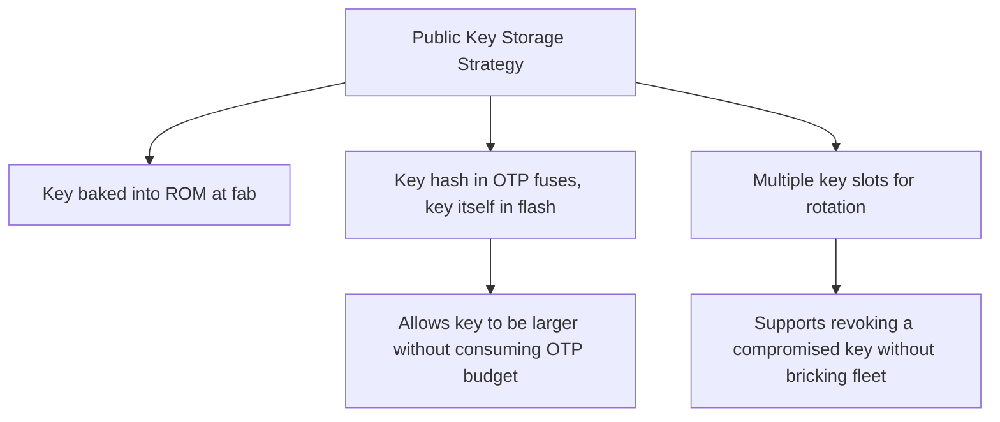
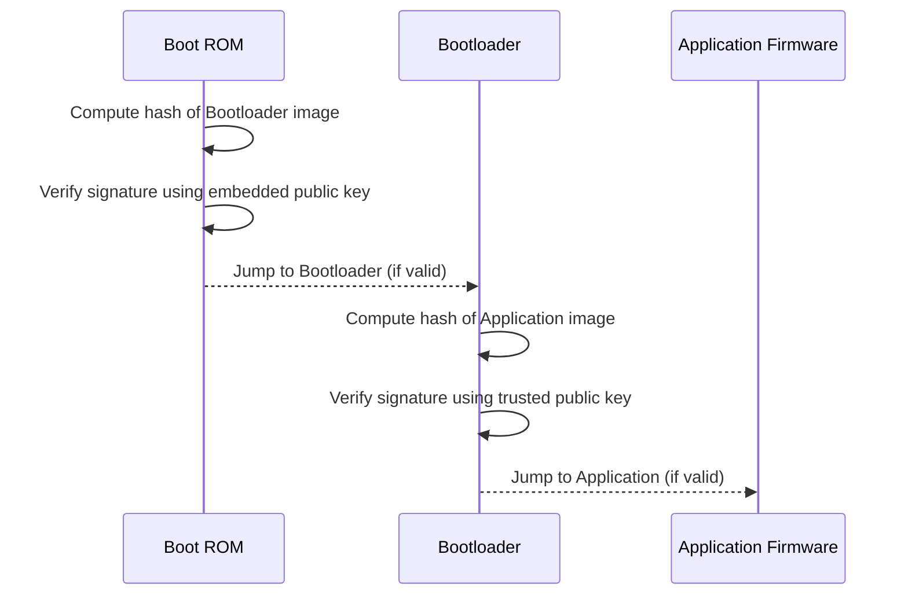

## Secure Boot Mechanisms

### Overview

Secure boot is the mechanism by which an embedded device verifies, at each stage of startup, that the code it is about to execute is authentic and unmodified before handing control to it. It establishes a **chain of trust** rooted in hardware, extending through the bootloader and into the application firmware, so that unauthorized or tampered code cannot silently run on the device.

### Why Secure Boot Matters

**Key Points**
- Without secure boot, any code written to a device's flash — whether via a debug interface, a compromised update, or physical access — will execute unquestioned.
- Secure boot is the foundation that other security properties depend on: device identity, encrypted storage, and secure OTA updates are all meaningless if an attacker can simply replace the firmware that enforces them.
- It specifically defends against **persistent** compromise (malicious code surviving reboot/power cycle), as distinct from runtime protections (e.g., memory protection units) that guard against exploitation while code is already running.

### The Chain of Trust Concept

A chain of trust means each stage of the boot process cryptographically verifies the next stage before executing it, starting from an immutable anchor.

- **Root of Trust (RoT)**: The first thing that executes and cannot itself be modified — typically stored in immutable on-chip ROM (mask ROM) or one-time-programmable (OTP) fuses, so it doesn't need to trust anything before it.
- Each subsequent stage is only executed if its cryptographic signature is verified by the stage before it.
- If verification fails at any stage, the device should refuse to boot the unverified code — the specific fallback behavior (halt, retry, fall back to a recovery image) is a design decision with real security and availability tradeoffs.

### Boot Stages in a Typical Embedded System

| Stage | Location | Mutability | Role |
|---|---|---|---|
| ROM bootloader (Boot ROM) | On-chip mask ROM | Immutable (fixed at chip fabrication) | Root of trust; verifies Stage 1 |
| Stage 1 bootloader (e.g., primary bootloader) | On-chip flash or OTP | Rarely updated, sometimes immutable | Verifies Stage 2 / application, may handle recovery |
| Stage 2 bootloader (optional, e.g., U-Boot-class) | External/internal flash | Updatable (itself signed) | Hardware init, verifies and loads application |
| Application firmware | Flash | Updatable via OTA | The actual product functionality |

[Unverified] The exact number and naming of these stages varies significantly by vendor and SoC family — some microcontrollers collapse this into two stages, while some application processors have three or more — so implementers should consult their specific chip's boot architecture documentation rather than assuming a universal stage count.

### Cryptographic Building Blocks

#### Digital Signatures

- Firmware images are signed with a private key (held by the manufacturer, ideally in an HSM) during the build/release process.
- The device holds only the corresponding **public key**, embedded immutably (in ROM/OTP/fuses) or in a hash of the public key (allowing the actual key to be stored in updatable memory, verified against the immutable hash).
- Common schemes: RSA (e.g., RSA-2048/3072), ECDSA (e.g., P-256), and increasingly EdDSA (Ed25519) for its resistance to certain implementation pitfalls and smaller signature size.

#### Hash Functions

- Used to compute a fixed-size digest of the firmware image, which is what actually gets signed (signing the whole image directly would be computationally impractical for large images).
- Common choices: SHA-256, SHA-384, SHA-3 family.

#### Public Key Storage Options

### Secure Boot Verification Flow

### Anti-Rollback / Version Protection

- Secure boot alone verifies *authenticity*, not *currency* — without additional protection, an attacker could reflash an older, legitimately-signed firmware image that contains a since-patched vulnerability.
- **Monotonic counters**: A hardware or securely-stored counter that only increases; each firmware version embeds a minimum required counter value, and the bootloader refuses to run images below the current counter threshold.
- This is a real tradeoff: overly aggressive rollback protection can **brick** a device if a bad update is pushed and there's no way back to a known-good older version, so many designs allow rollback within a bounded, deliberately-permitted window (e.g., specific designated recovery images) rather than an absolute one-way ratchet.

### Secure Boot vs. Measured Boot

- **Secure boot**: Verifies signatures and *refuses to execute* code that fails verification — an enforcing model.
- **Measured boot**: *Records* (measures/hashes) each stage into a protected log (e.g., a TPM's Platform Configuration Registers) without necessarily blocking execution, allowing a remote party to later attest to what actually ran — a reporting model.
- The two are complementary and often used together: secure boot prevents known-bad code from running at all, while measured boot/remote attestation allows a backend to verify what state a device is *actually* in, useful for detecting more subtle tampering or unexpected configurations.

### Hardware Roots of Trust

- **On-chip Boot ROM**: Fixed at silicon fabrication, cannot be altered post-manufacture — the strongest immutability guarantee, but also means any bug in it is permanent for that chip revision.
- **OTP (One-Time Programmable) fuses**: Can be written once (per bit/region) during manufacturing or provisioning, commonly used to store public key hashes, lifecycle state, and debug-disable flags.
- **Secure enclaves / Trusted Execution Environments (TEEs)**: Isolated execution environments (e.g., Arm TrustZone) that can host boot verification logic separately from the main application processor's normal execution environment, reducing the impact of application-level vulnerabilities on the boot verification process itself.
- **Discrete secure elements**: Can participate in boot verification by holding keys or performing signature checks on behalf of a simpler host MCU that lacks its own strong hardware root of trust.

### Vendor/Platform-Specific Implementations

**Example** (illustrative, not exhaustive — implementation details are vendor- and version-specific):
- **Arm TrustZone / Platform Security Architecture (PSA)**: Defines a secure boot and trusted firmware model for Cortex-M and Cortex-A devices, with reference implementations like Trusted Firmware-M (TF-M).
- **ESP-IDF Secure Boot** (Espressif ESP32 family): Uses RSA or ECDSA signature verification with keys burned into eFuses.
- **STM32 Secure Boot / TrustZone** (STMicroelectronics): Varies by family; newer STM32 parts with Cortex-M33 support Arm TrustZone-based secure boot flows.
- **NXP i.MX High Assurance Boot (HAB)**: A widely deployed secure boot implementation on NXP application processors.

[Unverified] Exact configuration steps, fuse-programming procedures, and key management tooling differ meaningfully between these platforms and across silicon revisions, so vendor-current documentation should be the authoritative reference during implementation rather than general descriptions.

### Common Pitfalls

- **Leaving debug interfaces enabled alongside secure boot**: Secure boot verifies the boot chain, but a live JTAG/SWD port can allow an attacker to halt the CPU after verification and before/during execution, or to dump memory directly — debug interface lockdown is a necessary companion control, not optional.
- **No anti-rollback protection**: Allowing reflashing of any previously-signed image, including ones with known vulnerabilities.
- **Single point of key compromise**: Using one signing key with no rotation or revocation mechanism — if that key leaks, every device that trusts it is compromised with no remediation path short of a hardware-level fix (often infeasible for deployed units).
- **Weak boot ROM implementation**: Bugs in the immutable first-stage boot ROM cannot be patched post-fabrication; insufficient security review of this specific stage has historically been a source of severe, unfixable vulnerabilities in some commercial chips.
- **Verification without integrity of the verification path itself**: E.g., storing the "verification passed" result in a way that can be tampered with independently of the actual signature check (a logic flaw rather than a cryptographic one).
- **Fail-open behavior**: A boot process that, on encountering an error during verification, defaults to running the code anyway rather than halting or entering a safe recovery mode — an availability-over-security choice that undermines the entire mechanism.
- **Treating secure boot as sufficient on its own**: Secure boot addresses persistent code tampering but does not by itself prevent runtime exploitation, side-channel key extraction, or insecure application-layer logic — it is one layer within a broader threat model (see threat modeling for embedded devices).

### Secure Boot Chain of Trust (SVG)

<svg xmlns="http://www.w3.org/2000/svg" viewBox="0 0 760 320">
  <text x="380" y="28" text-anchor="middle" font-size="18" font-weight="bold" fill="#1a1a1a">Secure Boot Chain of Trust (svg_diagram)</text>

  <rect x="30" y="80" width="160" height="90" rx="8" fill="#eafaf1" stroke="#1f9d55" stroke-width="1.5" />
  <text x="110" y="110" text-anchor="middle" font-size="12" font-weight="bold" fill="#1a1a1a">Boot ROM</text>
  <text x="110" y="128" text-anchor="middle" font-size="10" fill="#333">Immutable</text>
  <text x="110" y="144" text-anchor="middle" font-size="10" fill="#333">Root of Trust</text>

  <rect x="240" y="80" width="160" height="90" rx="8" fill="#e8f0fe" stroke="#3b6fd6" stroke-width="1.5" />
  <text x="320" y="110" text-anchor="middle" font-size="12" font-weight="bold" fill="#1a1a1a">Bootloader</text>
  <text x="320" y="128" text-anchor="middle" font-size="10" fill="#333">Signature verified</text>
  <text x="320" y="144" text-anchor="middle" font-size="10" fill="#333">by Boot ROM</text>

  <rect x="450" y="80" width="160" height="90" rx="8" fill="#fdf3e3" stroke="#d68b1a" stroke-width="1.5" />
  <text x="530" y="110" text-anchor="middle" font-size="12" font-weight="bold" fill="#1a1a1a">Application</text>
  <text x="530" y="128" text-anchor="middle" font-size="10" fill="#333">Signature verified</text>
  <text x="530" y="144" text-anchor="middle" font-size="10" fill="#333">by Bootloader</text>

  <rect x="620" y="80" width="120" height="90" rx="8" fill="#fbeaea" stroke="#c0392b" stroke-width="1.5" />
  <text x="680" y="110" text-anchor="middle" font-size="12" font-weight="bold" fill="#1a1a1a">Running</text>
  <text x="680" y="128" text-anchor="middle" font-size="10" fill="#333">Device</text>
  <text x="680" y="144" text-anchor="middle" font-size="10" fill="#333">State</text>

  <line x1="190" y1="125" x2="240" y2="125" stroke="#555" stroke-width="1.5" marker-end="url(#arrow6)" />
  <line x1="400" y1="125" x2="450" y2="125" stroke="#555" stroke-width="1.5" marker-end="url(#arrow6)" />
  <line x1="610" y1="125" x2="620" y2="125" stroke="#555" stroke-width="1.5" marker-end="url(#arrow6)" />

  <text x="380" y="220" text-anchor="middle" font-size="11" fill="#777">Each arrow represents a cryptographic signature check;</text>
  <text x="380" y="238" text-anchor="middle" font-size="11" fill="#777">failure at any point should halt or divert to recovery, not proceed</text>

  </svg>

### Related Topics

- OTA update security and signed update packages
- Anti-rollback and monotonic counter design
- Trusted Execution Environments (TrustZone, secure enclaves) in depth
- Threat modeling for embedded devices (secure boot as one layer)
- Debug interface lockdown (JTAG/SWD fuse-disable) techniques
- Device provisioning and identity (key injection during manufacturing)
- Remote attestation and measured boot architectures