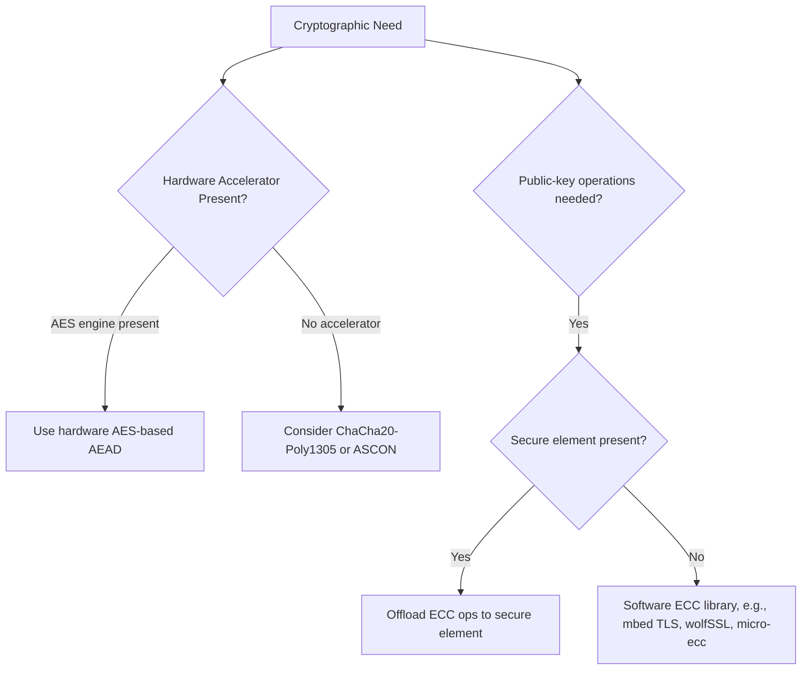

## Cryptographic Primitives for Constrained Devices

### Overview

Constrained devices — microcontrollers with limited RAM (KB range), flash (tens to hundreds of KB), and often battery power — cannot always run the same cryptographic algorithms used on servers or smartphones without significant performance, memory, or energy penalties. This has driven both careful selection among existing "full-size" primitives and the development of a dedicated field, **lightweight cryptography**, purpose-built for this hardware class.

### What "Constrained" Means for Cryptography

**Key Points**
- **RAM**: Many algorithms need working memory proportional to key size or block size; a few KB of total RAM budget makes some standard algorithm implementations impractical without careful engineering.
- **Flash/code size**: Implementation code size matters when total flash is measured in tens of KB and shared with the rest of the application.
- **Energy**: Every cryptographic operation costs battery life; this matters acutely for devices expected to run for years on a coin cell or energy harvesting.
- **Execution time**: Real-time or duty-cycled systems may have strict latency budgets that rule out slow implementations.
- **Absence of hardware acceleration**: Not all MCUs have a hardware AES engine or a true random number generator (TRNG); software fallbacks are slower and sometimes weaker.

### Symmetric-Key Cryptography

#### AES (Advanced Encryption Standard)

- The dominant symmetric block cipher, standardized (FIPS 197) with 128, 192, or 256-bit keys.
- Many modern MCUs include a **hardware AES accelerator**, making AES often the most practical choice on constrained devices *despite* not being designed as a "lightweight" algorithm — because hardware support outweighs a smaller cipher's theoretical efficiency advantage when no acceleration exists for the smaller cipher either.
- Common modes for constrained use:
  - **CCM (Counter with CBC-MAC)**: Combines confidentiality and authentication in one pass, widely used in IoT protocols (e.g., Zigbee, Thread, 802.15.4 security).
  - **GCM (Galois/Counter Mode)**: Also provides authenticated encryption; can be more efficient with hardware support for the Galois field multiplication, but implementations are more complex to get right (nonce reuse in GCM is a well-known catastrophic failure mode).
  - **ECB mode should not be used** for anything beyond single-block, non-repeating data, as it leaks patterns in the plaintext — this is a widely-documented weakness, not an implementation-specific quirk.

#### ChaCha20-Poly1305

- A stream cipher (ChaCha20) combined with a MAC (Poly1305) for authenticated encryption, standardized in RFC 8439.
- [Inference] Often preferred over AES on devices *without* hardware AES acceleration, since ChaCha20's operations (add-rotate-XOR) map efficiently onto general-purpose CPU instructions without needing dedicated hardware, whereas software-only AES implementations are comparatively slower and, if not written carefully, more prone to timing side-channel leakage.

#### Lightweight Block/Stream Ciphers

- **ASCON**: Selected by NIST in 2023 as the standard for lightweight cryptography, designed specifically for resource-constrained authenticated encryption and hashing.
- Other historically notable lightweight ciphers include PRESENT and SPECK, though [Unverified] their current standardization/adoption status varies and some have faced scrutiny or limited real-world deployment relative to AES and the NIST-selected ASCON family — current guidance should be checked before selecting one for new designs.

### Asymmetric-Key (Public-Key) Cryptography

#### RSA

- Historically dominant for digital signatures and key exchange, but computationally expensive — key generation and private-key operations at 2048+ bit key sizes are notably slow on microcontrollers without hardware acceleration.
- Generally considered a poor fit for constrained devices doing frequent public-key operations, though still seen where interoperability with existing RSA-based infrastructure is required.

#### Elliptic Curve Cryptography (ECC)

- Provides equivalent security to RSA at much smaller key sizes (e.g., a 256-bit ECC key is roughly comparable in strength to a 3072-bit RSA key), directly translating to smaller memory footprint and faster operations.
- **ECDSA**: Elliptic Curve Digital Signature Algorithm — widely used for embedded device identity certificates and firmware signing.
- **ECDH / ECDHE**: Elliptic Curve Diffie-Hellman (Ephemeral) — used for key exchange/agreement, forming the basis of TLS key negotiation.
- **Curve25519 / Ed25519**: A modern elliptic curve and associated signature scheme (EdDSA), increasingly favored for its resistance to several classes of implementation mistakes that have historically affected other curve choices, and for competitive performance on constrained hardware.
- Common curve choices: NIST P-256 (secp256r1), Curve25519 — [Unverified] the specific curve recommended or required varies by target standard/certification body and by protocol (e.g., TLS cipher suite negotiation), so implementers should confirm the applicable requirement rather than assuming universal interchangeability.

### Hash Functions

- **SHA-256 / SHA-384 / SHA-512**: Standard cryptographic hash functions, used for firmware integrity verification, HMAC construction, and as a building block in signature schemes.
- **SHA-3 (Keccak-based)**: A structurally different hash family standardized as an alternative to SHA-2, offering resistance to certain classes of attack that (hypothetically) might affect SHA-2's underlying construction, though SHA-2 itself remains widely trusted and deployed.
- **Lightweight hashing**: ASCON also includes a lightweight hashing mode (Ascon-Hash), relevant where SHA-2/3 implementation cost is a concern.

### Random Number Generation

**Key Points**
- Cryptographic operations (key generation, nonces, IVs) require a source of true randomness; using a weak or predictable random number generator undermines the security of an otherwise sound cryptographic scheme.
- **TRNG (True Random Number Generator)**: A hardware peripheral that samples physical entropy sources (thermal noise, oscillator jitter); increasingly common as a built-in MCU peripheral.
- **PRNG (Pseudo-Random Number Generator)**: Deterministic algorithm that expands a seed into a longer random-looking sequence — cryptographically secure PRNGs (CSPRNGs) are required for security purposes; a general-purpose PRNG (like those used for simulations) is not sufficient.
- Devices lacking a TRNG must seed a CSPRNG from some other entropy source (e.g., timing jitter, ADC noise on a floating pin) — a design area where mistakes are common and have historically led to predictable key generation.

### Authenticated Encryption with Associated Data (AEAD)

- A construction that provides both confidentiality (encryption) and integrity/authenticity (a MAC) in a single scheme, generally preferred over combining encryption and authentication as separate manual steps, since manual combination has historically been a common source of protocol-level vulnerabilities.
- Examples: AES-CCM, AES-GCM, ChaCha20-Poly1305, Ascon-AEAD128.

$$\text{AEAD}(K, N, P, A) \rightarrow (C, T)$$

Where $K$ = key, $N$ = nonce, $P$ = plaintext, $A$ = associated (authenticated but not encrypted) data, $C$ = ciphertext, $T$ = authentication tag.

### Hardware Support Landscape

- **Secure elements / crypto co-processors**: Offload key storage and cryptographic operations (especially expensive ECC/RSA operations) from the main MCU, also providing physical protection for private keys.
- **PSA Crypto API**: Arm's Platform Security Architecture defines a standardized crypto API abstraction, allowing application code to call cryptographic functions without depending directly on whether the underlying implementation is hardware-accelerated or software-only.

### Common Software Libraries

**Example**
- **mbed TLS**: Widely used, configurable (features can be compiled in/out to control code size), commonly paired with Arm Cortex-M devices.
- **wolfSSL / wolfCrypt**: Marketed specifically toward embedded/constrained targets, with a focus on small footprint.
- **micro-ecc**: A minimal library focused specifically on ECC operations for small devices.
- **TinyCrypt**: A compact cryptographic library originally from Intel, focused on a minimal feature set for constrained environments.

[Unverified] Specific benchmark numbers (code size, cycles per operation) for these libraries vary by MCU architecture, compiler, optimization flags, and library version, so head-to-head comparisons should be validated on the actual target hardware rather than assumed from general reputation.

### Performance and Footprint Tradeoffs

| Primitive | Relative Code Size | Relative Speed (no HW accel) | Typical Use |
|---|---|---|---|
| AES-128 (software) | Small–Medium | Moderate | Symmetric encryption, widely supported |
| ChaCha20-Poly1305 | Small | Fast on general-purpose cores | AEAD without hardware AES |
| ECC (P-256/Curve25519) | Medium | Slow relative to symmetric ops | Signatures, key exchange |
| RSA-2048 | Large | Very slow (esp. private-key ops) | Legacy interoperability |
| SHA-256 | Small | Fast | Hashing, integrity, HMAC |
| ASCON family | Small (designed for this) | Fast, designed for constrained cores | AEAD and hashing on very constrained MCUs |

[Inference] These are general tendencies rather than fixed values, since actual performance depends heavily on the specific MCU core, compiler, and whether any hardware acceleration is present — the table should be read as directional guidance for initial primitive selection, not as a benchmark.

### Common Pitfalls

- **Rolling your own cryptography**: Implementing a custom cipher or protocol instead of using a standardized, peer-reviewed primitive — a well-documented source of avoidable vulnerabilities, even for skilled engineers.
- **Nonce/IV reuse**: Reusing a nonce with the same key in stream ciphers or AEAD modes like GCM can catastrophically break confidentiality and/or authenticity; constrained devices with weak randomness sources are particularly susceptible to this if not carefully designed.
- **Insufficient entropy at boot**: Generating keys or nonces immediately at boot before a TRNG or entropy pool has gathered sufficient randomness, especially on devices without a dedicated hardware TRNG.
- **Non-constant-time implementations**: Software crypto code whose execution time depends on secret data (key bits, etc.) can leak information via timing side channels, particularly relevant for software-only implementations without hardware side-channel protections.
- **Using ECB mode or otherwise misusing a correct primitive**: Choosing a correct algorithm but an inappropriate mode of operation for the actual data pattern being protected.
- **Ignoring key storage**: A cryptographically sound algorithm is undermined if the key itself is stored in easily-extractable flash rather than a secure element or protected memory region (see device provisioning and identity, secure boot mechanisms).
- **Assuming software crypto library defaults are optimal for the target**: Default configurations are often tuned for general compatibility rather than a specific MCU's constraints; footprint and performance frequently require explicit tuning/compilation flag review.

### Crypto Primitive Selection Flow (SVG)

<svg xmlns="http://www.w3.org/2000/svg" viewBox="0 0 760 340">
  <text x="380" y="28" text-anchor="middle" font-size="18" font-weight="bold" fill="#1a1a1a">Crypto Primitive Selection Flow (svg_diagram)</text>

  <rect x="300" y="55" width="160" height="55" rx="8" fill="#e8f0fe" stroke="#3b6fd6" stroke-width="1.5" />
  <text x="380" y="87" text-anchor="middle" font-size="12" font-weight="bold" fill="#1a1a1a">Security Need</text>

  <rect x="80" y="150" width="180" height="70" rx="8" fill="#eafaf1" stroke="#1f9d55" stroke-width="1.5" />
  <text x="170" y="178" text-anchor="middle" font-size="12" font-weight="bold" fill="#1a1a1a">Confidentiality/</text>
  <text x="170" y="195" text-anchor="middle" font-size="12" font-weight="bold" fill="#1a1a1a">Integrity</text>
  <text x="170" y="212" text-anchor="middle" font-size="10" fill="#333">AES-CCM/GCM, ChaCha20-Poly1305, ASCON</text>

  <rect x="300" y="150" width="180" height="70" rx="8" fill="#fdf3e3" stroke="#d68b1a" stroke-width="1.5" />
  <text x="390" y="178" text-anchor="middle" font-size="12" font-weight="bold" fill="#1a1a1a">Identity/</text>
  <text x="390" y="195" text-anchor="middle" font-size="12" font-weight="bold" fill="#1a1a1a">Signatures</text>
  <text x="390" y="212" text-anchor="middle" font-size="10" fill="#333">ECDSA, EdDSA (Ed25519)</text>

  <rect x="520" y="150" width="180" height="70" rx="8" fill="#fbeaea" stroke="#c0392b" stroke-width="1.5" />
  <text x="610" y="178" text-anchor="middle" font-size="12" font-weight="bold" fill="#1a1a1a">Key Exchange</text>
  <text x="610" y="195" text-anchor="middle" font-size="10" fill="#333">ECDH/ECDHE</text>
  <text x="610" y="212" text-anchor="middle" font-size="10" fill="#333">(Curve25519, P-256)</text>

  <line x1="330" y1="110" x2="200" y2="150" stroke="#555" stroke-width="1.5" marker-end="url(#arrow7)" />
  <line x1="380" y1="110" x2="390" y2="150" stroke="#555" stroke-width="1.5" marker-end="url(#arrow7)" />
  <line x1="430" y1="110" x2="580" y2="150" stroke="#555" stroke-width="1.5" marker-end="url(#arrow7)" />

  <text x="380" y="270" text-anchor="middle" font-size="11" fill="#777">Hash functions (SHA-256/SHA-3/Ascon-Hash) and a validated</text>
  <text x="380" y="288" text-anchor="middle" font-size="11" fill="#777">RNG source underpin all three branches</text>

  </svg>

### Related Topics

- Secure boot mechanisms (signature verification using ECDSA/EdDSA)
- Device provisioning and identity (X.509 certificates, key generation)
- TLS/DTLS protocol stacks for constrained transport security
- Secure elements and hardware security modules (HSMs)
- Side-channel resistant implementation techniques (constant-time crypto)
- NIST lightweight cryptography standardization (ASCON) in depth
- Random number generation and entropy source design on MCUs