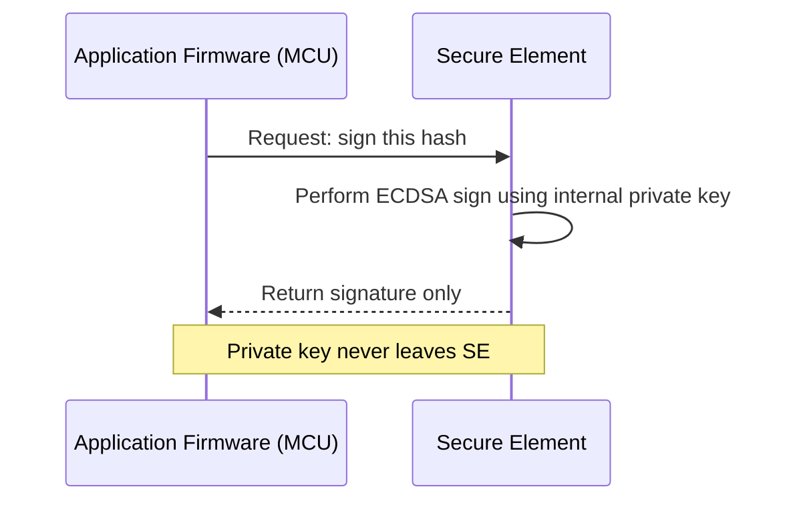
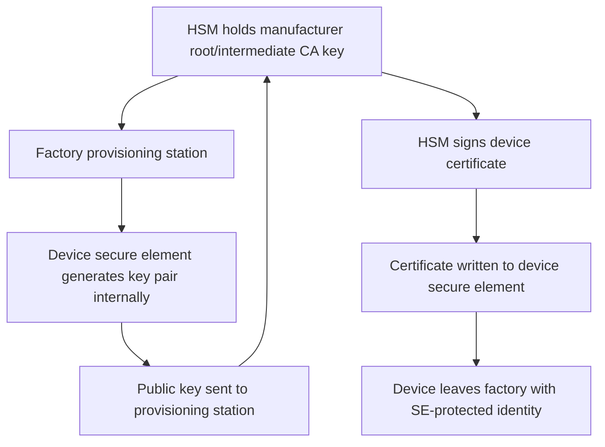

## Hardware Security Modules and Secure Elements

### Overview

Hardware security modules (HSMs) and secure elements (SEs) are dedicated hardware components designed to generate, store, and use cryptographic keys such that the keys never appear in plaintext outside the protected hardware boundary. They serve related but distinct roles in an embedded system's security architecture: HSMs are typically used on the backend/manufacturing side to manage keys at scale, while secure elements are integrated into the device itself to protect keys throughout the product's field life.

### HSM vs. Secure Element: Core Distinction

**Key Points**
- **HSM (Hardware Security Module)**: A dedicated, often rack-mounted or PCIe-card device used in data centers, factories, or certificate authorities to perform key generation, signing, and encryption operations at scale, with strong physical and logical tamper protection.
- **Secure Element (SE)**: A small, low-power chip (or a hardware-isolated region within a larger SoC) embedded directly into the end product, protecting a much smaller set of keys used by that specific device.
- Both share the same underlying principle — a hardware boundary that prevents key extraction even if the surrounding system (server OS, device firmware) is compromised — but differ enormously in scale, cost, and deployment context.

### Hardware Security Modules (HSMs)

#### Role in the Embedded Product Lifecycle

- **Certificate authority root/intermediate key protection**: The private key used to sign device certificates during manufacturing is one of the highest-value secrets in an IoT product's security architecture — if it leaks, an attacker can mint certificates that impersonate any device. HSMs are the standard way to protect this key.
- **Code signing**: Firmware signing keys used to authorize what code a device's secure boot process will accept are commonly held in an HSM rather than on a developer's workstation or a build server's filesystem.
- **Bulk key injection support**: During factory provisioning, an HSM can generate or sign large volumes of per-device keys/certificates without the root signing key ever leaving the module.

#### HSM Characteristics

- **Tamper resistance and detection**: Many HSMs are designed to detect physical tampering (drilling, temperature/voltage manipulation) and respond by zeroizing (erasing) stored key material.
- **Certification standards**: HSMs are commonly evaluated against standards such as FIPS 140-2/140-3 (US) or Common Criteria, which define levels of physical and logical security assurance. [Unverified] The specific certification level required varies by industry, regulatory context, and the sensitivity of what's being protected, so requirements should be confirmed against applicable compliance obligations rather than assumed.
- **Access control**: Operations (e.g., "sign this firmware image") are typically gated by multi-person authorization schemes (e.g., requiring multiple authorized operators, sometimes called an M-of-N quorum) rather than a single credential, reducing the risk of a single compromised or malicious insider.
- **Deployment forms**: Physical on-premise appliances, PCIe cards, network-attached HSM appliances, and increasingly cloud HSM services (offered by major cloud providers as a managed service).

### Secure Elements (On-Device)

#### What a Secure Element Provides

- **Non-exportable private key storage**: Keys generated inside the SE (or securely injected during manufacturing) never leave the chip in plaintext form; cryptographic operations (signing, key agreement) are performed *inside* the SE, with only the result (e.g., a signature) exposed to the host MCU.
- **Physical tamper resistance**: Secure elements are typically designed and tested against physical attacks including side-channel analysis (power/EM), fault injection (glitching), and microprobing — a level of hardening not present in a general-purpose MCU's flash memory.
- **Secure key generation**: Often includes an on-chip TRNG specifically to support high-quality key generation without depending on the host MCU's entropy source.
- **Counter/monotonic storage**: Some SEs provide hardware monotonic counters useful for anti-rollback protection (see secure boot mechanisms).

#### Common Secure Element Categories

| Category | Description | Example Use |
|---|---|---|
| Discrete crypto authentication chip | Small, low-cost, single-purpose IC focused on key storage and basic crypto ops | Device identity, authentication tokens (e.g., ATECC-family devices) |
| SIM/eSIM-derived secure element | Secure element lineage from mobile SIM technology | Cellular IoT device identity, sometimes reused for general application keys |
| Embedded Secure Element (eSE) | Integrated into a larger SoC package rather than a discrete chip | Payment-capable devices, smartphones |
| TrustZone / TEE (software-hardware hybrid) | Hardware-isolated execution environment within the main application processor, not a fully separate chip | Devices where a discrete SE is cost/space-prohibitive but some isolation is still needed |

[Inference] A discrete secure element generally provides stronger physical isolation than a TrustZone-style TEE, because the TEE shares the same silicon and power/clock domains as the "normal world" execution environment, whereas a discrete chip has an independent physical boundary — though the practical security difference depends heavily on the specific TEE implementation and threat model in question.

### Integration Architecture

- Communication between the host MCU and a discrete secure element is typically over I2C or SPI, meaning the *bus itself* becomes a point worth considering in the threat model (see threat modeling for embedded devices) — though the private key material itself is not exposed on the bus, only operation requests and results are.
- **Configuration/personalization**: Secure elements often ship with a configurable set of "slots" for keys, certificates, and counters, which must be configured (and sometimes permanently locked) during manufacturing provisioning — an irreversible step in many devices, making the provisioning process itself security-critical.

### Key Use Cases in Embedded Products

**Example**
1. **Device identity for cloud authentication**: SE holds the device's private key; TLS/mTLS handshake signing operations are delegated to the SE so the key backing the device's cloud identity is never exposed to firmware memory (see device provisioning and identity).
2. **Firmware/OTA update verification**: SE can hold the public key(s) used to verify signed firmware updates, and in some architectures can itself perform the verification, keeping the trust anchor outside the potentially-vulnerable main application code.
3. **Anti-counterfeiting / authentication of consumables**: A pattern used in printers, medical devices, and similar products where a secure element in a consumable (e.g., a cartridge) proves its authenticity to the host device via a challenge-response protocol.
4. **Secure data-at-rest encryption**: SE-protected keys can encrypt sensitive data stored in external flash, so that removing and reading the flash chip directly does not expose the plaintext.

### HSM-to-Device Key Provisioning Flow

### Selection Considerations

**Key Points**
- **Cost**: Discrete secure elements add bill-of-materials (BOM) cost per unit; for extremely cost-sensitive, high-volume products, this can be a significant factor weighed against the security benefit.
- **Board space and power**: An additional discrete chip requires board area and draws additional (typically modest) power — relevant for size- or power-constrained designs.
- **Communication overhead**: Offloading crypto operations to an external SE over I2C/SPI introduces latency compared to an in-MCU software implementation, generally negligible for infrequent operations like TLS handshakes but potentially relevant for high-frequency signing use cases.
- **Certification requirements**: Some industries (payment, automotive, government) have specific certification requirements (e.g., EMVCo for payment, Common Criteria for certain government use) that effectively mandate secure element use and specific certification levels.
- **Vendor lock-in and supply chain**: Committing to a specific secure element part number ties the product to that vendor's availability, lifecycle, and any associated provisioning infrastructure — a supply chain consideration alongside the purely technical one.

### Common Pitfalls

- **Treating "has a secure element" as sufficient**: A secure element protects the keys it holds, but if application logic doesn't actually route sensitive operations *through* the SE (e.g., a developer implements a software fallback "for convenience" that bypasses it), the protection is illusory.
- **Misconfigured slot locking**: Failing to properly lock configuration slots during manufacturing can leave key slots writable/readable in ways that undermine the SE's protection after deployment.
- **Ignoring the host-SE communication channel**: Assuming that because keys don't leave the SE, the system is fully protected — an attacker who can manipulate the I2C/SPI bus (e.g., replay a "signature valid" response, or manipulate what data is sent for signing) may still find exploitable gaps if the host-side protocol isn't carefully designed.
- **HSM operational key exposure via weak access control**: Focusing entirely on the HSM's hardware tamper resistance while neglecting operational access control (e.g., overly broad API credentials, insufficient multi-person authorization) — the hardware boundary doesn't help if legitimate-looking API calls can extract signing capability at will.
- **No key backup/recovery strategy for HSM-held root keys**: Losing access to an HSM-protected root key (e.g., due to a disaster without proper backup/escrow procedures) can be catastrophic for a product line's ability to issue new certificates or firmware signatures — HSM vendors typically provide secure backup mechanisms, but they must be deliberately configured and tested, not assumed.
- **Assuming SE integration is "set and forget"**: Firmware updates over a product's life must continue to correctly interface with the SE; a refactor that accidentally reintroduces a software-only crypto path is a realistic regression risk without specific test coverage for this property.

### HSM and Secure Element Roles (SVG)

<svg xmlns="http://www.w3.org/2000/svg" viewBox="0 0 760 340">
  <text x="380" y="28" text-anchor="middle" font-size="18" font-weight="bold" fill="#1a1a1a">HSM and Secure Element Roles (svg_diagram)</text>

  <rect x="60" y="70" width="280" height="130" rx="10" fill="#e8f0fe" stroke="#3b6fd6" stroke-width="1.5" />
  <text x="200" y="98" text-anchor="middle" font-size="14" font-weight="bold" fill="#1a1a1a">HSM (Backend/Factory)</text>
  <text x="200" y="122" text-anchor="middle" font-size="11" fill="#333">Protects root/intermediate CA key</text>
  <text x="200" y="142" text-anchor="middle" font-size="11" fill="#333">Signs device certificates</text>
  <text x="200" y="162" text-anchor="middle" font-size="11" fill="#333">Protects firmware signing key</text>
  <text x="200" y="182" text-anchor="middle" font-size="11" fill="#333">FIPS 140-2/3, Common Criteria</text>

  <rect x="420" y="70" width="280" height="130" rx="10" fill="#eafaf1" stroke="#1f9d55" stroke-width="1.5" />
  <text x="560" y="98" text-anchor="middle" font-size="14" font-weight="bold" fill="#1a1a1a">Secure Element (Device)</text>
  <text x="560" y="122" text-anchor="middle" font-size="11" fill="#333">Protects device identity key</text>
  <text x="560" y="142" text-anchor="middle" font-size="11" fill="#333">Performs signing for TLS/mTLS</text>
  <text x="560" y="162" text-anchor="middle" font-size="11" fill="#333">Verifies firmware update signatures</text>
  <text x="560" y="182" text-anchor="middle" font-size="11" fill="#333">On-chip TRNG, tamper resistance</text>

  <line x1="340" y1="135" x2="420" y2="135" stroke="#555" stroke-width="1.5" marker-end="url(#arrow8)" />
  <text x="380" y="125" text-anchor="middle" font-size="10" fill="#777">provisions</text>

  <text x="380" y="250" text-anchor="middle" font-size="11" fill="#777">Different scale, same principle: keys never leave the hardware boundary</text>

  </svg>

### Related Topics

- Device provisioning and identity (SE's role in the provisioning flow)
- Secure boot mechanisms (SE-assisted signature verification)
- Cryptographic primitives for constrained devices (algorithms an SE typically accelerates)
- Threat modeling for embedded devices (bus-level and physical attack considerations)
- FIPS 140-2/140-3 and Common Criteria certification processes
- Key lifecycle management: generation, rotation, revocation, and backup/escrow