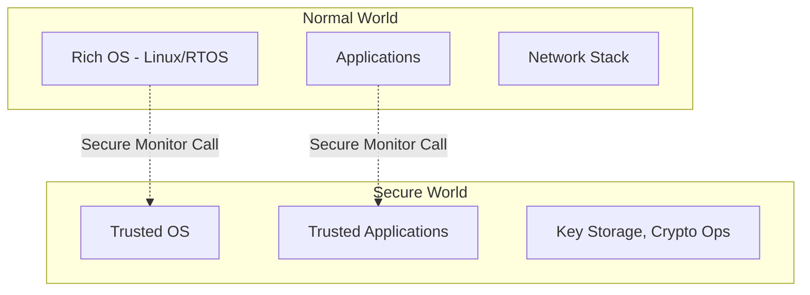
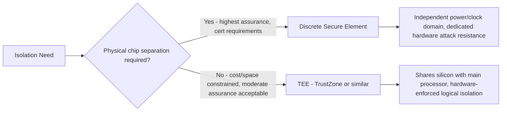
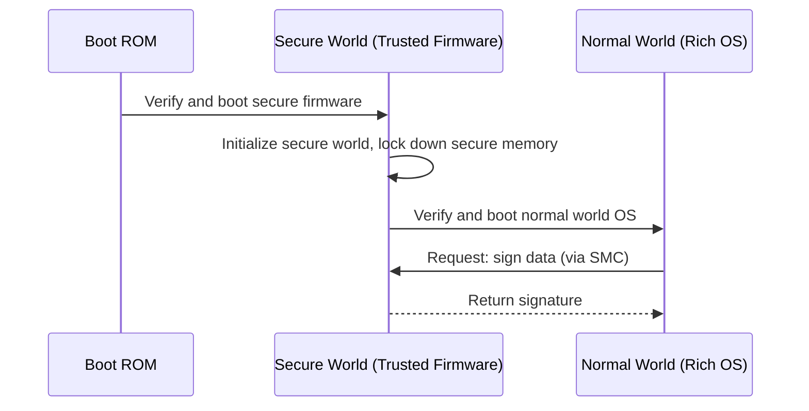

## Trusted Execution Environments

### Overview

A Trusted Execution Environment (TEE) is an isolated execution area within a device's main processor that runs code and handles data with stronger confidentiality and integrity guarantees than the "normal" operating environment, even if that normal environment (the OS, application code) is compromised. Unlike a discrete secure element, a TEE typically shares the same physical chip as the main application processor but uses hardware-enforced isolation to create a security boundary between a "secure world" and a "normal world."

### Core Concept: Two Worlds

**Key Points**
- **Normal World (Rich Execution Environment, REE)**: Runs the main OS (Linux, an RTOS, or bare-metal application code), general application logic, and anything not specifically security-critical.
- **Secure World (Trusted Execution Environment)**: Runs a minimal, carefully audited trusted OS and specific trusted applications, with hardware-enforced isolation preventing the normal world from directly accessing secure world memory, even with full OS-level (kernel) compromise in the normal world.
- The isolation is enforced by hardware — memory controllers, bus fabric, and interrupt controllers are configured to respect the world boundary — not merely by software convention, which is what distinguishes a TEE from, say, a privileged OS process.

### Arm TrustZone

- The most widely deployed TEE technology in embedded and mobile devices, available in two forms: **TrustZone for Cortex-A** (application processors, typically running Linux/Android in the normal world) and **TrustZone for Cortex-M** (microcontrollers, aimed at more resource-constrained embedded targets).
- Switching between worlds happens through a **Secure Monitor Call (SMC)** on Cortex-A, or through architected entry/exit mechanisms on Cortex-M, both mediated by hardware rather than a normal function call — the CPU itself changes security state.
- Memory and peripherals can be partitioned as secure or non-secure at the hardware level (via a component like the TrustZone Address Space Controller, or similarly named partitioning logic depending on the specific SoC), meaning a peripheral or memory region can be made physically inaccessible from the normal world.

#### TrustZone for Cortex-M vs. Cortex-A

| Aspect | Cortex-A TrustZone | Cortex-M TrustZone |
|---|---|---|
| Typical target | Application processors (smartphones, gateways, richer embedded Linux devices) | Microcontrollers (sensor nodes, simpler embedded products) |
| Secure world OS | Full trusted OS (e.g., OP-TEE) | Lightweight, often a minimal secure firmware image |
| Isolation granularity | Coarser, memory-region based | Finer-grained, can secure individual peripherals/interrupts |
| Typical use case | DRM, payment, biometric processing, key management alongside a rich OS | Secure boot, key storage, crypto operations on constrained devices |

### Trusted OS Implementations

**Example**
- **OP-TEE (Open Portable TEE)**: An open-source trusted OS widely used with Arm TrustZone on Cortex-A, maintained under the Linaro/Trusted Firmware ecosystem.
- **Trusted Firmware-A (TF-A)** and **Trusted Firmware-M (TF-M)**: Arm reference implementations providing secure world firmware for Cortex-A and Cortex-M respectively, often used as a foundation that silicon vendors and product teams build upon rather than a complete end-user trusted OS by itself.
- [Unverified] Vendor-specific trusted OS implementations also exist (built on or alongside these reference implementations), and their exact feature sets and certification status vary by silicon vendor and product line — current vendor documentation should be the authoritative source.

### What Runs in the Secure World

- **Key management and cryptographic operations**: Similar functions to a secure element, but implemented in software/firmware within the isolated secure world rather than on a physically separate chip.
- **Secure boot verification logic**: Some architectures place the signature-verification code itself in the secure world, so that even if the normal world's bootloader logic is compromised, the actual trust decision is made in isolated code.
- **Biometric data processing**: Common in mobile/consumer devices — fingerprint or facial recognition matching often happens within a TEE so raw biometric data and match results aren't exposed to the potentially-compromised normal world OS.
- **DRM (Digital Rights Management)**: Protecting decryption keys for premium content, historically one of the primary drivers of TEE adoption in consumer electronics.
- **Payment/transaction processing**: Sensitive transaction data and cryptographic operations for payment applications.
- **Attestation**: Generating cryptographic proof of the device's software/hardware state for a remote party to verify (see also measured boot, discussed under secure boot mechanisms).

### TEE vs. Secure Element: Comparison

[Inference] A TEE generally offers weaker resistance to sophisticated physical attacks (power analysis, fault injection, decapping) than a purpose-built secure element, because it shares the same die, power delivery, and clock infrastructure as the normal world processor, which was not necessarily designed with the same physical hardening priorities as a dedicated security chip — though specific TEE implementations vary in how much additional physical hardening they include, and high-assurance TEE designs do exist.

### Secure Boot and TEE Integration

- On systems using both, the boot chain often establishes the secure world *before* the normal world OS boots, so the secure world's trusted firmware can act as part of the root of trust described under secure boot mechanisms.
- The secure world persists alongside the normal world during runtime (not just at boot), allowing ongoing protected operations (e.g., "sign this data") to be requested by the normal world throughout the device's operation, not just verified once at startup.

### Peripheral and Interrupt Security

- Beyond just memory, a hardware TEE architecture can extend isolation to specific peripherals (e.g., making a fingerprint sensor's data bus accessible only from the secure world) and interrupts (ensuring a secure-world-owned interrupt cannot be redirected or masked by normal-world code).
- This peripheral-level partitioning is particularly relevant on Cortex-M TrustZone implementations aimed at embedded products, where the goal is often protecting a specific sensor or communication interface's data path end-to-end, not just abstract "keys in memory."

### Attestation

- A TEE can support **remote attestation**: generating a signed report of the device's software state (hashes of what's running, secure world integrity status) that a backend server can verify before trusting the device with sensitive operations or data.
- This complements the local, enforcing behavior of secure boot with a reporting mechanism a remote party can independently check, which is useful when the backend needs assurance beyond "the device booted" — e.g., confirming specific firmware versions are running fleet-wide.

### Common Pitfalls

- **Treating the secure world as immune to all bugs**: A TEE reduces attack surface by isolating sensitive code, but the trusted OS and trusted applications running inside the secure world can still contain their own vulnerabilities — isolation limits *blast radius* from the normal world, it does not guarantee the secure world code itself is bug-free.
- **Overloading the secure world with unnecessary code**: Placing large amounts of general application logic in the secure world (rather than only truly sensitive operations) increases the trusted computing base and thus the attack surface of the very thing meant to be minimal and audited.
- **Insecure world-switching interfaces**: The API/protocol used to request secure world operations from the normal world is itself a potential attack surface (e.g., insufficient validation of parameters passed across the world boundary) — a flaw here can undermine the isolation the hardware otherwise provides.
- **Confusing "TrustZone-capable silicon" with "a configured, secure TEE"**: Having TrustZone-capable hardware does not automatically provide security; the secure world firmware, memory partitioning, and peripheral assignment must all be deliberately and correctly configured by the product team or platform vendor.
- **Assuming TEE-level assurance is equivalent to a certified secure element**: For use cases with specific regulatory or certification requirements (e.g., payment, some government applications), a TEE alone may not meet the required assurance level without additional certification of the specific implementation — this is a real distinction certification bodies draw, not merely a theoretical one.
- **Neglecting secure world updates**: Trusted firmware/OS running in the secure world still requires a secure update mechanism of its own; a static, never-updated secure world is a liability if a vulnerability is later discovered in it.

### TrustZone World Isolation (SVG)

<svg xmlns="http://www.w3.org/2000/svg" viewBox="0 0 760 320">
  <text x="380" y="28" text-anchor="middle" font-size="18" font-weight="bold" fill="#1a1a1a">TrustZone World Isolation (svg_diagram)</text>

  <rect x="40" y="60" width="330" height="220" rx="10" fill="#fdf3e3" stroke="#d68b1a" stroke-width="1.5" />
  <text x="205" y="88" text-anchor="middle" font-size="14" font-weight="bold" fill="#1a1a1a">Normal World</text>
  <rect x="65" y="105" width="280" height="45" rx="6" fill="#ffffff" stroke="#d68b1a" stroke-width="1" />
  <text x="205" y="132" text-anchor="middle" font-size="11" fill="#333">Rich OS (Linux / RTOS)</text>
  <rect x="65" y="160" width="280" height="45" rx="6" fill="#ffffff" stroke="#d68b1a" stroke-width="1" />
  <text x="205" y="187" text-anchor="middle" font-size="11" fill="#333">Applications, Network Stack</text>
  <rect x="65" y="215" width="280" height="45" rx="6" fill="#ffffff" stroke="#d68b1a" stroke-width="1" />
  <text x="205" y="242" text-anchor="middle" font-size="11" fill="#333">Device Drivers</text>

  <rect x="410" y="60" width="310" height="220" rx="10" fill="#eafaf1" stroke="#1f9d55" stroke-width="1.5" />
  <text x="565" y="88" text-anchor="middle" font-size="14" font-weight="bold" fill="#1a1a1a">Secure World</text>
  <rect x="435" y="105" width="260" height="45" rx="6" fill="#ffffff" stroke="#1f9d55" stroke-width="1" />
  <text x="565" y="132" text-anchor="middle" font-size="11" fill="#333">Trusted OS (e.g., OP-TEE)</text>
  <rect x="435" y="160" width="260" height="45" rx="6" fill="#ffffff" stroke="#1f9d55" stroke-width="1" />
  <text x="565" y="187" text-anchor="middle" font-size="11" fill="#333">Key Storage, Crypto Ops</text>
  <rect x="435" y="215" width="260" height="45" rx="6" fill="#ffffff" stroke="#1f9d55" stroke-width="1" />
  <text x="565" y="242" text-anchor="middle" font-size="11" fill="#333">Trusted Applications</text>

  <line x1="370" y1="170" x2="410" y2="170" stroke="#555" stroke-width="2" marker-end="url(#arrow9)" />
  <text x="390" y="160" text-anchor="middle" font-size="9" fill="#777">SMC</text>

  </svg>

### Related Topics

- Secure boot mechanisms (secure world as part of the boot chain)
- Hardware security modules and secure elements (TEE vs. discrete SE tradeoffs)
- Remote attestation and measured boot architectures
- Arm Platform Security Architecture (PSA) and Trusted Firmware-M/A implementation details
- Threat modeling for embedded devices (isolation as a mitigation layer)
- OP-TEE and trusted application development workflows