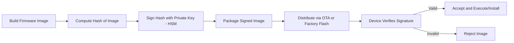
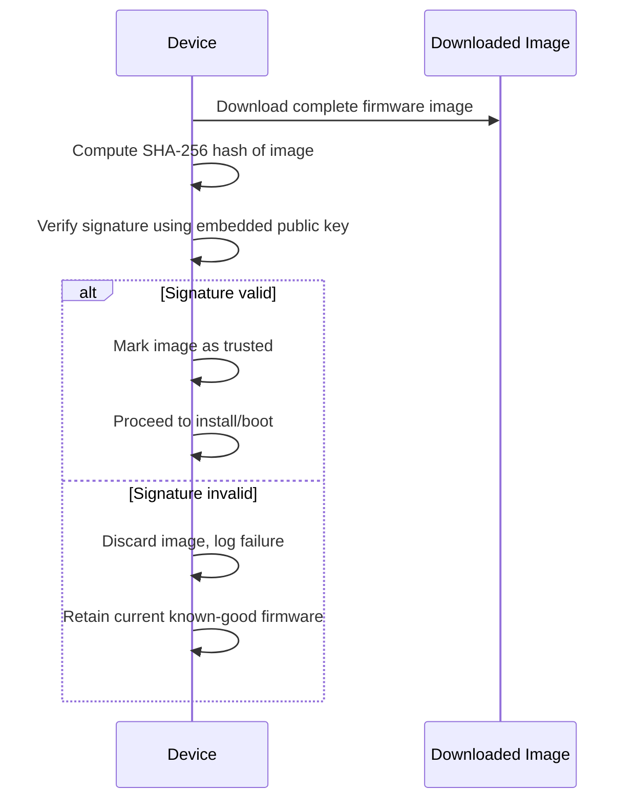
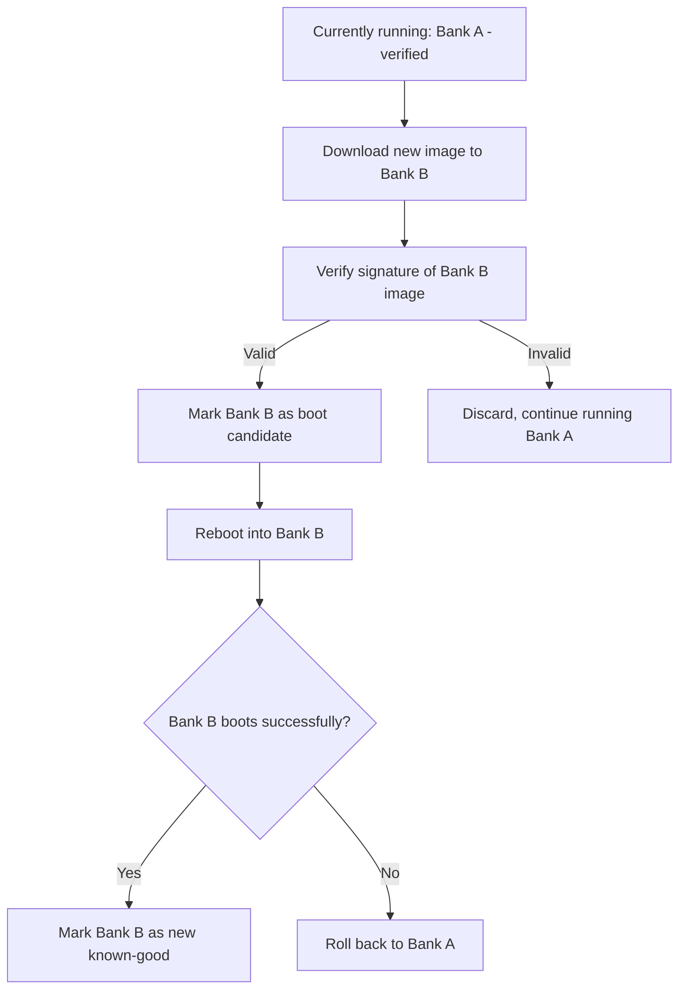

## Firmware Signing and Verification

### Overview

Firmware signing and verification is the process by which a firmware image is cryptographically signed by an authorized party (typically the manufacturer) at build/release time, and then verified by the device before the image is trusted and executed or installed. It is the specific mechanism that makes secure boot and secure OTA updates actually work — secure boot verifies what's *already* on the device at startup, while signing/verification more broadly also governs what's *allowed onto* the device in the first place, including during field updates.

### Where Signing Fits in the Firmware Lifecycle

### The Signing Process

**Key Points**
- A cryptographic hash (e.g., SHA-256) is computed over the firmware image, producing a fixed-size digest that uniquely represents the image's contents.
- That digest is signed using the manufacturer's private key — typically held in an HSM (see hardware security modules and secure elements) rather than on a developer machine or build server, to prevent the signing key itself from being extracted.
- The signature is packaged alongside (or embedded within) the firmware image, along with metadata such as version number, target hardware identifier, and sometimes a certificate chain if the signing key itself is validated by a higher authority.

### The Verification Process

- The device recomputes the hash of the received image and uses the corresponding **public key** (embedded in the device, typically in immutable or write-protected storage) to verify that the signature matches.
- Verification confirms two properties simultaneously: **authenticity** (the image was signed by the holder of the private key) and **integrity** (the image has not been altered since signing, since any modification changes the hash).
- Verification should occur *before* any part of the new image is trusted or executed — for OTA updates, this typically means verifying a fully-downloaded image before it's marked as the active/bootable image, not verifying incrementally as data streams in (which can create windows for partial-image tampering or corruption to slip through undetected).

### Signature Schemes in Practice

| Scheme | Key Size (typical) | Signature Size | Notes |
|---|---|---|---|
| RSA-2048/3072 with PKCS#1 or PSS padding | 2048–3072 bit | 256–384 bytes | Widely supported, larger signatures, slower verification on constrained devices |
| ECDSA (P-256) | 256 bit | ~64–72 bytes | Smaller signatures, faster verification, common in embedded contexts |
| EdDSA (Ed25519) | 256 bit | 64 bytes | Deterministic signatures (no per-signature randomness needed), resistant to certain implementation pitfalls affecting other schemes |

[Inference] ECDSA and EdDSA are generally preferred over RSA for firmware signing on constrained devices primarily because of their smaller signature size and faster verification with smaller keys, which matters both for flash footprint (the signature must be stored/transmitted alongside the image) and for boot-time verification latency — though RSA remains in use where interoperability with existing infrastructure outweighs this efficiency difference.

### Image Format and Metadata

**Example** typical fields included alongside a signed firmware image:
- Image hash (over the payload)
- Signature (over the hash, or sometimes over the whole header+payload depending on scheme)
- Version number (for anti-rollback comparison)
- Target hardware/product identifier (to prevent flashing firmware built for a different hardware revision)
- Signing key identifier (if multiple signing keys/certificates are in use, to select the correct public key for verification)
- Image size and possibly a magic number/format identifier for basic sanity checking before full verification

### Verification Failure Handling

**Key Points**
- **Reject and retain current firmware**: The most common and generally safest approach for OTA updates — if the new image fails verification, the device simply continues running its current, already-verified firmware rather than attempting to install something unverified.
- **Recovery/fallback image**: Some architectures maintain a separate, rarely-updated recovery image that can be booted if the primary application image repeatedly fails verification, providing a path back to a functional (if outdated) state rather than a fully bricked device.
- **Logging and reporting**: A verification failure is potentially a security-relevant event (a tampering attempt) as much as a corruption event; logging failures locally and, where connectivity allows, reporting them to a backend can help distinguish routine transmission corruption from a deliberate attack pattern across a fleet.
- [Inference] The specific fallback behavior chosen involves a real security-availability tradeoff: a strict "never boot unverified code, ever" policy maximizes security but risks bricking a device if, for example, the *only* stored image somehow becomes corrupted without a viable fallback, whereas a more permissive fallback improves availability at some cost to the strength of the security guarantee — the right balance depends on the product's specific risk profile and serviceability model.

### Dual-Bank / A-B Update Schemes

A common pattern for safe OTA updates that also interacts directly with signing/verification:

- Having two flash banks (A and B) allows the new, verified image to be tested by actually booting it, with an automatic rollback path to the previous known-good image if the new one fails to boot or fails a post-boot health check — a pattern that meaningfully reduces the risk of a bad update bricking a device, independent of the signature verification step itself.
- This requires roughly double the flash budget for firmware storage compared to a single-bank scheme, a real resource cost that must be weighed against the safety benefit, particularly on constrained microcontrollers.

### Key Management for Signing

- **Root key protection**: The top-level signing key (or the key that signs intermediate signing keys) is the highest-value asset in this entire chain — its compromise potentially allows an attacker to sign malicious firmware that every device in the fleet will accept as legitimate. HSM-based protection (see hardware security modules and secure elements) is standard practice for this reason.
- **Key rotation and multiple key slots**: Designing the device to trust more than one public key (or a key that can itself be updated via a separately-verified mechanism) allows a compromised or aging key to be retired without bricking the fleet, though the mechanism for *adding trust* in a new key must itself be carefully secured (it's effectively another privileged operation).
- **Separate signing keys per product line or hardware revision**: Limits the blast radius of a single key compromise to the specific product(s) that trust it, rather than an organization's entire device portfolio.

### Relationship to Anti-Rollback Protection

- Signature verification alone confirms an image is authentic and unmodified — it does not by itself prevent an attacker from re-flashing an older, validly-signed image that contains a known, since-patched vulnerability.
- Anti-rollback (via monotonic version counters, discussed under secure boot mechanisms) is a complementary mechanism, typically checked as part of the same verification step, comparing the image's declared version against a stored minimum-acceptable version before accepting an otherwise validly-signed image.

### Common Pitfalls

- **Verifying before download completes**: Beginning to execute, decompress, or otherwise trust partial image data before the full signature check has passed, creating a window where corrupted or malicious partial data could have an effect.
- **Weak or missing target/hardware binding**: An image signed correctly but intended for a different hardware revision or product variant being accepted, potentially causing malfunction or exposing hardware-specific vulnerabilities if pin configurations or peripheral assumptions differ.
- **Public key stored in mutable, unprotected memory**: If the public key used for verification can itself be overwritten by an attacker (e.g., stored in ordinary flash without write protection), the entire verification scheme can be bypassed by simply replacing the key alongside a malicious image.
- **Silent failure or fail-open behavior**: A verification routine that, due to a bug or an unhandled error path, proceeds to execute the image despite a failed or incomplete check — this has historically been a subtle but serious class of real-world vulnerability, often introduced through implementation error rather than a flawed algorithm choice.
- **No monitoring of failed verification attempts across the fleet**: Missing the opportunity to detect a coordinated tampering attempt or exploitation campaign that would show up as an unusual pattern of verification failures if aggregated and monitored centrally.
- **Assuming code signing alone secures the update mechanism**: The transport and delivery mechanism (how the image gets to the device) still matters — signing protects against a *tampered* image being accepted, but doesn't by itself protect against, say, a denial-of-service attack on the update channel, or metadata-level manipulation not covered by the signature's scope.

### Firmware Signing and Verification Flow (SVG)

<svg xmlns="http://www.w3.org/2000/svg" viewBox="0 0 760 340">
  <text x="380" y="28" text-anchor="middle" font-size="18" font-weight="bold" fill="#1a1a1a">Firmware Signing and Verification Flow (svg_diagram)</text>

  <rect x="30" y="60" width="160" height="70" rx="8" fill="#e8f0fe" stroke="#3b6fd6" stroke-width="1.5" />
  <text x="110" y="90" text-anchor="middle" font-size="12" font-weight="bold" fill="#1a1a1a">Build</text>
  <text x="110" y="108" text-anchor="middle" font-size="10" fill="#333">Compile firmware image</text>

  <rect x="230" y="60" width="160" height="70" rx="8" fill="#fdf3e3" stroke="#d68b1a" stroke-width="1.5" />
  <text x="310" y="90" text-anchor="middle" font-size="12" font-weight="bold" fill="#1a1a1a">Sign (HSM)</text>
  <text x="310" y="108" text-anchor="middle" font-size="10" fill="#333">Hash + sign with root key</text>

  <rect x="430" y="60" width="160" height="70" rx="8" fill="#eafaf1" stroke="#1f9d55" stroke-width="1.5" />
  <text x="510" y="90" text-anchor="middle" font-size="12" font-weight="bold" fill="#1a1a1a">Distribute</text>
  <text x="510" y="108" text-anchor="middle" font-size="10" fill="#333">OTA or factory flash</text>

  <rect x="630" y="60" width="110" height="70" rx="8" fill="#fbeaea" stroke="#c0392b" stroke-width="1.5" />
  <text x="685" y="90" text-anchor="middle" font-size="12" font-weight="bold" fill="#1a1a1a">Device</text>
  <text x="685" y="108" text-anchor="middle" font-size="10" fill="#333">Verify</text>

  <line x1="190" y1="95" x2="230" y2="95" stroke="#555" stroke-width="1.5" marker-end="url(#arrow10)" />
  <line x1="390" y1="95" x2="430" y2="95" stroke="#555" stroke-width="1.5" marker-end="url(#arrow10)" />
  <line x1="590" y1="95" x2="630" y2="95" stroke="#555" stroke-width="1.5" marker-end="url(#arrow10)" />

  <rect x="230" y="200" width="300" height="100" rx="8" fill="#f4f4f4" stroke="#888" stroke-width="1.5" stroke-dasharray="6,4" />
  <text x="380" y="225" text-anchor="middle" font-size="12" font-weight="bold" fill="#1a1a1a">Device Verification Step</text>
  <text x="380" y="248" text-anchor="middle" font-size="10" fill="#333">Recompute hash, check signature,</text>
  <text x="380" y="264" text-anchor="middle" font-size="10" fill="#333">check version vs. anti-rollback counter,</text>
  <text x="380" y="280" text-anchor="middle" font-size="10" fill="#333">check hardware/target binding</text>

  <line x1="685" y1="130" x2="500" y2="200" stroke="#555" stroke-width="1.5" marker-end="url(#arrow10)" />

  </svg>

### Related Topics

- Secure boot mechanisms (verification as part of the boot chain)
- Hardware security modules and secure elements (protecting the signing key)
- OTA update transport security and dual-bank/A-B update architectures
- Anti-rollback and monotonic counter design in depth
- Threat modeling for embedded devices (update mechanism as an attack surface)
- Cryptographic primitives for constrained devices (signature scheme selection)