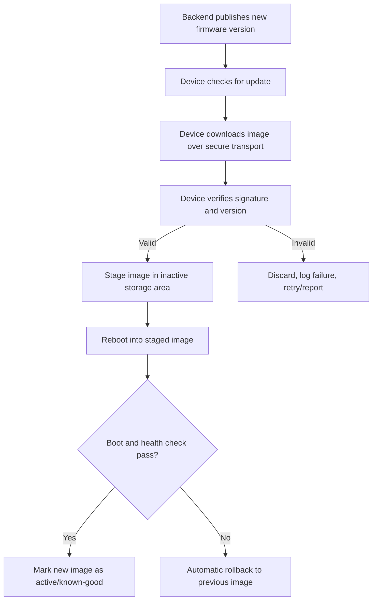
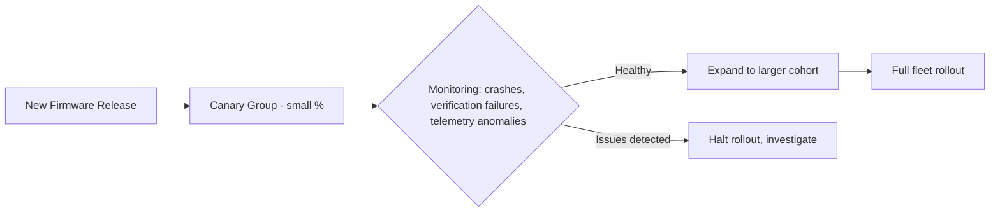

## Secure Over-the-Air Update Design

### Overview

Secure OTA (over-the-air) update design encompasses the full set of mechanisms — transport, storage, verification, sequencing, and recovery — needed to deliver new firmware to a deployed device and install it without introducing a window for compromise, corruption, or bricking. It builds directly on firmware signing and verification and secure boot mechanisms, but extends beyond signature checking alone into the operational architecture of how updates are delivered, staged, applied, and rolled back at fleet scale.

### Why OTA Update Design Is Its Own Discipline

**Key Points**
- Signing and verification answer "is this image legitimate?" — OTA design additionally answers "how does the device safely get, stage, and apply that image without ever being left in a broken or vulnerable state," which involves storage architecture, power-loss handling, network reliability, and fleet management concerns that signature verification alone doesn't address.
- A field device that becomes unresponsive after a failed update (**bricking**) is often costly or impossible to physically service, especially for remote or embedded-in-infrastructure deployments — so OTA design must treat "update went wrong" as an expected case to handle gracefully, not an exception.
- OTA is also a major attack surface in its own right (see threat modeling for embedded devices): an update mechanism with weak transport security or insufficient authorization checks can become the primary path an attacker uses to compromise a fleet.

### End-to-End OTA Update Flow

### Transport Security

- **TLS/DTLS-protected download channel**: Ensures the firmware image cannot be eavesdropped on (protecting intellectual property in the firmware) or tampered with in transit — though signature verification is still required even over a secure transport, since TLS protects the channel, not the ultimate trustworthiness of what's being sent, and a compromised or malicious server could still push a technically "clean" but unauthorized image over a perfectly valid TLS connection.
- **Mutual authentication**: The device should authenticate the update server (via a trusted certificate, typically the same cloud-facing identity infrastructure discussed under device provisioning and identity) to avoid being tricked into pulling updates from a spoofed source, particularly relevant if DNS or network-level attacks are within the threat model.
- **Resumable/chunked downloads**: Constrained devices with intermittent or low-bandwidth connectivity (cellular, LPWAN) often need to download large images in chunks over multiple sessions, requiring the protocol to handle partial downloads without compromising the eventual full-image verification step.

### Update Delivery Models

| Model | Description | Typical Use |
|---|---|---|
| Pull (device-initiated) | Device periodically polls a server for available updates | Common default; simpler server-side logic, device controls timing |
| Push (server-initiated) | Server notifies device (e.g., via MQTT topic, push notification) that an update is available | Faster propagation, useful for urgent security patches |
| Scheduled/staged rollout | Backend deliberately releases to a subset of the fleet first, expanding gradually | Reduces blast radius of an unexpected bad update across an entire fleet |
| Gateway-mediated | Devices behind a gateway receive updates relayed/cached locally rather than each device downloading independently (see gateway architectures) | Bandwidth-constrained or high-density sensor deployments |

### Staged Rollouts and Canary Deployments

**Key Points**
- Releasing an update to 100% of a fleet simultaneously means any unforeseen issue (a compatibility bug, an edge-case crash, a subtle regression) affects the entire deployed base at once.
- A staged rollout releases to a small percentage first (a "canary" group), monitors for anomalies (crash reports, unexpected behavior, verification failures), and only proceeds to wider rollout if the canary group behaves as expected.
- [Inference] This approach trades update propagation speed for risk reduction — appropriate for most routine feature/bug-fix updates, though a critical security patch addressing an actively-exploited vulnerability may reasonably justify a faster, more aggressive rollout despite the higher collective risk of an undetected regression, since the alternative (leaving the vulnerability unpatched fleet-wide) may be the greater risk in that specific case.

### Storage Architecture for Safe Updates

#### Dual-Bank (A/B) Updates

- Discussed in detail under firmware signing and verification — maintaining two firmware storage banks allows the new image to be fully staged and verified before ever becoming the active boot target, with automatic rollback if the new image fails to boot successfully.

#### Single-Bank Updates with Recovery Partition

- For devices where flash budget doesn't support a full second application bank, a smaller, minimal recovery/bootloader partition can still provide *some* fallback capability (e.g., re-downloading a known-good image) even if the primary application partition is left in a bad state.
- [Inference] This provides materially weaker guarantees than true dual-bank A/B updates, since the device may be non-functional for its normal application purpose during the recovery process, though it can still avoid the worst outcome of a fully unrecoverable brick if the recovery mechanism itself remains reachable (e.g., over the network or a minimal local interface).

#### Delta/Differential Updates

- Rather than transmitting a full firmware image, only the *difference* between the currently-running version and the new version is transmitted and applied, meaningfully reducing bandwidth and download time — valuable for large images over constrained links (cellular, LPWAN).
- Adds complexity: the device must correctly reconstruct the full image from the delta and the existing image before (or as part of) verification, and the delta-generation/application logic itself becomes part of the trusted computing base and attack surface.

### Power-Loss and Interruption Resilience

- An update interrupted by power loss mid-write is a realistic and common failure mode in embedded deployments (battery depletion, unstable power at a remote site, user unplugging a device).
- **Atomic activation**: The design should ensure that a power loss during the download/write phase leaves the device still able to boot into its previous known-good firmware — typically achieved by only "committing" to the new image (e.g., flipping a boot-selector flag) after the full image is written and verified, not incrementally during the write itself.
- **Write-then-verify-then-activate ordering**: Structuring the update process so that activation (the point of no return) is the very last step, after every prior step has been confirmed successful, minimizes the window in which an interruption could leave the device in an inconsistent state.

### Post-Update Health Checks

**Example** checks a device might perform after booting a newly-updated image, before marking it as the permanently trusted version:
1. Successful boot to a defined operational state within a timeout window
2. Core peripherals (sensors, radios, storage) initialize without error
3. Successful check-in / heartbeat with the backend, confirming network connectivity works post-update
4. Absence of repeated crash/watchdog-reset loops within an initial observation period

If these checks fail, the device should automatically roll back to the previous known-good image (assuming a dual-bank or equivalent architecture is in place) rather than remaining on a potentially broken new image indefinitely.

### Update Authorization and Access Control

- Only authorized parties (verified via the signing key infrastructure) should be able to produce updates the device will accept — this is enforced by firmware signing and verification, but the *operational* process of deciding who can trigger a release, and to which devices/cohorts, is a separate access-control concern on the backend/fleet-management side.
- Fleet management systems typically need role-based access control over who can initiate rollouts, to what device groups, and audit logging of update actions — relevant for both security and regulatory/compliance purposes in some industries.

### Common OTA Frameworks and Standards

**Example**
- **The Update Framework (TUF)**: A standardized, well-studied specification for secure software update systems, addressing not just individual image signing but broader threats like key compromise, rollback attacks, and mix-and-match attacks (where valid components from different releases are combined to produce something that individually verifies but wasn't a tested/released combination).
- **Uptane**: A variant of TUF specifically adapted for automotive OTA update security, addressing the distributed, multi-ECU nature of vehicle software.
- **MCUboot**: A widely used open-source bootloader providing dual-bank update and rollback support for microcontroller-class devices, often paired with Zephyr RTOS or other embedded platforms.
- **AWS IoT Device Management / Azure IoT Hub device update services**: Cloud-vendor-provided OTA orchestration services handling staged rollout, device targeting, and status reporting at fleet scale.

[Unverified] Specific feature support, protocol details, and integration requirements for these frameworks change over time and vary by version, so current documentation should be consulted for implementation specifics rather than relying on a general description.

### Common Pitfalls

- **No rollback mechanism**: Treating "verification passed" as sufficient without a post-boot health check and rollback path — a validly-signed image can still contain a functional bug that breaks the device in practice.
- **Committing to the new image too early**: Flipping the "boot this new image" flag before the image is fully written and verified, creating a window where a power loss leaves the device trying to boot a corrupted or incomplete image.
- **Update mechanism with weaker security than the rest of the system**: A common real-world pattern where core operational security (device identity, telemetry encryption) is carefully designed, but the update path itself is bolted on with weaker authentication or transport security, making it the path of least resistance for an attacker.
- **Unbounded retry loops**: A device that repeatedly attempts and fails an update without any backoff or eventual "give up and alert" behavior can waste significant battery/bandwidth or create a denial-of-service-like load pattern against the update server, especially at fleet scale if many devices hit the same failure simultaneously.
- **No fleet-wide rollout control**: Pushing to 100% of devices immediately, with no staged/canary mechanism, converts any undetected regression into an immediate fleet-wide incident rather than a contained, catchable one.
- **Ignoring delta-update reconstruction integrity**: If differential updates are used, failing to verify the *reconstructed* full image (not just the delta patch itself) can allow a corrupted or maliciously crafted delta to produce a bad final image that slips past a check performed only on the patch.
- **Insufficient monitoring/telemetry on update outcomes**: Without centralized visibility into update success/failure rates across the fleet, a systemic issue (a bad release, a compatibility problem with a specific hardware batch) may go undetected until it's affected a large portion of deployed devices.

### OTA Update Safety Architecture (SVG)

<svg xmlns="http://www.w3.org/2000/svg" viewBox="0 0 760 360">
  <text x="380" y="28" text-anchor="middle" font-size="18" font-weight="bold" fill="#1a1a1a">OTA Update Safety Architecture (svg_diagram)</text>

  <rect x="30" y="60" width="150" height="70" rx="8" fill="#e8f0fe" stroke="#3b6fd6" stroke-width="1.5" />
  <text x="105" y="90" text-anchor="middle" font-size="12" font-weight="bold" fill="#1a1a1a">Download</text>
  <text x="105" y="108" text-anchor="middle" font-size="10" fill="#333">TLS, resumable</text>

  <rect x="215" y="60" width="150" height="70" rx="8" fill="#fdf3e3" stroke="#d68b1a" stroke-width="1.5" />
  <text x="290" y="90" text-anchor="middle" font-size="12" font-weight="bold" fill="#1a1a1a">Verify</text>
  <text x="290" y="108" text-anchor="middle" font-size="10" fill="#333">Signature + anti-rollback</text>

  <rect x="400" y="60" width="150" height="70" rx="8" fill="#eafaf1" stroke="#1f9d55" stroke-width="1.5" />
  <text x="475" y="90" text-anchor="middle" font-size="12" font-weight="bold" fill="#1a1a1a">Stage</text>
  <text x="475" y="108" text-anchor="middle" font-size="10" fill="#333">Inactive bank B</text>

  <rect x="585" y="60" width="150" height="70" rx="8" fill="#fbeaea" stroke="#c0392b" stroke-width="1.5" />
  <text x="660" y="90" text-anchor="middle" font-size="12" font-weight="bold" fill="#1a1a1a">Boot + Check</text>
  <text x="660" y="108" text-anchor="middle" font-size="10" fill="#333">Health verification</text>

  <line x1="180" y1="95" x2="215" y2="95" stroke="#555" stroke-width="1.5" marker-end="url(#arrow11)" />
  <line x1="365" y1="95" x2="400" y2="95" stroke="#555" stroke-width="1.5" marker-end="url(#arrow11)" />
  <line x1="550" y1="95" x2="585" y2="95" stroke="#555" stroke-width="1.5" marker-end="url(#arrow11)" />

  <rect x="475" y="210" width="150" height="70" rx="8" fill="#f4f4f4" stroke="#888" stroke-width="1.5" />
  <text x="550" y="240" text-anchor="middle" font-size="12" font-weight="bold" fill="#1a1a1a">Mark Active</text>
  <text x="550" y="258" text-anchor="middle" font-size="10" fill="#333">Health check passed</text>

  <rect x="255" y="210" width="150" height="70" rx="8" fill="#f4f4f4" stroke="#888" stroke-width="1.5" />
  <text x="330" y="240" text-anchor="middle" font-size="12" font-weight="bold" fill="#1a1a1a">Rollback</text>
  <text x="330" y="258" text-anchor="middle" font-size="10" fill="#333">Health check failed</text>

  <line x1="660" y1="130" x2="600" y2="210" stroke="#555" stroke-width="1.5" marker-end="url(#arrow11)" />
  <line x1="660" y1="130" x2="380" y2="210" stroke="#555" stroke-width="1.5" marker-end="url(#arrow11)" />

  </svg>

### Related Topics

- Firmware signing and verification (the trust foundation OTA relies on)
- Secure boot mechanisms and dual-bank/A-B rollback in depth
- Gateway architectures (gateway-mediated update distribution)
- Device provisioning and identity (mutual authentication with update servers)
- Threat modeling for embedded devices (update channel as attack surface)
- The Update Framework (TUF) and Uptane specification details
- Fleet management and device telemetry for update monitoring