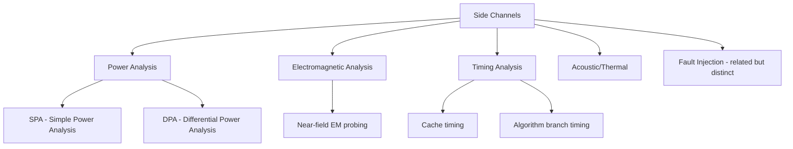
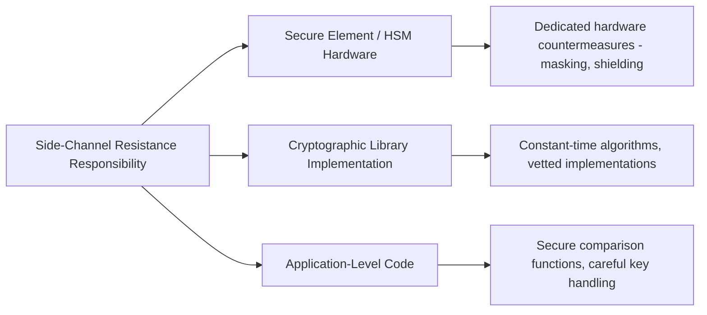

## Side-Channel Attack Awareness

### Overview

Side-channel attacks extract secret information (cryptographic keys, sensitive data) not by breaking the mathematics of an algorithm, but by observing physical or behavioral byproducts of a device's operation — power consumption, electromagnetic emissions, timing, sound, or even temperature — that correlate with the secret being processed. A cryptographic implementation can be mathematically flawless and still leak its key entirely through how it physically executes on real hardware.

### Why Side Channels Exist

**Key Points**
- Every logic operation a chip performs consumes power, takes time, and radiates electromagnetic energy, and the exact amount of each often depends on the data being processed (e.g., flipping more bits typically draws more instantaneous current than flipping fewer).
- If a secret key influences *which* operations occur or *how* they occur (a conditional branch based on a key bit, a lookup table indexed by key material), that dependency can, in principle, be observed externally without ever accessing the key value directly in memory.
- Side channels are fundamentally a *physical implementation* problem, not an algorithmic one — the same mathematically secure cipher can be side-channel-resistant or side-channel-vulnerable purely based on how it's coded and what hardware it runs on.

### Categories of Side Channels

#### Power Analysis

- **Simple Power Analysis (SPA)**: Directly inspecting a single power trace to visually identify distinct operations (e.g., recognizing the pattern of RSA square-and-multiply operations, where a "multiply" step's presence or absence can directly reveal a key bit).
- **Differential Power Analysis (DPA)**: A statistical technique combining many power traces (often thousands) captured across repeated operations with varying input, using statistical correlation to extract key bits even when no single trace is individually informative — [Inference] this makes DPA considerably more powerful than SPA in practice, since it can defeat implementations where no single observable operation obviously correlates with a key bit, at the cost of requiring the ability to capture many repeated traces of the target operation.

#### Electromagnetic (EM) Analysis

- Similar principle to power analysis, but measures electromagnetic emissions from the chip rather than requiring a direct electrical connection to measure current draw — meaning it can sometimes be performed without any physical contact or modification to the target device, using a near-field probe positioned close to the package.
- Localized EM probing can sometimes isolate signals from a specific region of a chip (e.g., a cryptographic co-processor block), potentially improving signal quality over board-level power measurement.

#### Timing Analysis

- Exploits variation in *how long* an operation takes depending on secret data — e.g., a naive string comparison that returns as soon as it finds a mismatched byte will take measurably longer when more leading bytes match, which can leak information about a secret being compared against (such as an authentication token or MAC).
- **Cache-timing attacks**: A specific and well-studied class where memory access patterns dependent on secret data (e.g., a table lookup indexed by a key byte) cause measurably different cache hit/miss timing, historically demonstrated against several real-world AES implementations that used table-based lookups.

#### Fault Injection (Related, Distinct Category)

- Rather than passively observing a side channel, fault injection *actively disturbs* the device (voltage glitching, clock glitching, electromagnetic pulses, laser fault injection on decapped chips) to induce incorrect computation, which can then be exploited — e.g., skipping a security check instruction, or inducing a faulty cryptographic computation whose result reveals key material through **differential fault analysis**.
- Historically significant as an attack against secure boot signature checks (inducing the CPU to skip the branch that would otherwise reject an unsigned image) — see secure boot mechanisms for the defensive context.

### Why Embedded Devices Are Particularly Exposed

**Key Points**
- Physical access is often realistically achievable for embedded devices (see threat modeling for embedded devices) — unlike a cloud server in a locked data center, a smart lock, industrial sensor, or consumer IoT device may sit somewhere an attacker can physically handle it, sometimes for extended, unsupervised periods.
- Constrained devices frequently run software-only cryptographic implementations (see cryptographic primitives for constrained devices) without the dedicated hardware countermeasures that a well-designed secure element or HSM incorporates, making them comparatively easier targets for basic side-channel techniques.
- High-value secrets — device identity keys, firmware decryption keys — are often accessed repeatedly over a device's operational life (e.g., every TLS handshake), giving an attacker with physical access the opportunity to capture the many traces needed for statistical techniques like DPA.

### Defensive Techniques

#### Constant-Time Implementation

- Writing cryptographic code such that execution time does not depend on secret data — no data-dependent branches, no data-dependent memory access patterns, no early-exit optimizations on secret comparisons.
- **Example**: A secure comparison function should compare all bytes of two values regardless of where a mismatch occurs (accumulating a running "difference" flag rather than returning early), rather than a naive comparison that exits as soon as it finds a mismatch.
- [Inference] Achieving true constant-time behavior is harder in practice than it sounds, because compiler optimizations can sometimes reintroduce data-dependent timing even from source code that was written to be constant-time (e.g., by optimizing away a deliberately "wasted" comparison), which is why well-vetted cryptographic libraries and compiler-specific verification techniques are generally preferred over ad hoc implementations for anything genuinely security-critical.

#### Power/EM Countermeasures

- **Masking**: Splitting a secret value into multiple random shares such that operations are performed on the shares rather than the raw secret, so that any single power/EM measurement correlates with a random share rather than the actual secret — recombination happens only internally in a way not directly observable externally.
- **Hiding**: Techniques that reduce the *signal-to-noise ratio* of the side channel itself — adding random noise to power consumption, randomizing the order of independent operations, or using constant-power logic gate designs — making statistical extraction require substantially more traces/effort.
- **Hardware-level shielding**: Physical design choices (e.g., decoupling capacitors, power supply filtering, sometimes active shielding in high-assurance secure elements) that reduce the amount of exploitable information leaking through power/EM channels in the first place.

#### Fault Injection Countermeasures

- **Redundant checks**: Performing security-critical checks (e.g., a signature verification result) more than once, and requiring consistent results, to reduce the chance a single glitch-induced fault flips the outcome undetected.
- **Sensors for abnormal operating conditions**: Voltage, clock, and temperature sensors that can detect glitching attempts and trigger a defensive response (e.g., resetting, zeroizing sensitive memory) rather than continuing execution under suspicious conditions.
- **Control-flow integrity techniques**: Ensuring that skipping a single instruction (a common glitch effect) cannot, by itself, bypass a security-critical branch — e.g., using redundant, differently-structured conditional logic rather than a single comparison-and-branch.

### Where Side-Channel Resistance Typically Lives

- **Secure elements and HSMs** (see hardware security modules and secure elements) are generally purpose-built and evaluated specifically for side-channel resistance, often as part of formal certification processes (e.g., Common Criteria evaluations for smart card and payment-related secure elements specifically test for this).
- **Software cryptographic libraries** (mbed TLS, wolfSSL, and similar) vary in how much side-channel-resistant coding practice they apply to which algorithms — [Unverified] the specific side-channel guarantees of a given library version and configuration should be checked against its documentation and any published security audits, rather than assumed uniformly across all functions in a library.
- **Application-level code** written by the product team is often the weakest link in practice, since it's less likely to have received the same level of security-focused scrutiny as a dedicated crypto library or certified secure element — e.g., a device's own PIN-comparison or token-validation logic, written outside the crypto library, is a common place naive, timing-vulnerable comparisons appear.

### Practical Risk Assessment Considerations

**Key Points**
- Not every embedded product needs the same level of side-channel hardening — a consumer device with low individual value and no high-value secrets warrants a different risk calculus than a payment terminal, a hardware security key, or critical infrastructure equipment.
- Side-channel attacks generally require *some* form of proximity or access (physical possession, or in some EM cases, close physical proximity) — this narrows the realistic threat actor population compared to a purely remote network attack, which is a relevant factor (though not a reason to dismiss the risk entirely) when threat modeling (see threat modeling for embedded devices).
- The cost and sophistication required for practical side-channel attacks vary enormously by technique — from relatively accessible SPA against a naive implementation, to DPA/fault injection requiring specialized equipment and expertise more associated with well-resourced adversaries or dedicated security researchers.

### Common Pitfalls

- **Assuming a mathematically secure algorithm is automatically implementation-secure**: Treating algorithm selection (see cryptographic primitives for constrained devices) as the entirety of the security decision, without separately considering how that algorithm is actually implemented in code and hardware.
- **Naive secret comparison functions**: Using standard library string/memory comparison functions (which often exit early on the first mismatch) to compare secret values like authentication tokens, PINs, or MACs — a frequently rediscovered vulnerability pattern across many unrelated codebases.
- **Table-lookup-based crypto implementations without cache-timing consideration**: Implementing algorithms like AES using data-dependent table lookups without awareness of cache-timing leakage, particularly relevant on processors with data caches (less relevant, though not entirely absent as a concern, on simple in-order microcontrollers without cache hierarchies).
- **Treating side-channel resistance as a one-time implementation property**: Compiler updates, optimization level changes, or even code refactoring can reintroduce timing or branch-based leakage into code that was previously verified constant-time — this needs ongoing verification, not a single point-in-time check.
- **Over-indexing on side-channel defense while neglecting more accessible attack paths**: Investing heavily in DPA-resistant hardware while leaving a debug port unlocked or default credentials in place (see threat modeling for embedded devices) — side-channel resistance should be prioritized relative to the device's actual overall threat model, not in isolation.
- **No physical security consideration alongside logical countermeasures**: Side-channel countermeasures reduce the information leaked per unit of physical access time/proximity, but don't eliminate the value of also making physical access itself harder (tamper-evident enclosures, potting, tamper-detection circuitry) as a complementary layer.

### Power Trace Leakage Concept (SVG)

<svg xmlns="http://www.w3.org/2000/svg" viewBox="0 0 760 320">
  <text x="380" y="28" text-anchor="middle" font-size="18" font-weight="bold" fill="#1a1a1a">Power Trace Leakage Concept (svg_diagram)</text>

  <line x1="60" y1="260" x2="700" y2="260" stroke="#333" stroke-width="1.5" />
  <line x1="60" y1="260" x2="60" y2="70" stroke="#333" stroke-width="1.5" />
  <text x="380" y="295" text-anchor="middle" font-size="11" fill="#333">Time</text>
  <text x="30" y="165" text-anchor="middle" font-size="11" fill="#333" transform="rotate(-90, 30, 165)">Power Draw</text>

  <polyline points="60,220 100,220 110,150 130,150 140,220 180,220 195,110 220,110 230,220 280,220 295,150 320,150 330,220 380,220 395,110 420,110 430,220 480,220 495,150 520,150 530,220 580,220 595,110 620,110 630,220 700,220" fill="none" stroke="#3b6fd6" stroke-width="2" />

  <text x="115" y="100" text-anchor="middle" font-size="10" fill="#c0392b">key bit = 1</text>
  <text x="205" y="100" text-anchor="middle" font-size="10" fill="#c0392b">key bit = 1</text>
  <text x="405" y="100" text-anchor="middle" font-size="10" fill="#c0392b">key bit = 1</text>
  <text x="605" y="100" text-anchor="middle" font-size="10" fill="#c0392b">key bit = 1</text>

  <text x="380" y="65" text-anchor="middle" font-size="10" fill="#777">Illustrative: taller peaks correlate with a specific operation tied to secret data</text>
</svg>

### Related Topics

- Cryptographic primitives for constrained devices (algorithm and implementation selection)
- Hardware security modules and secure elements (dedicated side-channel countermeasures)
- Secure boot mechanisms (fault injection as a historical bypass technique)
- Threat modeling for embedded devices (physical attack surface context)
- Constant-time programming techniques and compiler-level verification tools
- Common Criteria and side-channel evaluation methodologies for secure hardware