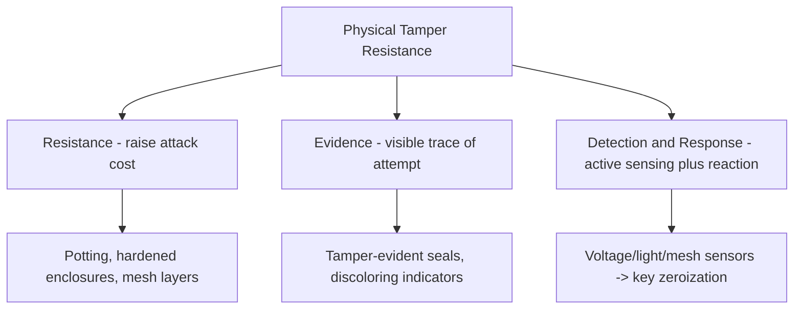
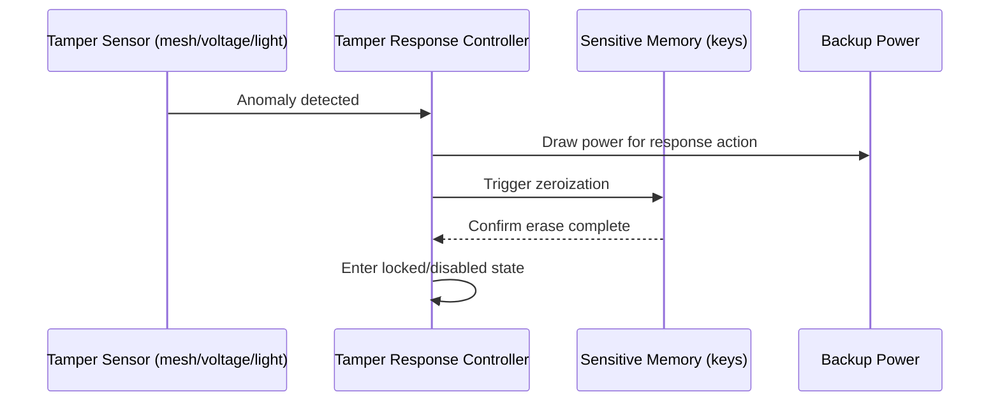

## Physical Tamper Resistance

### Overview

Physical tamper resistance encompasses the design techniques used to detect, resist, or respond to attempts at physically accessing, modifying, or extracting secrets from a device's hardware. Where side-channel resistance concerns passively observing a device's normal operation, and secure boot/signing concern the integrity of code, tamper resistance concerns direct physical interference — opening an enclosure, probing a circuit board, or altering hardware — and how a device detects and responds to it.

### Tamper Resistance, Evidence, and Detection: Three Distinct Goals

**Key Points**
- **Tamper resistance**: Making physical access to sensitive components difficult or costly, e.g., through potting, hardened enclosures, or embedded mesh layers — the goal is raising the effort/cost required, not necessarily making access impossible.
- **Tamper evidence**: Ensuring that if tampering *did* occur, it leaves a visible or otherwise detectable trace (a broken seal, a discolored indicator) that a legitimate inspector can later identify, even if the device itself took no active response.
- **Tamper detection/response**: Active electronic sensing of tampering attempts (voltage changes, enclosure opening, mesh continuity breaks) that triggers an immediate defensive response, such as zeroizing (erasing) sensitive key material.
- These three goals are complementary, not interchangeable — a device can have strong tamper evidence (a broken seal is visible) without any active detection/response capability, or vice versa; comprehensive designs for high-value targets typically layer all three.

### Physical Attack Techniques This Defends Against

- **Enclosure opening and direct board access**: The most basic physical attack — simply opening a device to access debug ports, probe test points, or physically remove/replace components.
- **Bus probing**: Attaching probes to circuit board traces (e.g., between a main MCU and an external flash chip, or an SPI/I2C link to a secure element) to intercept or inject data in transit (see also hardware security modules and secure elements regarding host-SE bus considerations).
- **Chip decapping**: Chemically or mechanically removing a chip's packaging to expose the silicon die for direct microprobing or optical/electron microscopy analysis — a resource-intensive technique historically associated with well-funded adversaries or dedicated security research labs.
- **Cold boot / memory extraction**: Rapidly cooling or otherwise manipulating volatile memory to extend data retention after power loss, then extracting the chip to read residual data (historically demonstrated against DRAM, with implications for any design that assumes RAM contents vanish immediately at power-off).
- **Component substitution**: Physically desoldering and replacing a component (e.g., swapping a flash chip for a modified one, or replacing a secure element with a compromised equivalent) as part of a supply chain or field-tampering attack.

### Detection Mechanisms

#### Enclosure and Mesh Sensors

- **Tamper-detection meshes**: A fine conductive trace pattern (sometimes on a flexible PCB layer) that surrounds sensitive components; continuity monitoring detects if the mesh is cut, drilled through, or otherwise disturbed, which is a common approach for hardening HSMs and high-assurance secure enclosures.
- **Switches and micro-switches**: Simple mechanical detection of enclosure opening, less sophisticated than mesh-based approaches but lower cost and useful as a baseline layer.
- **Light sensors**: Detecting ambient light entering a normally sealed, opaque enclosure — a signal that the enclosure has been breached, since decapping or opening typically exposes internal components to light.

#### Environmental Sensors

- **Voltage monitoring**: Detecting abnormal voltage levels or rapid transitions that may indicate a fault-injection (glitching) attempt (see side-channel attack awareness) or an attempt to operate the device outside its normal specified range to induce a fault.
- **Clock monitoring**: Detecting abnormal clock frequency or glitches that could indicate a clock-glitching fault injection attempt.
- **Temperature sensors**: Detecting operation outside a normal temperature range, which can indicate an attempt to use temperature extremes to induce faults or to affect memory retention behavior (e.g., for cold-boot-style attacks).

### Response Mechanisms

**Key Points**
- **Zeroization**: Actively erasing sensitive key material and other secrets from volatile or non-volatile memory upon tamper detection, so that even if the attacker gains physical access moments later, there is nothing left to extract.
- **Fail-secure lockout**: Rather than (or in addition to) zeroizing, some designs simply disable the device's cryptographic or operational functionality upon tamper detection, requiring a secure re-provisioning process to restore function — trading availability for assurance that a tampered device cannot continue operating with its original trust level.
- **Logging/reporting**: Where connectivity allows, reporting a tamper event to a backend system before or alongside zeroization, so that fleet operators have visibility into physical tampering attempts rather than only silent local defensive action.
- [Inference] Zeroization must itself be reliably powered to execute — a purely reactive zeroization scheme depends on having enough residual power (from a backup battery or capacitor) to complete the erase operation even if the tampering attempt itself disrupts main power, which is why high-assurance tamper-responsive designs often include a dedicated backup power source specifically to guarantee the zeroization action can complete.

### Enclosure and Board-Level Design Techniques

- **Potting/encapsulation**: Filling a device's internal cavity with a hardened epoxy or resin compound, making component removal or probing significantly more difficult and time-consuming without visibly damaging (and thus tamper-evidencing) the device.
- **Multi-layer PCB routing of sensitive traces**: Routing security-critical signal traces (e.g., between an MCU and a secure element) through internal PCB layers rather than the outer layers, making them harder to access via simple probing without more invasive board disassembly.
- **Removal of test points and debug headers in production**: Not populating or physically removing connectors/pads used during development debugging, so that even if the underlying debug interface exists in silicon, the physical access point to it is absent (complementing the logical lockout discussed under threat modeling for embedded devices and secure boot mechanisms).
- **Tamper-evident fasteners and seals**: Screws with non-standard heads, seals that visibly deform or discolor when broken, or enclosures designed to fracture visibly rather than open cleanly when forced.

### Tamper Response Architecture

### Certification and Assurance Levels

- **FIPS 140-2/140-3 physical security levels**: Define graduated requirements for physical security, from Level 1 (no specific physical security mechanisms required beyond production-grade components) up to Level 4 (requiring tamper detection and response, including environmental monitoring, capable of zeroizing across the full range of specified operating conditions).
- **Common Criteria**: Provides a broader evaluation framework where physical tamper resistance is one of several evaluated security properties, with specific Protection Profiles for certain device categories (e.g., smart cards, payment terminals) defining relevant physical attack scenarios evaluators must test against.
- [Unverified] Exact requirements at each level, and which level is appropriate or mandated for a given product category, depend on the specific regulatory/industry context and current standard revisions, so applicable certification requirements should be confirmed against current standards documentation rather than assumed from general familiarity with the standard's existence.

### Risk-Proportionate Tamper Resistance

**Key Points**
- Not every embedded device warrants FIPS 140-2 Level 4-grade tamper response — a consumer smart plug and a hardware security module protecting a certificate authority's root key have fundamentally different asset values and correspondingly different justified investment in physical hardening.
- **Example** proportionate tiers:
  - **Low assurance**: Standard enclosure, no active detection — acceptable where compromising one unit yields limited value (e.g., a single consumer sensor with no shared secrets, only per-device credentials that can be individually revoked).
  - **Medium assurance**: Tamper-evident seals, some potting of critical components — appropriate where physical tampering is a plausible but not primary threat vector, and evidence of attempts is operationally useful.
  - **High assurance**: Active mesh/voltage/light detection with zeroization, backup power for response — appropriate for devices protecting high-value shared secrets or operating in hostile/unattended physical environments (e.g., payment terminals, certain industrial control or defense-related equipment).
- The appropriate tier should emerge from the broader threat modeling process (see threat modeling for embedded devices) rather than being selected independently of the device's actual asset value and deployment context.

### Common Pitfalls

- **Tamper evidence without any response**: Relying solely on a visible broken seal without pairing it with any active protection means an attacker who successfully tampers still obtains the secrets — evidence alone only helps *after the fact*, for detection/audit purposes, not prevention.
- **Zeroization without guaranteed power**: Designing a zeroization response that depends on main power remaining available during the very event (physical tampering) that might also disrupt that power — undermining the mechanism exactly when it's needed most.
- **Treating debug port lockout and physical tamper resistance as redundant**: These are complementary, not substitutable — a logically-locked debug port can still potentially be attacked by other physical means (bus probing, chip decapping), and physical hardening doesn't eliminate the value of also disabling debug access logically.
- **Overinvesting relative to actual asset value**: Applying high-assurance tamper response to a device holding no significant shared secrets, adding cost and complexity without a commensurate security benefit — proportionality should be a deliberate assessment, not a default maximalist posture.
- **Ignoring supply chain tampering as a physical threat**: Focusing tamper resistance entirely on post-deployment field attacks while neglecting that physical tampering can also occur during manufacturing or distribution (see threat modeling for embedded devices, supply chain threats), where standard field-deployment tamper detection may not yet even be active.
- **Assuming potting is a complete solution**: Potting raises the effort and time required for physical attacks and adds tamper evidence (visible damage from removal attempts), but sufficiently determined and resourced attackers can still defeat it — it's a resistance-raising layer, not an absolute barrier, and shouldn't be treated as eliminating the need for other complementary controls.

### Layered Tamper Resistance Design (SVG)

<svg xmlns="http://www.w3.org/2000/svg" viewBox="0 0 760 340">
  <text x="380" y="28" text-anchor="middle" font-size="18" font-weight="bold" fill="#1a1a1a">Layered Tamper Resistance Design (svg_diagram)</text>

  <rect x="60" y="60" width="640" height="250" rx="10" fill="#f4f4f4" stroke="#888" stroke-width="1.5" stroke-dasharray="5,4" />
  <text x="380" y="85" text-anchor="middle" font-size="12" fill="#777">Enclosure Boundary</text>

  <rect x="100" y="100" width="560" height="60" rx="8" fill="#e8f0fe" stroke="#3b6fd6" stroke-width="1.5" />
  <text x="380" y="125" text-anchor="middle" font-size="12" font-weight="bold" fill="#1a1a1a">Tamper-Evident Seals + Mesh Layer</text>
  <text x="380" y="145" text-anchor="middle" font-size="10" fill="#333">Detects opening or drilling attempts</text>

  <rect x="100" y="175" width="560" height="60" rx="8" fill="#fdf3e3" stroke="#d68b1a" stroke-width="1.5" />
  <text x="380" y="200" text-anchor="middle" font-size="12" font-weight="bold" fill="#1a1a1a">Voltage / Clock / Temperature / Light Sensors</text>
  <text x="380" y="220" text-anchor="middle" font-size="10" fill="#333">Detects environmental manipulation attempts</text>

  <rect x="140" y="250" width="230" height="45" rx="8" fill="#eafaf1" stroke="#1f9d55" stroke-width="1.5" />
  <text x="255" y="277" text-anchor="middle" font-size="11" font-weight="bold" fill="#1a1a1a">Potted Secure Element</text>

  <rect x="390" y="250" width="230" height="45" rx="8" fill="#fbeaea" stroke="#c0392b" stroke-width="1.5" />
  <text x="505" y="277" text-anchor="middle" font-size="11" font-weight="bold" fill="#1a1a1a">Backup Power for Zeroization</text>
</svg>

### Related Topics

- Side-channel attack awareness (passive observation vs. active physical tampering)
- Hardware security modules and secure elements (built-in tamper resistance)
- Threat modeling for embedded devices (physical and supply chain attack surface)
- Secure boot mechanisms (fault injection resistance)
- FIPS 140-2/140-3 and Common Criteria certification processes in depth
- Supply chain security for contract-manufactured hardware