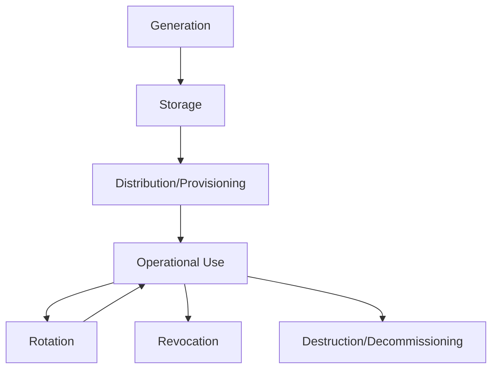
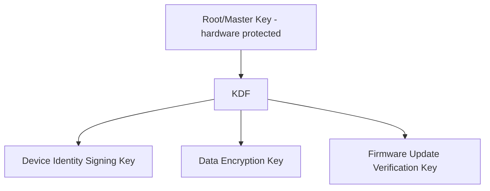
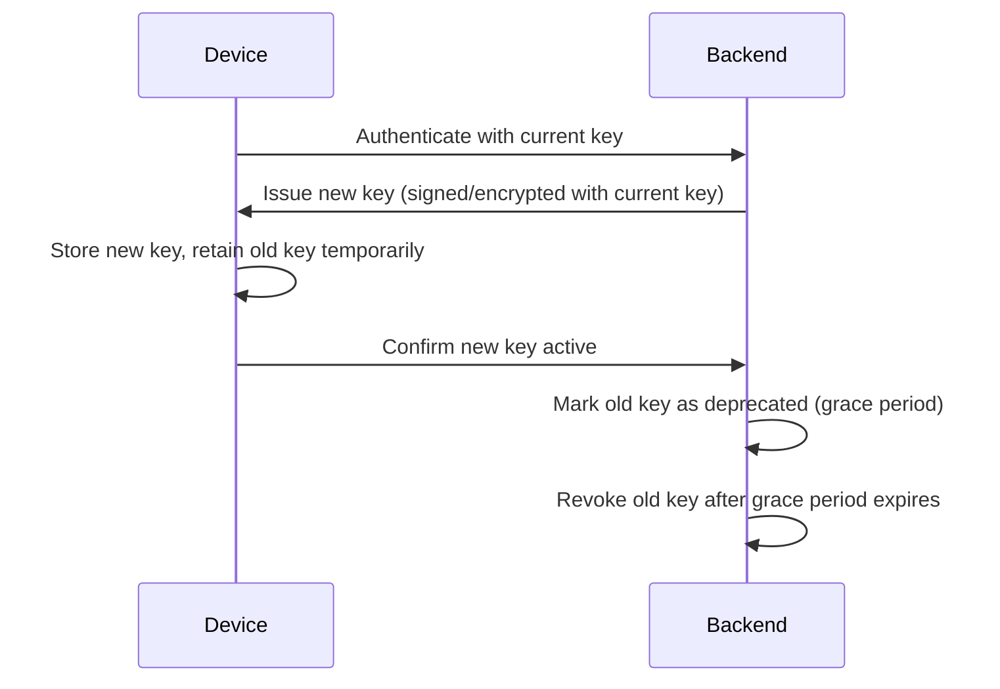

## Key Management and Storage

### Overview

Key management and storage is the discipline of generating, storing, distributing, rotating, and retiring cryptographic keys throughout a device's entire lifecycle — from factory provisioning through field operation to decommissioning. Every other security mechanism covered so far (secure boot, firmware signing, TLS-based identity, side-channel resistance) ultimately depends on keys being generated correctly and protected adequately; key management is the connective discipline that ties those pieces into a coherent system rather than a collection of independently-secure parts resting on a weak foundation.

### The Key Lifecycle

### Key Generation

**Key Points**
- Keys must be generated using a cryptographically secure random number generator (CSPRNG), ideally seeded from a hardware TRNG (see cryptographic primitives for constrained devices) — a predictable or low-entropy key generation process undermines every downstream protection regardless of algorithm strength.
- **Where generation happens matters**: keys generated inside a secure element or HSM and never exported in plaintext provide categorically stronger guarantees than keys generated in general-purpose firmware/software and then written to storage, since the latter creates a window where the plaintext key exists somewhere extractable.
- **Batch vs. per-device generation**: Generating a unique key per device (rather than reusing one key across a batch or product line) limits the blast radius of any single key's compromise — a foundational principle discussed in device provisioning and identity, but worth restating here as a key management principle in its own right.

### Key Storage Options

| Storage Location | Extraction Difficulty | Typical Use |
|---|---|---|
| Plaintext in external flash | Low — readable via debug port or desoldering | Should generally be avoided for genuinely sensitive keys |
| Encrypted in flash, decryption key elsewhere | Moderate — depends entirely on protection of the decryption key | Common when a hardware root key encrypts other stored keys |
| On-chip OTP/eFuses | Moderate-high — requires physical extraction techniques | Root keys, public key hashes, small fixed secrets |
| Secure element (discrete) | High — designed specifically to resist extraction | Device identity keys, operational signing keys |
| TEE-protected memory (TrustZone) | Moderate-high — hardware-isolated but shares silicon with main processor | Keys needing isolation without discrete SE cost |
| HSM (backend/factory) | Very high — physically and logically hardened, certified | Root CA keys, firmware signing keys |

[Inference] This ordering reflects general tendencies in extraction difficulty rather than a strict, universal ranking, since the actual difficulty for any specific implementation depends on the quality of that implementation (a poorly-configured secure element can be weaker in practice than a well-designed encrypted-flash scheme), the specific attacker's capability level, and the physical/logical protections layered around each option.

### Key Hierarchies

- Rather than using a single key for everything, most systems employ a **key hierarchy**: a small number of high-value root or master keys protect (encrypt, or derive) a larger number of lower-tier operational keys.
- **Key Encryption Keys (KEKs)**: Keys whose sole purpose is to encrypt other keys for storage, rather than being used directly for data encryption or signing — this allows the "working" keys to be rotated more freely while the KEK itself changes far less frequently and receives the strongest protection.
- **Key derivation**: Deriving multiple purpose-specific keys from a single root secret using a **Key Derivation Function (KDF)**, such as HKDF, rather than storing many independent keys — reduces the total number of secrets that must be independently protected and backed up, at the cost of making the root secret itself an even higher-value target if it's compromised.

$$K_{purpose} = \text{KDF}(K_{root}, \text{context}, \text{purpose\_label})$$

Where distinct, cryptographically independent purpose-specific keys are derived from a single root secret using different context/label inputs, so compromise of one derived key does not directly reveal the root or other derived keys.

### Key Distribution and Provisioning

- Covered in depth under device provisioning and identity — the process by which keys move from where they're generated (often a factory HSM-adjacent process, or on-device secure element generation) to where they're used, without exposure in transit.
- **In-field key distribution**: Beyond initial provisioning, some systems need to securely deliver *new* keys to already-deployed devices (e.g., rotating a compromised key, or distributing a session key for a specific operation) — this requires an already-trusted channel (typically the device's existing operational identity) to bootstrap trust in the new key material, since a device cannot securely receive a new key over a channel it has no way to authenticate.

### Key Rotation

**Key Points**
- Rotating keys periodically (or in response to a suspected compromise) limits the time window during which any single leaked key remains useful to an attacker.
- **Rotation cadence tradeoffs**: More frequent rotation reduces exposure window but increases operational complexity, network/CPU overhead for the re-provisioning handshake, and — critically for constrained or intermittently-connected devices — risk of a device missing its rotation window and ending up with an expired credential and no path to renew it without manual intervention.
- **Graceful rotation**: Well-designed rotation schemes support a transition period where both old and new keys are valid, so in-flight operations or devices that haven't yet received the new key don't immediately fail — an abrupt cutover (invalidating the old key the instant the new one is issued) is more prone to availability problems, particularly at fleet scale with devices in varying connectivity states.

### Key Revocation

- When a key is known or suspected to be compromised, it must be actively invalidated so that a backend or peer will no longer trust operations signed/encrypted with it, distinct from simply issuing a replacement — see also the revocation discussion under device provisioning and identity (CRLs, OCSP, registry-based disable).
- **Revocation propagation delay**: A real-world constraint — revocation information (a CRL update, a registry change) must reach every system that needs to check it, and intermittently-connected devices or caching intermediaries may continue trusting a revoked key for some period until they receive updated revocation information, which is a genuine limitation to account for rather than an implementation detail to overlook.

### Key Backup and Escrow

- **The tension**: Backing up a key (so it can be recovered if lost, e.g., due to hardware failure) inherently creates an additional copy that could itself be a target — key backup and key security are in some tension, and the appropriate balance depends heavily on the consequences of key loss versus the consequences of key compromise for the specific use case.
- **Root/master key backup**: For high-value keys like an HSM-protected certificate authority root, secure backup (often using techniques like secret sharing, where the key is split such that a threshold number of independently-held shares are required to reconstruct it) is standard practice, since losing this key entirely could be catastrophic for an entire product line's ability to issue new device certificates.
- **Device-level operational keys**: Whether these warrant backup depends on the consequences of loss — if a lost device key simply means that device needs re-provisioning (acceptable operational friction), backup may not be justified; if key loss means unrecoverable access to critical stored data, backup or key-escrow becomes more important despite the added exposure risk.
- [Inference] As a general principle, the decision to back up a given key should weigh the specific cost of losing that key against the specific cost of an additional copy existing somewhere, rather than applying a uniform backup policy across all key types in a system, since different keys in the same product can have very different loss-vs-compromise cost profiles.

### Key Destruction

- At decommissioning (a device being retired, returned, or repurposed) or upon confirmed compromise, sensitive keys should be actively destroyed/zeroized rather than simply left in storage and implicitly relied upon to be inaccessible (see physical tamper resistance for the related concept of tamper-triggered zeroization).
- **Cryptographic erasure**: An alternative to physically overwriting every bit of stored data — if data is encrypted and only the encryption key is destroyed, the underlying ciphertext becomes practically unrecoverable without needing to overwrite the (potentially large) data itself, which is often faster and more practical on flash storage where physical overwrite patterns interact with wear-leveling in ways that can make guaranteed physical erasure surprisingly difficult to verify.

### Common Pitfalls

- **Single key for everything**: Using one key across multiple purposes (e.g., the same key for both firmware signing and TLS identity) means a compromise or cryptanalytic weakness discovered in one context has consequences far beyond its original intended use.
- **No rotation mechanism designed in from the start**: Retrofitting key rotation into a system that was never designed to support it is often significantly harder than designing for it from the beginning, sometimes requiring a full re-provisioning of an entire deployed fleet if no graceful transition path exists.
- **Backup without adequate protection of the backup itself**: Creating a key backup/escrow copy and then storing it with materially weaker protection than the original (e.g., an HSM-protected root key backed up as a plaintext file on an ordinary server) — the backup becomes the weakest link, undermining the original hardware protection investment.
- **Ignoring revocation propagation delay in security assumptions**: Designing a system as though "revoked" means "instantly untrusted everywhere," when in practice intermittently-connected or cached components may continue honoring a revoked key for some period.
- **Treating key derivation as free unlimited key generation**: Deriving many purpose-specific keys from a single root is efficient, but it also means that root key's compromise has cascading impact across every derived key — the hierarchy concentrates risk at the root even as it distributes operational usage, a tradeoff worth being deliberate about rather than assuming derivation is purely beneficial.
- **No plan for key material at decommissioning**: Devices retired, resold, or discarded while still holding valid, undestroyed keys represent a persistent latent risk — particularly relevant for devices that may be physically recovered by a future attacker long after the original operator has stopped thinking about that unit's security.

### Key Hierarchy and Lifecycle (SVG)

<svg xmlns="http://www.w3.org/2000/svg" viewBox="0 0 760 360">
  <text x="380" y="28" text-anchor="middle" font-size="18" font-weight="bold" fill="#1a1a1a">Key Hierarchy and Lifecycle (svg_diagram)</text>

  <rect x="290" y="55" width="180" height="55" rx="8" fill="#fbeaea" stroke="#c0392b" stroke-width="1.5" />
  <text x="380" y="87" text-anchor="middle" font-size="13" font-weight="bold" fill="#1a1a1a">Root/Master Key</text>

  <rect x="100" y="150" width="160" height="55" rx="8" fill="#e8f0fe" stroke="#3b6fd6" stroke-width="1.5" />
  <text x="180" y="182" text-anchor="middle" font-size="11" font-weight="bold" fill="#1a1a1a">Identity Key</text>

  <rect x="300" y="150" width="160" height="55" rx="8" fill="#fdf3e3" stroke="#d68b1a" stroke-width="1.5" />
  <text x="380" y="182" text-anchor="middle" font-size="11" font-weight="bold" fill="#1a1a1a">Data Enc. Key</text>

  <rect x="500" y="150" width="160" height="55" rx="8" fill="#eafaf1" stroke="#1f9d55" stroke-width="1.5" />
  <text x="580" y="182" text-anchor="middle" font-size="11" font-weight="bold" fill="#1a1a1a">Update Verify Key</text>

  <line x1="340" y1="110" x2="200" y2="150" stroke="#555" stroke-width="1.5" marker-end="url(#arrow12)" />
  <line x1="380" y1="110" x2="380" y2="150" stroke="#555" stroke-width="1.5" marker-end="url(#arrow12)" />
  <line x1="420" y1="110" x2="560" y2="150" stroke="#555" stroke-width="1.5" marker-end="url(#arrow12)" />

  <rect x="150" y="250" width="470" height="80" rx="8" fill="#f4f4f4" stroke="#888" stroke-width="1.5" stroke-dasharray="5,4" />
  <text x="385" y="275" text-anchor="middle" font-size="12" font-weight="bold" fill="#1a1a1a">Lifecycle applies to every key</text>
  <text x="385" y="298" text-anchor="middle" font-size="10" fill="#333">Generate -&gt; Store -&gt; Rotate -&gt; Revoke -&gt; Destroy</text>
  <text x="385" y="315" text-anchor="middle" font-size="10" fill="#333">Root key changes are rare; derived keys rotate more freely</text>

  </svg>

### Related Topics

- Device provisioning and identity (key distribution and initial trust establishment)
- Hardware security modules and secure elements (protected key storage locations)
- Cryptographic primitives for constrained devices (algorithm selection underlying key use)
- Physical tamper resistance (tamper-triggered key zeroization)
- Firmware signing and verification (signing key hierarchy specifics)
- Secure over-the-air update design (key rotation interacting with fleet-wide update mechanisms)