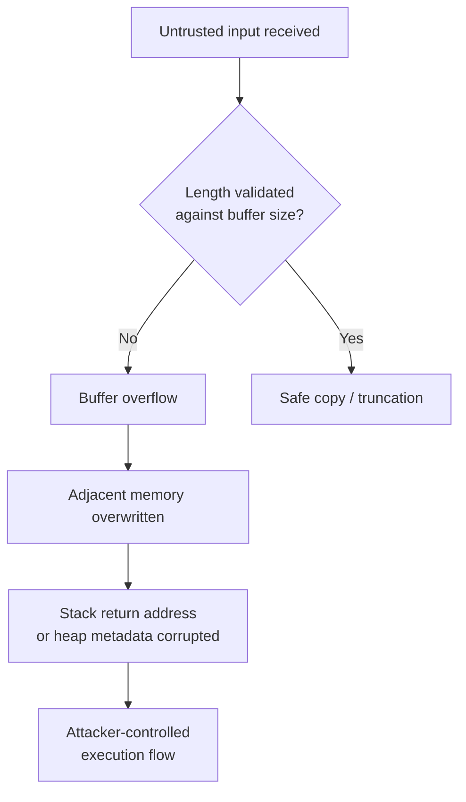
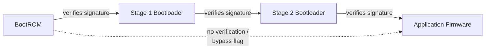

## Common Vulnerability Classes in Firmware

### Overview

Firmware sits closer to hardware than typical application software, which changes the security calculus significantly. Vulnerabilities here often bypass protections that operating systems and modern compilers take for granted — stack canaries, ASLR, DEP/NX, and sandboxing are frequently absent, weakened, or improperly implemented on constrained embedded targets. A single memory corruption bug in a network-facing firmware component can lead directly to persistent, undetectable compromise of a physical device, since there is often no antivirus, no OS-level patching cadence, and sometimes no practical way to re-flash the device in the field.

This topic surveys the major classes of vulnerabilities that recur across embedded firmware, organized by root cause.

### Memory Corruption Vulnerabilities

**Key Points**

- Firmware is predominantly written in C/C++ for performance and direct hardware access, which forfeits the memory safety guarantees of higher-level languages.
- Constrained targets frequently disable or lack stack canaries, ASLR, and NX/DEP, so classic exploitation techniques that are largely mitigated on desktop/server platforms remain highly effective on firmware.

**Buffer Overflows**

A buffer overflow occurs when data written to a fixed-size buffer exceeds its allocated bounds, overwriting adjacent memory. In firmware this commonly happens in:

- Parsers for network protocols (DHCP, DNS, HTTP headers, custom binary protocols)
- Configuration file or NVRAM (non-volatile RAM) parsing
- Command-line or AT-command interpreters in modems and radios

Stack-based overflows can overwrite the return address, redirecting execution to attacker-controlled code or a return-oriented programming (ROP) chain. Heap-based overflows corrupt heap metadata or adjacent allocations, which is especially dangerous in embedded heap allocators that often use simpler, less-hardened designs than desktop-grade allocators (e.g., dlmalloc variants without robust corruption checks).



**Integer Overflows and Underflows**

Firmware routinely performs arithmetic on lengths and offsets derived from untrusted input (e.g., a length field in a network packet). If this arithmetic wraps around a fixed-width integer boundary, a downstream bounds check can be silently defeated.

Example pattern (C), illustrative:

```c
uint16_t len = packet_get_length(pkt); // attacker-controlled
uint8_t buf[64];

if (len - 1 < sizeof(buf)) {   // if len == 0, this underflows to 0xFFFF
    memcpy(buf, pkt->data, len); // check bypassed, overflow occurs
}
```

Here, when `len` is `0`, `len - 1` underflows to `65535` on an unsigned 16-bit type, which is not less than `sizeof(buf)` in the intended sense — but depending on the exact comparison and types involved, such patterns routinely defeat bounds checks in real firmware. [Inference: this specific snippet is illustrative of a known bug pattern, not a verbatim vulnerability from a specific product.]

**Use-After-Free and Double-Free**

These occur when a pointer to freed memory is dereferenced or freed again. In event-driven firmware (common in RTOS-based designs), objects are frequently freed and reused across asynchronous callbacks, increasing the chance that a stale pointer held by one task is used after another task has freed and possibly reallocated the same memory region. Because many embedded heap allocators reuse freed chunks quickly and predictably, use-after-free bugs are often more reliably exploitable on firmware than on platforms with hardened allocators (e.g., those with quarantine/delayed-free mechanisms).

**Format String Vulnerabilities**

When user-controlled data is passed directly as a format string argument (e.g., `printf(user_input)` instead of `printf("%s", user_input)`), an attacker can leverage format specifiers like `%x` or `%n` to read stack memory or write to arbitrary addresses. This is less common in production firmware than in the early 2000s but still appears in debug logging paths and diagnostic shells that ship in release builds.

### Firmware Update and Boot Integrity Vulnerabilities

**Key Points**

- Trust in firmware is only as strong as the weakest link in the chain from power-on to application execution.
- These vulnerabilities allow an attacker to replace or modify firmware rather than merely exploit a running instance of it.

**Missing or Weak Secure Boot**

Secure boot establishes a chain of trust where each stage cryptographically verifies the next before executing it (bootROM verifies first-stage bootloader, which verifies the second-stage bootloader, which verifies the OS/application image). Common failures include:

- No verification at all — any image accepted and executed
- Signature verification present but checking only a hash without a cryptographic signature, allowing trivial forgery
- Signature checked but not enforced (a debug/bypass flag left enabled in production)
- Verification logic itself containing a memory corruption or logic bug that can be exploited to skip the check



**Unauthenticated or Unencrypted Firmware Updates**

If update images are not signed, an attacker who can position themselves on the network path, or who can trigger a local update mechanism, can supply a malicious firmware image. If images are unencrypted (even when signed), attackers can still perform static analysis to find other vulnerabilities, extract cryptographic keys, or identify proprietary algorithms. Downgrade (rollback) attacks are a related issue: even with valid signatures, if the bootloader does not enforce a minimum version number, an attacker can flash an old, known-vulnerable signed firmware image and then exploit vulnerabilities that were patched in later versions.

**Insecure Update Delivery Channels**

Updates fetched over plain HTTP, or over HTTPS without proper certificate validation (a frequent shortcut on constrained TLS stacks), are vulnerable to man-in-the-middle substitution regardless of how the image itself is signed downstream, if the signature check can be independently bypassed or is absent.

### Hardcoded and Weak Cryptographic Material

**Key Points**

- Cryptography in firmware fails less often because of broken algorithms and more often because of poor key management and implementation shortcuts.

**Hardcoded Secrets**

Firmware images commonly contain embedded API keys, TLS private keys, default passwords, or symmetric encryption keys as string constants or simple byte arrays. Because the same firmware image is often flashed onto every unit of a product line, a secret extracted from one device compromises every device running that firmware version. Extraction is typically straightforward: strings analysis, disassembly, or dumping flash contents directly from the chip.

**Weak or Custom Cryptographic Implementations**

Resource-constrained designs sometimes reach for reduced-strength or home-grown algorithms to save code space or CPU cycles — for example, a simple XOR cipher with a static key, a shortened or non-standard hash construction, or a reduced-round variant of a standard cipher. These generally fail to provide the intended security properties and are often reversible with modest effort.

**Predictable or Reused Random Values**

True entropy sources are harder to obtain on embedded platforms than on general-purpose computers with sources like `/dev/urandom` backed by interrupt timing, disk I/O jitter, and other entropy inputs. Firmware that seeds a pseudo-random number generator (PRNG) from a predictable value (such as a fixed boot-time counter or device serial number) can produce cryptographic keys, nonces, or session tokens that are far easier to predict or brute-force than the key length would suggest. [Inference: the specific degree of predictability depends heavily on the PRNG algorithm and seed source in use, and varies by platform.]

### Debug and Diagnostic Interface Exposure

**Key Points**

- Interfaces intended purely for factory testing or field diagnostics are a recurring source of full-device compromise when left enabled in shipped products.

**JTAG and SWD Left Enabled**

JTAG (Joint Test Action Group) and SWD (Serial Wire Debug) provide low-level access to a microcontroller's internals, including the ability to halt execution, read and write arbitrary memory, and dump flash contents — including firmware that was otherwise protected by application-layer access controls. If these interfaces are not disabled (via fuse bits, lock bits, or equivalent silicon-level protections) before a device ships, physical access to a handful of exposed test pads can be sufficient to fully extract or reflash firmware.

**UART Debug Consoles**

Many embedded Linux and RTOS devices expose a UART (Universal Asynchronous Receiver/Transmitter) serial console during boot, sometimes dropping directly into a root shell or a bootloader command prompt (such as U-Boot) without authentication. An attacker with physical access can often solder to a handful of test points, interrupt the boot process, and gain a privileged shell or modify boot arguments to bypass later authentication.

**Left-In Manufacturer Backdoors**

Distinct from debug interfaces, these are intentional access mechanisms — undocumented network services, hidden command sequences, or hardcoded accounts — inserted during development or by contract manufacturers for support purposes, and never removed before mass production.

### Input Validation and Parsing Vulnerabilities

**Key Points**

- Firmware frequently implements custom parsers for network protocols, file formats, and configuration data, and these parsers are a disproportionately common source of vulnerabilities.

**Insufficient Bounds and Type Checking**

Beyond classic buffer overflows, parsers may fail to validate that a length field is internally consistent (e.g., a nested structure's declared length exceeding the outer structure's remaining bytes), leading to out-of-bounds reads that leak adjacent memory or crash the device.

**Injection into Downstream Interpreters**

Where firmware exposes a command-line interface, web-based management UI, or scripting hook, insufficient sanitization of user input before it reaches a shell (`system()`, `popen()`), SQL-like query engine, or template engine can allow command injection. This is especially common in consumer router and IoT web management interfaces, where form fields are passed into shell commands to configure underlying Linux networking utilities.

**Deserialization of Untrusted Data**

Firmware that deserializes structured data (custom binary protocols, JSON, protobuf-like formats) without validating type and length invariants can be manipulated to construct unexpected object graphs, corrupt memory, or trigger logic errors — analogous to deserialization vulnerabilities in higher-level languages but frequently manifesting as direct memory corruption in C-based firmware rather than object-injection style attacks.

### Access Control and Privilege Vulnerabilities

**Key Points**

- Many embedded systems run most or all code at the highest privilege level available, so a single vulnerability anywhere often yields full system compromise.

**Lack of Privilege Separation**

Many RTOS-based designs run all tasks in a single privileged mode with a shared address space, because the RTOS or MCU lacks a memory protection unit (MPU) or the design does not use one. In such designs, a vulnerability in any single task — even a low-importance one like a status LED handler — can corrupt or take over the entire system, since there is no memory isolation between tasks.

**Insecure Inter-Process/Inter-Task Communication**

Where firmware does have multiple processes or tasks (particularly on embedded Linux), message queues, shared memory regions, or IPC sockets that lack authentication or proper access controls can allow a lower-privileged component (such as a Wi-Fi driver handling untrusted radio input) to send crafted messages that a higher-privileged component processes without adequate validation.

**Improper Authentication and Session Management**

Web-based or app-based device management interfaces on embedded devices frequently reimplement authentication logic rather than using well-vetted libraries, leading to issues such as predictable session tokens, authentication bypass via direct API endpoint access, or insufficient rate limiting on login attempts.

### Side-Channel and Physical Vulnerabilities

**Key Points**

- These attack classes exploit the physical implementation of a system rather than a logical flaw in its code.

**Power Analysis**

Simple Power Analysis (SPA) and Differential Power Analysis (DPA) observe variations in a device's power consumption during cryptographic operations. Because power draw can correlate with the data being processed (e.g., the Hamming weight of a key byte during an AES round), statistical analysis of many power traces can recover secret key material without ever breaking the cryptographic algorithm itself.

**Fault Injection**

Techniques such as voltage glitching, clock glitching, and electromagnetic fault injection deliberately induce transient hardware errors — for example, causing a single instruction to be skipped or a comparison result to be flipped. A classic target is a security check such as `if (signature_valid) { boot(); }`; a well-timed glitch can cause the branch to be taken regardless of the actual comparison result, defeating secure boot or authentication checks that are logically correct in source code but implemented without hardware-level fault tolerance.

**Timing Side Channels**

Comparisons implemented with early-exit logic (such as a naive byte-by-byte password or MAC comparison using `memcmp` or a hand-written loop that returns as soon as a mismatch is found) leak information about how many leading bytes were correct through response timing, allowing an attacker to recover a secret byte-by-byte rather than needing to brute-force it as a whole. Constant-time comparison functions exist specifically to close this class of vulnerability.

$$T_{leak} \propto n_{correct\_bytes}$$

Where $T_{leak}$ denotes the measurable timing variation and $n_{correct\_bytes}$ is the number of correctly guessed leading bytes in an early-exit comparison — the practical exploitability of this relationship depends on measurement noise and the granularity of the timing side channel available to the attacker. [Inference]

**Hardware Vulnerability Surface Overview (svg_diagram)**

<svg xmlns="http://www.w3.org/2000/svg" viewBox="0 0 760 420">
<text x="380" y="30" text-anchor="middle" font-size="18" font-weight="bold" fill="#1a1a1a">Firmware Attack Surface by Layer (svg_diagram)</text>
<rect x="40" y="60" width="680" height="60" rx="6" fill="#fde2e1" stroke="#c0392b" stroke-width="1.5" />
<text x="60" y="85" font-size="14" font-weight="bold" fill="#7b241c">Physical / Hardware Layer</text>
<text x="60" y="105" font-size="12" fill="#7b241c">JTAG/SWD exposure, power analysis, fault injection, flash chip extraction</text>
<rect x="40" y="135" width="680" height="60" rx="6" fill="#fdebd0" stroke="#b9770e" stroke-width="1.5" />
<text x="60" y="160" font-size="14" font-weight="bold" fill="#7e5109">Boot / Update Layer</text>
<text x="60" y="180" font-size="12" fill="#7e5109">Missing secure boot, unsigned updates, rollback attacks, insecure delivery</text>
<rect x="40" y="210" width="680" height="60" rx="6" fill="#fcf3cf" stroke="#b7950b" stroke-width="1.5" />
<text x="60" y="235" font-size="14" font-weight="bold" fill="#7d6608">Memory / Runtime Layer</text>
<text x="60" y="255" font-size="12" fill="#7d6608">Buffer overflows, UAF, integer overflows, missing MPU isolation</text>
<rect x="40" y="285" width="680" height="60" rx="6" fill="#d5f5e3" stroke="#1e8449" stroke-width="1.5" />
<text x="60" y="310" font-size="14" font-weight="bold" fill="#145a32">Application / Protocol Layer</text>
<text x="60" y="330" font-size="12" fill="#145a32">Parser bugs, command injection, weak auth, deserialization flaws</text>
<rect x="40" y="360" width="680" height="45" rx="6" fill="#d6eaf8" stroke="#2471a3" stroke-width="1.5" />
<text x="60" y="388" font-size="13" font-weight="bold" fill="#1b4f72">Cryptographic Material: hardcoded keys, weak RNG (cross-cutting across all layers)</text>
</svg>

### Mitigation Themes Across Vulnerability Classes

**Key Points**

- No single control addresses every class above; layered mitigations are necessary because embedded platforms cannot rely on OS-level protections the way general-purpose computing does.

| Vulnerability Class | Primary Mitigations |
| --- | --- |
| Memory corruption | Memory-safe languages where feasible (Rust), stack canaries, MPU/MMU isolation, fuzzing, static analysis |
| Boot/update integrity | Hardware root of trust, signed images, anti-rollback counters, encrypted update channels |
| Weak cryptography | Vetted crypto libraries, hardware security modules (HSMs)/secure elements, per-device keys instead of shared keys |
| Debug interface exposure | Fuse-based JTAG/SWD lockout, authenticated UART consoles, removal of manufacturing backdoors before release |
| Input validation | Strict parsing (reject-by-default), fuzz testing of parsers, bounds-checked memory operations |
| Access control | Privilege separation via MPU/MMU, least-privilege IPC, vetted authentication libraries |
| Side channels | Constant-time cryptographic implementations, power/EM shielding, fault-detection circuitry |

**Conclusion**

Firmware vulnerabilities cluster around a common theme: the absence of protections that higher-level software ecosystems have made standard. Memory corruption remains exploitable because mitigations like ASLR and stack canaries are frequently missing on constrained targets; boot integrity fails because cryptographic verification is treated as optional rather than foundational; and physical/side-channel attacks succeed because software-only threat models ignore the fact that embedded devices are, by definition, physically accessible to attackers in a way that cloud servers are not. Effective firmware security requires treating hardware access, boot integrity, memory safety, and cryptographic hygiene as a single interconnected problem rather than addressing them in isolation.

**Related Topics**

- Secure boot chain design and hardware roots of trust
- Fuzzing techniques for embedded firmware and parsers
- Static and dynamic binary analysis of firmware images
- Memory protection units (MPUs) and task isolation in RTOS design
- Constant-time cryptographic implementation techniques
- Firmware reverse engineering methodology
- Secure over-the-air (OTA) update architecture
- Hardware security modules and secure elements in embedded design