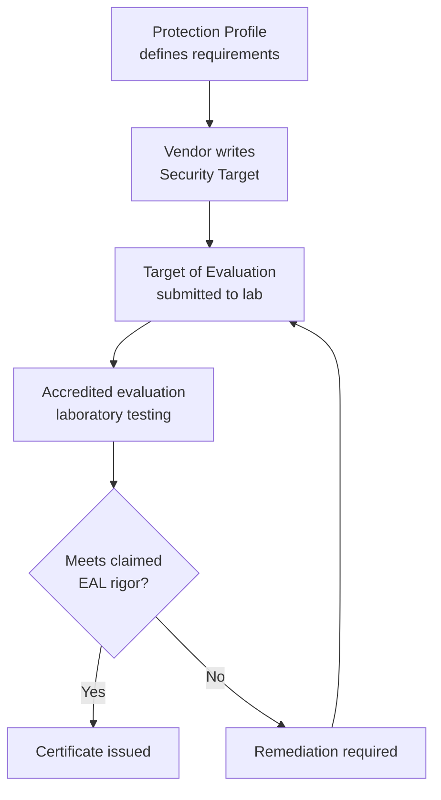

## Security Certification Standards

### Overview

Security certification standards provide independent, structured frameworks for evaluating whether an embedded device meets defined security requirements. For embedded systems specifically, certification matters because manufacturers, regulators, and integrators generally cannot verify a device's internal firmware and hardware security posture on their own — certification substitutes third-party or self-attested evidence for that trust gap. These standards vary widely in scope: some evaluate the development process, some evaluate the final product against specific technical requirements, and some evaluate the manufacturing and supply chain. This topic surveys the major standards relevant to embedded and IoT devices, organized by domain.

### Common Criteria (ISO/IEC 15408)

**Key Points**

- Common Criteria (CC) is an internationally recognized framework for evaluating IT security products, including embedded secure elements, smart cards, and TPMs.
- It defines *what* to evaluate through Protection Profiles (PPs) and *how rigorously* through Evaluation Assurance Levels (EALs).

Common Criteria is built around three core artifacts:

- **Protection Profile (PP)**: A document defining security requirements for a category of product (e.g., smart card ICs, hardware security modules), typically produced by industry consortiums or government bodies.
- **Security Target (ST)**: A vendor-specific document describing how a particular product meets the requirements of a chosen PP.
- **Target of Evaluation (TOE)**: The specific product or component being evaluated.

Evaluation Assurance Levels range from EAL1 (functionally tested, lowest rigor) to EAL7 (formally verified design and tested, highest rigor). Most commercial embedded secure elements (smart card chips, secure microcontrollers) target EAL4+ to EAL6+, since higher levels require formal methods and are typically reserved for very high-assurance government or military use. [Inference: exact EAL targeting varies by vendor and market segment and is not fixed by the standard itself.]

Common Criteria certification is recognized across the ~30+ member nations of the Common Criteria Recognition Arrangement (CCRA), meaning a certification obtained in one member country is generally accepted in others without re-evaluation. [Unverified: the current member count and mutual-recognition scope change periodically and should be checked against the current CCRA member list for a specific certification effort.]

### FIPS 140-3 (Cryptographic Module Validation)

**Key Points**

- FIPS 140-3 is a U.S. government standard (with broader international adoption) specifically for validating cryptographic modules — hardware, software, or firmware that implements cryptographic functions.
- It superseded FIPS 140-2 as the active standard for new validations. [Unverified: exact transition and sunset dates for legacy FIPS 140-2 certificates should be checked against current NIST/CMVP guidance at the time of a specific project.]

FIPS 140-3 defines four increasing security levels:

- **Level 1**: Basic security requirements; production-grade components, no physical security mechanisms required beyond basic ones.
- **Level 2**: Adds tamper-evidence requirements and role-based authentication.
- **Level 3**: Adds tamper-*detection* and *response* (the module actively resists physical attempts to access sensitive data, e.g., key zeroization on tamper detection), plus identity-based authentication.
- **Level 4**: Adds protection against environmental attacks (voltage/temperature manipulation) and a complete envelope of tamper protection.

Embedded devices that handle cryptographic keys — payment terminals, hardware security modules, secure boot implementations using validated crypto libraries — often require FIPS 140-3 validated cryptographic modules specifically to be sold into U.S. federal government or regulated industries (finance, healthcare). Validation is performed by NIST/CMVP-accredited testing laboratories, and validated modules are listed on the NIST Cryptographic Module Validation Program (CMVP) module list.

### IEC 62443 (Industrial Automation and Control Systems)

**Key Points**

- IEC 62443 is the dominant standard family for securing industrial control systems (ICS), SCADA, and operational technology (OT), including the embedded controllers within them.
- Unlike Common Criteria, it addresses the full lifecycle: component security, system integration, and organizational processes.

The standard is organized into parts addressing different stakeholders:

- **IEC 62443-4-1**: Secure product development lifecycle requirements for component manufacturers (applies directly to embedded firmware development processes).
- **IEC 62443-4-2**: Technical security requirements for individual components (embedded controllers, network devices), defining Security Levels 1 through 4 based on the sophistication of the threat actor the component is designed to resist (from casual/coincidental exposure at SL1 up to resistance against attackers with extended resources and IEC 62443-specific expertise at SL4).
- **IEC 62443-3-3**: System-level security requirements for integrated automation systems.
- **IEC 62443-2-1/2-4**: Requirements for asset owners and service providers (organizational/process focus rather than product focus).

For embedded developers specifically, IEC 62443-4-1 and 4-2 are the most directly applicable, since 4-1 governs how the firmware is developed (secure coding practices, vulnerability management processes, threat modeling requirements) and 4-2 governs what security capabilities the shipped component must have (authentication, logging, resource availability under attack conditions).

### FCC and Regional RF/IoT Security Requirements

**Key Points**

- Regulatory bodies increasingly bundle baseline cybersecurity requirements into product certification programs that were historically focused on radio frequency (RF) compliance alone.

The **FCC IoT Labeling Program** (marketed under the "U.S. Cyber Trust Mark") in the United States establishes a voluntary labeling scheme for consumer IoT devices, built on baseline criteria adapted from NIST IR 8425. [Unverified: program rollout timelines, mandatory vs. voluntary status, and specific enrolled product categories are subject to ongoing regulatory updates and should be verified against current FCC guidance for any specific compliance effort.] Devices seeking the label are generally expected to demonstrate baseline security capabilities such as unique per-device credentials (no shared default passwords), secure software update mechanisms, and basic vulnerability disclosure processes.

In the European Union, the **Radio Equipment Directive (RED)**, specifically Delegated Regulation (EU) 2022/30 covering Articles 3(3)(d), (e), and (f), extends the existing RF-focused RED certification to require that wireless-enabled devices protect network integrity, protect personal data and privacy, and prevent fraud. [Unverified: specific enforcement dates and harmonized standard references (e.g., ETSI EN 18031 series) should be checked against current official EU sources, as these have been subject to revision.]

### UL 2900 and UL Cybersecurity Assurance Program

**Key Points**

- UL (Underwriters Laboratories) extended its traditional product safety certification role into cybersecurity, particularly relevant for embedded devices in healthcare, industrial, and consumer network-connectable product categories.

UL 2900-1 defines general cybersecurity requirements applicable across network-connectable products, covering software weakness analysis (static/dynamic analysis of the firmware for known vulnerability classes), penetration testing, and security risk management process review. UL 2900-2-1 and 2900-2-2 provide sector-specific supplements for healthcare and industrial control systems respectively. This certification family is frequently referenced by U.S. FDA premarket guidance for medical device cybersecurity, though it operates as an independently referenceable standard rather than being an FDA-mandated certification itself. [Inference: the exact relationship between UL 2900 and specific regulatory submissions depends on the regulatory body and product category in question.]

### ioXt Alliance Certification

**Key Points**

- ioXt is an industry-driven (rather than government-driven) certification specifically targeting consumer and commercial IoT devices, emphasizing continuous compliance over a single point-in-time evaluation.

The ioXt framework defines a baseline set of security principles — no universal default passwords, secured interfaces, proven cryptography, verified software integrity via secure boot, security expiration disclosure (a published end-of-support date), and vulnerability reporting programs — then layers product-category-specific "profiles" on top (e.g., separate profiles for smart locks, cameras, routers, and mobile-connected devices) with escalating certification levels within each profile. A distinguishing feature relative to Common Criteria or FIPS is that ioXt places explicit emphasis on the manufacturer's ongoing security update commitment as part of the certification itself, rather than treating certification as a one-time snapshot of the shipped firmware.

### PSA Certified (Platform Security Architecture)

**Key Points**

- PSA Certified, developed originally around Arm's Platform Security Architecture, is a multi-level certification scheme specifically structured around silicon, firmware, and device layers of embedded systems.

PSA Certified evaluates in layered stages that map naturally onto the embedded supply chain:

- **Level 1**: Self-assessment against a baseline questionnaire covering fundamental security goals (secure boot, isolation, secure storage of keys).
- **Level 2**: Laboratory-based evaluation of the chip/silicon root of trust against a defined set of attack techniques, using standardized methodologies.
- **Level 3**: Adds resistance testing against more sophisticated hardware attacks, including certain side-channel and fault-injection techniques.
- **Level 4**: The highest tier, incorporating more extensive physical attack resistance evaluation.

Because Level 1 is self-certifiable and free, PSA Certified has seen broad adoption among silicon vendors and RTOS providers as a baseline signal, with Levels 2+ providing laboratory-verified assurance for higher-security use cases. [Inference: adoption patterns and the precise current level structure may evolve; verify against current PSA Certified program documentation for an active certification effort.]

### Standards Comparison

| Standard | Primary Domain | Evaluation Basis | Typical Embedded Use Case |
| --- | --- | --- | --- |
| Common Criteria (ISO 15408) | General IT security, secure elements | Independent lab evaluation, EAL1–EAL7 | Smart cards, TPMs, secure microcontrollers |
| FIPS 140-3 | Cryptographic modules | NIST/CMVP lab validation, Level 1–4 | Crypto libraries, HSMs, secure boot crypto |
| IEC 62443-4-1/4-2 | Industrial control systems | Process + product technical requirements, SL1–SL4 | Industrial controllers, OT gateways |
| FCC Cyber Trust Mark / EU RED | Consumer IoT / RF-connected devices | Regulatory baseline compliance | Consumer smart home devices |
| UL 2900 | Network-connectable products, healthcare, ICS | Software weakness analysis, pen testing | Medical devices, industrial systems |
| ioXt | Consumer/commercial IoT | Industry baseline + ongoing compliance | Cameras, locks, routers |
| PSA Certified | Silicon/firmware/device root of trust | Self-assessment to lab-based attack resistance | MCU vendors, RTOS platforms |

### Selecting a Certification Path

**Key Points**

- The right standard depends on target market, product category, and the specific security claim a manufacturer needs to substantiate.

Practical selection generally follows target market and regulatory exposure rather than a single "best" standard:

- Devices selling into U.S. federal/regulated sectors typically need FIPS 140-3 validated cryptography as a baseline, often alongside Common Criteria for the broader product if it's a secure element or similar high-assurance component.
- Devices in industrial/OT environments align to IEC 62443, with 4-1/4-2 governing the embedded component itself.
- Consumer IoT devices increasingly need to address FCC/EU regulatory labeling requirements as these become more codified, with ioXt or PSA Certified frequently used as the underlying technical framework that satisfies those regulatory baselines in practice.
- Silicon and RTOS vendors building a platform intended for reuse across many downstream products often pursue PSA Certified specifically because its layered structure lets downstream device manufacturers inherit assurance from the underlying chip/OS rather than re-proving root-of-trust properties themselves.

**Conclusion**

No single certification standard covers the full embedded security landscape, and this is a genuinely broad topic spanning cryptographic validation, industrial process requirements, consumer regulatory labeling, and silicon-level root-of-trust evaluation. In practice, embedded security certification is layered: silicon vendors establish a root of trust (PSA Certified), cryptographic implementations are separately validated (FIPS 140-3), the finished product may need sector-specific process and technical certification (IEC 62443, UL 2900), and consumer-facing products increasingly need to satisfy regulatory labeling baselines (FCC Cyber Trust Mark, EU RED) that are often satisfied via industry frameworks like ioXt. Because certification requirements, program status, and specific technical criteria change over time through official standards bodies, verifying current requirements against the relevant standards body is necessary before relying on any of the above for an active compliance effort.

**Related Topics**

- Secure boot chain design and hardware roots of trust
- FIPS-validated cryptographic library selection for embedded projects
- Threat modeling for IEC 62443 component certification
- Vulnerability disclosure program design for connected devices
- Common vulnerability classes in firmware
- Hardware security modules and secure elements in embedded design
- Regulatory compliance timelines for consumer IoT (FCC, EU RED)