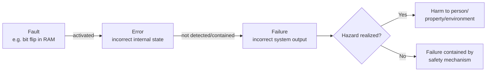
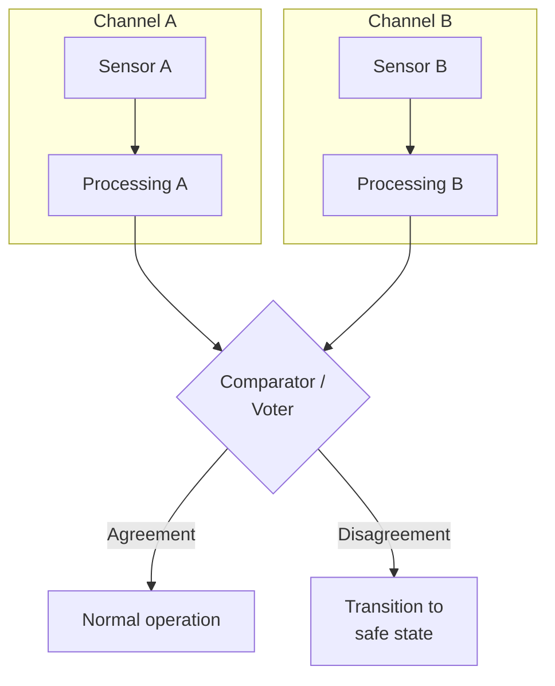
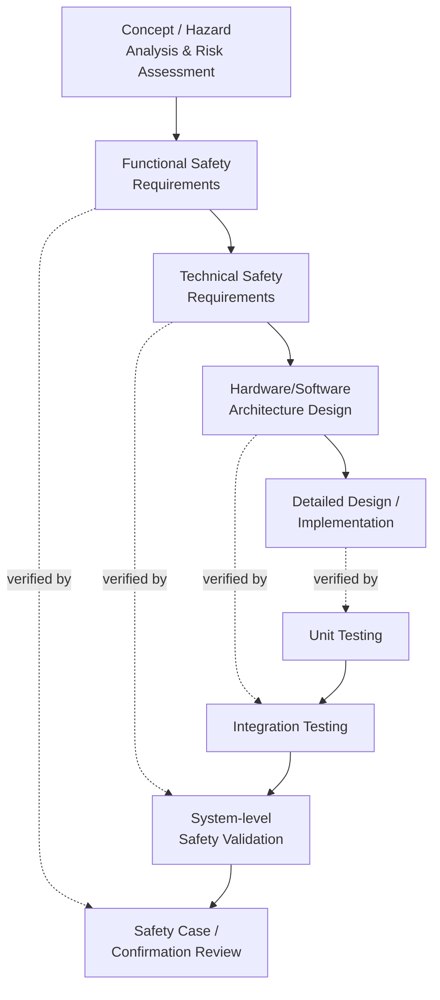

## Functional Safety Concepts

### Overview

Functional safety is the discipline of ensuring a system operates correctly in response to its inputs, including in the presence of faults, so that it does not create unacceptable risk to people, property, or the environment. This is distinct from general "quality" or "security" — functional safety is specifically concerned with hazardous failure modes and the mechanisms that detect, tolerate, or safely respond to them. For embedded devices, functional safety governs how hardware and firmware are designed, verified, and documented when a malfunction could cause physical harm — automotive electronic control units, medical infusion pumps, industrial robots, elevator controllers, and aircraft avionics are canonical examples.

This topic covers the core conceptual vocabulary and mechanisms shared across functional safety standards, independent of any single industry standard.

### Core Terminology

**Key Points**

- Functional safety has a precise, standardized vocabulary; imprecise use of these terms is a common source of miscommunication between engineering and safety disciplines.
- **Hazard**: A potential source of harm (e.g., unintended motor actuation, loss of braking).
- **Fault**: An abnormal condition that may cause a reduction in, or loss of, the capability of a system to perform a required function (e.g., a stuck-at bit in memory, a broken solder joint).
- **Error**: A discrepancy between a computed, observed, or measured value and the true, specified, or theoretically correct value, typically resulting from a fault being activated.
- **Failure**: The termination of the ability of a system to perform a required function, resulting from an error propagating to the system's output or behavior.
- **Fault → Error → Failure** describes the causal chain: a fault, if activated and not mitigated, produces an error; an error, if not contained, propagates into an observable failure.

- **Safety Function**: A function implemented to achieve or maintain a safe state for the system in relation to a specific hazard (e.g., "cut motor power within 50ms of overcurrent detection").
- **Safe State**: A state of the system where safety is achieved (not necessarily "off" — for example, a fail-operational flight control system may need to remain functional rather than shut down).
- **Tolerance Time / Fault Tolerant Time Interval (FTTI)**: The maximum time between a fault occurring and a hazard being realized, within which the safety mechanism must act.

### Risk Assessment and Safety Integrity Levels

**Key Points**

- Safety requirements are not applied uniformly; they are derived from a systematic assessment of risk severity, and expressed as a target integrity level that governs how rigorously the corresponding function must be engineered.

Risk assessment for functional safety generally considers three factors:

- **Severity**: How serious the harm would be if the hazard occurred (e.g., minor injury vs. fatality).
- **Exposure/Probability**: How often the hazardous situation arises during normal operation.
- **Controllability**: How likely it is that the person affected can act to avoid the harm (e.g., a driver's ability to react to a fault vs. a passenger with no control).

These factors combine, via a defined methodology, into a target integrity level — the specific naming and calculation method differs by industry standard:

| Standard | Domain | Integrity Level Scale |
| --- | --- | --- |
| IEC 61508 | General/generic (basis for sector-specific standards) | SIL 1–4 (Safety Integrity Level) |
| ISO 26262 | Automotive | ASIL A–D (Automotive Safety Integrity Level), plus QM (no safety requirement) |
| IEC 62061 | Industrial machinery | SIL 1–3 |
| ISO 13849 | Industrial machinery (simplified approach) | PL a–e (Performance Level) |
| DO-178C | Airborne software | DAL A–E (Design Assurance Level) |
| IEC 62304 | Medical device software | Class A/B/C (software safety classification) |

Higher integrity levels demand progressively more rigorous development processes: more extensive requirements traceability, more thorough verification and validation, stronger architectural safety mechanisms (redundancy, diagnostics), and often independent assessment by a party outside the immediate development team. [Inference: the exact process rigor mapped to each level is standard-specific and detailed tables should be consulted for a specific compliance effort.]

### Systematic vs. Random Hardware Failures

**Key Points**

- Functional safety standards draw a fundamental distinction between failures caused by design/process mistakes and failures caused by physical degradation, because the mitigation strategy differs entirely between the two.

**Systematic failures** arise from human error in the specification, design, implementation, or manufacturing process — a firmware logic bug, an incorrect requirement, a flawed schematic. These cannot be quantified probabilistically or "designed around" statistically; they are addressed through *process rigor*: structured requirements management, design and code review, static analysis, structured testing, and configuration management. A system with zero systematic faults in its logic will behave correctly every time it encounters the same inputs under the same conditions — the fault is deterministic, not random.

**Random hardware failures** arise from physical degradation of hardware components over time (a resistor drifting out of tolerance, a solder joint fatiguing, a memory cell's charge leaking) and are inherently probabilistic. These are addressed through quantitative reliability engineering: failure rate data (often expressed in FIT — Failures In Time, i.e., failures per $10^9$ device-hours), redundancy, and diagnostic coverage.

$$\lambda_{total} = \lambda_{safe} + \lambda_{dangerous}$$

Where $\lambda_{total}$ is the total failure rate of a component, decomposed into failure modes that lead to a safe outcome ($\lambda_{safe}$, e.g., fail-to-off in a system where off is safe) versus a dangerous outcome ($\lambda_{dangerous}$, e.g., fail-to-on when on is hazardous). Diagnostic coverage further splits dangerous failures into those detected by a diagnostic mechanism ($\lambda_{DD}$) versus those left undetected ($\lambda_{DU}$) — it is $\lambda_{DU}$ that primarily drives residual risk, since undetected dangerous failures can persist silently until the hazard is realized.

### Architectural Safety Mechanisms

**Key Points**

- Because both systematic and random faults are assumed to be possible in principle (functional safety does not assume perfect design or perfect hardware), systems implement specific architectural mechanisms to detect and respond to faults at runtime.

**Redundancy**

Duplicating a function across independent channels allows the system to detect disagreement (in a 1-out-of-2, or "1oo2," voting architecture) or to continue operating correctly even if one channel fails (in a 2-out-of-3, or "2oo3," voting architecture, common in aircraft flight computers). Redundancy is only effective against random hardware failures if the channels are sufficiently independent — using identical hardware and identical firmware on both channels does not protect against a systematic design fault, since both channels would fail identically and simultaneously. This is why some high-integrity designs use *diverse redundancy*: different hardware architectures or independently developed software implementing the same function, specifically to avoid common-cause and common-mode failures.

**Watchdog Timers**

A watchdog timer monitors that firmware execution is proceeding as expected, typically requiring the application to periodically "kick" or "pet" the watchdog within a defined time window. If the application fails to do so — due to a hang, infinite loop, or crash — the watchdog forces a reset or transition to a safe state. Simple watchdogs only verify that *some* code is executing periodically; more robust designs (windowed watchdogs, or watchdogs that require a specific challenge-response sequence rather than a simple register write) provide stronger evidence that the *correct* code path executed, since a corrupted program counter that happens to loop through the watchdog-kick instruction would defeat a naive watchdog.

**Memory Protection and Partitioning**

A memory protection unit (MPU) or memory management unit (MMU) enforces that different software components (particularly a safety-critical function versus a non-safety-critical function sharing the same processor) cannot corrupt each other's memory. This underlies the concept of **freedom from interference**, a core requirement in mixed-criticality systems where safety and non-safety code coexist on one chip — without enforced partitioning, a fault in low-criticality code (e.g., an infotainment display driver) could in principle corrupt memory used by a high-criticality function (e.g., braking control), which safety standards treat as unacceptable unless independence is architecturally proven.

**Error Detection Codes**

Memory and communication buses use error detection and correction mechanisms proportional to the integrity requirement:

- **Parity**: Detects single-bit errors, cannot correct them.
- **CRC (Cyclic Redundancy Check)**: Detects a broader class of multi-bit and burst errors in transmitted or stored data, commonly used on safety-relevant communication buses (e.g., automotive CAN with an additional safety layer) and in bootloader image verification.
- **ECC (Error-Correcting Code) memory**: Detects and corrects single-bit errors and detects (without correcting) certain multi-bit errors in RAM, commonly required for safety-relevant memory in higher ASIL/SIL designs.

**Plausibility and Range Checks**

Firmware validates that sensor readings and internal computed values fall within physically plausible bounds and are self-consistent (e.g., cross-checking a wheel speed sensor against an independently derived vehicle speed estimate). A value outside plausible range, or disagreement between independently derived values, is treated as a fault indication even without a direct hardware failure signal.

### The V-Model and Safety Lifecycle

**Key Points**

- Functional safety standards mandate a structured development lifecycle, most commonly visualized as a V-model, where each design/decomposition activity on the left side of the V has a corresponding verification activity on the right side.

Each level of decomposition on the left (concept → functional requirements → technical requirements → design → implementation) is matched by a corresponding verification or validation activity on the right, ensuring traceability from a hazard identified at the top of the V all the way down to a specific line of firmware, and back up through test evidence confirming that implementation satisfies the original safety requirement. This traceability is typically maintained in a requirements management tool and is a primary artifact reviewed during a safety assessment or audit.

### Common Cause and Common Mode Failures

**Key Points**

- Redundancy is only as strong as the independence between redundant channels; shared root causes can defeat redundancy entirely.

A **common cause failure (CCF)** occurs when a single underlying cause (a shared power supply, a shared clock source, a manufacturing batch defect, extreme temperature affecting co-located components) causes multiple redundant channels to fail concurrently or near-concurrently. A **common mode failure** is a specific case where multiple channels fail in the *same way* due to the same cause — most dangerously, a systematic firmware bug replicated identically across all redundant channels, which would cause all channels to fail simultaneously and identically under the triggering condition. Mitigations include physical separation of redundant hardware, independent power and clock domains, diverse implementation, and analysis techniques (such as Failure Modes, Effects, and Diagnostic Analysis — FMEDA) specifically intended to identify shared dependencies between nominally independent channels.

### Software-Specific Safety Concepts

**Key Points**

- Safety standards impose requirements specific to software, since software faults are purely systematic (software does not "wear out" the way hardware does) but can still cause hazardous failures.

**Coding Standards and Static Analysis**: Safety-critical firmware typically must conform to a restricted subset of the source language intended to eliminate undefined behavior and error-prone constructs — MISRA C is the most widely referenced such standard for C/C++ in safety contexts. Compliance is generally verified through static analysis tooling rather than manual review alone, given the volume of rules involved.

**Structural Code Coverage**: Beyond functional test coverage (does the test suite exercise the specified requirements), safety standards often require structural coverage metrics that measure how thoroughly the *code itself* was exercised — statement coverage, branch/decision coverage, and for the highest criticality software, Modified Condition/Decision Coverage (MC/DC), which requires that each condition within a decision be shown to independently affect the decision's outcome. [Inference: the specific coverage level required scales with integrity level and is standard-specific.]

**Tool Qualification**: When a software tool (compiler, static analyzer, test framework) is used to produce or verify safety-relevant artifacts, the tool itself may need to be qualified — i.e., evidence must be provided that the tool does not introduce errors, or that errors it might introduce would be detected by other means in the process. This is particularly relevant for compilers, since an unqualified compiler could in principle generate object code that does not faithfully implement the reviewed source code.

### Diagnostic Coverage and Safe Failure Fraction

**Key Points**

- Quantitative metrics allow a design to demonstrate, numerically, that it meets the required integrity level rather than relying solely on qualitative process arguments.

**Diagnostic Coverage (DC)** expresses the fraction of dangerous failures that a system's diagnostic mechanisms are able to detect:

$$DC = \frac{\lambda_{DD}}{\lambda_{DD} + \lambda_{DU}}$$

**Safe Failure Fraction (SFF)** expresses the proportion of a component's total failure rate that results in either a safe failure or a detected dangerous failure (i.e., excludes only the undetected-dangerous portion):

$$SFF = \frac{\lambda_{safe} + \lambda_{DD}}{\lambda_{safe} + \lambda_{DD} + \lambda_{DU}}$$

These metrics, combined with hardware architectural constraints (minimum redundancy requirements at a given integrity level, particularly in IEC 61508-derived standards) and the quantitative failure rate target for the safety function as a whole, form the quantitative half of a safety case — complementing the qualitative process-rigor evidence (requirements traceability, review records, coding standard compliance) required for systematic failure mitigation. [Inference: the precise numerical targets and architectural constraint tables differ across standards and revisions, and should be sourced from the specific applicable standard.]

### Relationship to Security

**Key Points**

- Functional safety and security are related but distinct disciplines; a system can be functionally safe while remaining insecure, and vice versa, though modern connected embedded systems increasingly require both to be addressed jointly.

Functional safety assumes faults arise from *random physical degradation* or *unintentional systematic error*; it does not traditionally assume an intelligent adversary deliberately inducing faults. Security, conversely, assumes an adversary is actively trying to defeat protections. A device can pass functional safety certification (correctly handling sensor failures, memory corruption from cosmic ray bit-flips, etc.) while remaining trivially exploitable over a network interface that safety analysis never considered, since that interface poses no *hazard* in the safety sense until an attacker uses it to deliberately trigger unsafe behavior. This gap has driven the emergence of combined safety-security standards and extensions (such as ISO/SAE 21434 for automotive cybersecurity, developed to work alongside ISO 26262) that explicitly address the case where a security vulnerability becomes a safety hazard — for example, a network-exploitable firmware bug that lets an attacker deliberately induce the same unsafe actuator state that functional safety analysis assumed could only occur through random hardware failure.

**Conclusion**

Functional safety is a broad discipline spanning risk assessment methodology, quantitative reliability engineering, architectural fault-tolerance mechanisms, and process rigor for systematic fault avoidance — this overview necessarily covers concepts common across standards rather than the full detail of any single one. The unifying thread across all of it is the fault → error → failure → hazard causal chain: every mechanism described here, from watchdog timers to MC/DC coverage to diverse redundancy, exists to either prevent a fault from occurring, prevent an activated fault from propagating into a failure, or ensure that if a failure does occur, the system reaches a safe state before the associated hazard is realized. Because specific numerical targets, architectural constraints, and process requirements are defined by the applicable industry standard (ISO 26262, IEC 61508, DO-178C, IEC 62304, etc.) and are periodically revised, the concepts here should be treated as the shared conceptual foundation to be grounded in the specific applicable standard for any real compliance effort.

**Related Topics**

- ISO 26262 automotive functional safety in depth
- IEC 61508 as the parent standard for sector-specific derivatives
- MISRA C coding guidelines for safety-critical firmware
- Failure Modes, Effects, and Diagnostic Analysis (FMEDA) methodology
- ISO/SAE 21434 automotive cybersecurity and its relationship to ISO 26262
- Redundant architecture design patterns (1oo2, 2oo3, dual-channel)
- Common vulnerability classes in firmware
- Security certification standards