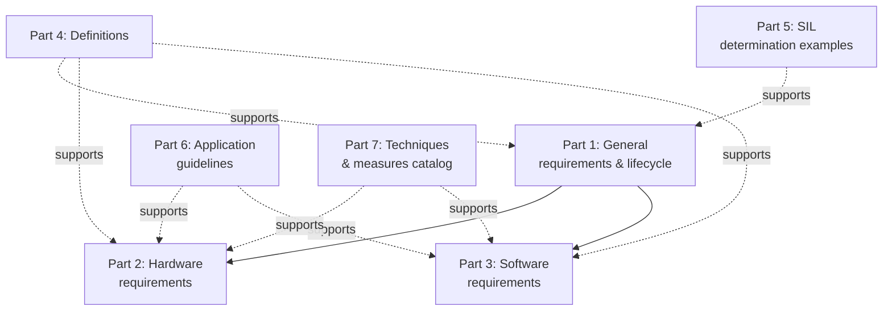
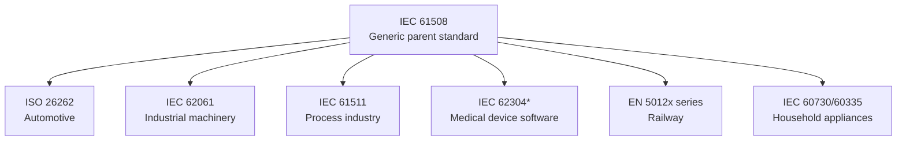

## Safety Standards Overview: IEC 61508 and Derivatives

### Overview

IEC 61508, titled "Functional Safety of Electrical/Electronic/Programmable Electronic Safety-related Systems," is the foundational generic standard from which most sector-specific functional safety standards are derived. Rather than targeting a specific industry, it establishes a generic risk-based methodology, a common vocabulary, and a set of quantitative and qualitative requirements that sector committees have since adapted into automotive, machinery, process industry, medical, and rail-specific variants. Understanding IEC 61508 provides the shared conceptual backbone for reading any of its derivatives, since most sector standards explicitly reference back to it or reuse its structure even where they diverge in detail.

This topic covers IEC 61508's structure and core requirements, then surveys its major sector-specific derivatives and how each diverges from the parent standard.

### IEC 61508 Structure

**Key Points**
- IEC 61508 is published as a multi-part standard; different parts address different lifecycle phases and different types of readers (hardware engineers, software engineers, application-layer implementers).

The standard is organized into seven parts:
- **Part 1**: General requirements — overall safety lifecycle, management of functional safety, competence requirements.
- **Part 2**: Requirements for E/E/PE safety-related systems — hardware-focused requirements, architectural constraints, hardware fault tolerance.
- **Part 3**: Software requirements — software safety lifecycle, requirements for avoiding and controlling systematic software faults.
- **Part 4**: Definitions and abbreviations.
- **Part 5**: Examples of methods for determining Safety Integrity Levels — illustrative risk graph and layer-of-protection methodologies.
- **Part 6**: Guidelines on application of Parts 2 and 3 — worked examples and clarifying guidance.
- **Part 7**: Overview of techniques and measures — a reference catalog of specific mitigation techniques (redundancy architectures, diagnostic techniques, coding practices) referenced by the normative parts.

Parts 1–3 are normative (contain the actual requirements an assessor checks compliance against); Parts 4–7 are largely definitional, illustrative, or reference material supporting the normative parts.

### The Overall Safety Lifecycle

**Key Points**
- IEC 61508 Part 1 defines an "overall safety lifecycle" spanning from initial concept through decommissioning, and this lifecycle structure is the template most sector derivatives inherit, even when they rename or reorganize individual phases.

The lifecycle proceeds broadly through: concept definition, overall scope definition, hazard and risk analysis, overall safety requirements specification, safety requirements allocation (to hardware, software, or external risk reduction facilities), realization (design and implementation), installation and commissioning, safety validation, operation and maintenance, and eventually decommissioning. A defining feature of IEC 61508's approach is that safety integrity requirements are derived directly from the hazard and risk analysis phase and then allocated down through the lifecycle — a Safety Integrity Level is not selected arbitrarily but calculated (or reasoned through a structured risk graph or similar method) from the severity, exposure, and controllability of the specific hazard the safety function addresses.

### Safety Integrity Levels (SIL) in IEC 61508

**Key Points**
- SIL is IEC 61508's central quantitative-plus-qualitative concept: a target level of risk reduction that a safety function must achieve, expressed on a four-point scale.

SIL 1 through SIL 4 represent increasing risk reduction, with SIL 4 reserved for the highest-consequence applications and rarely used outside specific high-hazard process industry contexts, since achieving SIL 4 typically demands extensive redundancy and process rigor that is often impractical or uneconomical outside narrow applications. [Inference: SIL 4 usage patterns are domain-dependent; some sector derivatives such as automotive ASIL do not map directly onto SIL numbering at all.]

Two complementary requirement types apply at each SIL:
- **Hardware safety integrity requirements**: Quantitative — expressed as a target probability of failure, using different metrics depending on how frequently the safety function is invoked. **Probability of Failure on Demand (PFD)** applies to low-demand safety functions (invoked infrequently, e.g., an emergency shutdown system tested periodically). **Probability of Failure per Hour (PFH)** applies to high-demand or continuous-mode functions (invoked frequently or continuously, e.g., a continuously active speed monitoring function).
- **Software safety integrity requirements**: Largely qualitative — a defined set of techniques and measures (from the Part 7 catalog) that must be applied at each SIL, since software faults cannot be quantified probabilistically the way random hardware failures can.

| SIL | PFD (low demand) | PFH (high demand, per hour) |
|---|---|---|
| 4 | $10^{-5}$ to $10^{-4}$ | $10^{-9}$ to $10^{-8}$ |
| 3 | $10^{-4}$ to $10^{-3}$ | $10^{-8}$ to $10^{-7}$ |
| 2 | $10^{-3}$ to $10^{-2}$ | $10^{-7}$ to $10^{-6}$ |
| 1 | $10^{-2}$ to $10^{-1}$ | $10^{-6}$ to $10^{-5}$ |

These ranges are as defined in the standard's normative tables; the exact boundary values should be confirmed against the specific edition of IEC 61508 in use for a compliance effort, as editions have been revised. [Unverified: confirm exact table values against the current standard edition.]

### Hardware Fault Tolerance and Architectural Constraints

**Key Points**
- IEC 61508 constrains not just the probabilistic failure rate but the minimum redundancy architecture permitted at a given SIL, based on the safe failure fraction of the components involved.

**Hardware Fault Tolerance (HFT)** is the number of faults a subsystem can sustain while still performing its safety function — HFT = 0 means a single fault can cause loss of the safety function; HFT = 1 means the subsystem tolerates one fault (typically implying at least a duplicated, 1oo2-style architecture) before the function is lost. IEC 61508 Part 2 defines architectural constraint tables that specify, for a given combination of Safe Failure Fraction (introduced in the prior functional safety concepts topic) and target SIL, the minimum HFT required — components with lower SFF need higher redundancy to reach the same SIL, and vice versa. Two routes exist for justifying architectural constraints: **Route 1H**, based on the SFF/HFT table approach, and **Route 2H**, based on more extensive component reliability data and prior-use justification, offering an alternative path where SFF data is harder to establish rigorously. [Inference: applicability of Route 2H depends on the availability of sufficiently rigorous field or test data and is generally considered a more demanding evidentiary path.]

### Major Sector-Specific Derivatives

**Key Points**
- Sector committees adapted IEC 61508's generic framework to domain-specific hazard profiles, terminology, and existing industry practice, producing a family of derivative standards that share DNA but are not interchangeable.

*IEC 62304 is influenced by and conceptually aligned with IEC 61508 principles but is not a formal derivative in the same direct sense as the others; it originates primarily from medical device quality system practice. [Inference: the degree of direct lineage varies by standard and source.]

**ISO 26262 — Road Vehicles Functional Safety**

Covers electrical and electronic systems in production road vehicles. Diverges from IEC 61508's SIL scale, using instead **ASIL A through D** (plus QM, "Quality Management," for functions with no safety relevance), derived from a risk assessment combining Severity, Exposure, and Controllability specific to the automotive context (rather than IEC 61508's more generic risk graph parameters). ISO 26262 also introduces automotive-specific concepts not present in the generic standard, including the **Safety Element out of Context (SEooC)** — a component developed against assumed requirements before the specific vehicle integration context is known, common for semiconductor and Tier 1 supplier components sold across multiple vehicle programs.

**IEC 62061 — Safety of Machinery**

Applies IEC 61508 principles specifically to industrial machinery safety-related electrical control systems, retaining the SIL 1–3 scale (SIL 4 is not used in this domain, reflecting the lower typical severity ceiling relative to process industry major-accident hazards). IEC 62061 is often used alongside, or is considered a partially overlapping alternative to, **ISO 13849** (Safety of Machinery — Safety-Related Parts of Control Systems), which takes a somewhat different methodological approach using Performance Levels (PL a–e) and predefined designated architectures (Category B, 1, 2, 3, 4) rather than IEC 61508's SFF/HFT table approach — machinery designers sometimes choose between IEC 62061 and ISO 13849 based on which methodology better fits their design approach and existing familiarity. [Inference: the practical choice between the two standards in machinery design is influenced by organizational familiarity and specific architecture patterns as much as by strict technical necessity.]

**IEC 61511 — Process Industry Safety Instrumented Systems**

Applies to Safety Instrumented Systems (SIS) in the process industries (oil and gas, chemical processing), where SIL 4 is more commonly encountered than in other derivatives due to the severity of major accident hazards (large-scale chemical release, explosion). IEC 61511 places heavy emphasis on the Safety Requirements Specification and proof-testing regimes for low-demand safety instrumented functions, since many process industry safety functions (e.g., emergency shutdown valves) sit dormant for long periods and their failure rate must be managed through periodic functional testing.

**IEC 62304 — Medical Device Software**

Classifies software into Class A, B, or C based on the severity of harm that could result from a software failure (Class A: no injury possible; Class C: death or serious injury possible), governing the rigor of the required software development and verification process. While conceptually aligned with systematic-fault-avoidance principles found in IEC 61508 Part 3, IEC 62304 is structured around software life-cycle process requirements more directly and does not use IEC 61508's SIL terminology or quantitative hardware failure rate framework, reflecting its origin in the medical device quality management ecosystem (alongside standards such as ISO 14971 for risk management) rather than a direct derivation from IEC 61508. [Inference: this characterization of lineage reflects general industry understanding rather than a specific normative statement within IEC 62304 itself.]

**EN 5012x Series — Railway**

The railway sector uses a family of standards (commonly referenced as EN 50126, EN 50128 for software, and EN 50129 for signaling-related electronic systems), using **SIL 0 through SIL 4**, closely aligned with IEC 61508's SIL scale and quantitative approach, reflecting rail signaling's historical closeness to the process/generic industrial safety tradition from which IEC 61508 itself emerged.

**IEC 60730 / IEC 60335 — Household and Similar Appliances**

Rather than adopting SIL-based methodology directly, these standards define software classes (Class A, B, C, broadly analogous in spirit to IEC 62304's classification, though defined independently for the appliance domain) governing the software integrity requirements for appliance control functions, reflecting a lighter-weight approach appropriate to the generally lower hazard severity of household appliances relative to industrial, automotive, or medical contexts.

### Cross-Standard Comparison

| Derivative | Domain | Integrity Scale | Notable Divergence from IEC 61508 |
|---|---|---|---|
| ISO 26262 | Automotive | ASIL A–D, QM | Automotive-specific S/E/C risk parameters, SEooC concept |
| IEC 62061 | Machinery | SIL 1–3 | No SIL 4; overlaps with ISO 13849's PL approach |
| ISO 13849 | Machinery (alternative) | PL a–e | Designated architecture categories instead of SFF/HFT tables |
| IEC 61511 | Process industry | SIL 1–4 | Strong emphasis on proof-test intervals for low-demand SIS |
| IEC 62304 | Medical device software | Class A/B/C | No quantitative hardware failure rate framework |
| EN 5012x | Railway | SIL 0–4 | Close alignment with IEC 61508's quantitative approach |
| IEC 60730/60335 | Household appliances | Class A/B/C | Lighter-weight, appliance-specific software classes |

### Practical Implications for Embedded Development

**Key Points**
- For embedded developers, the practical consequence of this standards family is that the *specific* standard governing a project depends entirely on the target industry, and generic IEC 61508 compliance is rarely the end goal in itself outside of general-purpose safety component manufacturers (e.g., a PLC or sensor vendor selling across multiple industries).

A component manufacturer building a general-purpose safety relay, sensor, or programmable logic controller intended for use across multiple industries (machinery, process, possibly others) is a plausible candidate for direct IEC 61508 certification, since their component's ultimate application context is not yet known — an approach conceptually similar to ISO 26262's SEooC, since the manufacturer is developing "out of context" relative to the final safety function it will be integrated into. By contrast, a developer building firmware for a specific automotive braking ECU, a specific insulin pump, or a specific machine tool controller works to the applicable sector derivative directly, since that derivative contains the domain-specific risk assessment methodology, terminology, and (where applicable) regulatory recognition that the generic parent standard does not directly provide for that market.

**Conclusion**

IEC 61508 functions as the shared grammar underlying a diverse family of sector-specific functional safety standards — its core concepts of SIL-based risk classification, hardware architectural constraints derived from safe failure fraction, and structured software lifecycle requirements for systematic fault avoidance recur, in adapted form, across automotive, machinery, process industry, medical, and rail applications. This breadth is inherent to the topic: a genuinely complete treatment would require separate deep coverage of each derivative's specific requirements, risk assessment methodology, and certification process. The practical starting point for any embedded project is identifying which sector derivative (if any) governs the target application, since that determines the specific integrity scale, quantitative targets, and process requirements that actually apply — direct IEC 61508 compliance is the exception rather than the norm for application-specific embedded firmware.

**Related Topics**
- Functional safety concepts (fault/error/failure model, redundancy architectures)
- ISO 26262 automotive functional safety in depth
- ISO/SAE 21434 automotive cybersecurity and its relationship to ISO 26262
- MISRA C coding guidelines for safety-critical firmware
- Safety Element out of Context (SEooC) development approach
- Failure Modes, Effects, and Diagnostic Analysis (FMEDA) methodology
- Security certification standards