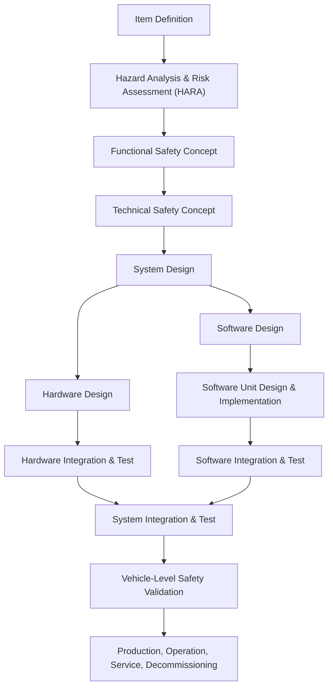
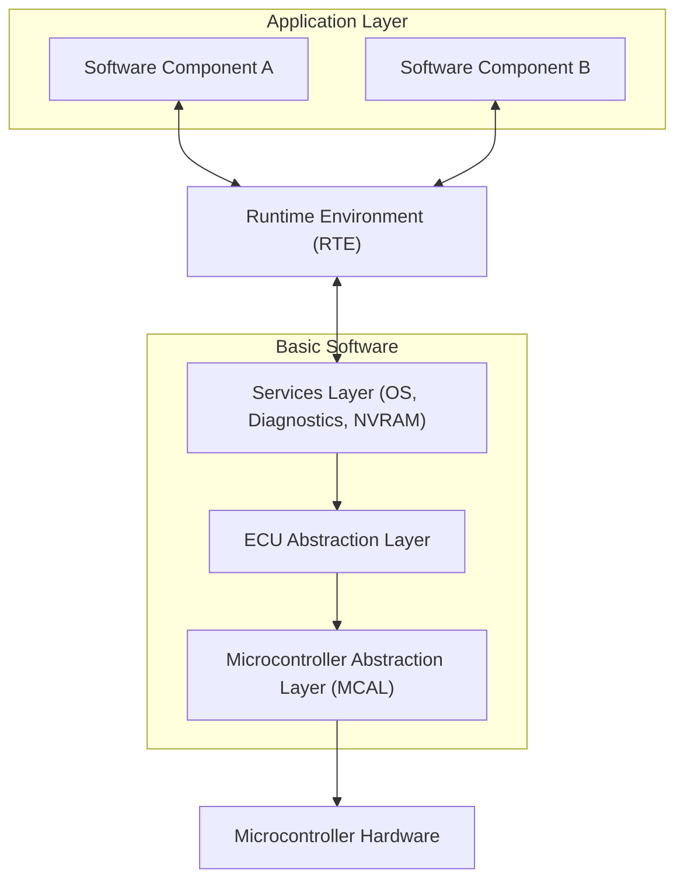

## Automotive Standards: ISO 26262 and AUTOSAR

### Overview

Automotive embedded systems operate brakes, steering, airbags, and increasingly complex driver-assistance and autonomous functions. A software or hardware fault in these systems can cause physical harm, which places automotive development under a different discipline than consumer embedded work. Two frameworks dominate this space: **ISO 26262**, a functional safety standard, and **AUTOSAR**, a software architecture standard. They are complementary rather than competing — ISO 26262 defines *what* must be done to manage risk, while AUTOSAR defines *how* the software is structured to make that manageable at scale across suppliers and OEMs (Original Equipment Manufacturers).

### Why Automotive Needs Dedicated Standards

General embedded practices (covered elsewhere in this material under real-time operating systems, memory safety, and hardware abstraction) are necessary but insufficient for vehicles. Automotive systems have properties that push them into a stricter regime:

- **Life-safety consequences.** A bug in a thermostat is an inconvenience; a bug in electronic stability control can be fatal.
- **Long supply chains.** A single vehicle integrates software and hardware from dozens of Tier 1 and Tier 2 suppliers, each contributing modules that must interoperate predictably.
- **Long product lifecycles.** Vehicles remain in service for 10–20 years, requiring maintainability and traceability far beyond typical consumer electronics.
- **Regulatory and liability exposure.** Manufacturers must demonstrate — often to regulators and in court — that a rigorous, auditable process was followed.

These pressures produced ISO 26262 (process and risk management) and, separately but around the same era, AUTOSAR (a shared software architecture to avoid every supplier reinventing incompatible low-level software).

### ISO 26262: Functional Safety for Road Vehicles

#### What It Is

ISO 26262, titled "Road vehicles — Functional safety," is an international standard adapted from the more general IEC 61508 (functional safety for electrical/electronic/programmable electronic systems) specifically for passenger vehicles. It was first published in 2011 and revised in 2018 to broaden scope beyond passenger cars up to 3,500 kg to include trucks, buses, motorcycles, and other vehicle classes.

ISO 26262 does not mandate specific technologies. Instead, it mandates a **process**: a lifecycle of activities, work products, and verification steps intended to reduce the risk of systematic and random hardware failures causing harm.

#### The Core Concept: Functional Safety

Functional safety is the part of overall safety that depends on a system correctly detecting a hazardous condition and responding to bring the system to a safe state, or on the system operating correctly to avoid introducing a hazard in the first place. ISO 26262 is concerned with **malfunctioning behavior** of electrical and electronic (E/E) systems — it does not cover mechanical failures unrelated to E/E systems, nor does it cover intentional misuse (that falls under cybersecurity standards such as ISO/SAE 21434).

#### Automotive Safety Integrity Levels (ASIL)

The central risk-classification mechanism in ISO 26262 is the **ASIL**, ranging from ASIL A (lowest rigor) to ASIL D (highest rigor), plus a "QM" (Quality Management) classification for functions where standard quality processes suffice because the residual risk is negligible.

ASIL is not assigned to a whole vehicle or even a whole ECU (Electronic Control Unit) — it is assigned per hazardous event, based on three factors combined in a **Hazard Analysis and Risk Assessment (HARA)**:

- **Severity (S0–S3):** How badly could this hazard hurt people if it occurs? (S0 = no injuries, S3 = life-threatening or fatal injuries.)
- **Exposure (E0–E4):** How often does the operational situation in which this hazard could occur actually happen? (E1 = very low probability, E4 = high probability, e.g., every drive.)
- **Controllability (C0–C3):** Can the driver or other people typically avoid the harm through their own action? (C0 = controllable in general, C3 = difficult or impossible to control.)

These three factors combine via a lookup table defined in the standard to produce the ASIL. For example, a hazard with high severity, frequent exposure, and low controllability tends toward ASIL D — this is the classification typically associated with functions like airbag deployment or steering control failure. A hazard with low severity or one that's easily controlled by the driver may only warrant QM.

$$
\text{ASIL} = f(S, E, C)
$$

Higher ASILs demand more rigorous engineering: more independent verification, stronger diagnostic coverage, more redundancy, and more extensive documentation. Decomposing a high-ASIL requirement into redundant lower-ASIL elements (**ASIL decomposition**) is permitted under specific architectural conditions, allowing engineers to distribute risk mitigation across independent channels.

#### The V-Model Lifecycle

ISO 26262 structures development around a **V-model**: the left side descends through increasingly detailed design (concept, system requirements, hardware/software requirements, architecture, unit design), and the right side ascends through corresponding verification and validation activities (unit testing, integration testing, system testing, safety validation), each right-side stage tracing back to its left-side counterpart.

Part 6 of ISO 26262 specifically addresses **software-level requirements**, including coding guidelines, unit verification methods, and software architectural design constraints. Part 4 addresses system-level requirements, and Part 5 addresses hardware.

#### Key Engineering Techniques Mandated or Recommended

- **FMEA (Failure Mode and Effects Analysis)** and **FTA (Fault Tree Analysis)** to systematically identify how components can fail and what the consequences are.
- **Diagnostic coverage** requirements for hardware, meaning the design must be able to detect a defined percentage of possible faults (e.g., via watchdog timers, memory protection units, lockstep processor cores).
- **Freedom from interference** analysis, ensuring that a lower-ASIL software component sharing an ECU with a higher-ASIL component cannot corrupt or delay it (relevant to memory partitioning and scheduling design, covered elsewhere under RTOS partitioning).
- **MC/DC (Modified Condition/Decision Coverage)** testing, a stringent structural code-coverage criterion typically required at ASIL C/D.
- **Static analysis and formal coding guidelines**, frequently implemented via MISRA C/C++ (Motor Industry Software Reliability Association) rule sets, which restrict undefined and unsafe language constructs.

[Inference] The specific coverage percentages and diagnostic coverage targets vary by ASIL level and are defined in normative tables within the standard; exact figures should be verified against the current edition (ISO 26262:2018) rather than assumed from general knowledge, since interpretations and supplier-specific tailoring do vary.

#### Safety Case and Traceability

A key deliverable is the **safety case**: a structured argument, supported by evidence (test reports, analyses, reviews), that the system is acceptably safe for its intended use. Full bidirectional traceability — from hazard, to requirement, to design element, to test case, to result — is expected throughout, since auditors and assessors need to verify that every safety requirement was actually implemented and verified, and that no implemented behavior lacks a traceable safety rationale.

### AUTOSAR: AUTomotive Open System ARchitecture

#### What It Is

AUTOSAR is a global partnership of automotive OEMs, Tier 1 suppliers, and semiconductor/tool vendors, founded in 2003, that defines a standardized software architecture for automotive ECUs. Its goal is to decouple application software from the underlying hardware and basic software services, so that software components can be reused, exchanged between suppliers, and integrated more predictably.

AUTOSAR is not itself a safety standard — it does not assign ASILs or require HARAs — but it is designed to be compatible with ISO 26262 and provides architectural mechanisms (like the E2E library and memory partitioning) that make satisfying ISO 26262 requirements more tractable.

#### The Two Main Platforms

AUTOSAR today spans two distinct platforms addressing different classes of ECU:

- **AUTOSAR Classic Platform (CP):** Designed for traditional, resource-constrained microcontroller-based ECUs (engine control, body control, brakes) with statically configured, deeply embedded real-time software, typically written in C.
- **AUTOSAR Adaptive Platform (AP):** Introduced later to address ECUs with higher computational demands and dynamic behavior — think ADAS (Advanced Driver Assistance Systems), autonomous driving compute, and infotainment — running on POSIX-based operating systems (often Linux-derived) with service-oriented communication, written primarily in C++14/17.

[Unverified] Exact language version requirements and OS baseline recommendations for the Adaptive Platform may have been revised in more recent AUTOSAR releases; version-specific claims should be checked against the current AUTOSAR release documentation.

#### AUTOSAR Classic Platform Layered Architecture

The Classic Platform defines three strict software layers running on an ECU:

- **Application Layer:** Software Components (SWCs) implementing the actual vehicle function (e.g., a wiper-control algorithm), communicating only through defined **ports** and **interfaces**, never accessing hardware directly.
- **Runtime Environment (RTE):** A generated communication layer acting as the sole intermediary between SWCs and between SWCs and Basic Software, implementing the virtual function bus concept in a concrete, ECU-specific form.
- **Basic Software (BSW):** A stack of standardized modules providing services — the Operating System (an OSEK/VDX-compliant scheduler), Communication Stack (CAN, LIN, FlexRay, Ethernet handling), Memory Stack (NVRAM management), Diagnostic services (UDS), and Microcontroller Abstraction Layer / ECU Abstraction Layer that isolate hardware specifics.

This layering is what enables **portability**: an application SWC written against the RTE's abstract interface can, in principle, be moved to a different microcontroller by regenerating the RTE and MCAL against the new hardware, without rewriting application logic.

#### Methodology and Tooling

AUTOSAR development is heavily model-based. Software component behavior and interfaces are described in standardized XML — **ARXML** (AUTOSAR XML) — which tools consume to auto-generate the RTE, configure the BSW modules, and validate consistency across the system description. This is central to how large OEM/supplier ecosystems exchange component definitions without ambiguity: an ARXML file is, in effect, a machine-readable contract.

Key AUTOSAR Classic concepts worth knowing:

- **VFB (Virtual Functional Bus):** The abstract, hardware-independent view of how SWCs communicate, before mapping to a concrete ECU topology.
- **Ports and Interfaces:** SWCs expose *provided* and *required* ports typed by *sender-receiver* or *client-server* interfaces, enforcing a strict contract-based communication model.
- **E2E (End-to-End) Protection Library:** A standardized mechanism adding sequence counters, CRCs (Cyclic Redundancy Checks), and timeout monitoring to safety-relevant signal communication, directly supporting ISO 26262 freedom-from-interference and communication-fault-detection requirements.
- **MCAL (Microcontroller Abstraction Layer):** The lowest software layer, typically supplied by the silicon vendor, directly driving peripherals (ADC, PWM, SPI, CAN controller).

#### AUTOSAR Adaptive Platform Highlights

The Adaptive Platform reflects the shift toward software-defined vehicles with over-the-air updateable, service-rich functions:

- **Service-Oriented Architecture (SOA):** Applications ("Adaptive Applications") discover and consume each other's services dynamically at runtime rather than through static, compile-time-bound signal routing.
- **SOME/IP (Scalable service-Oriented MiddlewarE over IP):** The dominant communication protocol binding for service discovery and RPC-style (Remote Procedure Call) calls over Ethernet.
- **Execution Management, State Management, and Update/Configuration Management** functional clusters replace the static configuration model of Classic with dynamically manageable application lifecycles, enabling in-field software updates.

### How ISO 26262 and AUTOSAR Work Together

| Concern | ISO 26262 Provides | AUTOSAR Provides |
|---|---|---|
| Risk classification | ASIL determination via HARA | — (consumes ASIL as input to configuration) |
| Process rigor | Lifecycle, work products, audits | — |
| Fault detection at runtime | Requirement for diagnostic coverage | E2E library, watchdog manager modules |
| Freedom from interference | Requirement to prevent cross-contamination | Memory Protection Unit configuration, OS partitioning |
| Traceability | Mandated hazard-to-test traceability | ARXML-based component/interface traceability |
| Reuse across projects | Not addressed | Standardized SWC/BSW architecture enabling reuse |

**Key Points**
- ISO 26262 answers "how safe does this function need to be, and how do we prove it?" through ASIL classification and a V-model lifecycle with traceable safety cases.
- AUTOSAR answers "how do we structure the software so multiple suppliers' components integrate predictably?" through layered architecture (Classic) or service-oriented middleware (Adaptive).
- The two standards are architecturally compatible by design — AUTOSAR mechanisms like the E2E library exist specifically to help satisfy ISO 26262 obligations.
- ASIL is assigned per hazardous event via Severity × Exposure × Controllability, not per component or per vehicle.
- [Inference] In practice, most production automotive safety-relevant ECUs today are built on AUTOSAR Classic for real-time control functions, while AUTOSAR Adaptive is concentrated in ADAS/autonomy compute nodes; the split may continue to shift as more real-time functions move toward higher-compute platforms, and specific OEM adoption strategies vary and should not be treated as fixed industry-wide fact.

**Example**

A simplified illustration of an ASIL-D braking function's safety concept, showing redundancy and monitoring:

<svg xmlns="http://www.w3.org/2000/svg" viewBox="0 0 800 420">
  \<style\>
    .box { fill: #f4f6f8; stroke: #2b3a4a; stroke-width: 1.5; }
    .boxAlt { fill: #eef2ff; stroke: #2b3a4a; stroke-width: 1.5; }
    .label { font-family: Helvetica, Arial, sans-serif; font-size: 13px; fill: #1a1a1a; }
    .small { font-family: Helvetica, Arial, sans-serif; font-size: 11px; fill: #444; }
    .title { font-family: Helvetica, Arial, sans-serif; font-size: 15px; fill: #111; font-weight: bold; }
    .arrow { stroke: #2b3a4a; stroke-width: 1.5; fill: none; marker-end: url(#arrowhead); }
  \</style\>
  <text x="400" y="28" text-anchor="middle" class="title">ASIL-D Redundant Braking Path (svg_diagram)</text>

  <rect x="40" y="60" width="180" height="60" rx="6" class="box" />
  <text x="130" y="85" text-anchor="middle" class="label">Primary Sensor Channel</text>
  <text x="130" y="102" text-anchor="middle" class="small">Wheel Speed Sensor A</text>

  <rect x="40" y="150" width="180" height="60" rx="6" class="boxAlt" />
  <text x="130" y="175" text-anchor="middle" class="label">Redundant Sensor Channel</text>
  <text x="130" y="192" text-anchor="middle" class="small">Wheel Speed Sensor B</text>

  <rect x="300" y="105" width="200" height="60" rx="6" class="box" />
  <text x="400" y="130" text-anchor="middle" class="label">Plausibility Check</text>
  <text x="400" y="147" text-anchor="middle" class="small">(Cross-comparison, E2E CRC)</text>

  <rect x="580" y="60" width="180" height="60" rx="6" class="box" />
  <text x="670" y="85" text-anchor="middle" class="label">Braking Control Logic</text>
  <text x="670" y="102" text-anchor="middle" class="small">ASIL D Software Component</text>

  <rect x="580" y="150" width="180" height="60" rx="6" class="boxAlt" />
  <text x="670" y="175" text-anchor="middle" class="label">Safety Monitor</text>
  <text x="670" y="192" text-anchor="middle" class="small">Independent watchdog / lockstep core</text>

  <rect x="300" y="260" width="200" height="60" rx="6" class="box" />
  <text x="400" y="285" text-anchor="middle" class="label">Fault Reaction</text>
  <text x="400" y="302" text-anchor="middle" class="small">Degrade to safe state</text>

  <path class="arrow" d="M220,90 L300,125" />
  <path class="arrow" d="M220,180 L300,145" />
  <path class="arrow" d="M500,130 L580,90" />
  <path class="arrow" d="M500,140 L580,175" />
  <path class="arrow" d="M670,120 L670,150" />
  <path class="arrow" d="M580,195 L500,290" />
  <path class="arrow" d="M400,165 L400,260" />

  <text x="400" y="360" text-anchor="middle" class="small">Dual sensor channels + independent monitor provide diagnostic coverage;</text>
  <text x="400" y="378" text-anchor="middle" class="small">detected mismatch triggers a defined safe-state transition rather than an uncontrolled failure.</text>
</svg>

**Related Topics**
- ISO/SAE 21434: Automotive cybersecurity engineering and its relationship to ISO 26262
- MISRA C/C++ coding guidelines and static analysis enforcement
- SOTIF (ISO 21448): Safety of the Intended Functionality, addressing hazards from performance limitations rather than malfunctions
- Real-time operating systems for automotive: OSEK/VDX and AUTOSAR OS scheduling
- Memory protection and freedom-from-interference mechanisms in mixed-criticality ECUs
- CAN, CAN FD, FlexRay, and Automotive Ethernet as physical/data-link layers under the AUTOSAR communication stack
- Functional safety in other domains: IEC 61508 (general), IEC 62304 (medical), DO-178C (aerospace)
- Hardware-in-the-Loop (HIL) testing for safety validation
- Safety case argumentation frameworks (e.g., GSN — Goal Structuring Notation)