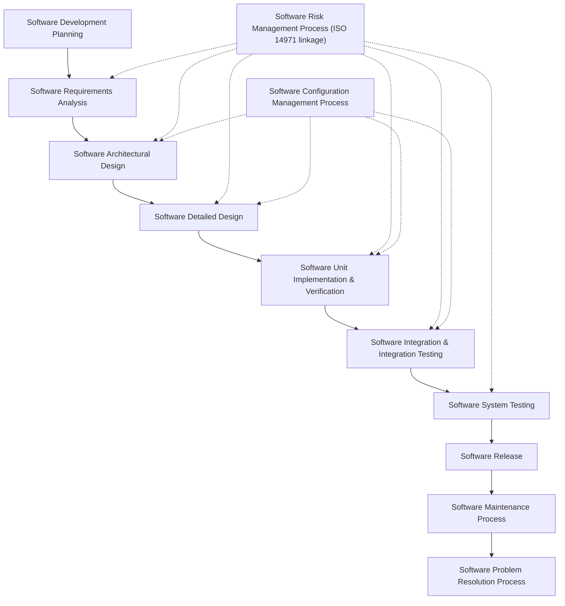

## Medical Device Standards: IEC 62304

### Overview

IEC 62304, titled "Medical device software — Software life cycle processes," is the internationally harmonized standard governing how software is developed and maintained for medical devices. It does not specify testing techniques or programming languages; instead, like ISO 26262 in automotive, it mandates a **process framework** — a defined life cycle of activities, risk-based rigor scaling, and documentation — intended to give reasonable assurance that medical device software is safe for its intended use. It is recognized by regulatory bodies including the FDA (U.S. Food and Drug Administration) and under the EU Medical Device Regulation (MDR), making conformance a practical prerequisite for market access in most jurisdictions rather than a purely voluntary best practice.

### Why Medical Device Software Needs a Dedicated Standard

Embedded software in medical devices — infusion pumps, ventilators, pacemakers, imaging systems, insulin delivery systems — sits in a unique risk position:

- **Direct physiological consequence.** A software defect can directly cause a delayed or incorrect drug dose, a missed alarm, or an incorrect diagnostic reading, with immediate patient harm.
- **Regulatory gatekeeping.** Unlike many embedded domains, medical devices generally cannot be legally sold without a regulatory submission (e.g., FDA 510(k), Premarket Approval, or EU MDR Technical Documentation) that references conformance to IEC 62304 as objective evidence of a controlled software development process.
- **Field population and update constraints.** Devices are often deployed for years, sometimes inside a patient's body, with limited or supervised opportunities for software updates, raising the cost of a defect discovered post-market.
- **Combination with other standards.** IEC 62304 does not operate alone — it works alongside ISO 14971 (risk management for medical devices), IEC 60601-1 (electrical safety and essential performance for medical electrical equipment), and IEC 62366 (usability engineering).

### Software Safety Classification

The central risk-scaling mechanism in IEC 62304 is the **Software Safety Classification**, assigned to each software system (and, where meaningfully separable, to individual software items within it) based on the potential consequence of a hazard to which the software could contribute:

- **Class A:** No injury or damage to health is possible.
- **Class B:** Non-serious injury is possible.
- **Class C:** Death or serious injury is possible.

Classification is not self-declared in isolation — it is derived from the device's overall risk management process under ISO 14971, considering the software's contribution to a hazardous situation, not merely the software's own internal complexity. Critically, classification can be **reduced** if a risk control measure external to the software (e.g., a hardware interlock, a mechanical safeguard, or a separate independent monitoring channel) sufficiently mitigates the hazard — but this reduction must itself be justified and documented in the risk management file.

$$
\text{Class} = f(\text{Severity of Harm} \mid \text{software contributes to hazard, after risk controls})
$$

The assigned class determines which life cycle activities are mandatory. Class A software has substantially reduced documentation and verification burden; Class C software requires the full set of processes defined across the standard, including detailed design documentation and rigorous unit-level verification.

**Key Points**
- Class is a property of the software's *role in causing harm*, not a measure of code complexity or line count.
- A single device commonly contains software items of different classes (e.g., a Class C dose-calculation module alongside a Class A logging module), provided architectural separation is demonstrated.
- Reclassifying downward due to external risk controls must be traceable back to the risk management file — it cannot be an unsubstantiated assertion.

### The Software Development Life Cycle Processes

IEC 62304 defines its requirements around a small set of interlocking processes, most of which map to a conventional software life cycle but with class-dependent rigor and explicit linkage to risk management.

#### Software Development Planning

Before design work begins, a **Software Development Plan** must define the life cycle model to be used, the standards and procedures to be followed, the deliverables expected at each stage, and how configuration management and problem resolution will be handled. This plan is itself a controlled document, updated as the project evolves, and is one of the first artifacts an auditor or regulator will review.

#### Software Requirements Analysis

Software requirements must be derived from system-level requirements and from the risk management file (specific requirements aimed at risk controls), and must be uniquely identifiable to support traceability. Requirements are expected to be verifiable — vague requirements that cannot be objectively tested are treated as a process gap.

#### Software Architectural Design

The architecture must decompose the software into items, define the interfaces between them, and — critically for Class B and C — identify which items implement or support risk controls (Segregation/Separation of software items with different safety classes is expected to be justified if used to reduce documentation burden on lower-class items).

#### Software Detailed Design

For Class B and C software, each unit's design must be specified in enough detail to enable implementation and verification against that design, including interfaces between units.

#### Software Unit Implementation and Verification

Coding standards, static analysis, and unit-level testing are expected here, with Class C carrying explicit requirements for unit verification to a level that would reveal defects before integration. [Inference] The standard itself does not mandate specific coverage metrics (e.g., MC/DC) the way DO-178C does for aerospace; specific coverage targets are typically an organizational or notified-body expectation layered on top of the standard rather than a literal numeric requirement within IEC 62304 text, so exact expectations should be verified against current guidance and any applicable regional regulatory expectations.

#### Software Integration and Integration Testing

Software items are progressively combined and tested against the architecture, verifying that interfaces behave as specified and that integrated behavior does not introduce new hazards.

#### Software System Testing

The complete software system is tested against its software requirements, including tests explicitly targeting the requirements that trace to risk controls, prior to release.

#### Software Release

Release requires documented evidence that all planned verification activities were completed, all known anomalies have been evaluated against risk (an unresolved defect isn't automatically a blocker if its risk is assessed and accepted through the risk management process), and the released version is uniquely identified.

#### Software Maintenance Process

Post-release, IEC 62304 requires an ongoing process for monitoring feedback (including field reports and, where linked, complaints), evaluating whether a problem constitutes a safety issue, and controlling the release of modified software with the same rigor as original development, scaled to the nature of the change.

#### Software Problem Resolution Process

Every reported problem — from an internal test failure to a field complaint — must be documented, evaluated for whether it introduces or reveals a hazard, and tracked through to resolution or a documented risk-based decision not to act, with traceability back into the risk file when relevant.

### Supporting Processes That Run Throughout

Two processes are not sequential stages but run continuously across the life cycle:

- **Software Configuration Management:** Every controlled item (requirements, design documents, source code, test artifacts, tools used to build/verify) must be uniquely identified and change-controlled, with the ability to reconstruct exactly what configuration was verified and released — this underpins the ability to answer "what exact software is running in this device in the field" during a later investigation.
- **Software Risk Management:** IEC 62304 does not duplicate ISO 14971's risk management methodology; it requires that software development activities feed into and draw from the ISO 14971 risk management file, particularly around identifying software items that implement risk controls and verifying those controls actually work as intended.

### Relationship to Other Standards

| Standard | Role |
|---|---|
| ISO 14971 | Overall medical device risk management; supplies the hazard/risk context that drives IEC 62304's software classification |
| IEC 60601-1 | Electrical safety and essential performance for medical *electrical* equipment; IEC 62304 is referenced from within it for the software aspects |
| IEC 62366-1 | Usability engineering; addresses use-error risks that may originate in UI/UX rather than internal software logic |
| IEC 81001-5-1 | Health software and health IT systems — security aspects, addressing what IEC 62304 does not (cybersecurity) |
| FDA guidance (e.g., Software Precertification concepts, premarket cybersecurity guidance) | U.S. regulatory expectations that reference or build on IEC 62304 conformance as supporting evidence, not a replacement for it |

[Inference] Regulatory expectations (FDA, EU MDR/notified bodies) evolve independently of the standard's own revision cycle, so current submission requirements should be checked against the applicable regulatory authority's current guidance rather than assumed static from the standard's text alone.

### Legacy Software (SOUP) Considerations

IEC 62304 devotes specific attention to **SOUP** (Software of Unknown Provenance) — third-party components, libraries, RTOS kernels, or legacy code not developed under the device manufacturer's own IEC 62304-conformant process. Using SOUP does not exempt a device from safety obligations: the manufacturer must document the SOUP's identity and version, assess its known anomalies, define requirements for its use in the context of the device, and — where the SOUP contributes to a Class B or C function — apply verification activities sufficient to gain confidence in its behavior within that context, since the original developer's process (if any) cannot be audited or assumed compliant.

**Example**

A simplified view of how software classification interacts with the risk file for an infusion pump dose-calculation function:

<svg xmlns="http://www.w3.org/2000/svg" viewBox="0 0 800 380">
  \<style\>
    .box { fill: #f4f6f8; stroke: #2b3a4a; stroke-width: 1.5; }
    .boxAlt { fill: #eef2ff; stroke: #2b3a4a; stroke-width: 1.5; }
    .boxWarn { fill: #fff1ea; stroke: #8a4a1f; stroke-width: 1.5; }
    .label { font-family: Helvetica, Arial, sans-serif; font-size: 13px; fill: #1a1a1a; }
    .small { font-family: Helvetica, Arial, sans-serif; font-size: 11px; fill: #444; }
    .title { font-family: Helvetica, Arial, sans-serif; font-size: 15px; fill: #111; font-weight: bold; }
    .arrow { stroke: #2b3a4a; stroke-width: 1.5; fill: none; marker-end: url(#arrowhead2); }
  \</style\>
  <text x="400" y="28" text-anchor="middle" class="title">Infusion Pump Dose-Calculation: Class C Path (svg_diagram)</text>

  <rect x="40" y="60" width="220" height="60" rx="6" class="boxWarn" />
  <text x="150" y="85" text-anchor="middle" class="label">Hazard Identified</text>
  <text x="150" y="102" text-anchor="middle" class="small">Overdose from calculation error</text>

  <rect x="320" y="60" width="220" height="60" rx="6" class="box" />
  <text x="430" y="85" text-anchor="middle" class="label">ISO 14971 Risk File</text>
  <text x="430" y="102" text-anchor="middle" class="small">Severity: High → drives class</text>

  <rect x="600" y="60" width="160" height="60" rx="6" class="boxAlt" />
  <text x="680" y="85" text-anchor="middle" class="label">Software Class C</text>
  <text x="680" y="102" text-anchor="middle" class="small">Full IEC 62304 rigor</text>

  <rect x="140" y="180" width="220" height="60" rx="6" class="box" />
  <text x="250" y="205" text-anchor="middle" class="label">Detailed Design + Unit Verification</text>
  <text x="250" y="222" text-anchor="middle" class="small">Required for Class C</text>

  <rect x="440" y="180" width="220" height="60" rx="6" class="box" />
  <text x="550" y="205" text-anchor="middle" class="label">Independent Dose Check</text>
  <text x="550" y="222" text-anchor="middle" class="small">Secondary risk control (e.g. hardware limit)</text>

  <rect x="290" y="290" width="220" height="60" rx="6" class="boxAlt" />
  <text x="400" y="315" text-anchor="middle" class="label">Residual Risk Evaluation</text>
  <text x="400" y="332" text-anchor="middle" class="small">Documented in risk management file</text>

  <path class="arrow" d="M260,90 L320,90" />
  <path class="arrow" d="M540,90 L600,90" />
  <path class="arrow" d="M430,120 L250,180" />
  <path class="arrow" d="M430,120 L550,180" />
  <path class="arrow" d="M250,240 L400,290" />
  <path class="arrow" d="M550,240 L400,290" />

  <text x="400" y="365" text-anchor="middle" class="small">Software class flows from risk severity; secondary controls may reduce but must justify residual risk.</text>
</svg>

**Related Topics**
- ISO 14971: Risk management methodology for medical devices (application of risk management to medical devices)
- IEC 60601-1: Electrical safety and essential performance for medical electrical equipment
- IEC 62366-1: Usability engineering for medical devices
- IEC 81001-5-1: Health software cybersecurity lifecycle requirements
- FDA Software as a Medical Device (SaMD) and premarket submission pathways (510(k), PMA, De Novo)
- Handling SOUP (Software of Unknown Provenance) and third-party RTOS qualification
- Design controls under 21 CFR Part 820 / ISO 13485 quality management systems
- Traceability matrices linking hazards, requirements, design, and test evidence
- Comparative view: IEC 62304 vs. ISO 26262 vs. DO-178C process philosophies across regulated embedded domains