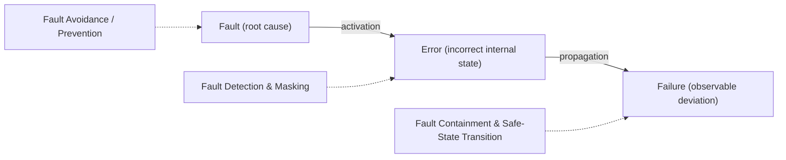
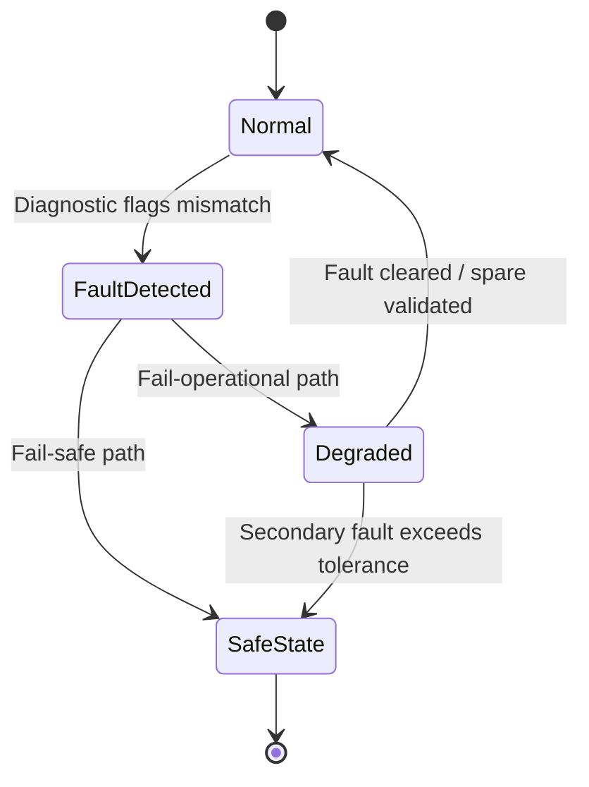

## Redundancy and Fault-Tolerant Design

### Overview

Fault-tolerant design is the discipline of building embedded systems that continue to deliver correct, or at least safe, behavior in the presence of hardware or software faults, rather than assuming faults will not occur. **Redundancy** — the duplication of critical components, computations, or information — is the primary mechanism for achieving fault tolerance, but redundancy alone is not sufficient: a system also needs the ability to detect that a fault occurred, diagnose which element failed, and respond, typically by switching to a working alternative or transitioning to a defined safe state. This topic underlies the practical mechanisms referenced by safety standards such as ISO 26262 and IEC 62304 (covered elsewhere in this material), which mandate diagnostic coverage and freedom-from-interference without prescribing the specific circuit or software pattern used to achieve them.

### Fault, Error, and Failure: A Necessary Distinction

Fault-tolerant design literature relies on a precise vocabulary that is easy to blur in casual use:

- **Fault:** The underlying physical or logical defect — a stuck bit, a cosmic-ray-induced bit flip, a design bug, a corroded solder joint.
- **Error:** The manifestation of a fault in the system's internal state — an incorrect value in a register or variable caused by the fault.
- **Failure:** The externally observable deviation of the system from its specified behavior — the point at which the error actually affects output or function.

A fault does not necessarily become an error (it may be latent or masked), and an error does not necessarily become a failure (it may be corrected before it propagates). Fault-tolerant design intervenes at each stage: preventing faults, containing errors, and preventing failures.

### Classifying Faults

Understanding fault-tolerant design requires classifying the faults being tolerated, since different fault types demand different mitigation strategies.

#### By Duration

- **Permanent faults:** Persist until repaired — a burned-out transistor, a broken trace, a firmware bug that always triggers under the same condition.
- **Transient faults:** Occur once and disappear without intervention — a cosmic-ray-induced bit flip (a **Single Event Upset**, or SEU) in memory, electromagnetic interference momentarily corrupting a signal.
- **Intermittent faults:** Recur irregularly, often due to a marginal condition such as a loose connector or a component operating near its thermal limit, making them notoriously difficult to reproduce and diagnose.

#### By Origin

- **Random hardware faults:** Statistically predictable failures arising from physical degradation (wear-out, radiation, thermal stress), typically modeled using failure rates such as FIT (Failures In Time, failures per $10^9$ device-hours).
- **Systematic faults:** Deterministic faults introduced during specification, design, or manufacturing — a software bug, an incorrect requirement, a design flaw replicated across every unit — which do not improve with redundancy of identical units, since identical faulty designs fail identically (this is why ISO 26262 emphasizes process rigor and diverse redundancy for systematic faults rather than relying purely on hardware duplication).

### Redundancy Strategies

#### Hardware Redundancy

- **Static (Passive) Redundancy — TMR (Triple Modular Redundancy):** Three identical modules perform the same computation in parallel, and a voting circuit outputs the majority result, masking a single faulty module without requiring explicit fault detection or reconfiguration. This is common in aerospace flight computers and in reactor protection systems.

$$
\text{Output} = \text{Majority}(M_1, M_2, M_3)
$$

- **Dynamic (Active) Redundancy — Standby Sparing:** A primary module operates while one or more spares remain powered off (**cold spare**) or powered and synchronized but idle (**hot spare**); upon detected failure of the primary, a switch mechanism activates a spare. Hot sparing achieves faster failover at the cost of continuous power draw and wear on the spare.
- **N-Modular Redundancy (NMR):** A generalization of TMR to N modules (commonly 5 for higher fault tolerance), allowing the system to tolerate multiple simultaneous faults depending on the voting scheme and N.
- **Lockstep Execution:** Two (or more) processor cores execute the identical instruction stream in synchronized lockstep; a comparator continuously checks that their outputs match, flagging a mismatch as a detected fault. This is a common pattern in automotive and industrial safety microcontrollers (e.g., ARM Cortex-R cores configured in lockstep pairs) and detects faults without necessarily masking them — a mismatch typically triggers a safe-state transition rather than silent correction, unless paired with a third channel for voting.

#### Software Redundancy

- **N-Version Programming:** Independent teams implement the same specification using different algorithms, languages, or even toolchains, with results cross-checked at runtime — intended to reduce the risk that a systematic software fault is replicated identically across versions. [Inference] The practical effectiveness of N-version programming is debated in the literature, since independently developed versions have been observed in some studies to share correlated faults arising from ambiguities in a common specification, so it should not be treated as a guaranteed elimination of systematic risk.
- **Recovery Blocks:** A primary algorithm's result is checked against an **acceptance test**; if the test fails, an alternative algorithm is tried, and so on, providing software fault tolerance through sequential retry with diverse implementations rather than parallel voting.
- **Checkpointing and Rollback Recovery:** Periodically saving known-good system state so that, upon detecting corruption, execution can roll back to the last checkpoint and retry — useful against transient faults but not effective against faults that will simply be re-triggered by the same input on retry.

#### Information Redundancy

Rather than duplicating entire modules, information redundancy adds extra bits or structure to data so that corruption can be detected, and sometimes corrected, without duplicating the computation itself.

- **Parity bits:** Detect single-bit errors cheaply but cannot correct them or reliably detect even-numbered multi-bit errors.
- **CRC (Cyclic Redundancy Check):** Widely used in communication protocols (CAN, Ethernet, storage) to detect burst errors in transmitted or stored data with much higher confidence than parity.
- **ECC (Error-Correcting Code) memory:** Commonly implemented as **SEC-DED** (Single Error Correction, Double Error Detection) using Hamming-code-based schemes, allowing memory controllers to transparently correct single-bit upsets — a standard mitigation against SEUs in memory subject to radiation or electrical noise.
- **Checksums and sequence counters:** Used in communication protocols (such as the AUTOSAR E2E library referenced in automotive standards material) to detect message loss, corruption, reordering, or repetition.

#### Time Redundancy

Repeating a computation or transmission and comparing results across time rather than across parallel hardware — for example, re-reading a sensor value twice within a short window and comparing, or re-executing a critical calculation before acting on its result. This trades latency for reduced hardware cost, and is particularly effective against transient faults, since a transient is unlikely to recur identically on immediate re-execution, whereas it does nothing against a permanent fault, which will simply reproduce the same erroneous result each time.

### Fault Detection Mechanisms

Redundancy is only useful if paired with a way to detect that something has gone wrong. Common embedded mechanisms include:

- **Watchdog timers:** A hardware or software timer that must be periodically reset ("kicked") by healthy application code; failure to reset it within a defined window triggers a reset or safe-state transition, guarding against software hangs, infinite loops, or scheduling failures. **Windowed watchdogs** additionally require the kick to occur within a specific time window (not too early, not too late), catching certain classes of runaway or corrupted execution that a simple watchdog would miss.
- **Built-In Self-Test (BIST):** Hardware or software routines that periodically or at startup exercise a component (memory, ADC, communication peripheral) against known expected behavior to detect latent faults before they cause a failure.
- **Memory Protection Units (MPUs) / Memory Management Units (MMUs):** Enforce access boundaries between software components, converting what might otherwise be a silent memory corruption into a detected access violation — directly relevant to the "freedom from interference" concept in ISO 26262.
- **Plausibility checks:** Application-level sanity checks on sensor or computed values against physically reasonable bounds or rate-of-change limits (e.g., a vehicle speed sensor cannot plausibly report a 200 km/h change within one control cycle).
- **Heartbeat / "I'm alive" messaging:** In multi-node systems, nodes periodically broadcast a liveness signal; absence of a heartbeat within an expected interval is treated as a node failure by the rest of the system.

### Safe States and Degraded Operation

Detecting a fault is not the end goal — the system must have a defined response. Fault-tolerant design generally distinguishes:

- **Fail-safe:** Upon fault detection, the system transitions to a state known to be safe, even if that means ceasing the function entirely (e.g., an elevator brake engaging on power loss).
- **Fail-operational:** The system must continue providing its function, potentially in a degraded form, because immediate cessation would itself be hazardous (e.g., steer-by-wire systems in vehicles without a mechanical backup, where losing steering entirely is not an acceptable "safe" state) — this typically demands active redundancy (hot sparing, voting) rather than simple detect-and-stop.
- **Graceful degradation:** The system sheds non-essential functions to preserve core safety-relevant functions under resource or component loss, rather than an all-or-nothing failure response.

### Quantifying Fault Tolerance

Reliability engineering provides metrics used to specify and verify fault-tolerant designs, particularly relevant when demonstrating conformance to standards like ISO 26262's hardware architectural metrics:

- **MTBF (Mean Time Between Failures)** and **MTTF (Mean Time To Failure):** Statistical expectations of operating time before failure, used for repairable and non-repairable systems respectively.
- **Diagnostic Coverage (DC):** The fraction of possible faults that a diagnostic mechanism can actually detect, expressed as a percentage; central to ISO 26262 hardware metric targets (Single-Point Fault Metric, Latent Fault Metric).
- **Common Cause Failures (CCF):** Failures that defeat redundancy by affecting multiple redundant channels simultaneously through a shared root cause — a shared power supply, a shared clock source, or identical software running on identical hardware exposed to the same environmental stress. Effective redundancy design must explicitly analyze and mitigate CCF (e.g., via physical separation, diverse power sourcing, or diverse implementations), since redundancy that shares a single point of common failure provides a false sense of tolerance.

**Key Points**
- Redundancy is a mechanism, not a guarantee — it must be paired with detection and a defined response to actually deliver fault tolerance.
- Systematic faults (design/software bugs) are not mitigated by identical hardware redundancy alone, since identical faulty units fail identically; diversity (in design, implementation, or timing) is needed to address them.
- The choice between fail-safe and fail-operational design depends on whether stopping the function is itself hazardous — this decision is a system-level safety judgment, not a purely technical one, and typically originates from the hazard analysis process rather than the fault-tolerance mechanism itself.
- Common Cause Failure analysis is essential; redundant channels sharing an undiagnosed single point of failure (power, clock, software defect) do not provide the intended risk reduction.

**Example**

A simplified TMR (Triple Modular Redundancy) voting arrangement for a sensor-driven control decision:

<svg xmlns="http://www.w3.org/2000/svg" viewBox="0 0 800 340">
  \<style\>
    .box { fill: #f4f6f8; stroke: #2b3a4a; stroke-width: 1.5; }
    .boxAlt { fill: #eef2ff; stroke: #2b3a4a; stroke-width: 1.5; }
    .boxWarn { fill: #fff1ea; stroke: #8a4a1f; stroke-width: 1.5; }
    .label { font-family: Helvetica, Arial, sans-serif; font-size: 13px; fill: #1a1a1a; }
    .small { font-family: Helvetica, Arial, sans-serif; font-size: 11px; fill: #444; }
    .title { font-family: Helvetica, Arial, sans-serif; font-size: 15px; fill: #111; font-weight: bold; }
    .arrow { stroke: #2b3a4a; stroke-width: 1.5; fill: none; marker-end: url(#arrowhead3); }
  \</style\>
  <text x="400" y="28" text-anchor="middle" class="title">Triple Modular Redundancy Voting (svg_diagram)</text>

  <rect x="40" y="50" width="180" height="55" rx="6" class="box" />
  <text x="130" y="73" text-anchor="middle" class="label">Module 1</text>
  <text x="130" y="90" text-anchor="middle" class="small">Independent compute channel</text>

  <rect x="40" y="140" width="180" height="55" rx="6" class="box" />
  <text x="130" y="163" text-anchor="middle" class="label">Module 2</text>
  <text x="130" y="180" text-anchor="middle" class="small">Independent compute channel</text>

  <rect x="40" y="230" width="180" height="55" rx="6" class="boxWarn" />
  <text x="130" y="253" text-anchor="middle" class="label">Module 3 (faulted)</text>
  <text x="130" y="270" text-anchor="middle" class="small">Outputs incorrect value</text>

  <rect x="330" y="140" width="180" height="60" rx="6" class="boxAlt" />
  <text x="420" y="165" text-anchor="middle" class="label">Voting Circuit</text>
  <text x="420" y="182" text-anchor="middle" class="small">2-of-3 majority selection</text>

  <rect x="600" y="140" width="160" height="60" rx="6" class="box" />
  <text x="680" y="165" text-anchor="middle" class="label">System Output</text>
  <text x="680" y="182" text-anchor="middle" class="small">Correct despite one fault</text>

  <path class="arrow" d="M220,77 L330,155" />
  <path class="arrow" d="M220,167 L330,170" />
  <path class="arrow" d="M220,257 L330,185" />
  <path class="arrow" d="M510,170 L600,170" />

  <text x="420" y="230" text-anchor="middle" class="small">A single faulty module is outvoted; output remains correct without visible disruption.</text>
</svg>

**Related Topics**
- ISO 26262 hardware architectural metrics: Single-Point Fault Metric and Latent Fault Metric
- Radiation-hardened design and Single Event Upset (SEU) mitigation for aerospace/space embedded systems
- Watchdog timer design patterns: simple, windowed, and independent (external) watchdogs
- Byzantine fault tolerance in distributed embedded and networked control systems
- Formal hazard analysis techniques: FMEA and FTA as inputs to redundancy architecture decisions
- Error-correcting codes: Hamming codes, Reed-Solomon, and their tradeoffs in embedded storage/communication
- AUTOSAR E2E library and CAN/Ethernet-layer fault detection in automotive systems
- Common Cause Failure analysis techniques and independence arguments in safety cases
- Power supply redundancy architectures (redundant rails, diode-OR'ing, hot-swap controllers)