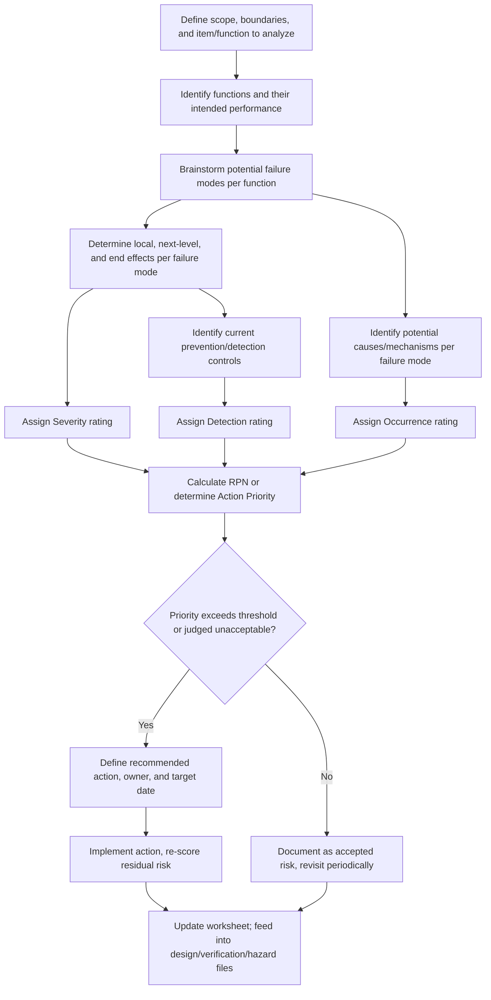

## Failure Mode and Effects Analysis

### Overview

Failure Mode and Effects Analysis (FMEA) is a systematic, bottom-up engineering technique for identifying how a system, component, or process can fail, what effect each failure would have, and how likely and severe that effect is — used to prioritize design changes, diagnostic coverage, and testing effort before failures occur in the field. In embedded systems development, FMEA is a foundational input to the hazard analyses required by standards such as ISO 26262 (automotive) and IEC 62304 (medical devices), covered elsewhere in this material, and is often the documented evidence auditors expect to see behind a safety case's risk claims.

### Purpose and Position in the Development Lifecycle

FMEA is fundamentally a **bottom-up** technique: it starts from individual component or function failure modes and traces forward to system-level effects, in contrast to **Fault Tree Analysis (FTA)**, a top-down technique that starts from an undesired system-level event and works backward to identify combinations of causes. The two are complementary rather than substitutes — many safety processes require both, using FMEA to build a comprehensive inventory of potential failure modes and FTA to analyze specific critical top events in more combinatorial depth (including logical AND/OR relationships between contributing faults that FMEA alone does not naturally capture).

FMEA is typically performed early in design (**Design FMEA**, or DFMEA) and separately for manufacturing/assembly processes (**Process FMEA**, or PFMEA). In embedded hardware/software contexts, it is common to distinguish:

- **System FMEA:** Analyzes failure modes at the level of overall system functions and interfaces.
- **Design FMEA (DFMEA):** Analyzes failure modes of specific hardware components (resistors, capacitors, connectors, sensors, ICs) and their electrical/mechanical effects.
- **Process FMEA (PFMEA):** Analyzes failure modes introduced during manufacturing, assembly, and soldering processes rather than in the design itself.
- **Software FMEA (SFMEA):** [Inference] Less standardized across industry than hardware DFMEA, SFMEA typically analyzes failure modes of software functions, algorithms, or interfaces (e.g., a variable exceeding expected range, a message arriving out of sequence), though the specific methodology and terminology used for software failure modes varies more between organizations than the hardware DFMEA convention does.

### Core FMEA Terminology

- **Function:** The intended purpose of the item under analysis, stated in a way that permits identifying deviations from it.
- **Failure Mode:** The specific manner in which an item fails to perform its function (e.g., "resistor open circuit," "sensor output stuck at maximum," "message not received within timeout").
- **Effect:** The consequence of the failure mode, typically analyzed at the local level (immediate effect on the component's neighbors), the next-higher level (subsystem effect), and the end effect (effect on the overall system or end user/vehicle occupant/patient).
- **Cause:** The mechanism by which the failure mode occurs (e.g., "thermal fatigue," "electromigration," "off-by-one error in loop bound").
- **Current Controls:** Existing design or process measures intended to prevent the cause, detect the failure mode, or mitigate its effect (e.g., a plausibility check, a watchdog timer, an inspection step).
- **Detection:** The mechanism and likelihood by which the failure mode would be caught before it causes the end effect, either during development (test) or in operation (diagnostic).

### The Risk Priority Number (RPN) Method

The classical (and still widely taught) quantitative approach to FMEA scores each identified failure mode along three independent dimensions, typically on a 1–10 scale, and multiplies them:

$$
\text{RPN} = S \times O \times D
$$

Where:

- **Severity (S):** How serious is the effect of the failure, assuming it occurs? (1 = no discernible effect, 10 = hazardous without warning.)
- **Occurrence (O):** How likely is the failure's cause to occur, based on historical data, physics-of-failure models, or field experience? (1 = extremely unlikely, 10 = almost certain.)
- **Detection (D):** How likely is the current control scheme to detect the failure before it reaches the customer/end effect? (Note the inverted scale convention — 1 = detection is almost certain, 10 = failure is undetectable by current controls.)

Failure modes are then typically ranked by RPN, with higher-RPN items prioritized for design changes, added diagnostics, or additional testing. A team might, for example, set an internal threshold (e.g., RPN above 100) requiring documented corrective action or explicit risk acceptance rationale before proceeding — [Inference] such thresholds are organizational conventions rather than a universal figure fixed by any single overarching standard, and specific numeric practice varies by industry, company, and applicable standard.

#### Known Limitations of RPN

The classical RPN method, despite widespread use, has documented weaknesses that automotive-industry practice in particular has moved to address:

- **Non-uniqueness:** Different combinations of S, O, and D can produce identical RPN values despite representing very different risk profiles (e.g., S=9, O=2, D=5 gives RPN=90; S=3, O=6, D=5 also gives RPN=90) — treating these as equivalent priorities can be misleading, especially when severity is high but occurrence appears low.
- **Arbitrary multiplication:** Multiplying ordinal rating scales (which are not true ratio scales) is mathematically questionable, since a "10" is not necessarily "twice as bad" as a "5" in any measurable physical sense.
- **Severity masking:** A very high severity, low occurrence, low detectability failure mode can receive a lower RPN than a low-severity, high-occurrence, poorly detected one, potentially under-prioritizing genuinely hazardous failure modes.

In response to these concerns, the most recent joint AIAG-VDA (Automotive Industry Action Group – Verband der Automobilindustrie) FMEA handbook, widely adopted in automotive practice, replaced RPN-based prioritization with an **Action Priority (AP)** table — a lookup approach that maps S, O, and D combinations directly to a High/Medium/Low action priority using a structured decision table rather than a multiplied score, explicitly designed to avoid masking high-severity failure modes behind an arithmetically moderate number. [Unverified] Organizations and industries outside automotive may continue to use classical RPN, a hybrid approach, or entirely different scoring conventions; readers should confirm which convention a specific project or standard expects rather than assuming RPN universally applies.

### The FMEA Worksheet Structure

FMEA is conventionally documented in a structured worksheet, with each row representing one failure mode of one item/function:

| Item/Function | Failure Mode | Effect (Local / End) | Severity | Cause | Occurrence | Current Controls | Detection | RPN / Action Priority | Recommended Action | Responsibility & Target Date |
|---|---|---|---|---|---|---|---|---|---|---|
| Temperature sensor read | Sensor output stuck at last value | Local: stale reading used / End: overheating undetected | 8 | ADC channel fault, connector corrosion | 3 | Periodic self-test on power-up only | 6 | 144 (RPN) / High (AP) | Add continuous plausibility/rate-of-change check | Firmware team, Sprint 14 |
| Watchdog kick routine | Kick occurs despite corrupted main loop | Local: watchdog satisfied incorrectly / End: unresponsive system appears alive | 9 | Kick call placed in interrupt unrelated to main loop health | 2 | Code review only | 8 | 144 (RPN) / High (AP) | Move kick to windowed watchdog gated on task-completion flags | Firmware team, Sprint 15 |

This worksheet becomes a living document, revisited as design changes are made, controls are added, and new failure modes are discovered through testing or field experience — it is not a one-time exercise performed only at project kickoff.

### The FMEA Process Flow

### FMEA in Embedded Systems Practice

Applying FMEA to embedded hardware and software surfaces some domain-specific considerations worth noting explicitly:

- **Component-level FMEA relies on failure rate databases** (such as those derived from MIL-HDBK-217, IEC TR 62380, or supplier-provided FIT rate data) to inform occurrence ratings for electronic components, rather than pure engineering judgment alone, particularly for automotive and aerospace applications where quantitative hardware metrics (as required by ISO 26262 Part 5) depend on this data.
- **Software failure modes are behavioral, not physical**, meaning occurrence ratings for software causes are typically grounded in code complexity, review/test coverage, and historical defect data rather than a physics-of-failure model, and this distinction is a recognized source of methodological difficulty when teams try to apply a single unified FMEA framework across combined hardware/software systems.
- **FMEA feeds directly into diagnostic coverage arguments.** A failure mode rated with poor detection is a direct signal that additional diagnostic mechanisms (discussed under redundancy and fault-tolerant design) — plausibility checks, redundant sensing, built-in self-test — are needed to raise detection and, correspondingly, lower risk.
- **FMEA is a living document, not a compliance artifact filed once.** Standards bodies and auditors generally expect evidence that the FMEA was revisited as the design matured, as field data accumulated, or as changes were made — a static FMEA frozen at concept stage is a common audit finding.

**Key Points**
- FMEA is bottom-up (failure mode → effect); FTA is top-down (undesired event → causes) — mature safety processes typically use both rather than treating either as sufficient alone.
- The classical RPN (Severity × Occurrence × Detection) method has well-documented mathematical and prioritization weaknesses, which is why current automotive practice (AIAG-VDA handbook) favors an Action Priority lookup table over raw RPN multiplication.
- A high-severity failure mode deserves scrutiny regardless of its calculated RPN or priority ranking, since severity alone can indicate an unacceptable risk that occurrence and detection scores should not be allowed to mathematically dilute.
- FMEA must be maintained as a living document throughout the product lifecycle, updated as designs, controls, and field data evolve.

**Example**

A simplified severity/occurrence/detection relationship feeding into prioritization, visualized as a decision flow rather than a single arithmetic score:

<svg xmlns="http://www.w3.org/2000/svg" viewBox="0 0 800 320">
  \<style\>
    .box { fill: #f4f6f8; stroke: #2b3a4a; stroke-width: 1.5; }
    .boxAlt { fill: #eef2ff; stroke: #2b3a4a; stroke-width: 1.5; }
    .boxWarn { fill: #fff1ea; stroke: #8a4a1f; stroke-width: 1.5; }
    .label { font-family: Helvetica, Arial, sans-serif; font-size: 13px; fill: #1a1a1a; }
    .small { font-family: Helvetica, Arial, sans-serif; font-size: 11px; fill: #444; }
    .title { font-family: Helvetica, Arial, sans-serif; font-size: 15px; fill: #111; font-weight: bold; }
    .arrow { stroke: #2b3a4a; stroke-width: 1.5; fill: none; marker-end: url(#arrowhead4); }
  \</style\>
  <text x="400" y="28" text-anchor="middle" class="title">Failure Mode Prioritization Flow (svg_diagram)</text>

  <rect x="40" y="60" width="180" height="55" rx="6" class="boxWarn" />
  <text x="130" y="83" text-anchor="middle" class="label">Severity = 9</text>
  <text x="130" y="100" text-anchor="middle" class="small">Hazardous effect</text>

  <rect x="40" y="150" width="180" height="55" rx="6" class="box" />
  <text x="130" y="173" text-anchor="middle" class="label">Occurrence = 2</text>
  <text x="130" y="190" text-anchor="middle" class="small">Rare cause</text>

  <rect x="40" y="240" width="180" height="55" rx="6" class="box" />
  <text x="130" y="263" text-anchor="middle" class="label">Detection = 8</text>
  <text x="130" y="280" text-anchor="middle" class="small">Poor current controls</text>

  <rect x="320" y="150" width="200" height="60" rx="6" class="boxAlt" />
  <text x="420" y="175" text-anchor="middle" class="label">Action Priority Table</text>
  <text x="420" y="192" text-anchor="middle" class="small">(not simple multiplication)</text>

  <rect x="600" y="150" width="160" height="60" rx="6" class="boxWarn" />
  <text x="680" y="175" text-anchor="middle" class="label">Priority: HIGH</text>
  <text x="680" y="192" text-anchor="middle" class="small">Despite low occurrence</text>

  <path class="arrow" d="M220,90 L320,170" />
  <path class="arrow" d="M220,175 L320,180" />
  <path class="arrow" d="M220,265 L320,195" />
  <path class="arrow" d="M520,180 L600,180" />

  <text x="420" y="240" text-anchor="middle" class="small">High severity drives priority up even when occurrence is low,</text>
  <text x="420" y="256" text-anchor="middle" class="small">avoiding the masking effect seen with raw RPN multiplication.</text>
</svg>

**Related Topics**
- Fault Tree Analysis (FTA) as the complementary top-down technique
- AIAG-VDA FMEA Handbook and the Action Priority (AP) methodology
- ISO 26262 Part 5 hardware architectural metrics and their reliance on FMEA-derived data
- Failure rate data sources: MIL-HDBK-217, IEC TR 62380, and supplier FIT rate reporting
- Hazard and Operability Study (HAZOP) as an alternative structured hazard-identification method
- Diagnostic coverage design informed by FMEA detection ratings
- Software FMEA methodologies and their divergence from hardware DFMEA conventions
- FRACAS (Failure Reporting, Analysis, and Corrective Action System) for closing the loop between field failures and FMEA updates