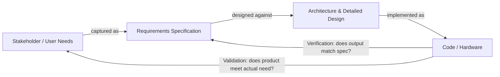
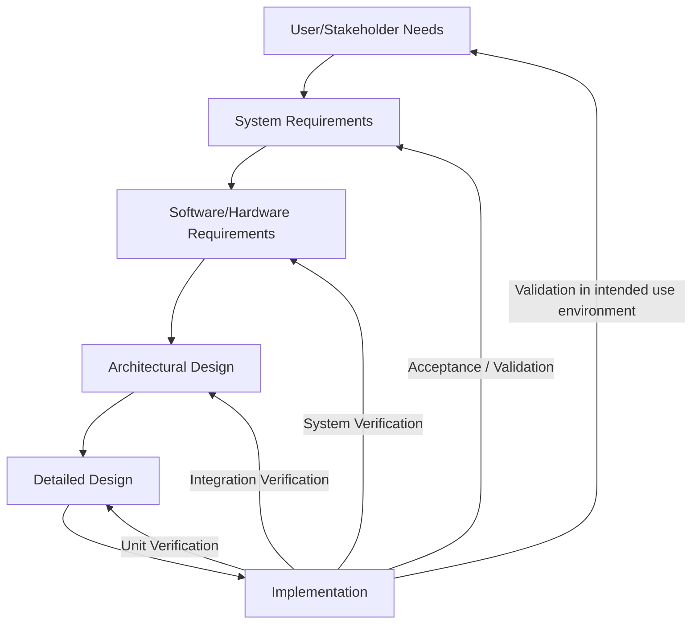

## Verification and Validation Processes

### Overview

Verification and validation (V&V) are the two complementary activities by which embedded systems development establishes confidence that a product was built correctly and that it is the correct product for its intended use. The distinction is commonly summarized as **verification asks "did we build the product right?"** — checking outputs against specified requirements and design — while **validation asks "did we build the right product?"** — checking that the product actually meets the user's or stakeholder's real-world needs and intended use, even where those needs were imperfectly captured in written requirements. Both activities are mandated, with varying rigor, by the safety standards covered elsewhere in this material (ISO 26262, IEC 62304), which treat V&V evidence as the primary basis for demonstrating that a system is safe to release.

### Verification vs. Validation: The Core Distinction

Verification is a **traceable, requirement-driven** activity: every verification test or analysis should trace back to a specific requirement or design element, and passing verification means the built artifact conforms to what was specified. Validation is **use-context-driven**: it can reveal that the system perfectly satisfies its written requirements yet still fails to serve its intended purpose, because the requirements themselves were incomplete, ambiguous, or based on incorrect assumptions about the operating environment or user behavior. A classic illustration: a control algorithm might pass every unit and integration test against its documented requirements (verification success) yet still perform poorly on real, noisy field sensor data that the requirements failed to anticipate (validation failure).

**Key Points**
- Verification without validation risks building a perfectly specified but wrong product.
- Validation without verification risks a product that behaves acceptably in trials but rests on an untraceable, unauditable, and unrepeatable basis.
- Both are required together; neither substitutes for the other in a rigorous development process.

### Verification Activities Across the Development Lifecycle

Verification is typically organized around the levels of the V-model (introduced in the ISO 26262 material), with each level of design decomposition paired with a corresponding verification activity.

#### Unit (Module) Verification

The smallest independently testable piece of software or hardware logic is checked against its detailed design specification, generally through:

- **Unit testing:** Executing the unit against controlled inputs and checking outputs against expected values, often automated within a continuous integration pipeline.
- **Static analysis:** Tool-based checking of source code against coding standards (e.g., MISRA C/C++), detecting undefined behavior, unreachable code, and certain classes of defects without executing the code.
- **Code review / inspection:** Human examination of source code against design intent and coding standards, frequently structured (e.g., Fagan inspections) for higher-criticality code.
- **Structural coverage analysis:** Measuring how thoroughly test cases exercise the code's control-flow structure, using criteria such as statement coverage, branch/decision coverage, and — for the highest-criticality software — **MC/DC (Modified Condition/Decision Coverage)**, which requires demonstrating that each condition within a decision independently affects that decision's outcome, not merely that both decision outcomes were exercised.

$$
\text{Coverage \%} = \frac{\text{Elements exercised by tests}}{\text{Total elements in scope}} \times 100
$$

[Inference] The specific coverage criterion required (statement, branch, or MC/DC) is generally tied to the software's assigned safety classification or criticality level under the applicable standard rather than being a fixed universal requirement; exact mappings should be checked against the specific standard and its current edition rather than assumed.

#### Integration Verification

Once units are combined, integration testing verifies that the **interfaces** between them behave as specified — a class of defect (mismatched assumptions between correctly-functioning individual units) that unit testing by design cannot catch, since each unit was tested in isolation against a simulated or stubbed environment. Integration strategies commonly include:

- **Bottom-up integration:** Combining and testing lower-level units first, progressively integrating upward, often requiring test harnesses ("drivers") to simulate not-yet-integrated higher-level callers.
- **Top-down integration:** Testing higher-level control logic first against stubs standing in for not-yet-integrated lower-level units.
- **Big-bang integration:** Combining all units simultaneously and testing the whole — generally discouraged in safety-relevant development because failures are harder to isolate to a specific interface.

#### System Verification

The fully integrated system is tested against system-level requirements, including functional behavior, timing/performance requirements, and — critically for embedded systems — behavior under resource constraints, fault injection, and environmental stress. This is typically where hardware-in-the-loop (HIL) testing becomes prominent: the embedded target hardware and software run against a simulated plant/environment model in real time, allowing system-level scenarios (including hazardous or hard-to-reproduce physical conditions) to be exercised safely and repeatably before field testing.

#### Regression Verification

Whenever a change is made to code, configuration, or requirements, a defined subset (or the entirety, depending on criticality and change impact analysis) of previously passing tests is re-executed to confirm the change did not introduce a new defect or reintroduce a previously fixed one. Change impact analysis — determining which existing verification evidence remains valid and which must be re-executed — is itself a documented activity under standards like IEC 62304, not an informal judgment call left undocumented.

### Validation Activities

Validation activities generally occur later in the lifecycle, once a sufficiently complete or representative system exists, and focus on real-world adequacy rather than specification conformance:

- **User/stakeholder validation:** Demonstrating the system to intended users or stakeholders under realistic conditions to confirm it meets their actual needs, sometimes formalized as **User Acceptance Testing (UAT)**.
- **Field trials / clinical trials:** In domains like medical devices or automotive ADAS, controlled real-world deployment (under monitored conditions) to validate performance against real environmental and usage variability that a lab or bench cannot fully replicate.
- **Environmental and usage-profile validation:** Confirming the system performs correctly across the actual range of temperature, vibration, electromagnetic environment, and usage patterns it will encounter — distinct from verifying it meets a specified environmental requirement, since validation asks whether that requirement itself was set correctly.
- **Usability validation:** Particularly emphasized in medical device development (linked to IEC 62366), confirming that real users, under realistic conditions including stress and distraction, can operate the device as intended without introducing use errors that verification against a written interface specification would not reveal.

### Test Levels and the V-Model Mapping

Each verification arrow in this mapping represents a traceable check against a specific prior artifact; the validation arrows at the top represent checks against the original need, which may not be fully or correctly captured even in a well-written requirements document.

### Traceability: The Backbone Connecting V&V to Requirements

A **traceability matrix** (or equivalent tool-managed linkage in a requirements management system) links each requirement to the design elements that implement it, the test cases that verify it, and the test results demonstrating pass/fail status — in both directions:

- **Forward traceability:** From requirement to test, confirming every requirement has been verified.
- **Backward traceability:** From test/design/code to requirement, confirming no implemented behavior or test exists without a documented rationale — an important check against unintended or undocumented functionality, which regulators and auditors specifically look for as a sign of process discipline.

Without traceability, it is difficult to answer a basic but critical audit question: "how do you know this specific requirement was actually verified, and by which test?" — a question that safety standards expect to be answerable directly from documented evidence, not reconstructed after the fact.

### Test Techniques Commonly Applied

- **Equivalence partitioning and boundary value analysis:** Reducing the input space to representative classes and specifically testing edges of valid/invalid ranges, since defects disproportionately cluster at boundaries.
- **Fault injection:** Deliberately introducing faults (corrupted memory, delayed messages, sensor value freezes) to verify that fault detection and fault-tolerant mechanisms (covered under redundancy and fault-tolerant design) actually behave as designed, rather than only ever being exercised in nominal conditions.
- **Robustness testing:** Verifying graceful behavior under invalid, out-of-range, or malformed inputs, not merely correct behavior under valid inputs.
- **Back-to-back testing:** Comparing the behavior of a model (e.g., a Simulink model used for auto-code generation) against the generated code's behavior under identical inputs, to verify the code generation step itself did not introduce a discrepancy.
- **Formal methods / model checking:** [Inference] Used selectively in the highest-criticality embedded domains to mathematically prove certain properties (e.g., absence of deadlock, satisfaction of a safety invariant) rather than relying solely on test-case sampling of the input space; adoption varies significantly by industry and organization, and is not a universal expectation across all embedded V&V processes.

### Independence in Verification

Safety standards frequently require some degree of **independence** between the person or team who develops an artifact and the person or team who verifies it, scaled to criticality — ranging from a different individual, to a different team, to (at the highest criticality levels) an organizationally separate group with no development responsibility for the item under test. This is intended to reduce the risk that a developer's own assumptions or blind spots are simply re-applied during their own verification of their own work, rather than genuinely challenged.

**Example**

A simplified traceability chain from a single safety requirement through to verified test evidence:

<svg xmlns="http://www.w3.org/2000/svg" viewBox="0 0 820 300">
  \<style\>
    .box { fill: #f4f6f8; stroke: #2b3a4a; stroke-width: 1.5; }
    .boxAlt { fill: #eef2ff; stroke: #2b3a4a; stroke-width: 1.5; }
    .boxGood { fill: #eefcf1; stroke: #1f6b3a; stroke-width: 1.5; }
    .label { font-family: Helvetica, Arial, sans-serif; font-size: 12.5px; fill: #1a1a1a; }
    .small { font-family: Helvetica, Arial, sans-serif; font-size: 11px; fill: #444; }
    .title { font-family: Helvetica, Arial, sans-serif; font-size: 15px; fill: #111; font-weight: bold; }
    .arrow { stroke: #2b3a4a; stroke-width: 1.5; fill: none; marker-end: url(#arrowhead5); }
  \</style\>
  <text x="410" y="26" text-anchor="middle" class="title">Requirement-to-Evidence Traceability Chain (svg_diagram)</text>

  <rect x="20" y="60" width="160" height="60" rx="6" class="box" />
  <text x="100" y="85" text-anchor="middle" class="label">Safety Requirement</text>
  <text x="100" y="102" text-anchor="middle" class="small">"System shall detect overtemp within 200ms"</text>

  <rect x="220" y="60" width="160" height="60" rx="6" class="box" />
  <text x="300" y="85" text-anchor="middle" class="label">Design Element</text>
  <text x="300" y="102" text-anchor="middle" class="small">Temperature monitor task</text>

  <rect x="420" y="60" width="160" height="60" rx="6" class="box" />
  <text x="500" y="85" text-anchor="middle" class="label">Implementation</text>
  <text x="500" y="102" text-anchor="middle" class="small">monitor_temp() routine</text>

  <rect x="620" y="60" width="180" height="60" rx="6" class="boxAlt" />
  <text x="710" y="85" text-anchor="middle" class="label">Test Case</text>
  <text x="710" y="102" text-anchor="middle" class="small">TC-014: inject overtemp fault</text>

  <rect x="620" y="180" width="180" height="60" rx="6" class="boxGood" />
  <text x="710" y="205" text-anchor="middle" class="label">Test Result: PASS</text>
  <text x="710" y="222" text-anchor="middle" class="small">Detected in 148ms</text>

  <path class="arrow" d="M180,90 L220,90" />
  <path class="arrow" d="M380,90 L420,90" />
  <path class="arrow" d="M580,90 L620,90" />
  <path class="arrow" d="M710,120 L710,180" />

  <text x="410" y="270" text-anchor="middle" class="small">Forward trace confirms the requirement was tested; backward trace confirms the test</text>
  <text x="410" y="286" text-anchor="middle" class="small">and implementation both exist to satisfy a documented requirement, not undocumented scope creep.</text>
</svg>

**Related Topics**
- Hardware-in-the-Loop (HIL) and Software-in-the-Loop (SIL) testing environments
- MC/DC and structural coverage criteria across DO-178C, ISO 26262, and IEC 62304
- Fault injection techniques and tooling for embedded fault-tolerance verification
- Requirements management and traceability tooling in regulated embedded development
- Formal methods and model checking for high-assurance embedded software
- Usability engineering and use-error validation under IEC 62366
- Change impact analysis and regression test selection strategies
- Independence requirements in verification roles across safety standards
- Back-to-back testing for model-based design and auto-generated code