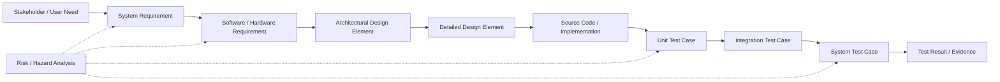
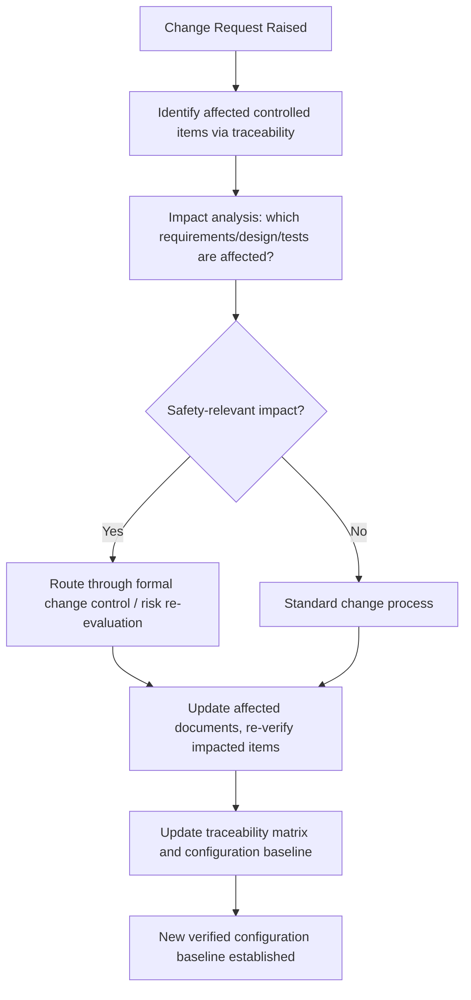

## Traceability and Documentation Requirements

### Overview

Traceability is the documented, maintainable linkage connecting every artifact in an embedded system's development — from a stakeholder need, through a requirement, through design and implementation, to the test evidence that verifies it — such that any artifact's origin and justification can be established, and any requirement's satisfaction can be confirmed, without reconstruction after the fact. Documentation requirements are the broader set of records, formats, and controls that standards such as ISO 26262 and IEC 62304 (covered elsewhere in this material) mandate to make a development process auditable, repeatable, and defensible. Where verification and validation (also covered separately) establish *that* a system works correctly, traceability and documentation establish *the evidence trail proving it*, which is what regulators, auditors, and downstream engineers actually inspect.

### Why Traceability Matters Beyond Compliance

It is tempting to treat traceability as a bureaucratic overhead imposed by standards, but it serves concrete engineering functions independent of any audit:

- **Impact analysis:** When a requirement changes, forward traceability identifies exactly which design elements, code, and tests must be reviewed or re-executed — without it, teams either under-test (missing affected areas) or over-test (re-verifying everything defensively, at high cost).
- **Gap detection:** Backward traceability from code to requirements surfaces implemented behavior with no documented justification — a signal of either an undocumented requirement or unintended scope, both of which are risk indicators in safety-relevant software.
- **Root cause investigation:** When a field failure occurs, a traceability chain lets engineers walk backward from the observed failure to the specific requirement, design decision, and verification evidence involved, dramatically shortening investigation time compared with searching through undifferentiated documentation.
- **Knowledge continuity:** Embedded products often have multi-year or multi-decade lifecycles (particularly in automotive, aerospace, and medical domains); traceability preserves the rationale for design decisions long after the original engineers have moved to other projects.

### The Traceability Chain

Each link in this chain should be **bidirectionally navigable**: given a requirement, one can find every design element and test case tracing to it (forward), and given a piece of code or a test case, one can find the requirement that justifies its existence (backward). A chain that only works in one direction is incomplete — for instance, forward-only traceability from requirements to tests cannot detect code that exists without any requirement behind it.

### Forward vs. Backward Traceability

- **Forward traceability** answers: "Has this requirement been addressed at every subsequent stage, and has it been verified?" Missing forward links typically indicate a requirement that was never implemented or never tested — a coverage gap.
- **Backward traceability** answers: "Why does this design element, line of code, or test case exist?" Missing backward links (an artifact with no upstream justification) typically indicate scope creep, an undocumented assumption, or dead/orphaned functionality that should be questioned during review.

Both directions are typically expected in a **traceability matrix** — whether implemented as a literal spreadsheet, a dedicated requirements management tool (e.g., IBM DOORS, Polarion, Jama Connect), or generated from structured metadata embedded in requirements and test management systems. [Inference] The specific tooling used varies enormously by organization and industry segment; no standard mandates a particular tool, only that the traceability information itself be maintained, accurate, and retrievable.

### Levels of Traceability in Practice

| Level | Links | Typical Question Answered |
|---|---|---|
| Requirements-to-Requirements | System requirement ↔ derived software/hardware requirement | Was this system-level need correctly decomposed? |
| Requirements-to-Design | Requirement ↔ architectural/detailed design element | Does a design element exist to satisfy this requirement? |
| Design-to-Code | Design element ↔ implementation (module, function, unit) | Was the design actually implemented as specified? |
| Requirements-to-Test | Requirement ↔ test case(s) | Has this requirement been verified, and by which test? |
| Risk-to-Requirement | Identified hazard/risk control ↔ requirement | Does a requirement exist to implement this specific risk control? |
| Test-to-Result | Test case ↔ executed result (pass/fail, date, environment, tester) | What is the current verification status of this requirement? |

The risk-to-requirement link deserves particular emphasis in safety-relevant embedded development: both ISO 26262 and IEC 62304 explicitly require that hazard/risk controls identified during hazard analysis be traceable to specific requirements implementing them, and that those requirements in turn be traceable to verification evidence confirming the control actually works — a three-way linkage (hazard → requirement → test) that is often specifically checked during audits and regulatory review, distinct from generic functional traceability.

### Documentation Categories Commonly Required

Beyond the traceability matrix itself, safety-relevant embedded development typically produces a defined set of controlled documents, though exact naming and organization vary by standard and company convention:

- **Development/Safety Plan:** Defines the life cycle model, standards to be followed, roles and responsibilities, and required deliverables for the project — typically the first document reviewed in an audit, since it establishes what the team committed to doing.
- **Requirements Specifications:** System, software, and/or hardware requirements, each uniquely identified and written to be objectively verifiable.
- **Architecture and Design Documents:** Describing decomposition into components/units, interfaces, and — for safety-relevant systems — the rationale for how the architecture supports required safety properties (e.g., freedom from interference, redundancy allocation).
- **Risk Management File / Hazard Log:** The living record of identified hazards, their analysis, assigned risk classifications (ASIL, Software Safety Class), and the controls implemented to address them.
- **Verification and Validation Plans and Reports:** Defining what will be tested, how, and to what acceptance criteria, followed by reports documenting actual results against that plan.
- **Configuration Management Records:** Identifying exactly which version of every controlled item (requirement, design document, source file, build tool, test script) constitutes a specific released configuration.
- **Problem Reports and Corrective Action Records:** Documenting defects found (in development or field use), their disposition, and evidence that corrective action was verified effective.
- **Release Documentation / Software Bill of Materials:** A defined, versioned record of exactly what is being released, including third-party and legacy components (SOUP, in IEC 62304 terminology).

### Configuration Management as the Foundation of Traceability

Traceability is only meaningful if the artifacts it connects are themselves under **configuration management** — uniquely identified and version-controlled such that "requirement REQ-042, version 3" or "source file sensor_driver.c, revision 17" is an unambiguous reference, not a moving target. Without this discipline, a traceability link can point to an artifact that has since changed, silently invalidating the verification evidence it was meant to represent. This is why configuration management is treated as a continuously running process throughout the life cycle (as noted under IEC 62304's supporting processes) rather than a one-time setup activity — every change to a controlled item must be evaluated for its ripple effect on existing traceability links and, where necessary, trigger re-verification.

### Common Traceability and Documentation Failure Patterns

Auditors and internal quality reviewers repeatedly encounter a recognizable set of gaps, worth naming explicitly since they represent avoidable process failures rather than inherent difficulty:

- **Orphaned requirements:** Requirements with no corresponding design element or test case — often the result of a requirement added late without updating the rest of the chain.
- **Orphaned code:** Implemented functionality with no traceable requirement behind it — a common source of unintended, unverified, and unreviewed behavior in a safety-relevant system.
- **Stale documentation:** Design or requirements documents that were not updated when the implementation changed, leaving the "as-documented" system diverging from the "as-built" system — dangerous because it misleads future verification and maintenance decisions.
- **One-time traceability:** A matrix built once at a project milestone (e.g., for a specific audit) and never maintained afterward, becoming progressively less accurate as the project evolves — standards generally expect traceability to be maintained continuously, not reconstructed retroactively before a review.
- **Test-to-nothing:** Test cases that exist and pass but do not trace back to any requirement, making it unclear what safety or functional claim the passing test actually supports.

**Key Points**
- Traceability must work bidirectionally — forward from requirement to evidence, and backward from artifact to justification — since each direction detects a different class of gap.
- Configuration management underpins traceability; a link to an unversioned or since-changed artifact is not reliable evidence.
- The risk-to-requirement-to-test chain is specifically scrutinized in safety-relevant audits, distinct from ordinary functional traceability, because it demonstrates that identified hazards were actually mitigated and that mitigation was verified.
- Traceability and documentation are living, continuously maintained artifacts; a static snapshot prepared only for a milestone review does not satisfy the intent of the requirement and tends to degrade in accuracy over the project's life.

**Example**

A simplified illustration of a bidirectional traceability gap versus a complete chain:

<svg xmlns="http://www.w3.org/2000/svg" viewBox="0 0 820 340">
  \<style\>
    .box { fill: #f4f6f8; stroke: #2b3a4a; stroke-width: 1.5; }
    .boxGood { fill: #eefcf1; stroke: #1f6b3a; stroke-width: 1.5; }
    .boxWarn { fill: #fff1ea; stroke: #8a4a1f; stroke-width: 1.5; }
    .label { font-family: Helvetica, Arial, sans-serif; font-size: 12.5px; fill: #1a1a1a; }
    .small { font-family: Helvetica, Arial, sans-serif; font-size: 11px; fill: #444; }
    .title { font-family: Helvetica, Arial, sans-serif; font-size: 15px; fill: #111; font-weight: bold; }
    .arrow { stroke: #2b3a4a; stroke-width: 1.5; fill: none; marker-end: url(#arrowhead6); }
    .arrowMissing { stroke: #b0442f; stroke-width: 1.5; stroke-dasharray: 5,4; fill: none; marker-end: url(#arrowhead6warn); }
  \</style\>
  <text x="410" y="26" text-anchor="middle" class="title">Complete Chain vs. Orphaned Artifact (svg_diagram)</text>

  <text x="200" y="55" text-anchor="middle" class="label" font-weight="bold">Complete Chain</text>

  <rect x="40" y="70" width="150" height="55" rx="6" class="boxGood" />
  <text x="115" y="93" text-anchor="middle" class="label">REQ-042</text>
  <text x="115" y="110" text-anchor="middle" class="small">Overtemp shutdown</text>

  <rect x="230" y="70" width="150" height="55" rx="6" class="boxGood" />
  <text x="305" y="93" text-anchor="middle" class="label">Design Element</text>
  <text x="305" y="110" text-anchor="middle" class="small">Thermal monitor module</text>

  <rect x="420" y="70" width="150" height="55" rx="6" class="boxGood" />
  <text x="495" y="93" text-anchor="middle" class="label">TC-014</text>
  <text x="495" y="110" text-anchor="middle" class="small">Verified: PASS</text>

  <path class="arrow" d="M190,97 L230,97" />
  <path class="arrow" d="M380,97 L420,97" />

  <text x="200" y="185" text-anchor="middle" class="label" font-weight="bold">Orphaned Code (Gap)</text>

  <rect x="40" y="200" width="150" height="55" rx="6" class="box" />
  <text x="115" y="223" text-anchor="middle" class="label">No Requirement</text>
  <text x="115" y="240" text-anchor="middle" class="small">Nothing documented</text>

  <rect x="230" y="200" width="150" height="55" rx="6" class="boxWarn" />
  <text x="305" y="223" text-anchor="middle" class="label">Undocumented Code</text>
  <text x="305" y="240" text-anchor="middle" class="small">calibration_offset_fix()</text>

  <rect x="420" y="200" width="150" height="55" rx="6" class="box" />
  <text x="495" y="223" text-anchor="middle" class="label">No Test Case</text>
  <text x="495" y="240" text-anchor="middle" class="small">Never explicitly verified</text>

  <path class="arrowMissing" d="M190,227 L230,227" />
  <path class="arrowMissing" d="M380,227 L420,227" />

  <text x="410" y="290" text-anchor="middle" class="small">A backward trace from the undocumented code finds no justifying requirement —</text>
  <text x="410" y="306" text-anchor="middle" class="small">exactly the gap pattern that audits are designed to surface before release.</text>
</svg>

**Related Topics**
- Configuration management processes and baseline control in regulated embedded development
- Requirements engineering: writing verifiable, uniquely identifiable requirements
- Risk management file structure and hazard-to-control traceability under ISO 14971
- Change impact analysis and regression scope determination
- Requirements management tooling (DOORS, Polarion, Jama Connect, and open-source alternatives)
- Software Bill of Materials (SBOM) and SOUP documentation practices
- Audit readiness and common findings in ISO 26262 / IEC 62304 assessments
- Document control and record retention requirements across product lifecycles