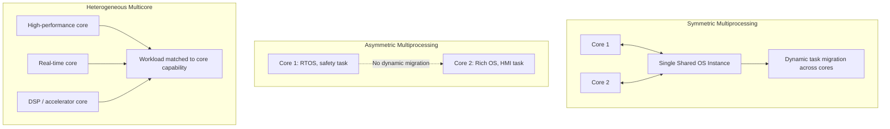

## Multicore Embedded Systems

### Overview

Multicore embedded systems integrate two or more independent processing cores onto a single die or package, allowing an embedded application to exploit parallelism for higher throughput, better performance-per-watt, or physical consolidation of previously separate single-core ECUs (Electronic Control Units) into one chip. This shift, driven originally by power and thermal limits on single-core clock scaling, introduces engineering challenges largely absent from single-core design: cache coherency, shared-resource contention, interference between cores, and — in safety-relevant domains — the need to demonstrate that one core's activity cannot compromise another's timing or correctness guarantees. Multicore adoption intersects directly with the redundancy and fault-tolerant design material (lockstep cores) and with the safety standards material (ISO 26262's freedom-from-interference requirements), both covered elsewhere in this content set.

### Why Multicore Entered Embedded Design

Embedded systems moved toward multicore architectures for reasons distinct from, though related to, the same forces in general-purpose computing:

- **Power and thermal limits on frequency scaling:** Continuing to raise a single core's clock frequency yields diminishing performance return per additional watt and heat generated; adding cores at a lower frequency each can deliver more aggregate throughput within the same thermal budget.
- **Consolidation:** Vehicles and industrial systems historically used many separate single-core ECUs, each handling one function; multicore microcontrollers allow several of these functions to be consolidated onto fewer physical chips, reducing wiring harness weight, cost, and part count — a significant driver in automotive "domain controller" and "zonal architecture" trends.
- **Mixed-criticality workloads:** A single multicore chip can host a high-criticality real-time control function on one core and a lower-criticality, less time-sensitive function (e.g., diagnostics logging, a UI) on another, provided isolation between them can be demonstrated.
- **Increasing computational demand:** Sensor fusion, computer vision, and ADAS (Advanced Driver Assistance Systems) workloads require far more computation than typical single-core microcontrollers can provide within embedded power and cost budgets.

### Multicore Architectural Patterns in Embedded Systems

#### Symmetric Multiprocessing (SMP)

All cores are identical, run the same operating system instance, and are treated as an interchangeable pool of execution resources by the scheduler, which can migrate tasks between cores dynamically. SMP is common in higher-performance embedded Linux applications (infotainment, ADAS compute) but introduces additional timing analysis complexity for hard real-time work, since task migration and shared-cache effects make worst-case execution time harder to bound tightly.

#### Asymmetric Multiprocessing (AMP)

Each core runs its own independent operating system instance (or no OS at all, running bare-metal), with a fixed, statically defined allocation of tasks to specific cores rather than dynamic migration. AMP is common in safety-relevant automotive and industrial microcontrollers, where a real-time safety function might run bare-metal or under a small RTOS on one core, while a separate core runs a different OS entirely (e.g., a rich OS for HMI) — the static allocation and separate OS instances simplify the timing and interference argument compared with SMP's dynamic scheduling.

#### Heterogeneous Multicore

Cores differ in architecture, capability, or purpose — for example, pairing a high-performance applications core with a lower-power, real-time-oriented core, or combining general-purpose cores with a dedicated DSP (Digital Signal Processor) or specialized safety core. This pattern is widespread in modern automotive and industrial SoCs (Systems on Chip), where different cores are deliberately matched to different workload characteristics rather than replicated identically.

### Cache Coherency

When multiple cores each maintain their own local cache but share access to main memory, **cache coherency** mechanisms must ensure that all cores observe a consistent view of shared data — without it, one core could read a stale cached value while another core has already written a newer value to memory.

- **Snooping-based coherency (e.g., MESI protocol — Modified, Exclusive, Shared, Invalid):** Each cache line is tagged with a coherency state, and cores monitor ("snoop") a shared bus for writes to addresses they have cached, invalidating or updating their local copy accordingly.
- **Directory-based coherency:** A centralized or distributed directory tracks which cores hold copies of which cache lines, avoiding the need for every core to observe every bus transaction — more scalable to higher core counts but adds directory access latency.

For real-time embedded systems, cache coherency introduces a specific concern beyond correctness: coherency traffic (cache line invalidations, snoop responses) consumes shared interconnect bandwidth in ways that are difficult to bound tightly, complicating worst-case execution time analysis for hard real-time tasks running alongside other cores' memory-intensive activity.

### Shared Resource Interference

A central concern distinguishing multicore embedded design from single-core design is that cores sharing a chip inevitably share some physical resources — the memory bus, last-level cache, DMA (Direct Memory Access) controllers, interconnect fabric — and contention for these shared resources can cause one core's timing to be affected by another core's activity, even when the two cores are running entirely unrelated, logically independent software.

This is the **multicore interference problem**, and it is the primary reason safety standards treat multicore adoption as requiring explicit additional analysis:

- A safety-critical task on Core A performing memory accesses can experience increased latency because Core B is simultaneously saturating the shared memory bus with unrelated traffic — a phenomenon sometimes informally described as "noisy neighbor" interference.
- Because this interference is a function of the *other* core's runtime behavior, which may not be under the same rigorous specification and test as the safety-critical task itself, worst-case execution time bounds calculated as if the core ran in isolation can be invalidated in the real multicore system.

[Inference] Quantifying worst-case interference precisely is an active area of both academic research and tooling development, since the interaction between cache replacement policies, memory controller arbitration, and interconnect topology is complex enough that simple analytical bounds are often either too pessimistic to be useful or insufficiently rigorous to be trusted; practical approaches frequently combine measurement-based characterization with conservative margins rather than relying on a single closed-form worst-case formula, and the maturity of tooling for this varies significantly by chip vendor and toolchain.

### Freedom from Interference in a Multicore Context

The "freedom from interference" concept introduced in the ISO 26262 material takes on additional dimensions in multicore systems, since interference can now occur not only through software logic (one task corrupting another's memory) but through the underlying shared hardware itself:

- **Spatial interference:** One core's software corrupting another core's memory region — addressed through Memory Protection Units (MPUs) or Memory Management Units (MMUs) enforcing partition boundaries, as in single-core systems.
- **Temporal interference:** One core's activity delaying another core's access to a shared resource (memory bus, cache, interconnect) beyond an assumed bound — a multicore-specific concern with no direct single-core analogue, requiring either hardware-level resource partitioning (e.g., cache way partitioning, memory bandwidth regulation/throttling mechanisms) or conservative timing margins validated through measurement.
- **Communication interference:** Shared communication mechanisms (semaphores, shared memory queues, interrupt controllers) used for legitimate inter-core communication becoming a vector for one core's fault to propagate to another if not carefully designed with appropriate protection.

ISO 26262's 2018 second edition added an annex specifically addressing multicore-related considerations, reflecting the standard's recognition that single-core-era interference arguments do not automatically transfer to multicore hardware. [Unverified] Specific normative content and its exact scope should be verified against the current edition text directly, since summarizing detailed annex requirements from memory risks imprecision on a topic where exact regulatory wording matters.

### Inter-Core Communication Mechanisms

- **Shared memory with synchronization primitives:** Semaphores, mutexes, and spinlocks coordinate access to memory regions shared between cores — but naive shared-memory designs risk priority inversion and deadlock in ways that require the same rigorous analysis as single-core RTOS synchronization, compounded by the added complexity of genuinely concurrent (not merely preemptive) execution.
- **Message passing / mailboxes:** Dedicated hardware mailbox peripherals or software-managed queues pass discrete messages between cores without requiring shared, simultaneously-accessed memory regions, often simplifying the interference argument at some cost to latency and throughput compared with shared memory.
- **Inter-Processor Interrupts (IPIs):** One core signals another via a dedicated interrupt mechanism, commonly used to trigger a specific handler on the target core (e.g., waking a sleeping core, requesting a core perform an action) rather than transferring bulk data.
- **Hardware semaphore/mutex peripherals:** Some multicore microcontrollers include dedicated hardware peripherals implementing atomic test-and-set semantics accessible from any core, avoiding certain race conditions inherent in software-only synchronization implemented over ordinary shared memory.

### Lockstep vs. General-Purpose Multicore: A Key Distinction

It is worth explicitly distinguishing the multicore patterns discussed here from **lockstep multicore** (introduced under redundancy and fault-tolerant design), since both involve multiple cores but for fundamentally different purposes:

- **Lockstep cores** execute the *identical* instruction stream in synchronization specifically to detect faults via output comparison — the cores are not doing independent, parallel work, and lockstep does not increase throughput; it exists purely for fault detection.
- **General-purpose multicore** (SMP, AMP, heterogeneous) runs *different*, independent workloads on each core specifically to increase throughput or enable functional consolidation — the cores are doing genuinely parallel, distinct work.

A modern automotive-grade microcontroller may include both patterns simultaneously: one lockstep core pair dedicated to a safety-critical control function, alongside additional independent cores handling non-lockstepped, higher-throughput tasks — meaning "multicore" in a single chip's datasheet can refer to a mixture of these architecturally distinct purposes, and reading a chip's core count alone does not indicate which pattern applies to which core.

**Key Points**
- Multicore adoption in embedded systems is driven by power/thermal limits on frequency scaling, consolidation of previously separate ECUs, and rising computational demand from sensor fusion and ADAS workloads.
- SMP offers scheduling flexibility at the cost of harder-to-bound worst-case timing; AMP's static allocation is generally preferred in safety-relevant real-time contexts specifically because it simplifies the interference and timing argument.
- Multicore interference is fundamentally a *shared-hardware-resource* problem (memory bus, cache, interconnect), distinct from the software-level interference concerns present in single-core systems, and requires additional analysis beyond simply porting a single-core-era safety argument.
- Lockstep multicore (fault detection via identical redundant execution) and general-purpose multicore (throughput via parallel independent execution) are different architectural patterns that can coexist on the same chip; the presence of multiple cores does not by itself indicate which pattern is in use.

**Example**

A simplified illustration of temporal interference between cores sharing a memory bus:

<svg xmlns="http://www.w3.org/2000/svg" viewBox="0 0 820 320">
  \<style\>
    .box { fill: #f4f6f8; stroke: #2b3a4a; stroke-width: 1.5; }
    .boxAlt { fill: #eef2ff; stroke: #2b3a4a; stroke-width: 1.5; }
    .boxWarn { fill: #fff1ea; stroke: #8a4a1f; stroke-width: 1.5; }
    .label { font-family: Helvetica, Arial, sans-serif; font-size: 13px; fill: #1a1a1a; }
    .small { font-family: Helvetica, Arial, sans-serif; font-size: 11px; fill: #444; }
    .title { font-family: Helvetica, Arial, sans-serif; font-size: 15px; fill: #111; font-weight: bold; }
    .arrow { stroke: #2b3a4a; stroke-width: 1.5; fill: none; marker-end: url(#arrowhead7); }
  \</style\>
  <text x="410" y="26" text-anchor="middle" class="title">Shared Memory Bus Interference (svg_diagram)</text>

  <rect x="40" y="60" width="180" height="60" rx="6" class="box" />
  <text x="130" y="85" text-anchor="middle" class="label">Core A: Safety Task</text>
  <text x="130" y="102" text-anchor="middle" class="small">Expects bounded memory latency</text>

  <rect x="40" y="160" width="180" height="60" rx="6" class="boxWarn" />
  <text x="130" y="185" text-anchor="middle" class="label">Core B: Data Logging</text>
  <text x="130" y="202" text-anchor="middle" class="small">High-volume, bursty memory writes</text>

  <rect x="330" y="110" width="180" height="60" rx="6" class="boxAlt" />
  <text x="420" y="135" text-anchor="middle" class="label">Shared Memory Bus</text>
  <text x="420" y="152" text-anchor="middle" class="small">Single arbitrated resource</text>

  <rect x="610" y="60" width="170" height="60" rx="6" class="box" />
  <text x="695" y="85" text-anchor="middle" class="label">Core A Actual Latency</text>
  <text x="695" y="102" text-anchor="middle" class="small">Delayed beyond isolated-case bound</text>

  <path class="arrow" d="M220,90 L330,135" />
  <path class="arrow" d="M220,190 L330,145" />
  <path class="arrow" d="M510,130 L610,90" />

  <text x="420" y="250" text-anchor="middle" class="small">Core B's unrelated bus traffic delays Core A's memory access;</text>
  <text x="420" y="266" text-anchor="middle" class="small">a single-core-derived timing bound for Core A does not account for this shared-resource effect.</text>
</svg>

**Related Topics**
- ISO 26262 multicore annex and freedom-from-interference analysis for shared hardware resources
- Cache coherency protocols: MESI and directory-based approaches in embedded SoCs
- Worst-Case Execution Time (WCET) analysis challenges under shared-resource contention
- Hardware resource partitioning: cache way partitioning and memory bandwidth throttling/regulation
- Lockstep processor architectures for fault detection (cross-reference to redundancy and fault-tolerant design)
- AUTOSAR multicore configuration and core-to-SWC mapping considerations
- Zonal and domain-controller automotive E/E architectures enabled by multicore consolidation
- Heterogeneous SoC design: pairing application cores, real-time cores, and DSP/accelerator cores
- RTOS scheduling strategies for SMP vs. AMP embedded configurations