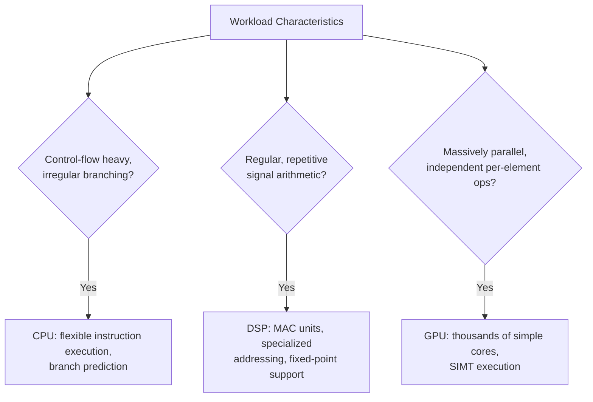
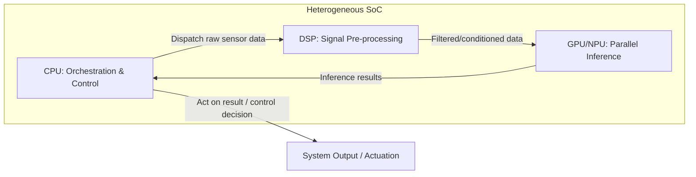

## Heterogeneous Computing: CPU, DSP, and GPU Cores

### Overview

Heterogeneous computing in embedded systems combines processing elements of fundamentally different architectures — general-purpose CPUs, Digital Signal Processors (DSPs), and Graphics Processing Units (GPUs), often alongside fixed-function accelerators and Neural Processing Units (NPUs) — on a single System on Chip (SoC), deliberately matching each workload to the processing element best suited to it rather than running everything on identical general-purpose cores. This builds directly on the heterogeneous multicore pattern introduced in the multicore embedded systems material, but focuses specifically on the architectural differences between CPU, DSP, and GPU cores, why those differences exist, and the software/toolchain complexity that heterogeneity introduces.

### Why Heterogeneity Instead of More General-Purpose Cores

Adding more identical general-purpose CPU cores to a chip does not scale efficiently for every workload type. Different computational patterns have fundamentally different bottlenecks, and specialized architectures address those bottlenecks far more efficiently — in performance-per-watt terms — than general-purpose cores can:

- **Control-flow-heavy, irregular code** (state machines, protocol parsing, decision logic) benefits from a CPU's branch prediction, out-of-order execution, and flexible instruction set.
- **Regular, repetitive, data-parallel arithmetic** (filtering, transforms, matrix operations) benefits from architectures that can perform many identical operations simultaneously rather than one flexible operation at a time.
- **Massively parallel, largely independent computations** (per-pixel image operations, many largely independent matrix multiplications) benefit from architectures with very high core counts running simpler per-core logic.

Matching workload to architecture yields substantial power and area efficiency gains over forcing all computation through general-purpose cores, which is why embedded SoCs — particularly in automotive ADAS, industrial vision, and audio/communications products — increasingly integrate multiple distinct processing architectures rather than simply adding more CPU cores.

### CPU Cores: General-Purpose Control

In a heterogeneous SoC, the CPU (commonly an Arm Cortex-A or Cortex-R series core, or a RISC-V core, in embedded contexts) typically serves as the **orchestrator**: running the operating system, managing overall system state, handling irregular control logic, communication protocol stacks, and coordinating work dispatched to the other processing elements. CPUs are architecturally optimized for **latency and flexibility** over raw parallel throughput — branch prediction, speculative execution, and deep instruction pipelines all exist to minimize the time to execute a single, often unpredictable, stream of instructions, at a cost in silicon area and power per unit of raw arithmetic throughput compared with more specialized architectures.

Within the CPU category itself, embedded heterogeneous designs often further specialize:

- **Application-class cores** (e.g., Cortex-A series): Run a full operating system (Linux, QNX), handle higher-level application logic, user interfaces, and complex protocol stacks.
- **Real-time-class cores** (e.g., Cortex-R series, or Cortex-M for lower-end designs): Run bare-metal or a lightweight RTOS, handle time-critical control loops requiring deterministic, bounded response latency that a general-purpose OS scheduler on an application core cannot reliably guarantee.

### DSP Cores: Specialized Signal Processing

A DSP is architecturally specialized for the arithmetic patterns common in signal processing — filtering, transforms (FFT/DFT), correlation, convolution — which overwhelmingly consist of repeated **multiply-accumulate (MAC)** operations across data streams:

$$
y[n] = \sum_{k=0}^{N-1} h[k] \cdot x[n-k]
$$

DSP architectures embed features directly supporting this pattern, distinguishing them from general-purpose CPUs:

- **Dedicated MAC hardware units:** Capable of performing a multiply and an addition in a single cycle, often with multiple MAC units operating in parallel within one core.
- **Specialized addressing modes:** Hardware support for **circular buffering** (essential for streaming filter implementations without explicit wraparound logic in software) and **bit-reversed addressing** (accelerating FFT butterfly computation patterns).
- **Fixed-point and saturating arithmetic support:** Many DSP workloads, particularly in cost- and power-constrained embedded audio/communications applications, use fixed-point rather than floating-point representations for efficiency; DSP cores commonly provide hardware saturation (clamping an overflow to the representable maximum/minimum rather than wrapping) to avoid the severe artifacts that silent integer overflow would cause in a signal processing context.
- **Very Long Instruction Word (VLIW) or SIMD (Single Instruction, Multiple Data) execution:** Many embedded DSPs issue several parallel operations per instruction word (VLIW) or apply one operation across multiple data elements simultaneously (SIMD), extracting instruction-level or data-level parallelism from the highly regular structure of signal-processing code.

DSPs are common in embedded audio processing, software-defined radio, sensor signal conditioning (e.g., radar/lidar pre-processing in automotive ADAS pipelines), and modem/communications baseband processing, where their power efficiency for these specific arithmetic patterns substantially exceeds what a general-purpose CPU core achieves for the same workload.

### GPU Cores: Massively Parallel Data-Parallel Compute

GPUs, originally designed for rendering graphics (where the same per-pixel or per-vertex computation is applied independently across millions of elements), have architectures built around extremely high parallelism at the cost of per-core flexibility and per-thread latency:

- **SIMT (Single Instruction, Multiple Thread) execution:** Groups of threads (commonly called warps or wavefronts, depending on vendor terminology) execute the same instruction simultaneously across many data elements, achieving high throughput specifically when the workload is highly parallel and threads within a group follow the same control-flow path.
- **Thousands of simple execution units** rather than a handful of complex ones — individually far less capable than a CPU core at irregular control flow, but collectively capable of enormous aggregate arithmetic throughput on regular, parallel workloads.
- **High memory bandwidth architectures**, since feeding thousands of parallel execution units with data is often the actual throughput bottleneck rather than the arithmetic itself.

In embedded contexts, GPUs are increasingly significant beyond traditional graphics rendering: **General-Purpose computing on GPU (GPGPU)** applies GPU parallelism to non-graphics workloads, most notably neural network inference for computer vision and sensor fusion in automotive ADAS and robotics, where convolutional operations map naturally onto the same massively parallel, regular-arithmetic pattern GPUs were built to accelerate. [Inference] Whether a given embedded ADAS or vision workload is better served by a GPU or by a dedicated NPU/neural accelerator depends heavily on the specific model architecture, power budget, and vendor tooling maturity; this is an area of active architectural competition rather than one with a single settled answer, and specific product selection should be evaluated against the target workload rather than assumed from general GPU vs. NPU characteristics alone.

### Comparative Summary

| Aspect | CPU | DSP | GPU |
|---|---|---|---|
| Optimized for | Flexible, irregular control flow | Regular, repetitive arithmetic (MAC-heavy) | Massively parallel, regular data-parallel arithmetic |
| Execution model | Sequential with branch prediction / speculation | VLIW / SIMD, specialized addressing | SIMT across thousands of simple cores |
| Typical embedded role | OS execution, orchestration, protocol stacks, control logic | Audio/signal filtering, radar/lidar pre-processing, baseband modem processing | Image/vision processing, neural network inference, graphics rendering |
| Per-thread latency | Low (optimized) | Low to moderate | High (throughput-oriented, not latency-oriented) |
| Power efficiency for its target workload | Moderate | High for signal-processing patterns | High for massively parallel patterns, poor for irregular control flow |

### Software and Toolchain Complexity

Heterogeneity's performance and power benefits come with substantial software engineering cost, since each processing element type typically requires its own toolchain, programming model, and debugging approach:

- **Separate compilers and instruction sets:** Code targeting the DSP or GPU is generally compiled with vendor-specific toolchains distinct from the CPU's toolchain, and the three architectures do not share a single unified instruction set or programming model in the way that homogeneous multicore CPU designs do.
- **Heterogeneous programming frameworks:** Standards and frameworks such as OpenCL, and vendor-specific SDKs, attempt to provide a more unified programming model across CPU/GPU/DSP targets, but [Inference] the degree of true portability achieved varies significantly by vendor and target, and performance-critical embedded code is frequently still hand-tuned per target architecture rather than relying solely on a portable abstraction layer, particularly where power and real-time constraints are tight.
- **Data movement and synchronization overhead:** Passing data between CPU, DSP, and GPU domains — each potentially with separate memory spaces or cache hierarchies — introduces explicit data transfer and synchronization steps that must be carefully managed to avoid the transfer overhead eliminating the performance benefit gained from offloading the computation in the first place.
- **Debugging across heterogeneous domains:** A single logical operation (e.g., "process this camera frame") may span CPU orchestration code, DSP pre-processing, and GPU/NPU inference, each potentially requiring a different debugger, trace mechanism, and profiling tool — significantly complicating root-cause analysis compared with debugging a single-architecture pipeline.
- **Safety and certification implications:** In safety-relevant embedded systems, demonstrating the correctness and timing determinism of computation offloaded to a DSP or GPU (particularly a GPU, whose scheduling and memory architecture were historically not designed with hard real-time or safety-argument transparency in mind) can be substantially harder than making the same argument for CPU-executed code, and this is an active area of standards development as GPUs and NPUs become more common in safety-relevant ADAS and autonomous driving pipelines.

**Key Points**
- Heterogeneity exists because different computational patterns (irregular control flow, regular signal arithmetic, massively parallel data-parallel operations) are served far more power-efficiently by architecturally distinct processing elements than by a single general-purpose architecture handling all three.
- DSPs specialize in MAC-heavy, streaming arithmetic through dedicated hardware and specialized addressing modes; GPUs specialize in massively parallel, regular data-parallel arithmetic through very high core counts and SIMT execution; CPUs specialize in flexible, irregular control flow.
- The performance and power benefits of heterogeneous computing come with real software engineering costs: separate toolchains, explicit data movement between domains, and more complex cross-domain debugging.
- Demonstrating safety-relevant timing and correctness guarantees for GPU- or NPU-offloaded computation is generally harder than for CPU-executed code, and is an evolving area as these architectures become more common in safety-relevant automotive and robotics pipelines.

**Example**

A simplified data flow for a camera-based ADAS pipeline spanning all three architecture types:

<svg xmlns="http://www.w3.org/2000/svg" viewBox="0 0 820 320">
  \<style\>
    .box { fill: #f4f6f8; stroke: #2b3a4a; stroke-width: 1.5; }
    .boxAlt { fill: #eef2ff; stroke: #2b3a4a; stroke-width: 1.5; }
    .boxGood { fill: #eefcf1; stroke: #1f6b3a; stroke-width: 1.5; }
    .label { font-family: Helvetica, Arial, sans-serif; font-size: 13px; fill: #1a1a1a; }
    .small { font-family: Helvetica, Arial, sans-serif; font-size: 11px; fill: #444; }
    .title { font-family: Helvetica, Arial, sans-serif; font-size: 15px; fill: #111; font-weight: bold; }
    .arrow { stroke: #2b3a4a; stroke-width: 1.5; fill: none; marker-end: url(#arrowhead8); }
  \</style\>
  <text x="410" y="26" text-anchor="middle" class="title">Camera-Based ADAS Pipeline Across Architectures (svg_diagram)</text>

  <rect x="30" y="120" width="150" height="60" rx="6" class="box" />
  <text x="105" y="145" text-anchor="middle" class="label">Camera Sensor</text>
  <text x="105" y="162" text-anchor="middle" class="small">Raw pixel stream</text>

  <rect x="220" y="120" width="150" height="60" rx="6" class="boxAlt" />
  <text x="295" y="145" text-anchor="middle" class="label">DSP</text>
  <text x="295" y="162" text-anchor="middle" class="small">Noise reduction, demosaicing</text>

  <rect x="410" y="120" width="150" height="60" rx="6" class="boxGood" />
  <text x="485" y="145" text-anchor="middle" class="label">GPU / NPU</text>
  <text x="485" y="162" text-anchor="middle" class="small">Object detection inference</text>

  <rect x="600" y="120" width="180" height="60" rx="6" class="box" />
  <text x="690" y="145" text-anchor="middle" class="label">CPU</text>
  <text x="690" y="162" text-anchor="middle" class="small">Decision logic, actuation command</text>

  <path class="arrow" d="M180,150 L220,150" />
  <path class="arrow" d="M370,150 L410,150" />
  <path class="arrow" d="M560,150 L600,150" />

  <text x="410" y="230" text-anchor="middle" class="small">Each stage runs on the architecture best matched to its computational pattern;</text>
  <text x="410" y="246" text-anchor="middle" class="small">data crosses architecture boundaries at each arrow, requiring explicit transfer and synchronization.</text>
</svg>

**Related Topics**
- Neural Processing Units (NPUs) and dedicated AI accelerators in embedded SoCs
- Fixed-point vs. floating-point arithmetic tradeoffs in embedded signal processing
- OpenCL and heterogeneous programming model portability in embedded contexts
- Worst-Case Execution Time analysis challenges for GPU/NPU-offloaded safety-relevant computation
- Automotive ADAS sensor fusion pipelines spanning radar, lidar, and camera processing
- Memory architecture and data movement overhead in heterogeneous SoC design
- VLIW and SIMD instruction-level parallelism in embedded DSP cores
- Vendor-specific heterogeneous SoC toolchains and their debugging/profiling ecosystems
- Safety certification challenges for GPU- and NPU-based computation in ISO 26262 contexts