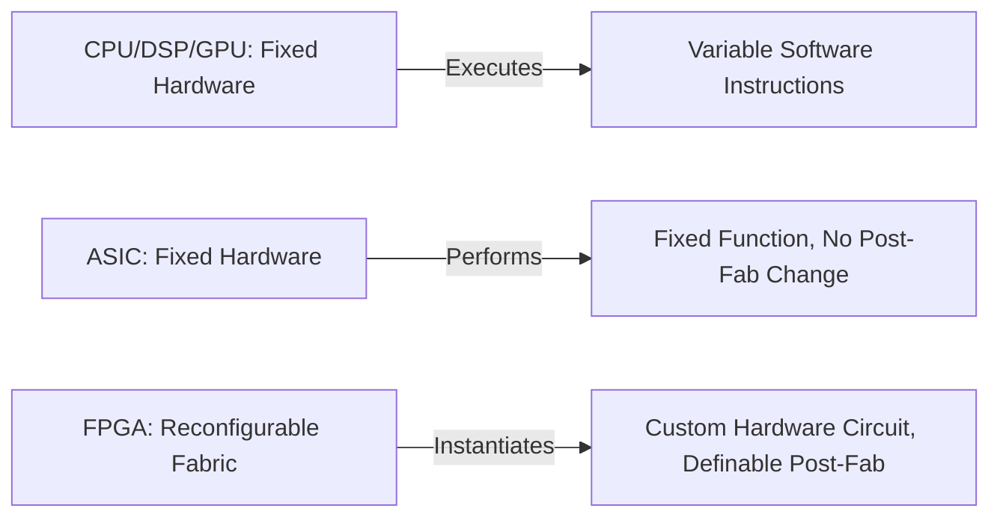
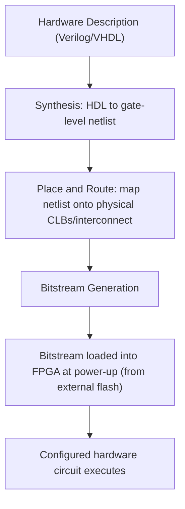

## FPGA Fundamentals and Use Cases

### Overview

A Field-Programmable Gate Array (FPGA) is an integrated circuit whose internal logic is not fixed at manufacture but is instead configured, and can be reconfigured, by the end user after fabrication — in contrast to an ASIC (Application-Specific Integrated Circuit), whose logic is permanently fixed during manufacturing, or a CPU/DSP/GPU (covered under heterogeneous computing), whose fixed hardware executes variable software instructions. This reconfigurability makes FPGAs a distinct third category of embedded compute alongside fixed-instruction processors and fixed-function ASICs, occupying a specific niche where hardware-level parallelism, deterministic timing, or post-deployment flexibility of the actual logic (not just the software running on fixed logic) are required.

### The Fundamental Distinction: Configurable Hardware vs. Programmable Software

The most important conceptual point for engineers new to FPGAs is that **programming an FPGA is not writing software that runs on hardware — it is describing hardware that is then physically instantiated** within the chip's reconfigurable fabric. A CPU executes a sequence of instructions one (or a few, with pipelining/superscalar execution) at a time against fixed silicon; an FPGA has its internal logic gates and interconnect wired into a specific circuit topology dictated by the design, and that circuit performs its function through genuine parallel, physical logic propagation rather than sequential instruction fetch-decode-execute.

This distinction has direct practical consequences: FPGA "programming" is properly called **hardware description**, typically in **Verilog** or **VHDL** (VHSIC Hardware Description Language), and the design process (synthesis, place-and-route) is fundamentally a hardware design flow, not a software compilation flow, even though tool interfaces sometimes present superficially similar project structures.

### Internal Architecture

An FPGA's reconfigurable fabric is built from a repeating array of basic building blocks, connected by a programmable interconnect network:

- **Configurable Logic Blocks (CLBs)** (Xilinx/AMD terminology) or **Logic Elements (LEs)** (Intel/Altera terminology): The basic unit of programmable logic, typically containing one or more **Look-Up Tables (LUTs)** that implement arbitrary combinational logic functions by storing a truth table in small memory cells, plus flip-flops for storing state (sequential logic) and small multiplexers for local routing.
- **Programmable Interconnect:** A dense, configurable network of wires and programmable switches connecting CLBs/LEs to each other and to I/O, whose specific configuration (which switches are closed) determines how signals physically route between logic blocks — this interconnect fabric is itself a substantial fraction of the chip's area and a key driver of achievable clock frequency, since signal propagation across configurable routing is generally slower than the equivalent fixed, optimized routing in an ASIC.
- **Dedicated I/O Blocks:** Configurable input/output circuitry supporting a range of voltage standards and signaling protocols, allowing the same FPGA to interface with diverse external devices depending on configuration.
- **Block RAM (BRAM):** Dedicated on-chip memory blocks distributed throughout the fabric, providing fast local storage (FIFOs, buffers, lookup tables for data) without consuming general-purpose logic resources to emulate memory.
- **DSP Slices / Hardened Multiply-Accumulate Blocks:** Dedicated hardware multiplier and accumulator circuits embedded in the fabric specifically to accelerate the same MAC-heavy arithmetic patterns discussed under DSP cores, without consuming general logic resources to build multipliers from LUTs — recognizing that implementing a fast multiplier purely from generic programmable logic is both slow and resource-expensive compared with a hardened block.
- **Clock Management Circuitry:** Phase-Locked Loops (PLLs) and Digital Clock Managers generating and distributing multiple precisely controlled clock domains across the fabric, since different parts of a design often need different clock frequencies or phase relationships.

The bitstream — the configuration data loaded into the FPGA at power-up (from external flash, since most FPGA fabric is volatile SRAM-based and loses its configuration on power loss) — determines the specific function of every LUT, every interconnect switch, and every configurable element, effectively "wiring up" the desired circuit each time the device is configured.

### Why FPGAs Instead of a Processor or an ASIC

FPGAs occupy a specific tradeoff space between processors and ASICs, and the decision to use one is driven by specific requirements that neither alternative satisfies as well:

- **True hardware parallelism:** Because an FPGA design is literally instantiated as parallel physical logic, operations that would need to be sequenced on a processor (even a heavily pipelined one) can genuinely execute simultaneously in independent hardware — valuable for applications needing extremely high, deterministic throughput on many parallel data streams (e.g., processing many independent sensor channels simultaneously).
- **Deterministic, cycle-accurate timing:** Because the logic is fixed hardware for the duration of its configuration (not subject to OS scheduling, cache effects, or instruction pipeline hazards), FPGA-implemented logic can achieve extremely tight, predictable timing — relevant to high-speed control loops, precise signal generation, and interfacing with protocols requiring very exact timing.
- **Custom interfacing and protocol implementation:** When an application needs to interface with a non-standard sensor protocol, an unusual bus timing requirement, or needs many parallel high-speed I/O channels, implementing this directly in configurable logic avoids the latency and jitter a software-based bit-banged or even a fixed-peripheral-based implementation would introduce.
- **Post-deployment reconfigurability of actual logic:** Unlike an ASIC, an FPGA's function can be entirely changed after deployment (even in the field, given appropriate update infrastructure), including fixing hardware-level logic bugs or adding entirely new functionality — valuable where field updates of behavior are needed but the volume does not justify a full ASIC respin, or where the algorithm/protocol is still evolving.
- **Faster time-to-market and lower non-recurring engineering (NRE) cost than an ASIC:** ASIC design requires expensive, slow mask fabrication with essentially no ability to fix a design error after fabrication without a costly re-spin; FPGAs allow iterating the actual hardware design far faster and without per-iteration fabrication cost, at the tradeoff of higher per-unit cost and lower achievable clock frequency/power efficiency than an equivalent ASIC at high volume.

[Inference] The specific crossover volume at which an ASIC becomes more cost-effective than an FPGA for a given design depends heavily on the design's complexity, target process node, and NRE cost structure, and varies significantly by year and vendor; no single fixed unit-volume threshold applies universally across designs.

### FPGA vs. ASIC vs. Processor: Comparative Summary

| Aspect | Processor (CPU/DSP/GPU) | FPGA | ASIC |
|---|---|---|---|
| Function fixed at | Never (software-defined) | Configuration/reconfiguration time | Fabrication (permanent) |
| Parallelism model | Sequential/pipelined instruction execution | True parallel hardware logic | True parallel hardware logic |
| Timing determinism | Subject to scheduling, cache, pipeline effects | Cycle-accurate, deterministic | Cycle-accurate, deterministic |
| Post-deployment flexibility | High (software update) | High (bitstream reconfiguration) | None (fixed at fabrication) |
| Per-unit cost at high volume | Moderate | Higher than ASIC | Lowest at high volume |
| Non-recurring engineering cost | Low | Low to moderate | Very high (mask costs, verification) |
| Power efficiency for a fixed function | Lower (general-purpose overhead) | Moderate (configurable overhead remains) | Highest (fully optimized fixed logic) |
| Typical design iteration time | Fast (software recompile) | Moderate (synthesis, place-and-route) | Very slow (fabrication cycle) |

### Common Embedded Use Cases

- **High-speed data acquisition and pre-processing:** Capturing and processing data from many parallel high-speed ADC (Analog-to-Digital Converter) channels or sensors simultaneously, applying real-time filtering or triggering logic before handing reduced/processed data to a CPU for higher-level decision-making — a common pattern in test-and-measurement equipment, radar systems, and scientific instrumentation.
- **Custom protocol bridging and glue logic:** Interfacing between components using incompatible or non-standard bus protocols, timing requirements, or voltage levels, where implementing the translation logic in configurable hardware is more practical than either finding a fixed off-the-shelf bridge chip or bit-banging the protocol in software with insufficient timing precision.
- **Software-Defined Radio (SDR):** Implementing the high-speed digital signal processing chain (modulation/demodulation, filtering, channelization) for radio communications directly in FPGA fabric, where the specific waveform or protocol may need to change across deployments or even be reconfigured in the field.
- **Motor control and precision timing:** Generating and processing precisely timed PWM (Pulse Width Modulation) signals, encoder feedback, and closed-loop control logic at very high update rates that would strain a software-based control loop on a general-purpose processor, particularly where many independent axes must be controlled with tight synchronization.
- **Prototyping and emulation of ASIC designs:** Before committing to expensive ASIC fabrication, engineers commonly implement and validate the design logic on an FPGA first, since FPGA-based prototyping allows functional and, to a degree, timing verification of the actual hardware description before the high-cost, hard-to-reverse ASIC fabrication step.
- **Safety-relevant and redundant computation:** FPGAs are used in some avionics, industrial, and automotive safety contexts specifically because their deterministic, non-shared-cache, non-OS-scheduled execution model can simplify certain timing and interference arguments compared with a software-on-processor implementation — though this comes with its own certification considerations (see below) rather than being an automatic simplification.

### FPGA Design Flow and Verification Considerations

The FPGA design process parallels, but is not identical to, the software V&V processes covered elsewhere in this material, since it is fundamentally a hardware design flow:

- **RTL (Register-Transfer Level) design:** Describing the desired hardware behavior in Verilog or VHDL at the level of registers and the logic transferring data between them.
- **Simulation:** Functionally verifying the RTL design against a testbench before committing to synthesis, since simulation is far faster to iterate than the full synthesis/place-and-route flow.
- **Synthesis:** Translating the RTL description into a gate-level netlist mapped to the target FPGA's specific logic primitives.
- **Place and Route:** Mapping the synthesized netlist onto specific physical CLBs/LEs and interconnect resources on the target device, a step whose outcome (and achievable timing) can vary depending on tool heuristics, making **static timing analysis** after place-and-route an essential verification step to confirm the design will actually meet its target clock frequency in the physical implementation, not merely in idealized simulation.
- **Hardware-in-the-loop / on-device validation:** Testing the actual configured FPGA hardware against real signals and interfaces, since simulation, however thorough, cannot always capture every physical-layer or timing-margin effect present in the fabricated device.

[Inference] Applying safety standards such as ISO 26262 or IEC 62304 to FPGA-based designs generally requires distinct guidance beyond the software-oriented lifecycle processes discussed elsewhere in this material, since an FPGA's HDL "design" occupies a middle ground between hardware and software from a process standard's perspective; some standards bodies and industry guidance documents address this specifically (e.g., automotive and aerospace guidance for programmable logic devices), but the exact applicable framework depends on the target industry and should be confirmed against current sector-specific guidance rather than assumed to map directly onto either the hardware or software lifecycle processes described for ASICs and microcontroller software respectively.

**Key Points**
- Programming an FPGA describes and instantiates physical hardware logic, not software executed by fixed hardware — this distinction underlies every difference between FPGA design flow and conventional embedded software development.
- FPGAs occupy a middle ground between processors (flexible, sequential, lower parallel throughput) and ASICs (fixed, highly optimized, no post-fabrication flexibility), justified specifically when true hardware parallelism, deterministic cycle-accurate timing, or post-deployment logic reconfigurability are required.
- Dedicated hardware blocks within the fabric (BRAM, DSP slices/hardened multipliers, clock management) exist because implementing equivalent functionality from generic programmable logic alone would be substantially slower and more resource-expensive.
- Verification of an FPGA design requires simulation, synthesis, place-and-route, and post-route static timing analysis — passing simulation alone does not guarantee the physically implemented design meets its timing requirements.

**Example**

A simplified illustration of an FPGA-based sensor pre-processing pipeline feeding a CPU:

<svg xmlns="http://www.w3.org/2000/svg" viewBox="0 0 820 320">
  \<style\>
    .box { fill: #f4f6f8; stroke: #2b3a4a; stroke-width: 1.5; }
    .boxAlt { fill: #eef2ff; stroke: #2b3a4a; stroke-width: 1.5; }
    .boxGood { fill: #eefcf1; stroke: #1f6b3a; stroke-width: 1.5; }
    .label { font-family: Helvetica, Arial, sans-serif; font-size: 13px; fill: #1a1a1a; }
    .small { font-family: Helvetica, Arial, sans-serif; font-size: 11px; fill: #444; }
    .title { font-family: Helvetica, Arial, sans-serif; font-size: 15px; fill: #111; font-weight: bold; }
    .arrow { stroke: #2b3a4a; stroke-width: 1.5; fill: none; marker-end: url(#arrowhead9); }
  \</style\>
  <text x="410" y="26" text-anchor="middle" class="title">FPGA Sensor Pre-Processing Pipeline (svg_diagram)</text>

  <rect x="30" y="130" width="140" height="55" rx="6" class="box" />
  <text x="100" y="150" text-anchor="middle" class="label">ADC Channel 1</text>
  <text x="100" y="167" text-anchor="middle" class="small">Parallel stream</text>

  <rect x="30" y="60" width="140" height="55" rx="6" class="box" />
  <text x="100" y="80" text-anchor="middle" class="label">ADC Channel 2..N</text>
  <text x="100" y="97" text-anchor="middle" class="small">Parallel stream</text>

  <rect x="230" y="95" width="220" height="90" rx="6" class="boxAlt" />
  <text x="340" y="120" text-anchor="middle" class="label">FPGA Fabric</text>
  <text x="340" y="137" text-anchor="middle" class="small">Parallel filtering across all channels</text>
  <text x="340" y="154" text-anchor="middle" class="small">DSP slices for MAC-heavy filtering</text>
  <text x="340" y="171" text-anchor="middle" class="small">Deterministic, cycle-accurate timing</text>

  <rect x="510" y="110" width="150" height="60" rx="6" class="boxGood" />
  <text x="585" y="135" text-anchor="middle" class="label">Reduced Data</text>
  <text x="585" y="152" text-anchor="middle" class="small">Filtered, decimated</text>

  <rect x="700" y="110" width="100" height="60" rx="6" class="box" />
  <text x="750" y="135" text-anchor="middle" class="label">CPU</text>
  <text x="750" y="152" text-anchor="middle" class="small">Decision logic</text>

  <path class="arrow" d="M170,150 L230,150" />
  <path class="arrow" d="M170,90 L230,120" />
  <path class="arrow" d="M450,140 L510,140" />
  <path class="arrow" d="M660,140 L700,140" />

  <text x="410" y="240" text-anchor="middle" class="small">All ADC channels are processed genuinely in parallel within the fabric,</text>
  <text x="410" y="256" text-anchor="middle" class="small">something a sequential processor core would need to time-multiplex across channels to achieve.</text>
</svg>

**Related Topics**
- Verilog vs. VHDL: language differences and typical usage contexts
- System-on-Chip (SoC) FPGAs combining hard CPU cores with programmable fabric
- Static timing analysis and timing closure in FPGA design
- Partial reconfiguration: updating a portion of the FPGA fabric without a full re-programming cycle
- FPGA-based prototyping workflows preceding ASIC tape-out
- Radiation-hardened and space-grade FPGAs for aerospace applications
- High-Level Synthesis (HLS): generating HDL from C/C++ descriptions
- Safety and certification guidance for programmable logic devices in avionics and automotive contexts
- FPGA vs. ASIC cost crossover analysis and volume-based design tradeoffs