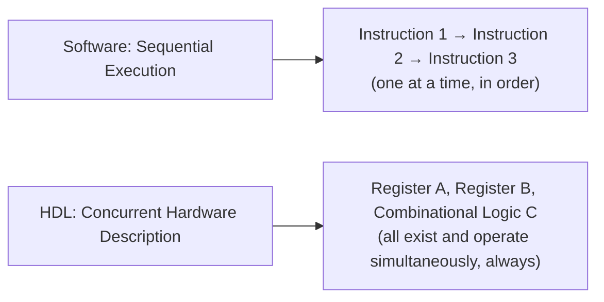
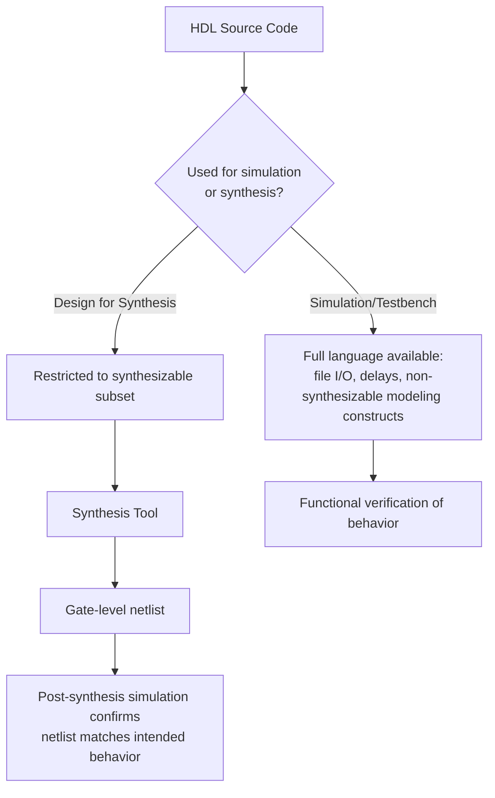

## Hardware Description Languages: Verilog and VHDL


### Overview

A Hardware Description Language (HDL) is a specialized language used to describe the structure and behavior of digital electronic circuits, serving as the primary design entry method for FPGAs and ASICs (introduced under FPGA fundamentals and use cases). Unlike a conventional programming language, an HDL description does not represent a sequence of instructions to be executed — it represents a **circuit** to be synthesized into physical gates, registers, and interconnect, with statements that, in the general case, execute concurrently rather than sequentially, mirroring the way real hardware components all operate simultaneously rather than one at a time. **Verilog** and **VHDL** are the two dominant HDLs in industry practice, differing substantially in syntax and some semantic conventions while addressing the same fundamental design problem.

### The Core Conceptual Shift: Concurrency, Not Sequence

The single most important adjustment for an engineer coming from conventional embedded software (C, C++) to HDL design is recognizing that most HDL code describes **concurrent hardware**, not a sequential program:



In a software function, statement order determines execution order. In an HDL module, most statements describe permanently existing hardware elements (registers, combinational logic blocks) that all operate continuously and simultaneously once the circuit is powered — statement order in the source file generally does not imply a temporal execution order, only the structural/behavioral relationship between the described hardware elements. This is why straightforward line-by-line translation of C algorithm code into HDL syntax, without re-thinking the design as concurrent hardware, is a common and consequential mistake for engineers new to HDL design.

### Two Levels of Description: Behavioral vs. Structural

Both Verilog and VHDL support describing hardware at different levels of abstraction:

- **Structural description:** Explicitly instantiating specific lower-level components (gates, or previously defined modules/entities) and wiring their inputs and outputs together — closely analogous to drawing a schematic in text form.
- **Behavioral (RTL — Register-Transfer Level) description:** Describing the desired *behavior* of the circuit (e.g., "on each clock edge, if enable is high, load this register with this value") using higher-level constructs, leaving the synthesis tool to determine the specific gate-level implementation that achieves that behavior. RTL is the dominant abstraction level used in modern FPGA and ASIC design, since writing pure structural gate-level descriptions for a design of meaningful complexity is impractical.

### Verilog

#### Background and Characteristics

Verilog originated in the mid-1980s and adopts syntax deliberately similar to the C programming language, which historically made it comparatively approachable for engineers with a software background, though this syntactic similarity can also mask the underlying concurrency semantics discussed above if a designer treats it as "C for hardware" too literally.

#### Basic Structural Unit: The Module

Verilog organizes designs into **modules**, each with a defined set of input and output ports, analogous to a function signature but describing a hardware block's interface rather than a callable routine:

```verilog
module and_gate (
    input  wire a,
    input  wire b,
    output wire y
);
    assign y = a & b;
endmodule
```

The `assign` statement here describes **continuous, combinational logic**: the output `y` is continuously driven to reflect the current values of `a` and `b`, with no notion of "executing once" — this hardware exists and operates at all times, reacting instantly (subject to real gate propagation delay) to any change in its inputs.

#### Sequential Logic and Clocking

Describing a register (a storage element that updates its value only on a clock edge) uses an `always` block sensitive to a clock signal:

```verilog
module d_flip_flop (
    input  wire clk,
    input  wire d,
    output reg  q
);
    always @(posedge clk) begin
        q <= d;
    end
endmodule
```

The `@(posedge clk)` sensitivity list specifies that this block of logic describes behavior occurring on the rising edge of the clock — this is how HDL captures the fundamental register/clock relationship underlying essentially all synchronous digital logic. The **non-blocking assignment** operator (`<=`) used here, as distinct from the **blocking assignment** operator (`=`), is a Verilog-specific semantic distinction with direct hardware consequences: non-blocking assignments are the correct and conventional choice for describing sequential (clocked, register) logic, since they model all right-hand-side values being sampled simultaneously at the clock edge before any left-hand-side updates occur — matching real register behavior — whereas blocking assignments are conventionally used for combinational logic, where the sequential, immediate-update semantics correctly model logic that has no memory of its own. [Inference] Using the wrong assignment type for a given context is a well-documented and common source of subtle simulation-versus-synthesis mismatches in Verilog design; the specific failure modes are numerous enough that this is generally treated as a coding-standard rule (always use non-blocking for sequential logic, blocking for combinational logic) rather than a case-by-case judgment call in professional practice.

### VHDL

#### Background and Characteristics

VHDL (VHSIC Hardware Description Language, where VHSIC stands for Very High Speed Integrated Circuit) originated from a U.S. Department of Defense program in the 1980s and adopts a more verbose, strongly-typed syntax influenced by the Ada programming language. VHDL's strict typing catches certain classes of design errors at compile/analysis time that Verilog's more permissive typing might not flag until simulation, at the cost of generally more verbose code for equivalent designs.

#### Basic Structural Unit: Entity and Architecture

VHDL separates a design's **interface** (the entity) from its **implementation** (the architecture), a more explicit separation than Verilog's module structure:

```vhdl
entity and_gate is
    port (
        a : in  std_logic;
        b : in  std_logic;
        y : out std_logic
    );
end entity and_gate;

architecture behavioral of and_gate is
begin
    y <= a and b;
end architecture behavioral;
```

The entity declaration defines only the ports (the "black box" interface); the architecture provides the actual logic description — this allows, in principle, multiple different architectures to be defined for the same entity interface (e.g., a behavioral description and a structural description of the same function), selectable at build time.

#### Sequential Logic and Clocking

The equivalent D flip-flop in VHDL uses a `process` block, VHDL's construct for describing behavior with an implied execution order within the block (distinct from the concurrent statements outside a process):

```vhdl
entity d_flip_flop is
    port (
        clk : in  std_logic;
        d   : in  std_logic;
        q   : out std_logic
    );
end entity d_flip_flop;

architecture behavioral of d_flip_flop is
begin
    process (clk)
    begin
        if rising_edge(clk) then
            q <= d;
        end if;
    end process;
end architecture behavioral;
```

The `process (clk)` sensitivity list, paired with the `rising_edge(clk)` condition, is VHDL's idiomatic pattern for describing clocked register behavior, directly analogous to Verilog's `always @(posedge clk)` construct. Within a VHDL process, statements do execute in a defined sequential order relative to each other (unlike the concurrent statements outside any process) — but the process as a whole still represents hardware that conceptually re-evaluates whenever its sensitivity list signals change, not a one-time sequential program execution.

### Verilog vs. VHDL: Comparative Summary

| Aspect | Verilog | VHDL |
|---|---|---|
| Syntax influence | C-like | Ada-like |
| Typing discipline | More permissive (implicit conversions common) | Strongly typed (explicit conversions generally required) |
| Verbosity | Generally more concise | Generally more verbose |
| Interface/implementation separation | Single module construct combines both | Explicit entity (interface) / architecture (implementation) separation |
| Historical origin/adoption | Broad adoption in commercial ASIC/FPGA design, particularly North America and increasingly globally | Strong adoption in European and defense/aerospace contexts historically, alongside broad general industry use |
| Common industry perception | [Inference] Often perceived as faster to write for straightforward designs | [Inference] Often perceived as catching more errors at compile/analysis time due to strict typing |

[Unverified] Claims about regional or industry-sector preference between Verilog and VHDL reflect broad historical tendencies rather than firm rules, and both languages remain in active, substantial use across virtually all industry segments and geographies; a specific team or company's choice is generally driven by existing codebase, tool ecosystem, and engineer familiarity rather than any inherent technical superiority of one language for a given class of problem. Both languages are supported by essentially all major synthesis and simulation tool vendors, and mixed-language designs (instantiating a VHDL module within a Verilog design or vice versa) are common and generally well-supported by modern toolchains.

### SystemVerilog: An Extension Worth Noting

**SystemVerilog** extends Verilog with additional constructs primarily aimed at design verification (assertions, more powerful testbench constructs, object-oriented verification methodologies) and some design-side conveniences (enhanced data types, interfaces for cleaner port grouping). [Inference] In much of modern industry practice, SystemVerilog syntax is used even for RTL design work that does not require its more advanced verification features, since tool support is broad and certain SystemVerilog conveniences (such as `always_ff` and `always_comb`, which make the designer's intent — sequential vs. combinational logic — explicit to both the reader and the synthesis tool, reducing the blocking/non-blocking assignment pitfall noted above) are widely considered good practice; however, the exact boundary of what a given project or tool flow considers "Verilog" versus "SystemVerilog" varies by convention and toolchain.

### The Simulation-to-Synthesis Relationship

A critical and sometimes underappreciated aspect of HDL design is that **not all syntactically valid HDL code is synthesizable** — some language constructs are fully supported in simulation (useful for testbenches, modeling, and verification) but have no meaningful hardware equivalent and will be rejected, ignored, or interpreted unpredictably by a synthesis tool. This is directly connected to the design flow introduced under FPGA fundamentals: simulation verifies the *described behavior* is functionally correct, but only synthesis (and post-synthesis simulation/static timing analysis against the actual synthesized netlist) confirms that behavior can actually be realized as physical hardware within the target device's timing constraints. Professional HDL coding guidelines typically define a **synthesizable subset** of the language and require design code (as opposed to testbench/verification code) to remain within it, precisely to avoid the situation where a design simulates correctly but cannot be synthesized as intended, or synthesizes into something subtly different from what the simulation modeled.



**Key Points**
- HDL code fundamentally describes concurrent hardware, not sequential software instructions; statement order in the source generally does not imply execution order the way it does in C or Python.
- Verilog favors C-like, more permissive, concise syntax; VHDL favors Ada-like, strongly-typed, more verbose syntax with explicit entity/architecture separation — both remain in broad active industry use, and the choice is generally driven by ecosystem and team familiarity rather than fixed technical necessity.
- Correctly distinguishing non-blocking assignment (sequential/clocked logic) from blocking assignment (combinational logic) in Verilog, and using `rising_edge`/process sensitivity correctly in VHDL, is essential to avoid subtle simulation-versus-synthesis mismatches.
- Not all simulatable HDL code is synthesizable; professional design practice restricts design-intent code to a defined synthesizable subset, reserving the language's full expressive range for testbenches and verification code.

**Example**

A simplified view of the same D flip-flop concept expressed in both languages, converging to identical synthesized hardware:

<svg xmlns="http://www.w3.org/2000/svg" viewBox="0 0 820 300">
  \<style\>
    .box { fill: #f4f6f8; stroke: #2b3a4a; stroke-width: 1.5; }
    .boxAlt { fill: #eef2ff; stroke: #2b3a4a; stroke-width: 1.5; }
    .boxGood { fill: #eefcf1; stroke: #1f6b3a; stroke-width: 1.5; }
    .label { font-family: Helvetica, Arial, sans-serif; font-size: 13px; fill: #1a1a1a; }
    .small { font-family: Helvetica, Arial, sans-serif; font-size: 11px; fill: #444; }
    .title { font-family: Helvetica, Arial, sans-serif; font-size: 15px; fill: #111; font-weight: bold; }
    .arrow { stroke: #2b3a4a; stroke-width: 1.5; fill: none; marker-end: url(#arrowhead10); }
  \</style\>
  <text x="410" y="26" text-anchor="middle" class="title">Two Languages, One Synthesized Circuit (svg_diagram)</text>

  <rect x="30" y="60" width="220" height="70" rx="6" class="box" />
  <text x="140" y="88" text-anchor="middle" class="label">Verilog</text>
  <text x="140" y="105" text-anchor="middle" class="small">always @(posedge clk)</text>
  <text x="140" y="120" text-anchor="middle" class="small">q &lt;= d;</text>

  <rect x="30" y="170" width="220" height="90" rx="6" class="box" />
  <text x="140" y="195" text-anchor="middle" class="label">VHDL</text>
  <text x="140" y="212" text-anchor="middle" class="small">process(clk)</text>
  <text x="140" y="227" text-anchor="middle" class="small">if rising_edge(clk) then</text>
  <text x="140" y="242" text-anchor="middle" class="small">q &lt;= d;</text>

  <rect x="360" y="120" width="180" height="70" rx="6" class="boxAlt" />
  <text x="450" y="148" text-anchor="middle" class="label">Synthesis Tool</text>
  <text x="450" y="165" text-anchor="middle" class="small">Language-agnostic mapping</text>

  <rect x="640" y="120" width="150" height="70" rx="6" class="boxGood" />
  <text x="715" y="148" text-anchor="middle" class="label">Physical D Flip-Flop</text>
  <text x="715" y="165" text-anchor="middle" class="small">Identical hardware</text>

  <path class="arrow" d="M250,95 L360,150" />
  <path class="arrow" d="M250,215 L360,160" />
  <path class="arrow" d="M540,155 L640,155" />

  <text x="410" y="280" text-anchor="middle" class="small">Both descriptions express the same clocked-register behavior; synthesis converges to equivalent physical hardware regardless of source language.</text>
</svg>

**Related Topics**
- SystemVerilog verification constructs: assertions, functional coverage, and object-oriented testbenches
- Synthesizable HDL coding guidelines and common non-synthesizable pitfalls
- Blocking vs. non-blocking assignment semantics and simulation-synthesis mismatch pitfalls
- Static timing analysis and timing constraint specification (SDC files) post-synthesis
- High-Level Synthesis (HLS) as an alternative C/C++-based design entry method
- Testbench design methodologies: directed testing, constrained-random verification, UVM
- Clock domain crossing (CDC) hazards and synchronization techniques in multi-clock HDL designs
- FPGA vendor-specific primitive instantiation vs. inferred logic in HDL design
- Formal verification and model checking applied to HDL designs