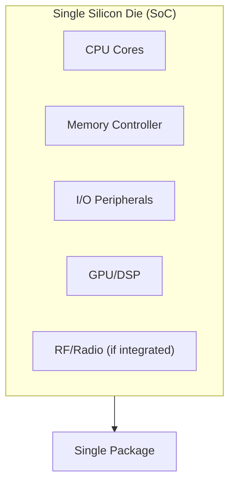
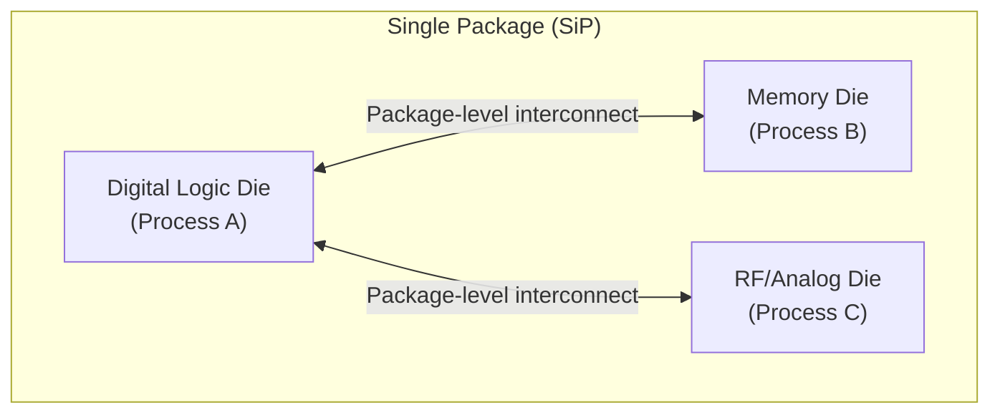

## SoC and System-in-Package Design

### Overview

System on Chip (SoC) and System in Package (SiP) are two distinct approaches to integrating multiple functional blocks — processor cores, memory, analog circuitry, radios, sensors — into a compact, tightly coupled unit, rather than as discrete chips wired together on a printed circuit board. An SoC achieves this integration on a **single silicon die**, fabricated as one monolithic piece of semiconductor; an SiP achieves similar functional integration by combining **multiple separate dies** (potentially fabricated on entirely different process technologies) within a **single package**. Understanding the distinction, and the tradeoffs each approach makes, is central to embedded hardware architecture decisions, since it directly affects cost, power, performance, time-to-market, and design flexibility in ways that ripple through the entire product development process.

### SoC: Single-Die Integration

#### What It Is

An SoC integrates the major functional blocks of a computing system — one or more CPU cores, memory controllers, I/O peripherals, and often specialized blocks such as DSPs, GPUs, or radio transceivers (introduced under heterogeneous computing) — onto a single piece of silicon, fabricated together in one semiconductor manufacturing process run. Everything on an SoC is, by definition, manufactured using the same process node and the same set of fabrication steps, since it is physically one die.

#### Advantages of Single-Die Integration

- **On-chip interconnect speed and power:** Signals traveling between functional blocks on the same die traverse extremely short distances through on-chip metal interconnect, achieving far higher bandwidth and far lower latency and power consumption than the same signals would if traveling between separate chips across a PCB (Printed Circuit Board), where longer trace lengths, package parasitics, and I/O driver overhead all impose significant power and speed penalties.
- **Lower per-unit cost at high volume:** A single die, once the design is finalized and mask costs amortized, is generally cheaper to manufacture and assemble than multiple separate dies requiring individual packaging and a more complex board-level integration.
- **Smaller physical footprint:** Consolidating functionality onto one die directly reduces the board area and often the package count needed for a given set of functions, which is a significant driver in space-constrained embedded products (wearables, implantable medical devices, compact IoT sensors).
- **Reduced board-level complexity:** Fewer discrete chips means fewer interconnects, fewer potential points of assembly failure, and generally a simpler PCB design.

#### Constraints and Limitations

- **Single process node for the entire design:** Since all blocks share one die, they must all be fabricated using the same underlying semiconductor process technology — this is a significant constraint because different circuit types have genuinely different optimal process characteristics. Digital logic benefits from the smallest, fastest available process nodes; analog and RF (Radio Frequency) circuitry often performs better, or is only well-characterized, on older or specifically analog-optimized process nodes; and this tension means an SoC design frequently represents a compromise rather than the individually optimal process choice for every block it contains.
- **High non-recurring engineering (NRE) cost and long design cycles:** Designing, verifying, and fabricating a custom SoC — particularly at advanced process nodes — involves very high mask and verification costs and long design cycles, generally justified only at meaningfully high production volumes or where the integration benefits are otherwise essential to the product's competitiveness.
- **Design risk concentration:** A design flaw discovered after fabrication (tape-out) affects the entire integrated die, and correcting it requires a costly and slow re-spin of the whole chip — there is no way to independently "swap out" just the flawed functional block the way a board-level design could replace one discrete component.
- **Reduced flexibility for late-stage or per-customer variation:** Because all functionality is fixed at fabrication, offering different feature combinations to different customers or product tiers generally requires either designing multiple SoC variants (multiplying NRE cost) or building in configurability that itself consumes die area and adds design complexity.

### SiP: Multi-Die Package Integration

#### What It Is

A System in Package integrates multiple separate dies — potentially a digital processor die, a separate memory die, an analog/RF die, and possibly passive components — within a single physical package, using techniques such as wire bonding, flip-chip bonding, or increasingly, more advanced 2.5D/3D packaging techniques (silicon interposers, through-silicon vias) to interconnect the dies at very short distances, though not as short as true on-die interconnect.

#### Advantages of Multi-Die Package Integration

- **Process-optimized dies:** Each die within an SiP can be fabricated on the process node genuinely best suited to its function — a digital logic die on an advanced, dense process node; an analog/RF die on a process specifically optimized for those circuit types — avoiding the single-process-node compromise inherent to SoC design.
- **Mix-and-match flexibility and reuse:** Existing, already-verified dies (including third-party or off-the-shelf dies, such as a standard memory die) can be combined into a new SiP design without needing to redesign or re-verify those components from scratch, substantially reducing design risk and time-to-market compared with integrating equivalent functionality into a new monolithic SoC.
- **Lower NRE for a given level of integration:** Since existing, already-taped-out dies can often be reused, an SiP can achieve a compact, integrated form factor without necessarily incurring the full custom-silicon design and verification cost of a from-scratch SoC.
- **Independent yield and testability:** Each die can be tested (a practice known as **Known Good Die**, or KGD, testing) before assembly into the package, meaning a defect in one die does not require scrapping an otherwise-functional adjacent die — improving overall package yield compared with betting an entire monolithic die's yield on every block being simultaneously defect-free.

#### Constraints and Limitations

- **Higher interconnect latency and power than true on-die integration:** Even the most advanced package-level interconnect (silicon interposers, through-silicon vias) introduces more latency, capacitance, and power overhead than genuine on-die wiring, since the signal must cross a physical die-to-die boundary rather than remaining within continuous silicon.
- **Generally larger physical footprint than an equivalent SoC:** Even tightly stacked or side-by-side multi-die packages typically occupy more area/volume than the same functionality would if truly integrated onto one die, though modern 3D packaging techniques have substantially narrowed this gap for some applications.
- **Package-level assembly and thermal complexity:** Stacking or placing multiple dies within one package introduces its own assembly yield considerations and can complicate thermal management, since heat-generating dies may be physically stacked or closely adjacent within a single, more thermally constrained package.

### SoC vs. SiP: Comparative Summary

| Aspect | SoC (Single Die) | SiP (Multiple Dies) |
|---|---|---|
| Physical integration | One monolithic die | Multiple dies in one package |
| Process node | Single node for entire design (a compromise across block types) | Each die can use its own optimal process node |
| Interconnect speed/power between blocks | Fastest, lowest power (true on-die) | Slower, higher power than on-die, but faster than board-level |
| NRE cost | Very high, especially at advanced nodes | Generally lower, particularly when reusing existing dies |
| Design risk on flaw discovery | Entire die affected; full re-spin required | Potentially isolated to one die; others may be reusable |
| Reuse of existing/third-party components | Not directly possible (must be redesigned into the die) | Directly possible (integrate existing, proven dies) |
| Typical footprint for equivalent function | Smaller | Larger, though narrowing with advanced 3D packaging |
| Best suited to | Very high volume, where NRE amortizes well and a single process compromise is acceptable | Moderate volume, mixed process requirements, or faster time-to-market via die reuse |

### Advanced Packaging Techniques Blurring the Line

Modern semiconductor packaging has introduced techniques that narrow the traditional gap between SoC and SiP, worth noting since the boundary is increasingly less binary than the classic definitions suggest:

- **2.5D packaging (silicon interposer):** Multiple dies are placed side-by-side on a passive silicon interposer containing dense interconnect, achieving much higher die-to-die bandwidth and lower latency than conventional package-level wiring, approaching (though not matching) true on-die interconnect performance.
- **3D packaging (die stacking with Through-Silicon Vias, TSVs):** Dies are physically stacked vertically and connected through vertical vias passing through the silicon itself, achieving very short die-to-die interconnect distances and enabling, for example, high-bandwidth memory stacked directly atop or very near a processor die.
- **Chiplet-based design:** [Inference] An increasingly prominent industry approach in which a large design is deliberately decomposed into smaller, independently manufacturable "chiplets" (potentially on different process nodes, from different design teams or vendors) and integrated via advanced packaging — combining some of SoC-like tight integration performance with SiP-like process flexibility and reuse benefits; the specific interconnect standards and ecosystem practices for chiplet integration are an active and evolving area of industry standardization, and the maturity of tooling and standards varies significantly by application segment as of this writing.

### Embedded Design Decision Factors

Choosing between an SoC, an SiP, or a conventional discrete multi-chip board design is a system-level decision driven by several factors together, not any single one in isolation:

- **Production volume:** Higher volumes better amortize an SoC's high NRE cost; lower or uncertain volumes often favor SiP or discrete approaches that avoid committing to expensive custom silicon before demand is proven.
- **Process node requirements across functions:** Designs mixing digital logic, precision analog, and RF functions with genuinely different optimal process characteristics are natural SiP candidates; designs where all functions are reasonably well-served by a single process node are better SoC candidates.
- **Time-to-market pressure:** Reusing existing, proven dies in an SiP is generally faster than the full custom design and verification cycle a new SoC requires.
- **Power and performance requirements:** Applications with the tightest power and interconnect-latency budgets (e.g., battery-powered wearables needing maximum energy efficiency) tend to favor the tightest possible integration an SoC provides, where the NRE investment is justified.
- **Physical space constraints:** Extremely space-constrained applications (implantable devices, compact wearables) often favor whichever approach — SoC or advanced SiP packaging — achieves the smallest footprint for the required functionality, which increasingly may not have a single universally correct answer given advanced packaging's narrowing of the traditional footprint gap.

**Key Points**
- The fundamental distinction is single die (SoC) versus multiple dies in one package (SiP), not "how integrated" the result looks from outside — a compact SiP and a compact SoC can appear similar externally while representing very different internal integration approaches.
- SoC integration provides the fastest, lowest-power inter-block communication and smallest footprint but forces a single-process-node compromise and concentrates design risk into one monolithic die with high NRE cost.
- SiP integration allows each die to use its process-optimal technology and enables reuse of existing, already-verified dies, at some cost in interconnect performance and footprint relative to true on-die integration.
- Advanced packaging techniques (2.5D interposers, 3D die stacking, chiplet-based design) are narrowing the historical performance gap between SoC and SiP approaches, making the choice increasingly nuanced rather than a simple binary tradeoff.

**Example**

A simplified comparison of interconnect paths for the same three functional blocks under SoC versus SiP integration:

<svg xmlns="http://www.w3.org/2000/svg" viewBox="0 0 820 340">
  \<style\>
    .box { fill: #f4f6f8; stroke: #2b3a4a; stroke-width: 1.5; }
    .boxAlt { fill: #eef2ff; stroke: #2b3a4a; stroke-width: 1.5; }
    .boxOuter { fill: none; stroke: #6b7a8a; stroke-width: 1.5; stroke-dasharray: 6,4; }
    .label { font-family: Helvetica, Arial, sans-serif; font-size: 13px; fill: #1a1a1a; }
    .small { font-family: Helvetica, Arial, sans-serif; font-size: 11px; fill: #444; }
    .title { font-family: Helvetica, Arial, sans-serif; font-size: 15px; fill: #111; font-weight: bold; }
    .arrow { stroke: #2b3a4a; stroke-width: 1.5; fill: none; marker-end: url(#arrowhead11); }
  \</style\>
  <text x="410" y="24" text-anchor="middle" class="title">SoC vs. SiP Interconnect Comparison (svg_diagram)</text>

  <text x="200" y="55" text-anchor="middle" class="label" font-weight="bold">SoC: Single Die</text>
  <rect x="40" y="65" width="320" height="110" rx="6" class="boxOuter" />
  <rect x="55" y="80" width="90" height="50" rx="5" class="box" />
  <text x="100" y="108" text-anchor="middle" class="small">CPU</text>
  <rect x="165" y="80" width="90" height="50" rx="5" class="box" />
  <text x="210" y="108" text-anchor="middle" class="small">Memory Ctrl</text>
  <rect x="275" y="80" width="70" height="50" rx="5" class="box" />
  <text x="310" y="108" text-anchor="middle" class="small">I/O</text>
  <path class="arrow" d="M145,105 L165,105" />
  <path class="arrow" d="M255,105 L275,105" />
  <text x="200" y="150" text-anchor="middle" class="small">On-die wiring: shortest distance,</text>
  <text x="200" y="164" text-anchor="middle" class="small">highest bandwidth, lowest power</text>

  <text x="620" y="55" text-anchor="middle" class="label" font-weight="bold">SiP: Multiple Dies, One Package</text>
  <rect x="460" y="65" width="320" height="110" rx="6" class="boxOuter" />
  <rect x="475" y="80" width="90" height="50" rx="5" class="boxAlt" />
  <text x="520" y="108" text-anchor="middle" class="small">CPU Die</text>
  <rect x="585" y="80" width="90" height="50" rx="5" class="boxAlt" />
  <text x="630" y="108" text-anchor="middle" class="small">Memory Die</text>
  <rect x="695" y="80" width="70" height="50" rx="5" class="boxAlt" />
  <text x="730" y="108" text-anchor="middle" class="small">RF Die</text>
  <path class="arrow" d="M565,105 L585,105" />
  <path class="arrow" d="M675,105 L695,105" />
  <text x="620" y="150" text-anchor="middle" class="small">Package-level interconnect: each die on its</text>
  <text x="620" y="164" text-anchor="middle" class="small">optimal process, more interconnect overhead</text>

  <text x="410" y="220" text-anchor="middle" class="small">Same three functional blocks; SoC minimizes interconnect distance at the cost of a shared process,</text>
  <text x="410" y="236" text-anchor="middle" class="small">while SiP allows per-die process optimization at the cost of crossing a physical die boundary.</text>
</svg>

**Related Topics**
- Chiplet-based design and emerging die-to-die interconnect standards
- 2.5D and 3D packaging: silicon interposers and Through-Silicon Vias (TSVs)
- Known Good Die (KGD) testing and its role in multi-die package yield
- Process node selection tradeoffs for digital, analog, and RF circuit design
- Heterogeneous computing architectures within SoC design (cross-reference to CPU/DSP/GPU integration)
- Thermal management challenges in stacked die packaging
- NRE cost modeling and volume-based silicon design decisions
- Package-on-Package (PoP) and other memory-processor integration techniques
- High-Bandwidth Memory (HBM) integration via advanced packaging