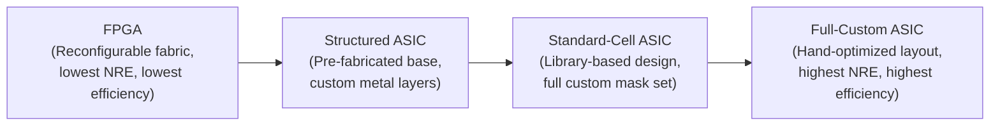
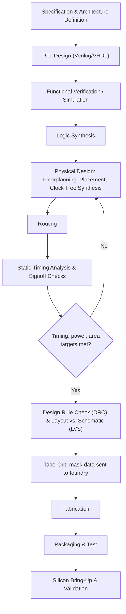
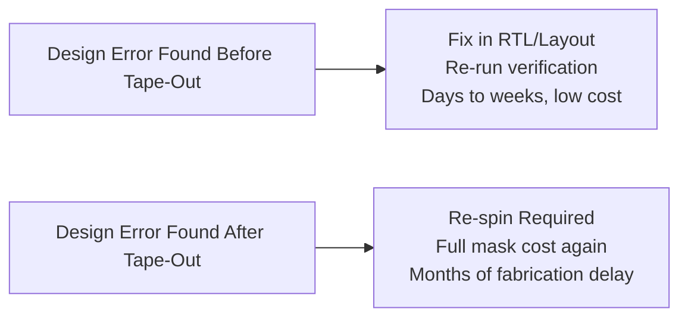

## Custom Silicon and ASIC Considerations

### Overview

An Application-Specific Integrated Circuit (ASIC) is a custom-designed integrated circuit fabricated to perform a specific function or set of functions, with its logic permanently fixed at manufacturing time — the endpoint of the design spectrum introduced under FPGA fundamentals, where FPGA prototyping and reconfigurability sit in explicit contrast to an ASIC's fixed, optimized, non-reconfigurable silicon. Deciding to pursue custom silicon is one of the highest-stakes decisions in embedded hardware development, since it commits substantial non-recurring engineering (NRE) investment and multi-month-to-multi-year lead time to a design that, once fabricated, cannot be functionally altered without a costly re-spin.

### Categories of Custom Silicon

Not all "ASIC" design represents the same level of custom engineering effort or risk; the term spans a spectrum of approaches with substantially different cost, flexibility, and design-cycle characteristics.

- **Full-Custom ASIC:** Every transistor and its physical layout is individually designed and optimized by hand or through intensive custom tooling, achieving the maximum possible performance and power efficiency for the specific function, at the cost of very long design cycles and very high engineering effort — generally reserved for the highest-volume, most performance-critical designs (e.g., flagship processor cores) where the effort is justified across enormous production quantities.
- **Standard-Cell ASIC:** The dominant approach for most custom digital ASIC design, in which the design is built from a library of pre-characterized, pre-verified logic cells (gates, flip-flops, more complex functional blocks) provided by the foundry or a third-party IP vendor, with automated place-and-route tools handling the physical layout — trading some of full-custom's peak efficiency for dramatically reduced design time and risk, since the underlying cells are already electrically characterized and verified.
- **Gate Array / Structured ASIC:** A middle ground between standard-cell ASIC and FPGA, using a partially pre-fabricated die (with the transistor layer already manufactured in bulk, leaving only the upper metal interconnect layers to be customized per design) — reducing both NRE cost and fabrication lead time relative to a full standard-cell ASIC by amortizing the most expensive fabrication steps across many different customer designs sharing the same base die, at some cost in flexibility and achievable density/performance compared with a fully custom mask set.

### Why Pursue Custom Silicon

The decision to move from a processor/FPGA-based solution (covered under heterogeneous computing and FPGA fundamentals) to custom silicon is driven by specific requirements that off-the-shelf or reconfigurable components cannot satisfy as efficiently at sufficient volume:

- **Power efficiency at high volume:** An ASIC implements exactly the required logic and nothing more, with no reconfigurable-fabric overhead (the programmable interconnect and LUT structures inherent to FPGAs) and no general-purpose instruction-decode overhead (inherent to processors) — for a fixed function at high production volume, this generally yields substantially better performance-per-watt than either alternative.
- **Per-unit cost at high volume:** While NRE cost is far higher than an FPGA or off-the-shelf processor solution, the marginal per-unit fabrication cost of an ASIC at high volume is typically lower, since the expensive design and mask costs are fixed one-time investments amortized across the full production run — meaning ASICs generally become cost-competitive only above some production volume threshold specific to the design's complexity and NRE structure.
- **Board space and system integration:** A custom ASIC can integrate exactly the required functionality (potentially combining what would otherwise be multiple discrete chips) into a single optimized die, reducing board area, part count, and assembly complexity beyond what is achievable with off-the-shelf components.
- **Intellectual property protection:** Custom silicon can make a company's proprietary algorithms or architecture significantly harder to reverse-engineer than equivalent functionality implemented in software running on a general-purpose processor, or in an FPGA bitstream (which, while also difficult, is a somewhat different and sometimes less robust protection model depending on the specific FPGA family's bitstream protection features).
- **Guaranteed, uncontended performance and timing:** Unlike a shared, general-purpose processor or an FPGA fabric potentially shared across multiple design blocks, an ASIC's logic is dedicated entirely to its intended function, with no possibility of another workload contending for the same physical resources.

### The ASIC Design Flow

The design flow shares its early RTL and functional verification stages with FPGA design (covered under hardware description languages), but diverges substantially at the physical design stage: an ASIC's physical implementation is fully custom to the specific design and target foundry process, involving detailed floorplanning (deciding physical placement of major functional blocks on the die), clock tree synthesis (designing the physical clock distribution network to minimize skew across the die), and extensive **signoff checks** — Design Rule Checking (DRC, verifying the physical layout obeys the foundry's manufacturable geometry rules) and Layout Versus Schematic (LVS, verifying the physical layout actually implements the intended circuit) — that have no direct equivalent in FPGA design, since an FPGA's physical fabric is already fixed and pre-verified by the FPGA vendor.

### Tape-Out: The Point of No Return

**Tape-out** is the moment the finalized mask data is submitted to the semiconductor foundry for fabrication — commonly treated as the definitive "point of no return" in ASIC development, since any design error discovered after this point cannot be corrected without an expensive and slow **re-spin**: a new fabrication run incorporating the fix, incurring the full mask cost again (mask sets for advanced process nodes represent a very substantial fraction of total project NRE) and a multi-month fabrication lead time delay before corrected silicon is available for validation.

This asymmetry — extremely costly and slow to fix an error after tape-out, versus comparatively cheap and fast to fix the same error before tape-out through additional simulation or verification — is the central reason ASIC design invests so heavily in pre-tape-out verification rigor relative to typical software development, where a discovered defect can usually be corrected and redeployed far more quickly and cheaply.

### Cost Structure: NRE vs. Per-Unit Cost

Understanding the ASIC cost model requires separating two fundamentally different cost categories:

- **Non-Recurring Engineering (NRE) cost:** The one-time cost of design, verification, mask creation, and initial tooling — incurred regardless of production volume, and dominated at advanced process nodes by mask costs and the engineering effort required for verification and physical design closure.
- **Per-unit (recurring) cost:** The marginal cost of fabricating, packaging, and testing each additional unit once the design is finalized and masks exist — generally low relative to NRE, particularly at high volumes where fabrication cost per die benefits from wafer-scale economics.

$$
\text{Total Cost} = \text{NRE} + (\text{Per-Unit Cost} \times \text{Volume})
$$

This cost structure directly explains why ASIC adoption is fundamentally a volume-driven decision: at low volumes, NRE dominates total cost and an FPGA or off-the-shelf processor solution (with far lower or no NRE) is typically more cost-effective even at higher per-unit cost; at sufficiently high volumes, the ASIC's lower per-unit cost eventually overcomes its higher NRE, making it the more cost-effective choice overall. [Inference] The specific crossover volume is highly design- and process-node-dependent and changes over time as mask and design costs evolve, so it should be calculated for the specific design and target process rather than assumed from a general industry rule of thumb.

### Foundry Relationships and Process Node Selection

ASIC development requires a relationship with a semiconductor **foundry** (the fabrication facility, whether a merchant foundry serving many customers or an integrated device manufacturer's own fab) and a design targeting that foundry's specific **Process Design Kit (PDK)** — the set of design rules, verified standard-cell libraries, and models specific to that foundry's particular manufacturing process node. Process node selection itself involves tradeoffs directly relevant to embedded system requirements:

- **Advanced/leading-edge nodes** offer higher transistor density, generally lower power per operation, and higher achievable clock frequencies, but carry substantially higher NRE cost (particularly mask costs) and are primarily justified for high-volume, performance- or power-critical designs.
- **Mature/legacy nodes** offer lower NRE cost, often better-characterized analog and RF performance (a point also raised under SoC/SiP design, since analog and RF circuitry frequently perform better on older, specifically analog-optimized processes than on the newest digital-optimized nodes), and are frequently the appropriate choice for lower-volume, cost-sensitive, or analog/mixed-signal-heavy embedded designs where leading-edge digital density is not the binding constraint.

### Design for Manufacturability and Testability

Two considerations distinguish rigorous ASIC design practice from a purely functional RTL description, addressing concerns that only become relevant once a design must actually be manufactured and individually tested at scale:

- **Design for Manufacturability (DFM):** Layout practices that improve fabrication yield — for instance, ensuring adequate spacing and via redundancy to reduce the statistical likelihood that a random manufacturing defect renders an individual die non-functional — since yield (the fraction of fabricated die that are functional) directly determines effective per-unit cost.
- **Design for Testability (DFT):** Incorporating structures into the design specifically to enable efficient post-fabrication testing of each individual manufactured die, most commonly **scan chains** (reconfiguring flip-flops into a serial shift-register mode during test, allowing external test equipment to load specific internal states and observe internal responses that would otherwise be inaccessible from the die's normal functional pins) and **Built-In Self-Test (BIST)** structures, without which verifying that each individual fabricated die is actually defect-free would be impractically slow or, for some internal structures, effectively impossible using only the chip's normal functional interface.

**Key Points**
- Custom silicon spans a spectrum from structured ASIC (lower NRE, lower flexibility, faster turnaround) through standard-cell ASIC to full-custom design (highest NRE and design effort, highest achievable efficiency) — "ASIC" is not a single fixed level of design investment.
- Tape-out is effectively irreversible: errors found afterward require a costly, multi-month re-spin, which is why pre-tape-out verification investment is proportionally much higher in ASIC design than in typical embedded software development.
- The ASIC-versus-FPGA-versus-processor decision is fundamentally volume-driven: NRE dominates total cost at low volumes (favoring FPGA/processor solutions), while ASIC's lower per-unit cost dominates at sufficiently high volumes.
- Design for Testability (scan chains, BIST) is not optional polish — without it, verifying that individually fabricated dies are actually defect-free is impractical, making DFT a functional necessity for any design intended for real production, not merely a best practice.

**Example**

A simplified illustration of the NRE-versus-volume crossover between an FPGA-based solution and a custom ASIC:

<svg xmlns="http://www.w3.org/2000/svg" viewBox="0 0 820 340">
  \<style\>
    .box { fill: #f4f6f8; stroke: #2b3a4a; stroke-width: 1.5; }
    .label { font-family: Helvetica, Arial, sans-serif; font-size: 13px; fill: #1a1a1a; }
    .small { font-family: Helvetica, Arial, sans-serif; font-size: 11px; fill: #444; }
    .title { font-family: Helvetica, Arial, sans-serif; font-size: 15px; fill: #111; font-weight: bold; }
    .axis { stroke: #2b3a4a; stroke-width: 1.5; }
    .fpgaLine { stroke: #2b6cb0; stroke-width: 2.5; fill: none; }
    .asicLine { stroke: #b0442f; stroke-width: 2.5; fill: none; }
  \</style\>

  <text x="410" y="26" text-anchor="middle" class="title">NRE vs. Volume: FPGA vs. ASIC Cost Crossover (svg_diagram)</text>

  <line x1="80" y1="280" x2="760" y2="280" class="axis" />
  <line x1="80" y1="280" x2="80" y2="60" class="axis" />
  <text x="410" y="310" text-anchor="middle" class="small">Production Volume →</text>
  <text x="35" y="170" text-anchor="middle" class="small" transform="rotate(-90 35 170)">Total Cost →</text>

  <path class="fpgaLine" d="M80,240 L760,120" />
  <path class="asicLine" d="M80,275 L760,80" />

  <rect x="600" y="60" width="16" height="10" class="box" fill="#2b6cb0" stroke="none" />
  <text x="625" y="70" class="small">FPGA-based (low NRE, higher per-unit)</text>
  <rect x="600" y="80" width="16" height="10" class="box" fill="#b0442f" stroke="none" />
  <text x="625" y="90" class="small">ASIC (high NRE, lower per-unit)</text>

  <line x1="330" y1="60" x2="330" y2="280" stroke="#6b7a8a" stroke-width="1" stroke-dasharray="4,3" />
  <text x="330" y="295" text-anchor="middle" class="small">Crossover volume</text>

  <text x="410" y="330" text-anchor="middle" class="small">Below the crossover, FPGA's low NRE wins overall; above it, ASIC's lower per-unit cost wins.</text>
</svg>

**Related Topics**
- Foundry Process Design Kits (PDKs) and standard-cell library characteristics
- Scan chain and Built-In Self-Test (BIST) design for testability techniques
- Static timing analysis and signoff methodology in physical design closure
- Chiplet-based design as an emerging alternative to monolithic ASIC integration
- Structured ASIC and eASIC-style approaches for reduced-NRE custom silicon
- Design Rule Checking (DRC) and Layout Versus Schematic (LVS) verification
- Yield modeling and Design for Manufacturability (DFM) practices
- Mixed-signal ASIC design challenges: combining digital, analog, and RF blocks
- IP core licensing and third-party IP integration in custom SoC/ASIC design