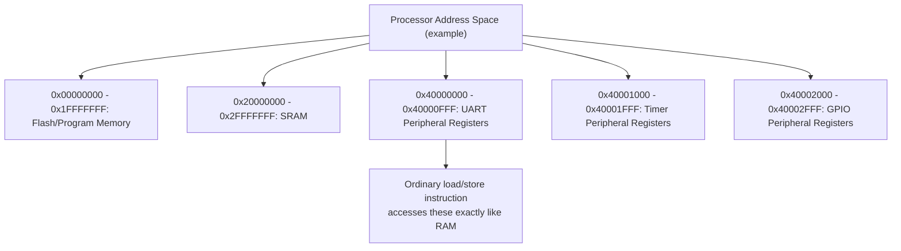
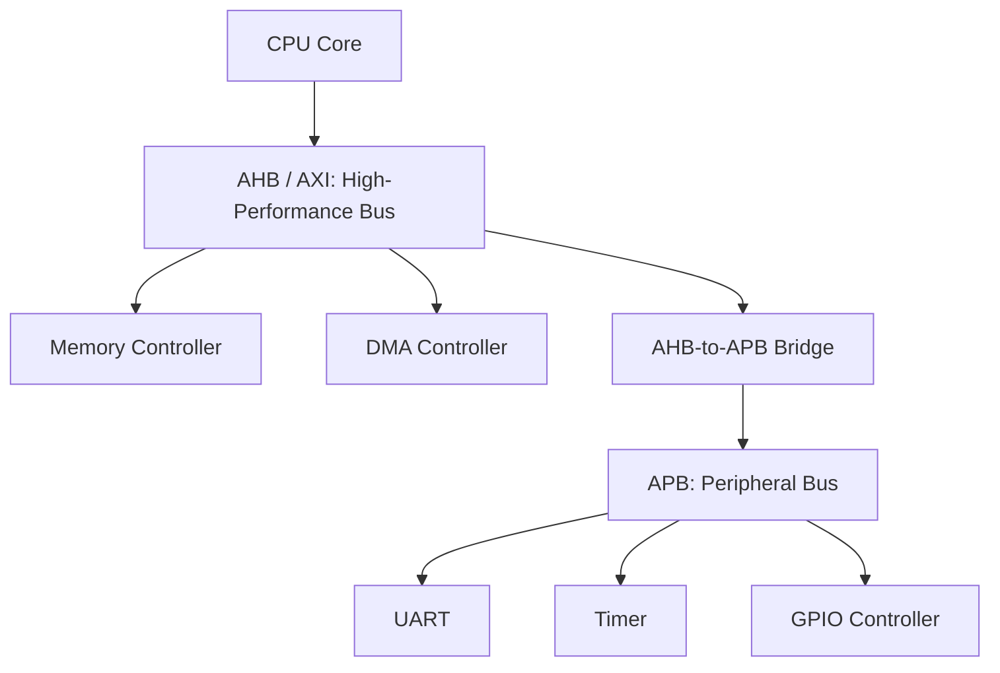

## Memory-Mapped Peripherals and Bus Architectures


### Overview

Memory-mapped I/O (MMIO) is the dominant technique by which embedded processors communicate with on-chip and off-chip peripherals, treating each peripheral's control, status, and data registers as if they were ordinary memory locations addressable by the same load/store instructions the processor uses to access RAM. Bus architectures are the interconnect fabrics — the wires, arbitration logic, and protocol rules — that physically carry these memory-mapped transactions between the processor core and the many peripherals, memory controllers, and other bus masters sharing access to the system's address space. Together, these two concepts define how virtually all embedded software ultimately interacts with the physical hardware beneath it, regardless of the specific processor architecture, RTOS, or application domain involved.

### Memory-Mapped I/O: The Core Concept

In a memory-mapped architecture, the processor's address space is partitioned so that certain address ranges correspond not to actual memory cells but to physical registers within peripheral hardware — reading or writing to an address in such a range does not access RAM at all, but instead reads a peripheral's current status or writes a control value that directly affects the peripheral's physical behavior.



From the CPU instruction set's perspective, there is generally no distinction between reading a data value from RAM and reading a peripheral's status register — both are accomplished with the same load instruction targeting a specific address; it is only the *address* that determines whether the resulting bus transaction reaches memory or a peripheral. This is why embedded C code frequently expresses peripheral access through pointer dereferences to fixed addresses (commonly wrapped in structures or macros defined by a vendor-supplied header) rather than through any dedicated I/O instruction.

### Memory-Mapped I/O vs. Port-Mapped I/O

It is worth briefly noting the alternative approach, **port-mapped I/O** (also called isolated I/O), historically significant on some architectures (most notably x86, which retains dedicated `IN`/`OUT` instructions and a separate I/O address space distinct from its memory address space):

| Aspect | Memory-Mapped I/O | Port-Mapped I/O |
|---|---|---|
| Address space | Peripherals share the same address space as memory | Peripherals occupy a separate, dedicated I/O address space |
| Instructions used | Ordinary load/store instructions | Dedicated I/O instructions (e.g., `IN`/`OUT`) |
| Prevalence in embedded microcontrollers | Dominant approach (Arm Cortex-M/A/R, RISC-V, most microcontrollers) | Largely historical/legacy, associated primarily with x86 |
| Compiler/language support | Directly expressible via ordinary pointer dereferences in C | Requires architecture-specific inline assembly or intrinsics, since standard C has no native I/O instruction concept |

[Inference] The overwhelming majority of modern embedded microcontroller architectures (Arm Cortex-M and Cortex-A/R families, RISC-V, and most other contemporary embedded cores) use memory-mapped I/O exclusively, without a separate port-mapped I/O space; port-mapped I/O is primarily a legacy characteristic of the x86 architecture family rather than a commonly chosen approach in new embedded microcontroller designs, though the specific instruction set of any given target should be confirmed rather than assumed.

### Peripheral Register Access Patterns

Vendor-supplied header files typically define memory-mapped peripheral registers as C structures overlaid onto fixed base addresses, allowing application code to access hardware registers using ordinary structure member syntax:

```c
typedef struct {
    volatile uint32_t CTRL;    // Control register
    volatile uint32_t STATUS;  // Status register
    volatile uint32_t DATA;    // Data register
} UART_TypeDef;

#define UART0_BASE  0x40000000UL
#define UART0       ((UART_TypeDef *) UART0_BASE)

// Application code:
UART0->CTRL |= (1 << 0);          // Enable UART
while (!(UART0->STATUS & 0x02));  // Wait for transmit-ready flag
UART0->DATA = 'A';                // Write byte to transmit
```

The `volatile` qualifier here is not a stylistic convenience but a functional necessity: it instructs the compiler that the value at this memory address may change independently of the program's own control flow (because underlying hardware, not just software, can modify it, and because reading it can itself have a hardware side effect), preventing the compiler from applying optimizations — such as caching the value in a register across multiple reads, or eliminating an apparently redundant read or write — that would be entirely valid for ordinary memory but would silently break correct peripheral interaction. Omitting `volatile` on memory-mapped register access is a well-documented and common class of embedded software defect, since the resulting bug (the compiler optimizing away a necessary hardware read or write) often only manifests at higher compiler optimization levels, making it easy to miss during initial development and testing at lower optimization settings.

### Memory-Mapped Register Types

Peripheral registers memory-mapped into the address space generally fall into a small number of recognizable categories, each with implications for correct software access:

- **Control registers:** Written by software to configure peripheral behavior (enable/disable, mode selection, clock division) — generally safe to read back the last written value, though not universally guaranteed across all peripherals.
- **Status registers:** Read by software to observe current peripheral state (data-ready flags, error flags, busy indicators) — often specifically designed so that reading certain bits has a side effect (such as clearing a flag), meaning the read operation itself is not side-effect-free the way reading ordinary memory is.
- **Data registers:** Used to transfer actual data to or from the peripheral (e.g., writing a byte to a UART transmit register, reading a converted sample from an ADC's data register) — frequently trigger a hardware action as a side effect of the access itself (writing to a UART's data register typically initiates transmission; reading an ADC's data register may clear a conversion-complete flag).
- **Interrupt-related registers:** Enable/disable specific interrupt sources, and often include a mechanism (writing a specific value, or reading a specific register) to explicitly clear a pending interrupt flag — failing to correctly clear an interrupt flag in the interrupt service routine is a common cause of an interrupt firing repeatedly or a system appearing to hang in a continuously re-triggered handler.

### Bus Architectures: Connecting Processor to Peripherals

The memory-mapped addresses a processor issues do not reach peripherals directly through a single universal wire — they traverse a **bus architecture**: a defined interconnect fabric with its own protocol for address/data transfer, arbitration among multiple potential bus masters, and, in more complex SoCs, multiple distinct bus segments optimized for different bandwidth and latency requirements.

#### AMBA: A Widely Adopted Embedded Bus Family

The **AMBA (Advanced Microcontroller Bus Architecture)** specification, originally developed by Arm and widely licensed and adopted across the embedded industry (including by many licensees implementing non-Arm cores alongside AMBA-compliant peripherals), defines a family of bus protocols addressing different performance and complexity requirements within a single SoC:

- **AHB (Advanced High-performance Bus):** A higher-bandwidth bus protocol intended for connecting high-performance components — the CPU core, high-speed memory controllers, DMA (Direct Memory Access) controllers — where transaction pipelining and burst transfers are important to sustaining throughput.
- **APB (Advanced Peripheral Bus):** A simpler, lower-bandwidth, lower-power bus protocol intended for connecting lower-speed, lower-complexity peripherals (UARTs, timers, GPIO controllers) where the additional protocol complexity of AHB is unnecessary overhead relative to these peripherals' actual bandwidth requirements.
- **AXI (Advanced eXtensible Interface):** A more advanced, higher-performance protocol (introduced in later AMBA versions) supporting features such as multiple outstanding transactions and separate read/write channels, targeted at the highest-bandwidth interconnect requirements in more complex SoCs, including multi-core and multi-master systems.



The AHB-to-APB bridge shown here is a common architectural pattern: it allows the simpler, lower-power APB peripherals to be attached without requiring every peripheral to implement the higher-complexity AHB/AXI protocol, while still keeping those peripherals within the same overall memory-mapped address space from the CPU's perspective — application software generally does not need to be aware of which specific bus segment a given peripheral's registers live on, since the memory-mapped addressing abstracts this away, though the underlying bus choice does affect the register's access latency and achievable throughput.

### Bus Arbitration and Multiple Masters

When more than one component can initiate bus transactions — for example, both the CPU core and a DMA controller — the bus architecture requires an **arbitration** mechanism to determine which master gains access to the bus during any given cycle, since only one transaction can typically be in flight on a given bus segment at a time (excepting more advanced protocols specifically designed to support genuinely concurrent outstanding transactions).

- **Fixed-priority arbitration:** A statically defined priority order determines which master wins when multiple masters request the bus simultaneously — simple and predictable, but can lead to lower-priority masters experiencing unbounded delay (starvation) if higher-priority masters generate sufficiently continuous traffic.
- **Round-robin arbitration:** Bus access rotates among requesting masters in a defined cyclic order, providing more balanced access at some cost to worst-case latency predictability for any single master compared with a strict priority scheme favoring that master.
- **Weighted or dynamic arbitration schemes:** More sophisticated schemes assign different priority weights or dynamically adjust priority based on factors such as how long a master has been waiting, attempting to balance fairness against the need for certain time-critical masters to receive bounded-latency access.

For real-time embedded systems, the choice and configuration of bus arbitration scheme has direct consequences for whether a time-critical peripheral access (e.g., a DMA transfer feeding a real-time control loop) can be guaranteed to complete within its required deadline — this connects directly to the shared-resource interference concerns raised under multicore embedded systems, since bus arbitration is one of the concrete mechanisms by which one bus master's activity can delay another's memory-mapped access.

### Direct Memory Access (DMA) and the Memory Map

**DMA controllers** are themselves bus masters, memory-mapped like any other peripheral for their own configuration (source address, destination address, transfer length, trigger conditions), but distinct in that once configured and triggered, they perform bulk data transfers directly between memory and a peripheral (or between two memory regions) without requiring the CPU core to individually execute a load and store instruction for each data element — the CPU issues a small number of memory-mapped configuration writes to set up the transfer, then the DMA controller independently arbitrates for and uses the bus to complete potentially large transfers, freeing the CPU core to perform other work concurrently (or enter a low-power state) while the transfer proceeds. This makes DMA controllers a critical mechanism for high-throughput peripheral interaction (high-speed ADC sampling, network interfaces, display refresh) where CPU-mediated, instruction-by-instruction transfer would either consume excessive CPU cycles or be unable to sustain the required data rate at all.

### Practical Software Implications

- **Register access ordering can matter:** Because memory-mapped register access can have hardware side effects, and because some bus/cache configurations can reorder or combine ordinary memory accesses in ways that would be incorrect for peripheral registers, embedded software sometimes requires explicit **memory barriers** or relies on the target region being configured as non-cacheable/strongly-ordered in the memory management unit's page attributes, to ensure register accesses occur in the exact order and with the exact individual transactions the programmer intended.
- **Peripheral register bit-field manipulation requires read-modify-write care:** Setting or clearing an individual bit within a multi-purpose control register typically requires reading the current register value, modifying only the relevant bit(s), and writing the result back — and because this is not an atomic operation from the bus's perspective, concurrent access to the same register from an interrupt handler and from main-line code can create race conditions requiring explicit synchronization (disabling interrupts during the sequence, or using a hardware-provided atomic bit-set/bit-clear mechanism where available).
- **Vendor header files encode the memory map but not necessarily the access rules:** A vendor's register definition header tells software *where* a register is and its bit layout, but correct usage (which bits are read-only, which have side effects on read, which require a specific write sequence) generally requires consulting the peripheral's reference manual directly, since this information is not always fully or unambiguously captured in the header file's structure and comments alone.

**Key Points**
- Memory-mapped I/O treats peripheral registers as ordinary addressable memory locations, allowing standard load/store instructions to access hardware — this is the dominant approach in modern embedded microcontrollers, with port-mapped I/O largely a legacy x86 characteristic.
- The `volatile` qualifier is functionally required, not stylistic, for memory-mapped register access in C, since omitting it allows the compiler to apply optimizations that silently break correct hardware interaction.
- Bus architectures like AMBA's AHB/APB/AXI family route memory-mapped transactions between the CPU and peripherals, with simpler/lower-power buses (APB) typically bridged from higher-performance buses (AHB/AXI) to match each peripheral's actual bandwidth needs.
- Bus arbitration among multiple masters (CPU, DMA controllers, other bus masters) directly affects the worst-case latency of memory-mapped accesses, connecting this topic to the shared-resource interference concerns relevant in real-time and multicore embedded design.

**Example**

A simplified view of a memory-mapped register write reaching physical peripheral hardware through the bus fabric:

<svg xmlns="http://www.w3.org/2000/svg" viewBox="0 0 820 320">
  \<style\>
    .box { fill: #f4f6f8; stroke: #2b3a4a; stroke-width: 1.5; }
    .boxAlt { fill: #eef2ff; stroke: #2b3a4a; stroke-width: 1.5; }
    .boxGood { fill: #eefcf1; stroke: #1f6b3a; stroke-width: 1.5; }
    .label { font-family: Helvetica, Arial, sans-serif; font-size: 13px; fill: #1a1a1a; }
    .small { font-family: Helvetica, Arial, sans-serif; font-size: 11px; fill: #444; }
    .title { font-family: Helvetica, Arial, sans-serif; font-size: 15px; fill: #111; font-weight: bold; }
    .arrow { stroke: #2b3a4a; stroke-width: 1.5; fill: none; marker-end: url(#arrowhead12); }
  \</style\>
  <text x="410" y="26" text-anchor="middle" class="title">Memory-Mapped Write Reaching a Peripheral (svg_diagram)</text>

  <rect x="30" y="60" width="180" height="60" rx="6" class="box" />
  <text x="120" y="85" text-anchor="middle" class="label">CPU Core</text>
  <text x="120" y="102" text-anchor="middle" class="small">STR instruction to 0x40001000</text>

  <rect x="270" y="60" width="180" height="60" rx="6" class="boxAlt" />
  <text x="360" y="85" text-anchor="middle" class="label">AHB Bus</text>
  <text x="360" y="102" text-anchor="middle" class="small">Address + data transaction</text>

  <rect x="510" y="60" width="150" height="60" rx="6" class="box" />
  <text x="585" y="85" text-anchor="middle" class="label">AHB-APB Bridge</text>
  <text x="585" y="102" text-anchor="middle" class="small">Protocol translation</text>

  <rect x="700" y="60" width="100" height="60" rx="6" class="boxAlt" />
  <text x="750" y="85" text-anchor="middle" class="label">APB Bus</text>
  <text x="750" y="102" text-anchor="middle" class="small">Lower speed</text>

  <rect x="510" y="180" width="150" height="60" rx="6" class="boxGood" />
  <text x="585" y="205" text-anchor="middle" class="label">Timer Peripheral</text>
  <text x="585" y="222" text-anchor="middle" class="small">Control register updated</text>

  <path class="arrow" d="M210,90 L270,90" />
  <path class="arrow" d="M450,90 L510,90" />
  <path class="arrow" d="M660,90 L700,90" />
  <path class="arrow" d="M750,120 L620,180" />

  <text x="410" y="270" text-anchor="middle" class="small">A single C statement (TIMER-&gt;CTRL = value) traverses the full bus fabric,</text>
  <text x="410" y="286" text-anchor="middle" class="small">crossing bridges between bus protocols before physically reaching the peripheral's hardware register.</text>
</svg>

**Related Topics**
- DMA controller configuration and CPU-offload data transfer patterns
- Cache coherency and memory-mapped I/O region attributes (cacheable vs. non-cacheable, strongly-ordered)
- Interrupt controller design and interrupt service routine register-clearing patterns
- AMBA AXI advanced features: outstanding transactions and multi-master arbitration
- Bus arbitration schemes and their real-time latency implications (cross-reference to multicore interference)
- Vendor Hardware Abstraction Layer (HAL) libraries and their relationship to raw register access
- Memory barriers and compiler/hardware reordering hazards in embedded C
- Peripheral driver design patterns: polling vs. interrupt-driven vs. DMA-driven access
- Network-on-Chip (NoC) architectures as a scalable alternative to shared bus topologies in complex SoCs