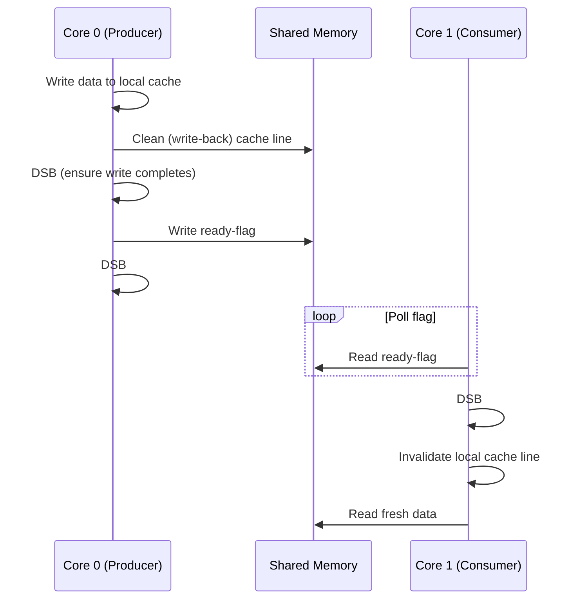

## Cache Coherency in Embedded Multicore Systems

### Overview

Cache coherency refers to the mechanisms that keep multiple per-core caches consistent when they hold copies of the same shared memory location. In embedded multicore systems (dual/quad-core microcontrollers, SoCs with heterogeneous cores, DSP+ARM combinations), coherency management directly affects real-time determinism, power budget, and correctness of shared-memory concurrent code — making it a distinct engineering concern from coherency on general-purpose desktop/server processors.

### Why Coherency Matters in Embedded Contexts

- **Correctness**: Without coherency, one core can read stale data that another core has already modified in its private cache, causing silent data corruption.
- **Determinism**: Coherency protocols introduce variable-latency stalls (snoop traffic, invalidation round-trips) that complicate worst-case execution time (WCET) analysis — a core embedded/RTOS concern.
- **Power**: Snoop-based coherency traffic consumes dynamic power on every shared-line access, which matters more on battery-powered or thermally constrained embedded platforms than on desktop systems.
- **Heterogeneity**: Many embedded SoCs mix cores with different cache architectures (e.g., Cortex-A application core plus Cortex-M real-time core), and coherency often does not extend uniformly across such asymmetric clusters.

### The Coherency Problem

When two cores each cache a copy of address `X`:

1. Core 0 reads `X` → cached locally.
2. Core 1 reads `X` → also cached locally.
3. Core 0 writes a new value to `X`.
4. Core 1's cached copy is now stale unless a coherency mechanism intervenes.

This is the classic **multiple-writer/multiple-reader consistency problem**, and it's compounded in embedded systems by DMA engines and peripherals that can also access memory independently of the CPU caches, sometimes bypassing coherency hardware entirely.

### Coherency Protocol Fundamentals

**MESI and Variants**

The MESI protocol (Modified, Exclusive, Shared, Invalid) is the most common baseline, with embedded-relevant variants:

- **M (Modified)**: Line is dirty, present only in this cache; must write back before another core can read.
- **E (Exclusive)**: Line matches memory, present only in this cache, not yet modified.
- **S (Shared)**: Line present in multiple caches, matches memory.
- **I (Invalid)**: Line not valid in this cache.

Many embedded cores (e.g., ARM Cortex-A series with AMBA coherency extensions) implement **MOESI** (adding an **Owned** state) to reduce write-back traffic by allowing a dirty line to be shared directly from one cache to another without going through main memory first.

**Snooping vs. Directory-Based Coherency**

- **Snooping**: Every cache monitors a shared bus for transactions and invalidates/updates its own lines accordingly. Common in small-to-medium embedded multicore clusters (2–4 cores) because the bus topology is simple and snoop filters keep overhead manageable.
- **Directory-based**: A central or distributed directory tracks which caches hold each line, avoiding the need to broadcast every transaction. This scales better but adds latency and complexity, and is more typical of larger embedded SoCs (network processors, higher-core-count application processors) than of small MCU clusters.

[Inference] For core counts typical of embedded systems (2–8 cores), snooping-based coherency is generally favored over full directory-based schemes because the broadcast overhead remains manageable at that scale, though exact crossover points are platform- and interconnect-dependent.

### Hardware Coherency Interconnects

ARM-based embedded multicore SoCs commonly rely on a **coherent interconnect fabric** distinct from the plain system bus:

- **AMBA ACE / ACE-Lite**: AXI Coherency Extensions define the signaling for cache-to-cache transfers, snoop requests, and barrier operations between coherent masters. ACE-Lite allows I/O masters (like DMA controllers or accelerators) to participate as coherency-aware but non-caching agents.
- **CCI (Cache Coherent Interconnect)** / **CCN (Cache Coherent Network)**: ARM interconnect IP blocks that implement the snoop/directory logic between cluster caches and system memory.
- **CHI (Coherent Hub Interface)**: A newer, more scalable protocol used in larger ARM-based systems, replacing ACE in high-core-count designs.

Not all embedded interconnects provide hardware coherency. Many microcontroller-class multicore parts (e.g., dual-core Cortex-M setups) provide **no automatic hardware coherency** between core-local caches or tightly coupled memories (TCMs), pushing the burden onto software.

### Software-Managed Coherency

Where hardware coherency is absent or only partial (common on Cortex-M multicore MCUs and heterogeneous Cortex-A/Cortex-M SoCs), the programmer or RTOS must manage consistency explicitly:

- **Manual cache maintenance operations**: Explicit clean (write-back), invalidate, and clean+invalidate operations on cache lines or regions before/after shared-buffer access.
- **Memory barriers/fences**: Data Synchronization Barrier (DSB), Data Memory Barrier (DMB), and Instruction Synchronization Barrier (ISB) on ARM ensure ordering of memory operations relative to cache maintenance and other cores' visibility.
- **Non-cacheable shared regions**: Mapping shared-memory regions (e.g., inter-core mailboxes, shared buffers for DMA) as Device or Non-Cacheable memory via the MPU/MMU, trading cache performance for guaranteed visibility.
- **Cache-line alignment of shared structures**: Padding shared data structures to cache-line boundaries to avoid **false sharing**, where unrelated variables in the same line cause unnecessary invalidation traffic between cores.

**Example: Manual Cache Maintenance Pattern (pseudo-C, Cortex-M/Cortex-R style)**

```c
/* Core 0: producer writes to shared buffer, then flags ready */
memcpy(shared_buffer, local_data, len);
SCB_CleanDCache_by_Addr(shared_buffer, len);  /* push writes to memory */
__DSB();                                       /* ensure completion */
shared_flag = READY;
__DSB();

/* Core 1: consumer polls flag, then reads shared buffer */
while (shared_flag != READY) { }
__DSB();
SCB_InvalidateDCache_by_Addr(shared_buffer, len); /* discard stale cached copy */
memcpy(local_copy, shared_buffer, len);
```

[Unverified] The exact API names (`SCB_CleanDCache_by_Addr`, etc.) are representative of CMSIS-style calls on Cortex-M7/M55 parts; actual function names and required parameters vary by vendor SDK and core revision, so this should be treated as illustrative rather than copy-paste-ready.

### Coherency Domains in Heterogeneous SoCs

Many embedded SoCs combine a hardware-coherent cluster (e.g., multiple Cortex-A cores sharing an L2/L3 cache under ACE/CHI) with separate cores outside that domain (Cortex-M real-time cores, DSPs, or GPUs):

- Cores **inside** the coherent domain see automatic consistency for shared lines.
- Cores **outside** the domain (a common pattern for real-time/safety cores kept isolated from the application cluster) require explicit software synchronization — typically through:
  - Shared memory regions marked non-cacheable or write-through on both sides.
  - Hardware mailboxes/semaphores (e.g., ARM's Mailbox peripheral, or vendor-specific IPC blocks) to signal data readiness, avoiding races that pure cache maintenance can't resolve alone.
  - Cache-coherent DMA-only paths where the DMA controller is coherency-aware (ACE-Lite) and inserts itself as a snoop participant even though the remote core's own cache is not part of the domain.

This split-domain architecture is deliberate in many designs: keeping the real-time core outside full hardware coherency avoids unpredictable snoop-stall latency on that core, preserving tighter interrupt/response determinism at the cost of manual synchronization overhead.

### Coherency and DMA

DMA engines are a major coherency hazard in embedded systems because they move data directly to/from memory, bypassing CPU caches:

- **Cache-coherent DMA** (via ACE-Lite or similar): the DMA controller issues coherent transactions, so CPU caches are automatically snooped/invalidated as needed. Available on many higher-end embedded application processors.
- **Non-coherent DMA** (typical of most microcontrollers): software must clean the cache before a DMA read from memory (ensuring the DMA sees the latest CPU-written data) and invalidate the cache after a DMA write to memory (ensuring the CPU doesn't read stale cached data instead of what DMA just wrote).

Failure to perform this maintenance is one of the most common real-world embedded bugs involving caches — data appears correct in a debugger's memory view (since the debugger often reads through the coherent path or with caches disabled) but the running CPU code reads garbage or stale values.

### Coherency and Real-Time Determinism

- **Snoop latency variability**: Coherency traffic adds a variable number of bus cycles to memory accesses depending on other cores' cache states, complicating WCET analysis for hard real-time tasks.
- **Cache locking / partitioning**: Some embedded cores (e.g., certain Cortex-R and Cortex-A profiles) support way-locking or cache partitioning to reserve deterministic cache behavior for critical tasks, reducing exposure to coherency-induced jitter from other cores.
- **Coherency granularity vs. false sharing**: Fine-grained coherency (per cache line, typically 32 or 64 bytes) means two logically unrelated variables can trigger cross-core invalidation traffic if they share a line — a subtle determinism and performance hazard in tightly packed embedded data structures.

### Coherency Protocol State Diagram (MOESI)

<svg xmlns="http://www.w3.org/2000/svg" viewBox="0 0 760 520">
  <text x="380" y="30" text-anchor="middle" font-size="18" font-weight="bold" fill="#1a1a1a">MOESI Cache Line State Transitions (svg_diagram)</text>

  <circle cx="380" cy="100" r="55" fill="#ffe0e0" stroke="#c0392b" stroke-width="2" />
  <text x="380" y="95" text-anchor="middle" font-size="16" font-weight="bold" fill="#c0392b">Modified</text>
  <text x="380" y="113" text-anchor="middle" font-size="11" fill="#7a2419">(dirty, sole owner)</text>

  <circle cx="600" cy="230" r="55" fill="#fff3d0" stroke="#b8860b" stroke-width="2" />
  <text x="600" y="225" text-anchor="middle" font-size="16" font-weight="bold" fill="#8a6500">Owned</text>
  <text x="600" y="243" text-anchor="middle" font-size="11" fill="#6b4e00">(dirty, shared)</text>

  <circle cx="380" cy="360" r="55" fill="#e0f0ff" stroke="#2471a3" stroke-width="2" />
  <text x="380" y="355" text-anchor="middle" font-size="16" font-weight="bold" fill="#2471a3">Shared</text>
  <text x="380" y="373" text-anchor="middle" font-size="11" fill="#1a4e6e">(clean, multi-copy)</text>

  <circle cx="160" cy="230" r="55" fill="#e0ffe4" stroke="#27ae60" stroke-width="2" />
  <text x="160" y="225" text-anchor="middle" font-size="16" font-weight="bold" fill="#1e8449">Exclusive</text>
  <text x="160" y="243" text-anchor="middle" font-size="11" fill="#186a3b">(clean, sole owner)</text>

  <circle cx="160" cy="450" r="45" fill="#f0f0f0" stroke="#555555" stroke-width="2" />
  <text x="160" y="446" text-anchor="middle" font-size="16" font-weight="bold" fill="#333333">Invalid</text>
  <text x="160" y="463" text-anchor="middle" font-size="11" fill="#333333">(not present)</text>

  <line x1="425" y1="140" x2="565" y2="200" stroke="#444444" stroke-width="1.5" marker-end="url(#arrow1)" />
  <text x="520" y="160" font-size="10" fill="#333333">other core reads</text>

  <line x1="565" y1="260" x2="425" y2="330" stroke="#444444" stroke-width="1.5" marker-end="url(#arrow1)" />
  <text x="530" y="310" font-size="10" fill="#333333">local write (invalidate others)</text>

  <line x1="335" y1="330" x2="205" y2="260" stroke="#444444" stroke-width="1.5" marker-end="url(#arrow1)" />
  <text x="230" y="310" font-size="10" fill="#333333">last sharer writes</text>

  <line x1="205" y1="200" x2="335" y2="130" stroke="#444444" stroke-width="1.5" marker-end="url(#arrow1)" />
  <text x="230" y="150" font-size="10" fill="#333333">local write</text>

  <line x1="160" y1="285" x2="160" y2="405" stroke="#444444" stroke-width="1.5" marker-end="url(#arrow1)" />
  <text x="168" y="350" font-size="10" fill="#333333">evicted / snooped out</text>

  <line x1="205" y1="450" x2="335" y2="380" stroke="#444444" stroke-width="1.5" marker-end="url(#arrow1)" />
  <text x="230" y="430" font-size="10" fill="#333333">read miss, other core has copy</text>

  <line x1="115" y1="410" x2="115" y2="270" stroke="#444444" stroke-width="1.5" marker-end="url(#arrow1)" />
  <text x="20" y="350" font-size="10" fill="#333333">read miss, no other copy</text>
</svg>

### Producer-Consumer Coherency Flow (Software-Managed, No Hardware Coherency)



### Design Trade-offs

- **Hardware coherency (ACE/CHI-based clusters)**
  - Pros: Transparent to software, simpler concurrent programming model, lower software overhead per access.
  - Cons: Snoop traffic adds power draw and latency variability; hardware cost/complexity; typically limited to a bounded coherent domain rather than the whole chip.
- **Software-managed coherency (manual maintenance)**
  - Pros: No dedicated coherency hardware required, more deterministic per-core cache behavior (no cross-core snoop stalls), lower silicon cost — common on Cortex-M multicore MCUs.
  - Cons: Error-prone (missing a clean/invalidate call is a classic source of intermittent, hard-to-reproduce bugs), higher software/engineering burden, manual barrier placement.
- **Non-cacheable shared memory**
  - Pros: Eliminates coherency bugs by construction for that region.
  - Cons: Every access to that region pays uncached-memory latency, which can be significant for frequently touched shared data structures.

### Common Pitfalls

- Forgetting cache invalidation after DMA writes to memory, causing the CPU to read stale cached values.
- False sharing from unrelated variables placed in the same cache line, causing unnecessary cross-core invalidation traffic and performance degradation.
- Assuming a heterogeneous SoC's real-time core is inside the same coherency domain as its application core cluster, when in most designs it is not.
- Missing memory barriers around cache maintenance operations — a clean/invalidate operation without a subsequent DSB does not guarantee completion before dependent code executes on some architectures.
- Treating debugger memory views as ground truth for cache-related bugs, since many debug access paths bypass the cache hierarchy and can mask a real coherency bug.

**Related Topics**
- Memory barriers and ordering models (DMB, DSB, ISB) in embedded ARM architectures
- MPU/MMU configuration for cacheable vs. non-cacheable memory regions
- Inter-core communication mechanisms (mailboxes, hardware semaphores, shared-memory IPC)
- DMA-cache interaction and coherent DMA controllers
- False sharing and cache-line-aware data structure design
- WCET analysis in cache-coherent multicore real-time systems
- AMBA ACE/CHI coherent interconnect architecture
- Cache locking and partitioning for real-time determinism