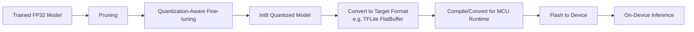
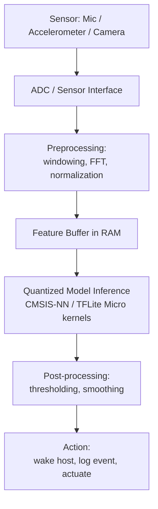

## TinyML Concepts and Constraints

### Overview

TinyML refers to the design, training, and deployment of machine learning models on extremely resource-constrained embedded devices — typically microcontrollers with kilobytes to a few megabytes of RAM, no operating system or a minimal RTOS, and power budgets in the milliwatt-to-microwatt range. It sits at the intersection of embedded systems engineering and machine learning, prioritizing extreme efficiency over raw model capability.

### Defining Characteristics

- **Target hardware**: Microcontrollers (Cortex-M class, RISC-V embedded cores, specialized ML accelerators) rather than GPUs, TPUs, or even mobile-class application processors.
- **Memory envelope**: Typically tens of KB to a few MB of SRAM/Flash, versus gigabytes on mobile/edge devices running standard TensorFlow Lite or ONNX Runtime.
- **Power envelope**: Often sub-milliwatt to a few milliwatts of average power, enabling always-on inference on coin-cell or energy-harvesting power sources.
- **Inference-only (usually)**: Training typically happens off-device on conventional hardware; the embedded device performs inference only, though on-device incremental learning is an active research area.
- **No dynamic memory allocation (commonly enforced)**: Many TinyML runtimes avoid heap allocation during inference to guarantee deterministic memory usage and avoid fragmentation over long-running deployments.

### Why TinyML Is Distinct From "Edge ML"

"Edge ML" broadly covers running models on edge devices like smartphones, edge servers, or Raspberry Pi-class boards, which still have OS support, ample RAM, and often GPU/NPU acceleration. TinyML specifically targets the microcontroller tier below that — where model size, arena memory, and even individual layer intermediate buffers must be budgeted in kilobytes.

[Inference] The boundary between "edge ML" and "TinyML" is not formally standardized industry-wide; it is generally understood by practitioners as separating OS-capable, RAM-rich edge devices from bare-metal or RTOS-based microcontrollers with severely constrained memory, though exact thresholds vary by source.

### Core Constraints

**Memory Constraints**

- **Model weights (Flash/ROM)**: Must fit within the device's flash storage alongside firmware, bootloader, and other application code — often a budget of tens to low hundreds of KB for the model itself.
- **Activation/arena memory (RAM)**: Intermediate tensor buffers during inference (the "tensor arena" in TensorFlow Lite Micro terminology) must fit in available RAM, which is frequently the tighter constraint since RAM is scarcer than flash on most MCUs.
- **Static memory allocation**: Many TinyML frameworks pre-allocate a single fixed-size memory arena at startup and perform no further heap allocation, trading flexibility for determinism and avoidance of fragmentation.

**Compute Constraints**

- **No floating-point hardware (on many targets)**: Lower-end Cortex-M0/M0+ cores lack an FPU, making integer/fixed-point arithmetic significantly faster than floating-point, which strongly motivates quantization.
- **Clock speed**: Often tens to low hundreds of MHz, versus GHz-class mobile/desktop processors, meaning inference latency budgets must be met with orders of magnitude less raw throughput.
- **No parallel execution (typically)**: Single-core execution is common on the smallest TinyML targets, so techniques like batching or multi-threaded inference used on larger platforms don't apply.

**Power Constraints**

- **Duty-cycled inference**: Many TinyML applications wake periodically or on sensor-triggered events, run inference, then return to a low-power sleep state, since continuous inference at full clock speed would exceed the power budget.
- **Energy per inference matters more than raw latency**: Because many TinyML devices run on batteries or harvested energy, the total energy consumed per inference (not just wall-clock time) is often the primary optimization target.

### Model Compression Techniques

**Quantization**

Converting model weights and/or activations from 32-bit floating point to lower-precision representations, most commonly **int8**, sometimes int4 or binary/ternary in research contexts.

$$W_{int8} = \text{round}\left(\frac{W_{fp32}}{s}\right) + z$$

where $s$ is a scale factor and $z$ is a zero-point offset, both derived per-tensor or per-channel from the weight distribution during calibration.

- **Post-training quantization (PTQ)**: Quantize an already-trained floating-point model using a calibration dataset to determine appropriate scale/zero-point values. Simpler pipeline, some accuracy loss.
- **Quantization-aware training (QAT)**: Simulate quantization effects during training so the model learns weights that are more robust to the precision loss, typically yielding better accuracy than PTQ at the same bit-width.

[Inference] Int8 quantization is widely reported across TinyML literature and tooling (e.g., TensorFlow Lite Micro documentation) to reduce model size roughly fourfold versus float32 with often minimal accuracy degradation for many model classes, though the actual accuracy impact is model- and dataset-dependent and should be validated per deployment.

**Pruning**

Removing weights, channels, or entire filters that contribute little to model output, based on magnitude, sensitivity analysis, or other importance criteria.

- **Unstructured pruning**: Removes individual weights, producing sparse weight matrices. Requires specialized sparse-matrix inference kernels to realize speed/memory benefits on hardware — without such kernels, the theoretical size reduction doesn't translate to actual runtime savings.
- **Structured pruning**: Removes entire channels, filters, or layers, producing a smaller dense model directly compatible with standard inference kernels, making it more practical on MCU targets that lack sparse-matrix acceleration.

**Knowledge Distillation**

Training a small "student" model to mimic the output distribution (not just the hard labels) of a larger, more accurate "teacher" model, often improving the student's accuracy beyond what training it directly on labeled data alone would achieve.

**Neural Architecture Search (NAS) for Constrained Targets**

Automated search over model architectures subject to explicit hardware constraints (RAM footprint, flash size, latency on target silicon), rather than searching purely for accuracy. Frameworks such as MCUNet (from MIT's TinyML research group) exemplify this direction, co-optimizing the neural architecture and the inference engine's memory scheduling together.

### TinyML Compression Pipeline

### Software Frameworks and Runtimes

- **TensorFlow Lite for Microcontrollers (TFLite Micro)**: A widely used inference runtime designed to run without dynamic memory allocation, an OS, or standard C library dependencies, targeting Cortex-M and similar cores.
- **CMSIS-NN**: ARM's optimized neural network kernel library for Cortex-M processors, providing hand-optimized (often SIMD-accelerated on cores that support it) implementations of common layer operations (convolution, fully connected, pooling, activation functions).
- **microTVM**: Part of the Apache TVM compiler stack, targeting bare-metal and RTOS-based microcontrollers with an automated compilation and kernel-tuning flow.
- **Edge Impulse**: A commercial/hosted platform providing an end-to-end pipeline from data collection through training, optimization, and deployment to a range of MCU targets, often used for rapid prototyping of TinyML applications without hand-building the full toolchain.

[Unverified] Specific feature sets, supported hardware targets, and licensing terms for these frameworks change over time; details should be confirmed against current vendor/project documentation before making a platform selection.

### Typical TinyML Application Domains

- **Keyword spotting / wake-word detection**: Always-on audio classification (e.g., detecting "Hey [assistant name]") running continuously at very low power, waking a larger downstream system only on trigger.
- **Anomaly detection in industrial sensors**: Vibration, temperature, or current-draw pattern analysis for predictive maintenance, run locally to avoid constant wireless transmission of raw sensor data.
- **Gesture and activity recognition**: Accelerometer/gyroscope-based classification for wearables, often using very small (few-KB) models.
- **Visual wake words**: Extremely lightweight image classification (e.g., "is a person present in frame") on low-power camera modules, distinct from full object detection.

### Data Flow: Sensor to Inference on a TinyML Device

### Memory Budget Illustration

<svg xmlns="http://www.w3.org/2000/svg" viewBox="0 0 700 380">
  <text x="350" y="30" text-anchor="middle" font-size="18" font-weight="bold" fill="#1a1a1a">Typical TinyML MCU Memory Budget (svg_diagram)</text>

  <text x="100" y="60" font-size="13" font-weight="bold" fill="#333333">Flash (e.g. 512 KB)</text>
  <rect x="60" y="70" width="280" height="240" fill="#f5f5f5" stroke="#888888" stroke-width="1.5" />
  <rect x="60" y="70" width="280" height="60" fill="#c8e6c9" stroke="#2e7d32" stroke-width="1" />
  <text x="200" y="105" text-anchor="middle" font-size="12" fill="#1b5e20">Firmware / RTOS (~60 KB)</text>
  <rect x="60" y="130" width="280" height="120" fill="#bbdefb" stroke="#1565c0" stroke-width="1" />
  <text x="200" y="185" text-anchor="middle" font-size="12" fill="#0d47a1">Quantized Model Weights (~120 KB)</text>
  <rect x="60" y="250" width="280" height="60" fill="#ffe0b2" stroke="#e65100" stroke-width="1" />
  <text x="200" y="285" text-anchor="middle" font-size="12" fill="#8a4400">App Code / Other (~60 KB)</text>

  <text x="530" y="60" font-size="13" font-weight="bold" fill="#333333">SRAM (e.g. 128 KB)</text>
  <rect x="420" y="70" width="220" height="240" fill="#f5f5f5" stroke="#888888" stroke-width="1.5" />
  <rect x="420" y="70" width="220" height="30" fill="#c8e6c9" stroke="#2e7d32" stroke-width="1" />
  <text x="530" y="90" text-anchor="middle" font-size="11" fill="#1b5e20">RTOS/Stack (~16 KB)</text>
  <rect x="420" y="100" width="220" height="110" fill="#f8bbd0" stroke="#ad1457" stroke-width="1" />
  <text x="530" y="150" text-anchor="middle" font-size="12" fill="#880e4f">Tensor Arena</text>
  <text x="530" y="167" text-anchor="middle" font-size="11" fill="#880e4f">(activation buffers, ~64 KB)</text>
  <rect x="420" y="210" width="220" height="40" fill="#d1c4e9" stroke="#512da8" stroke-width="1" />
  <text x="530" y="234" text-anchor="middle" font-size="11" fill="#311b92">Sensor/Feature Buffers</text>
  <rect x="420" y="250" width="220" height="60" fill="#fff9c4" stroke="#f9a825" stroke-width="1" />
  <text x="530" y="284" text-anchor="middle" font-size="11" fill="#7a5c00">Free / Heap Margin</text>

  <text x="350" y="345" text-anchor="middle" font-size="11" fill="#555555">Illustrative proportions only — actual budgets vary widely by device and model (svg_diagram)</text>
</svg>

[Speculation] The specific KB figures shown in the diagram above are illustrative round numbers chosen for pedagogical clarity, not measurements from any particular commercial device; real budgets should be taken from the target MCU's datasheet and the specific model's compiled arena size.

### Design Trade-offs

- **Accuracy vs. footprint**: Aggressive quantization and pruning generally reduce accuracy to some degree; the acceptable trade-off point is application-specific (a false wake-word trigger has different cost than a missed industrial anomaly).
- **Latency vs. power**: Running inference faster (higher clock speed) often draws more instantaneous power; for battery-constrained devices, the optimization target is frequently total energy per inference rather than raw speed.
- **Generality vs. specialization**: Hand-tuned, architecture-specific kernels (e.g., CMSIS-NN) offer better performance than generic portable code but tie the deployment to a specific silicon vendor's optimized library.
- **On-device preprocessing vs. raw data transmission**: Performing feature extraction (e.g., FFT) on-device reduces the data that needs to move through the inference pipeline but adds fixed compute/memory cost that must also fit the constrained budget.

### Common Pitfalls

- Underestimating tensor arena size requirements, causing runtime allocation failures that only appear with certain input shapes or model configurations, not at compile time.
- Assuming post-training quantization will always preserve original float32 accuracy without validating against a held-out test set on the target quantized format.
- Neglecting worst-case timing analysis for periodic inference against real-time or power-duty-cycle deadlines, particularly when using interpreter-based runtimes with input-dependent execution paths.
- Selecting model architectures optimized for accuracy on datacenter-scale benchmarks (e.g., large image classification networks) without accounting for the drastically different memory/compute ratio available on MCU targets.
- Overlooking flash write-cycle and wear considerations when the deployment involves periodic on-device model updates (relevant to some federated or incremental learning scenarios).

**Related Topics**
- Quantization-aware training workflows and calibration dataset selection
- CMSIS-NN kernel internals and SIMD instruction utilization on Cortex-M
- Federated learning and on-device incremental training constraints
- Power profiling and duty-cycle design for always-on sensing applications
- Neural architecture search under hardware-aware constraints (MCUNet and related work)
- Sensor fusion pipelines feeding TinyML inference stages
- Real-time scheduling of periodic inference tasks under an RTOS
- Flash memory wear leveling for devices with on-device model updates