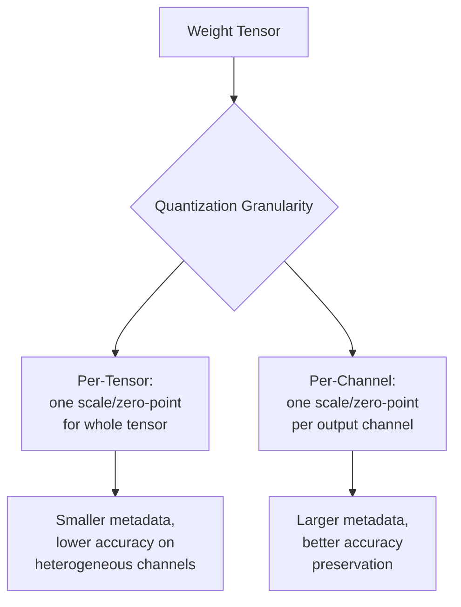
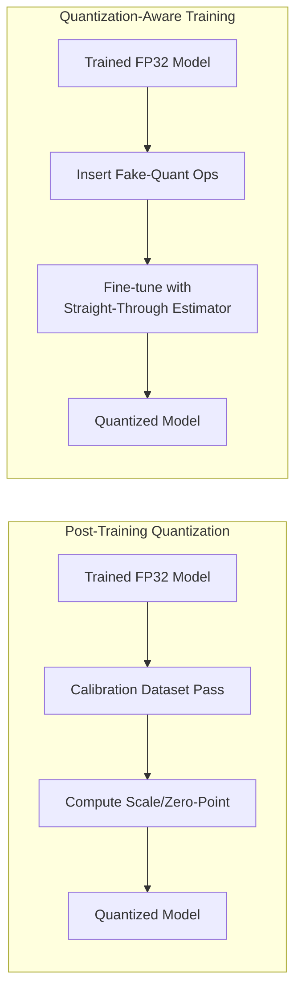
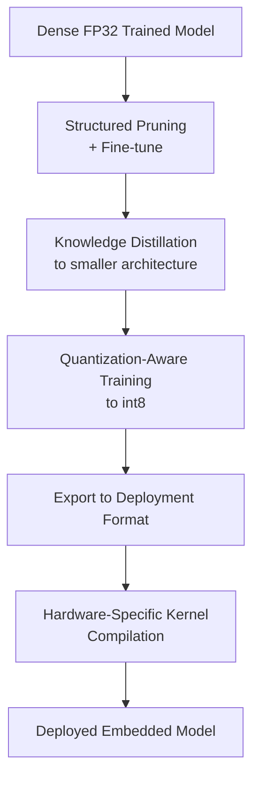

## Model Quantization and Compression

### Overview

Model quantization and compression encompass the techniques used to reduce a trained neural network's memory footprint, compute cost, and energy consumption so it can run on resource-constrained embedded hardware. This spans numerical precision reduction (quantization), structural size reduction (pruning, factorization), and knowledge transfer (distillation), and is a foundational discipline underlying practical TinyML and embedded ML deployment.

### Why Compression Is Necessary for Embedded Deployment

Models trained on datacenter hardware default to 32-bit floating-point (FP32) weights and activations, sized for accuracy rather than deployability. Embedded targets impose hard limits:

- Flash/ROM budgets often in the tens to low hundreds of KB for the model itself.
- RAM budgets that must also hold activation buffers, application state, and RTOS overhead.
- Compute budgets measured in tens to hundreds of MHz, often without a floating-point unit (FPU).
- Power budgets where every additional memory access and multiply-accumulate operation has a direct energy cost.

Compression techniques address these constraints from different angles — quantization primarily reduces precision (and often compute cost), while pruning and factorization primarily reduce parameter count and structural redundancy.

### Quantization

**Numerical Representation Fundamentals**

Standard floating-point32 (FP32) uses 32 bits per value (1 sign, 8 exponent, 23 mantissa) to represent a wide dynamic range with high precision. Quantization maps this to a lower-bit-width fixed-point or integer representation.

**Uniform Affine Quantization**

The most common scheme maps a float range $[\alpha, \beta]$ to an integer range (e.g., $[-128, 127]$ for signed int8) using a scale $s$ and zero-point $z$:

$$q = \text{clip}\left(\text{round}\left(\frac{r}{s}\right) + z,\ q_{min},\ q_{max}\right)$$

$$r \approx s \cdot (q - z)$$

where $r$ is the real (float) value, $q$ is the quantized integer value, $s = \frac{\beta - \alpha}{q_{max} - q_{min}}$, and $z$ is the integer zero-point corresponding to real value zero.

**Symmetric vs. Asymmetric Quantization**

- **Symmetric**: Zero-point fixed at 0, range is $[-\alpha, \alpha]$. Simpler arithmetic (no zero-point offset term in the accumulation), commonly used for weights since weight distributions are often roughly zero-centered.
- **Asymmetric**: Zero-point can be any value within the quantized range, better suited to activations following functions like ReLU where the distribution is skewed (all non-negative).

**Per-Tensor vs. Per-Channel Quantization**

- **Per-tensor**: A single scale/zero-point pair for the entire weight tensor. Simplest, smallest metadata overhead, but can lose accuracy when different channels have very different weight magnitude distributions.
- **Per-channel (per-axis)**: A separate scale/zero-point for each output channel of a convolutional or fully-connected layer. Better preserves accuracy at the cost of slightly more metadata and implementation complexity; widely supported in modern quantization toolchains for weight tensors specifically.

**Quantization Granularity Comparison**

**Post-Training Quantization (PTQ)**

Applied after a model is fully trained in floating point:

1. Run a representative calibration dataset through the float model.
2. Record the observed min/max (or a statistical distribution) of activations at each layer.
3. Compute scale/zero-point values from these observed ranges.
4. Convert weights and (optionally) activations to the target integer format.

PTQ requires no retraining, making it fast and low-effort, but can incur measurable accuracy loss, particularly for models sensitive to precision (e.g., those with wide dynamic-range activations or highly asymmetric layers).

**Quantization-Aware Training (QAT)**

Simulates quantization effects during the training or fine-tuning process by inserting "fake quantization" operations into the forward pass — rounding values to the target precision while still computing gradients in floating point (commonly via the straight-through estimator, since the rounding operation itself has zero gradient almost everywhere).

$$\frac{\partial L}{\partial r} \approx \frac{\partial L}{\partial q} \quad \text{(straight-through estimator, ignoring the non-differentiable round)}$$

This lets the model adapt its weights to compensate for quantization noise, typically yielding better final accuracy than PTQ at equivalent bit-widths, at the cost of requiring access to a training pipeline and labeled data, plus additional training time.

**Quantization Workflow Comparison**

**Bit-Width Choices**

- **Int8**: The dominant choice for embedded deployment, well-supported by frameworks (TensorFlow Lite, ONNX Runtime) and hardware (SIMD instructions on many Cortex-M/Cortex-A cores), generally providing a strong accuracy/size trade-off.
- **Int4 / sub-byte**: More aggressive compression, active research and increasingly production use for certain model classes, but typically requires QAT and specialized kernel support to realize actual speed benefits — naive int4 storage without matching compute kernels only saves memory, not compute time.
- **Binary/ternary networks**: Weights constrained to {-1, +1} or {-1, 0, +1}. Extreme compression (up to 32x versus FP32) with correspondingly larger accuracy trade-offs; mostly a research-stage technique for mainstream embedded production use, though niche deployments exist. [Speculation] Widespread production adoption of binary networks outside of specialized research or niche ultra-low-power applications appears limited as of general industry practice, though this varies by domain and is difficult to verify comprehensively.

### Pruning

**Magnitude-Based Pruning**

The simplest and most common criterion: weights with the smallest absolute magnitude are assumed to contribute least to the output and are set to zero.

$$\text{prune}(w_{i}) = \begin{cases} 0 & \text{if } |w_i| < \tau \\ w_i & \text{otherwise} \end{cases}$$

where $\tau$ is a threshold chosen to hit a target sparsity level.

**Unstructured vs. Structured Pruning**

- **Unstructured (fine-grained) pruning**: Individual weights are zeroed anywhere in the tensor, producing an irregular sparsity pattern. Achieves the highest theoretical compression ratios for a given accuracy loss, but the resulting sparse tensor requires specialized sparse-matrix multiplication kernels to realize actual speed or memory bandwidth benefits — without such kernel support, a "90% sparse" model can still consume the same memory and compute time as the dense original, since zeros are still stored and multiplied.
- **Structured pruning**: Entire channels, filters, attention heads, or layers are removed, producing a smaller but still fully dense model. Directly compatible with standard dense-matrix inference kernels used on most embedded runtimes, making it the more practically deployable option on typical MCU-class hardware.

**Iterative Pruning and Fine-Tuning**

Pruning aggressively in a single pass often damages accuracy substantially. A common practical pattern:

1. Train (or start from) a dense model.
2. Prune a portion of weights/channels according to the chosen criterion.
3. Fine-tune the pruned model to recover accuracy.
4. Repeat steps 2–3 iteratively toward the target sparsity/size.

**Pruning Sensitivity Analysis**

Not all layers tolerate pruning equally — early layers extracting low-level features are often more sensitive than later, more redundant layers. [Inference] Sensitivity generally varies by layer depth and role within a given architecture, so a per-layer pruning sensitivity analysis (rather than a single uniform pruning ratio across the whole network) is commonly recommended in the literature to avoid disproportionately damaging accuracy in sensitive layers, though the specific pattern of sensitivity is architecture- and task-dependent.

### Knowledge Distillation

A "student" network (small, embedded-target-sized) is trained to match the output distribution of a larger "teacher" network, rather than (or in addition to) training directly on ground-truth hard labels.

$$L = \alpha \cdot L_{hard}(y, \hat{y}_{student}) + (1-\alpha) \cdot L_{soft}(\sigma(z_{teacher}/T), \sigma(z_{student}/T))$$

where $L_{hard}$ is standard cross-entropy against true labels, $L_{soft}$ is typically KL-divergence between softened teacher and student output distributions, $T$ is a temperature parameter that smooths the probability distribution to expose more inter-class relationship information, and $\alpha$ balances the two loss terms.

The intuition: a teacher's soft output probabilities (e.g., "70% cat, 25% dog, 5% other") carry more information than a hard label ("cat") about which classes are similar, and this extra signal can help a small student model learn a better decision boundary than training on hard labels alone would achieve at the same model size.

### Low-Rank Factorization

Large weight matrices (particularly in fully-connected layers) can be approximated as a product of two smaller matrices:

$$W_{m \times n} \approx U_{m \times r} \cdot V_{r \times n}, \quad r \ll \min(m,n)$$

reducing parameter count from $m \times n$ to $r(m+n)$. This is most effective when the original weight matrix has significant redundancy (low effective rank), which is common but not universal across layer types — convolutional layers often benefit less directly than large fully-connected/attention layers, since their parameter counts are already comparatively small per layer.

### Combining Techniques

Production embedded deployments typically combine multiple compression techniques rather than relying on a single method:

The order and combination of techniques is not fixed — some pipelines prune before distillation, others distill first into a smaller architecture and then quantize; the appropriate sequence depends on the accuracy/size targets and available tooling.

### Compression Technique Comparison

| Technique | Primary Benefit | Typical Size Reduction | Requires Retraining? | Hardware Kernel Dependency |
|---|---|---|---|---|
| Post-training quantization (int8) | Reduced memory + faster integer math | ~4x vs. FP32 | No | Low (widely supported) |
| Quantization-aware training | Better accuracy than PTQ at same bit-width | ~4x vs. FP32 | Yes | Low (widely supported) |
| Structured pruning | Smaller dense model | Variable, often 30–70% parameter reduction | Yes (fine-tuning) | Low (standard dense kernels) |
| Unstructured pruning | Highest theoretical sparsity | Can exceed 90% weights zeroed | Yes (fine-tuning) | High (needs sparse kernels) |
| Knowledge distillation | Smaller architecture, retained accuracy | Depends entirely on chosen student architecture | Yes (full training run) | None (produces a normal dense model) |
| Low-rank factorization | Fewer parameters in FC/attention layers | Layer-dependent | Often yes | Low to moderate |

[Inference] The size-reduction figures above reflect commonly cited ranges in quantization and pruning literature and toolchain documentation; actual results are highly model-, dataset-, and task-dependent, and should be empirically validated rather than assumed for any specific deployment.

### Accuracy-Size Trade-off Curve

<svg xmlns="http://www.w3.org/2000/svg" viewBox="0 0 700 420">
  <text x="350" y="30" text-anchor="middle" font-size="18" font-weight="bold" fill="#1a1a1a">Illustrative Accuracy vs. Model Size Trade-off (svg_diagram)</text>

  <line x1="80" y1="360" x2="640" y2="360" stroke="#333333" stroke-width="1.5" />
  <line x1="80" y1="360" x2="80" y2="60" stroke="#333333" stroke-width="1.5" />
  <text x="360" y="395" text-anchor="middle" font-size="13" fill="#333333">Model Size (compression increasing →)</text>
  <text x="35" y="210" text-anchor="middle" font-size="13" fill="#333333" transform="rotate(-90 35 210)">Accuracy</text>

  <path d="M 100 80 C 250 90, 350 120, 450 190 C 520 250, 570 310, 610 345" fill="none" stroke="#1565c0" stroke-width="3" />

  <circle cx="100" cy="80" r="6" fill="#2e7d32" />
  <text x="100" y="65" text-anchor="middle" font-size="11" fill="#2e7d32">FP32 Baseline</text>

  <circle cx="250" cy="95" r="6" fill="#1565c0" />
  <text x="250" y="115" text-anchor="middle" font-size="11" fill="#1565c0">Int8 QAT</text>

  <circle cx="380" cy="140" r="6" fill="#8e24aa" />
  <text x="380" y="130" text-anchor="middle" font-size="11" fill="#8e24aa">Pruned + Int8</text>

  <circle cx="500" cy="230" r="6" fill="#e65100" />
  <text x="500" y="220" text-anchor="middle" font-size="11" fill="#e65100">Distilled Student</text>

  <circle cx="600" cy="335" r="6" fill="#c62828" />
  <text x="600" y="355" text-anchor="middle" font-size="11" fill="#c62828">Aggressive Int4/Binary</text>

  <text x="360" y="60" text-anchor="middle" font-size="10" fill="#777777">Illustrative curve shape only — not derived from a specific benchmark (svg_diagram)</text>
</svg>

[Speculation] The curve shape and relative positioning of points in the diagram above are illustrative of the generally reported trend (accuracy tends to degrade as compression increases) rather than derived from a specific measured benchmark; actual curves vary substantially by model architecture, task, and compression method.

### Design Trade-offs

- **PTQ vs. QAT**: PTQ is faster to apply and requires no training infrastructure, but QAT generally yields better accuracy at the same bit-width — the choice depends on whether accuracy loss from PTQ is acceptable for the application and whether a training pipeline is available.
- **Structured vs. unstructured pruning**: Structured pruning is more practically deployable on typical embedded inference kernels; unstructured pruning offers higher theoretical compression but is only useful with matching sparse-kernel hardware/software support.
- **Compression aggressiveness vs. robustness**: Heavily compressed models can become more sensitive to input distribution shift or adversarial perturbation than their full-precision counterparts, a consideration relevant for safety- or reliability-sensitive embedded applications.
- **Toolchain maturity vs. technique novelty**: Well-supported techniques (int8 PTQ/QAT, structured pruning) have mature tooling and hardware kernel support; newer techniques (int4, binary networks, advanced NAS-based compression) may offer better theoretical results but with less mature or less portable tooling.

### Common Pitfalls

- Applying PTQ without a representative calibration dataset, leading to poorly chosen scale/zero-point values and disproportionate accuracy loss on the actual deployment data distribution.
- Assuming unstructured pruning yields real-world speedup or memory savings without confirming the target inference runtime actually supports sparse computation.
- Quantizing a model without validating accuracy on the target integer format specifically — floating-point simulation of quantization behavior during development can diverge from actual fixed-point hardware execution nuances.
- Over-pruning early feature-extraction layers uniformly with later, more redundant layers, causing disproportionate accuracy degradation.
- Neglecting to re-validate latency/power benefits after compression — a smaller model is not automatically faster or lower-power unless the target runtime and hardware actually exploit the specific compression technique applied (e.g., sparsity, reduced bit-width).

**Related Topics**
- TinyML deployment constraints and runtime selection (TFLite Micro, CMSIS-NN, microTVM)
- Hardware-aware neural architecture search for embedded targets
- Fixed-point arithmetic and integer-only inference kernel design
- Calibration dataset selection strategies for post-training quantization
- Sparse matrix computation kernels for embedded processors
- On-device fine-tuning and incremental learning under compression constraints
- Robustness and adversarial sensitivity of compressed models